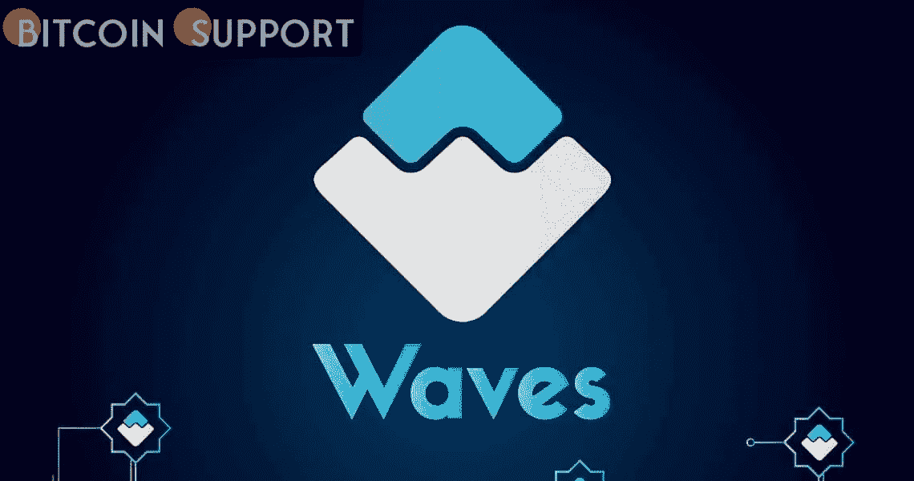
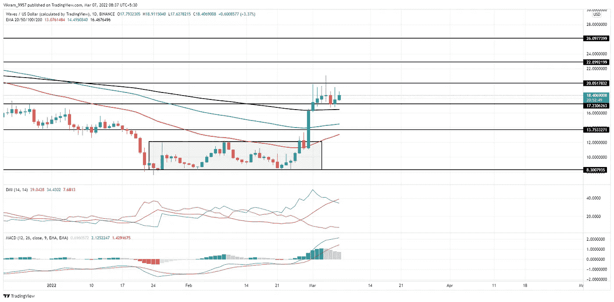

# 波浪技术分析:上升趋势必须超过 20 美元才能继续

> 原文：<https://medium.com/coinmonks/waves-technical-analysis-uptrend-must-surpass-20-to-continue-4642fc027736?source=collection_archive---------64----------------------->

**Visit our website:-** [**https://bitcoinsupports.com/**](https://bitcoinsupports.com/)

在更高的价格拒绝导致从 20 美元的反转后，波浪硬币价格从 200 日均线找到支撑。公牛会继续前进吗？技术亮点:

—WAVES 币价格维持在 17 美元以上。

——DMI 指标表明趋势动量显著增加。

——Waves 加密货币 24 小时交易量 8.64 亿美元，同比增长 70%。波浪硬币价格历史波浪硬币价格历史显示，随着从 10 美元到 12 美元区间突破开始的疯狂购买热潮，从 20 美元开始的价格拒绝增加。长尾理论的发展导致价格下跌到 200 日均线和 17 美元的支撑汇合点。一旦结果是，随着购买狂潮接近尾声，购买者就会减少。

**Visit our website:-** [**https://bitcoinsupports.com/**](https://bitcoinsupports.com/)

**波浪技术分析**

波浪价格已经站稳在 17 美元至 18 美元的心理水平，在接下来的交易中有反转至 20 美元的迹象。然而，看涨的尝试无法经受住 20 美元以上的卖压。随着上周价格飙升，50 和 100 日均线突然反转，表明看涨与 200 日均线交叉。然而，对权力的追求可能导致替代硬币的下跌，这可能导致 EMAs 的熊市延续。

**DMI 指标:**以抛物线增长通过+DI 线上方，ADX 越过 35%水平。DI 线仍然看涨，但它们正在反转，彼此接近。另一方面，DI 线保持很大的缺口，为牛市路线提供了充足的时间。

**MACD 指标:**随着快慢线为维持上升趋势而战，MACD 直方图呈现下降分布。空头交叉可能是由于快线的平淡表现。简而言之，WAVES 技术分析强调了那些推迟突破 20 美元关口的强大卖家。

即将到来的趋势要想保持上升势头，海浪币的价格必须突破 20 美元的门槛，并承受抛售压力。如果发生这种情况，空头将重新控制趋势，反转到 15 美元将使替代硬币进入盘整。支撑位:$17 和$15 阻力位:$20 和$22

**访问我们的网站:-**[**https://bitcoinsupports.com/**](https://bitcoinsupports.com/)

**免责声明:以上为作者观点，不应视为投资建议。读者应该自己做研究。**