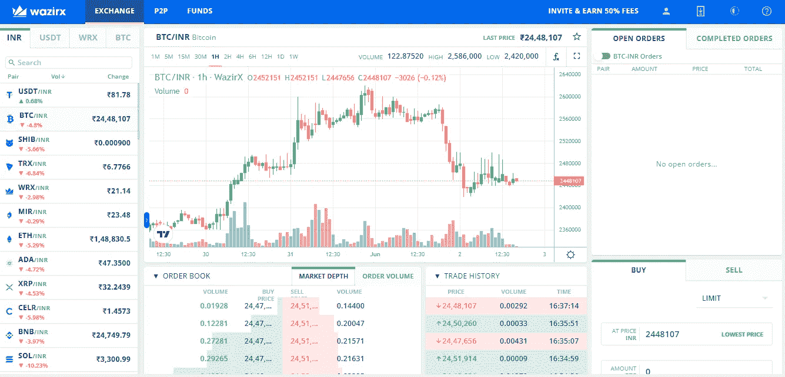
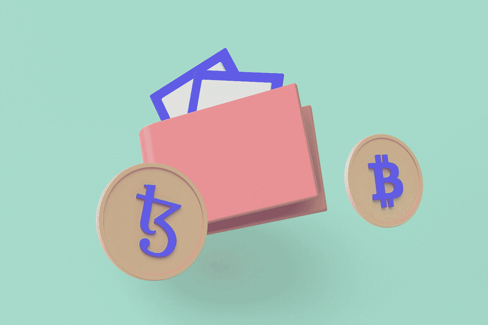

# 瓦济克斯评论 2022

> 原文：<https://medium.com/coinmonks/wazirx-review-2022-8610b9de11f9?source=collection_archive---------57----------------------->

印度最受信任的比特币和加密货币交易所

[WazirX](https://wazirx.com/invite/rxs6tr2c) 于 2018 年在印度成立，并于 2019 年被币安收购。作为收购的结果，T2 瓦济克斯 T3 交易所的用户现在可以进入币安市场进行交易。WazirX 的实用程序令牌是 WRX。

[WazirX](https://wazirx.com/invite/rxs6tr2c) 提供多种可以跨多个平台交易的加密货币。WazirX 接受菲亚特存款和提款，但该功能仅限于印度卢比。

# WazirX 值得吗？

Photo by [Austin Distel](https://unsplash.com/@austindistel?utm_source=medium&utm_medium=referral) on [Unsplash](https://unsplash.com?utm_source=medium&utm_medium=referral)

WazirX 是一个复杂的交易所，但是一旦你习惯了它的界面，交易就变得简单了。该交易所提供来自加密货币市场各个领域的各种加密货币，包括 Web 3.0 和元宇宙。它与币安的整合为您提供了一个更大、更具流动性的市场。它的智能令牌基金(STF)是独一无二的，因为它们帮助新手交易者找到更有经验的交易者来管理他们的资产。该交易所目前缺乏加密贷款的功能，而大多数交易所都有这种功能。在 WazirX 上被动赚钱的其他方式包括代币开采、空投和它的推荐项目。

# 关于 WazirX 你应该知道什么

Photo by [Tezos](https://unsplash.com/@tezos?utm_source=medium&utm_medium=referral) on [Unsplash](https://unsplash.com?utm_source=medium&utm_medium=referral)

[WazirX](https://wazirx.com/invite/rxs6tr2c) 是印度最大的中央加密货币交易所，拥有超过 600 万注册用户，月交易额超过 50 亿美元。WazirX 提供超过 225 种加密货币，以及令人印象深刻的自动匹配 P2P 机器，使加密-菲亚特转换简单快捷。尽管起源于印度，但该交易所现在向世界其他地区提供服务，七个不同国家的用户都可以使用法定存款(P2P)。

WazirX 的 STF 是一个独特的功能，它让你可以与专业交易员联系，帮助你管理你的资产。作为交换，这些专业交易员会从你的利润中获得 25%的佣金。【2021 年 12 月，WazirX 被印度商品及服务税(GST)管理局指控逃税总计 40.5 亿卢比(97.4 万美元)。[瓦济克斯](https://wazirx.com/invite/rxs6tr2c)被罚款 492 亿卢比(118 万美元)。WazirX 95%的加密货币都存放在冷库里。在使用 P2P 等大多数服务之前，你必须首先完成交易所的 KYC(了解你的客户)程序。

# 受支持的加密货币

WazirX 有大量的加密货币可供选择(225+)。它包括来自加密货币市场各个领域的加密货币，包括中端和微端。它提供的加密货币如下:

比特币(BTC)
以太坊(ETH)
多边形(MATIC)
索拉纳(SOL)
凡托姆(FTM)
币安币(BNB)
波尔卡多(DOT)
柴犬(SHIB)
多格科恩(DOGE)
加拉游戏(Gala)

# WazirX 的利弊

**优点:**

自动撮合，高流动性的 P2P 平台
引荐奖金有。智能代币基金(STF)市场的存在有助于新手交易者保持盈利。

**缺点:**

法定存款和 P2P 交易量限制
只有八个国家的用户可以进行法定存款。交易所不提供期货交易。

# 转移法定货币和加密货币

WazirX 接受各种货币的固定存款，但是银行转账只能用印度卢比(INR)进行。其余 7 种法定货币只能用于点对点(P2P)交易。硬币存款是免费的，但取款费用因加密货币而异。WazirX 处理事务的速度很快，尽管根据使用的网络，可能会出现延迟。

# 用 WazirX 是什么感觉？

WazirX 提供了一个用户界面，对于有经验的密码交易员来说很容易使用，但是对于新手来说可能很难。存款法定期权被标为“资金”，你可能会认为它指的是你的钱包余额。首页(基金)有 P2P、交易所、固定存款选项。目前，WazirX 不提供期货交易。交易所对杠杆交易者可能没什么用。现货交易者可以交易 225+硬币和超过 280 对。

# WazirX 的服务:

Photo by [Erik Mclean](https://unsplash.com/@introspectivedsgn?utm_source=medium&utm_medium=referral) on [Unsplash](https://unsplash.com?utm_source=medium&utm_medium=referral)

[WazirX](https://wazirx.com/invite/rxs6tr2c) 为其用户提供东南亚市场独有的各种服务。该交易所提供了一个快速的 P2P 平台，以及 NFTs、赚钱机会和促销活动。

## 贸易

[WazirX 的](https://wazirx.com/invite/rxs6tr2c)交易界面与大多数其他交易所的完全相同。存入现金后，你可以购买任何可用的加密货币。WazirX 上的所有交易都要收取 0.2%的做市商和收市商费用。如果您使用本地令牌 WRX 进行交易，费用将减半(0.1%)。WazirX 目前还不提供期货交易服务。WazirX 还支持点对点(P2P)交易，即资金由 WazirX 托管，而用户之间直接交易。

## 收入

[WazirX](https://wazirx.com/invite/rxs6tr2c) 为您提供了通过平台补充收入的选择。向推荐其他客户的用户收取交易费是在 WazirX 上赚钱的一种流行方式。对于持有的交易者来说，还有一个下注的选择。您可以通过参加尚未上市的 WazirX 硬币交易锦标赛来获得空投。

## NFTs

WazirX 是东南亚第一家为加密用户提供 NFT 市场的交易所。在该平台上，支持 NFT 铸造和销售。

## Visa 借记/贷记

[WazirX](https://wazirx.com/invite/rxs6tr2c) 尚未提供 Visa 借记卡或信用卡。然而，WazirX 的母公司币安确实向其客户提供 Visa 借记卡。想要 Visa 借记卡的 WazirX 用户可以通过他们的币安账户申请一张，并在需要时免费将资金从 WazirX 转移到币安。

## 借款

WazirX 目前不为其用户提供借贷服务。该平台的联合创始人尼斯查尔·谢蒂(Nischal Shetty)此前曾讨论过借出比特币的重要性。WazirX 打算充当交易所贷款的中介。2021 年，WazirX 与分散式多链借贷系统 EasyFi 合作。由于这种合作，WazirX 用户现在可以使用该协议的服务。

## 促销

如果您已经确认了您的帐户，您就有资格享受 select [WazirX](https://wazirx.com/invite/rxs6tr2c) 促销活动。如果您通过验证并进行了价值超过 100 美元的交易，您可以获得 WRX，WazirX 的原生令牌。如果你向 WazirX 推荐一个客户，你将获得向新客户收取的 50%的交易费用。WazirX 上还举办有奖问答和交易马拉松。

# WazirX 的客服好吗？

Photo by [Petr Macháček](https://unsplash.com/@machec?utm_source=medium&utm_medium=referral) on [Unsplash](https://unsplash.com?utm_source=medium&utm_medium=referral)

WazirX 为客户解决问题提供了多种选择。在“常见问题”选项卡下会深入回答各种问题。您还可以使用聊天机器人从一系列可能性中进行选择。如果您有任何其他问题，您可以拨打免费电话直接与代理沟通。

WazirX 还不时使用社交媒体来回应问题，但不是全部。聊天机器人快速高效，但其呼叫中心的工作人员在 Trustpilot 等网站上收到了负面反馈。

# 在 WazirX 上注册

Photo by [Austin Distel](https://unsplash.com/@austindistel?utm_source=medium&utm_medium=referral) on [Unsplash](https://unsplash.com?utm_source=medium&utm_medium=referral)

第一步:创建一个[账户](https://wazirx.com/invite/rxs6tr2c)。

> 访问网站。向下滚动到主页上的注册按钮，然后单击它。输入您的电子邮件地址，创建一个密码，并确认您收件箱的链接。

第二步:了解你的客户(KYC)

> 在您使用大部分 WazirX 服务之前，您必须首先完成“了解您的客户(KYC)”身份验证。您必须提交姓名、地址和身份证明等信息。作为 KYC 流程的一部分，还需要一张带身份证的自拍照。

第三步:屏住呼吸，期待最好的结果。

> 加入 Coinmonks [电报频道](https://t.me/coincodecap)和 [Youtube 频道](https://www.youtube.com/c/coinmonks/videos)了解加密交易和投资

# 另外，阅读

*   [Bookmap 评论](https://coincodecap.com/bookmap-review-2021-best-trading-software) | [美国 5 大最佳加密交易所](https://coincodecap.com/crypto-exchange-usa)
*   最佳加密[硬件钱包](/coinmonks/hardware-wallets-dfa1211730c6) | [Bitbns 评论](/coinmonks/bitbns-review-38256a07e161)
*   [新加坡十大最佳密码交易所](https://coincodecap.com/crypto-exchange-in-singapore) | [收购 AXS](https://coincodecap.com/buy-axs-token)
*   [红狗赌场评论](https://coincodecap.com/red-dog-casino-review) | [Swyftx 评论](https://coincodecap.com/swyftx-review) | [CoinGate 评论](https://coincodecap.com/coingate-review)
*   [投资印度的最佳加密软件](https://coincodecap.com/best-crypto-to-invest-in-india-in-2021)|[WazirX P2P](https://coincodecap.com/wazirx-p2p)|[Hi Dollar Review](https://coincodecap.com/hi-dollar-review)