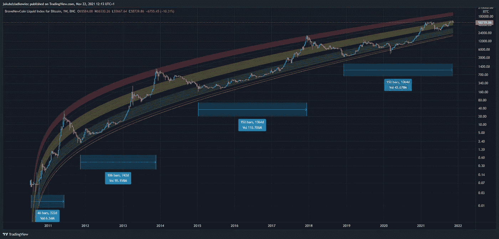

# 我们已经接近周期底部

> 原文：<https://medium.com/coinmonks/we-are-close-to-the-cycle-bottom-4b1b8ed47b3c?source=collection_archive---------29----------------------->

最相关的密码人物之一是亚瑟·海斯。他在 2013 年以套利交易者的身份起步，在 Mt. Gox 黑客攻击中遇到问题，能够拿回自己的钱，并最终创建了 bit MEX——一个加密交易所，现在已经有超过 3 万亿美元的流量。

他对市场有一个坚实而有根据的观点，他所说的话会被市场极其谨慎地分析。在他最近的一篇名为“[关闭它！](https://cryptohayes.medium.com/shut-it-down-15d230b28089)”他指出，密码市场可能会因为三个主要原因而触底:

**原因 1:在最近的密码市场崩溃期间，BTC/联邦理工学院和纳斯达克 100 指数之间的相关性被打破**

Hayes 坚信 crypto 引领着更广阔的市场。在最近的抛售中，加密与更广泛的风险资产领域脱钩，这可能表明该行业接近好转。

**原因 2: BTC 和瑞士联邦理工学院可能接近其主要周期的底部**

到目前为止，比特币有三个主要周期:

*   2013 年至 2015 年:1 162 美元至 164 美元
*   2017 年至 2018 年:19800 美元至 3190 美元
*   2021 年至 2022 年:68 700 美元至 26 500 美元

另一方面，以太坊有两个:

*   2018 年 1 月至 2018 年 12 月:1400 美元至 82 美元
*   2021 年至 2022 年:4859 美元至 1761 美元

在所有这些情况下，当地的低点相对接近以前的 ATH。他认为，我们可以估计出一个区间，这个区间可能对应于当地的底部。对于比特币来说，那就是 25000 美元到 27000 美元。乙醚的价格是 1700 到 1800 美元。

**原因#3:普遍的市场情绪是恐惧和不信任**

投资者可以很容易地在媒体 clickbait 上找到关于 NFT 是一个骗局、比特币一文不值、一切都是投机以及许多其他类似标题的文章。

这种周期性的媒体行为以前也发生过，现在是买入的最佳时机之一。

**重要提示:**

*   虽然海斯认为底部已经到来，但这并不一定意味着 BTC 和瑞士联邦理工学院的价格会飙升至历史最高水平；
*   对于短线投资者(不推荐)，祝波动性好运。对于那些着眼于大局的人，积累。海耶斯有权说:等待是值得的。

> 加入 Coinmonks [电报频道](https://t.me/coincodecap)和 [Youtube 频道](https://www.youtube.com/c/coinmonks/videos)了解加密交易和投资

[*乔·罗伯特*](https://joerobert.com/) *现任罗伯特风险投资公司首席执行官，拥有超过 20 年的资产管理经验。自创业以来，乔已经为投资者和合伙人创造了可预见的两位数回报。Joe 已经投资了股权和代币的种子轮，以及比特币、以太坊和其他顶级加密货币的投资组合。*

*如果您是合格投资者，并想了解更多关于我们产品的信息，请联系我们。*