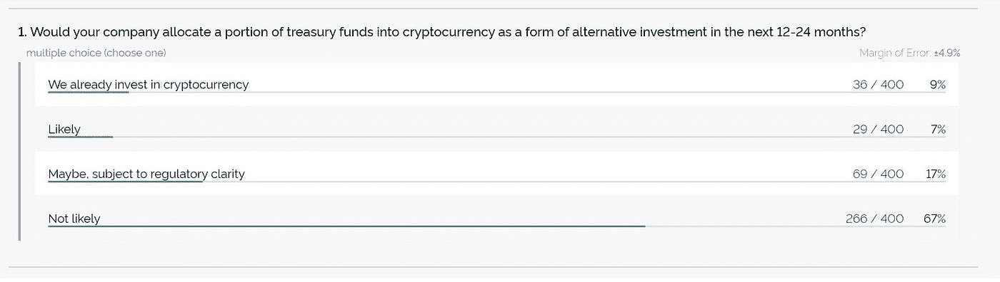
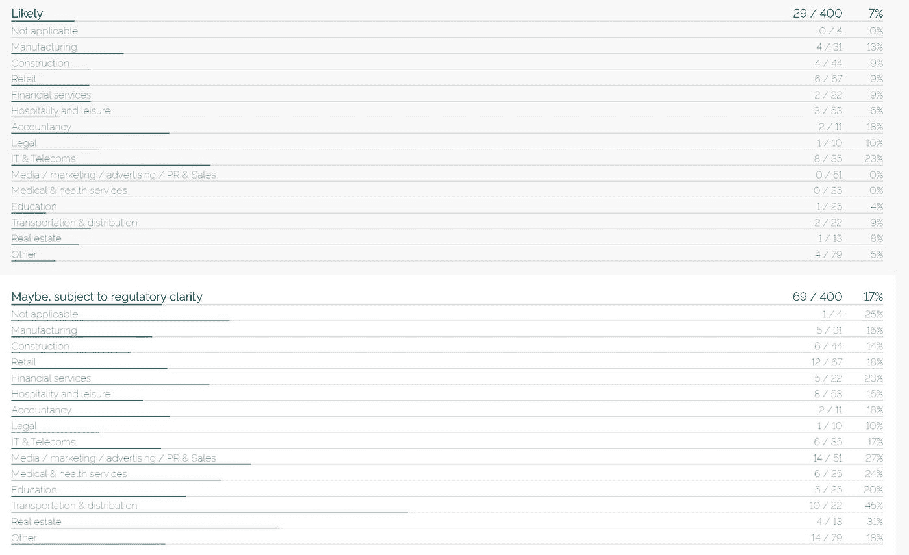
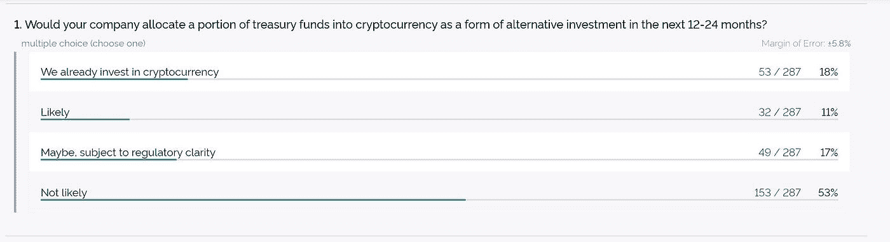
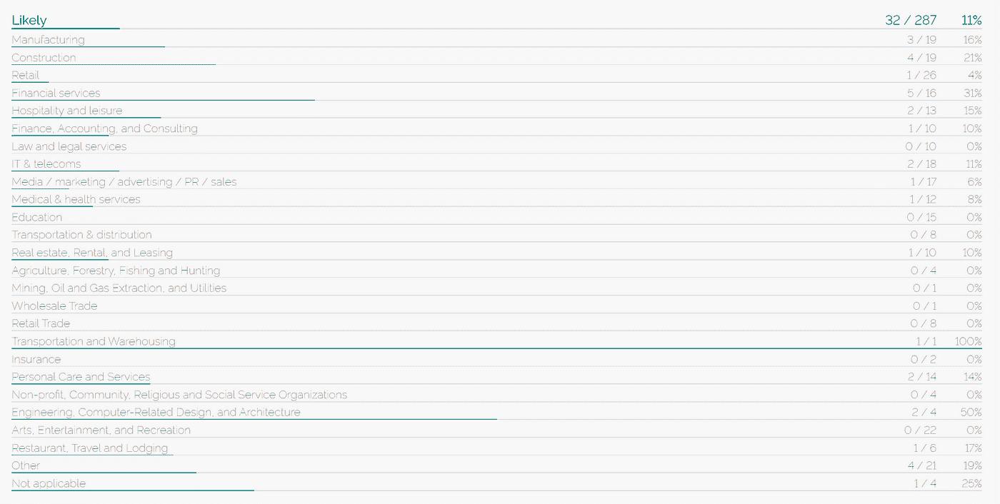
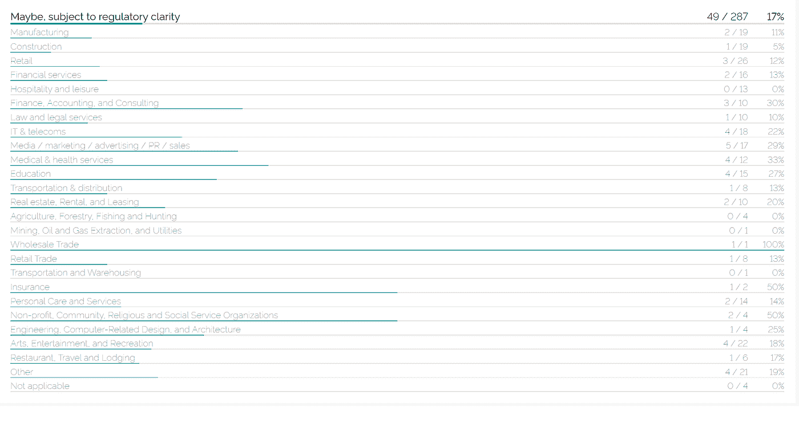
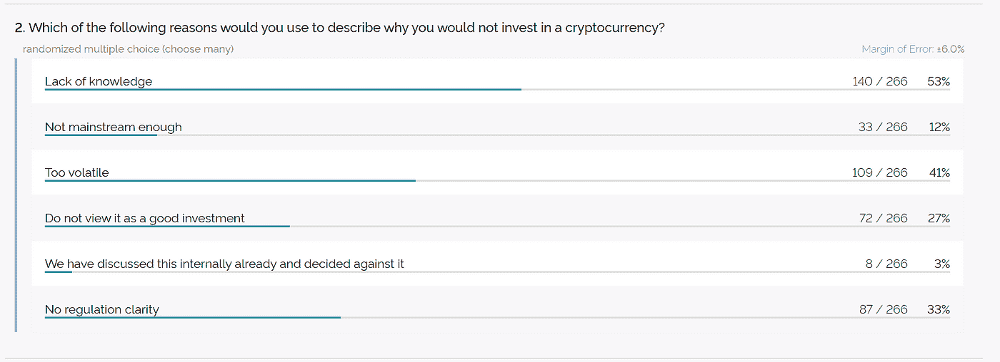
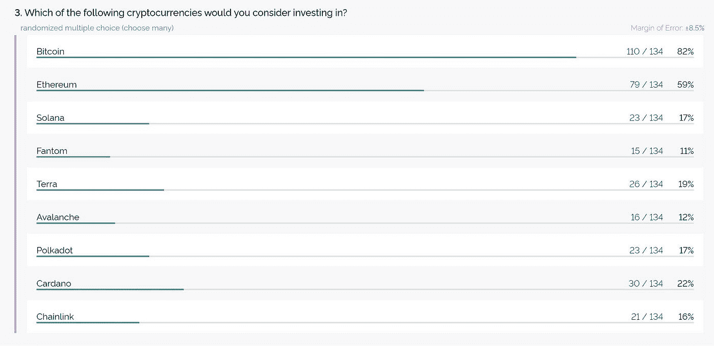
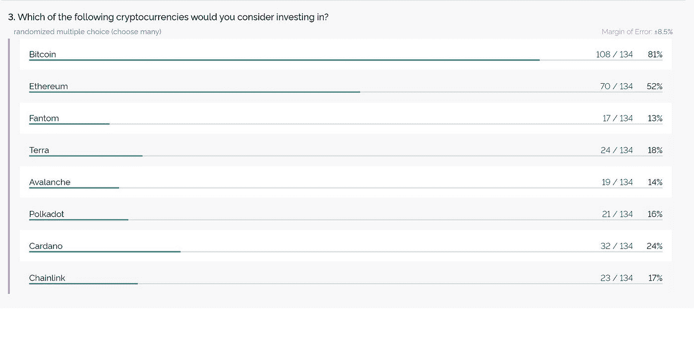

# 我们询问了 687 位首席执行官对未来两年投资加密货币的计划。以下是他们不得不说的话。

> 原文：<https://medium.com/coinmonks/we-asked-687-ceos-on-their-plans-to-invest-in-cryptocurrencies-in-the-next-two-years-e2636ee60787?source=collection_archive---------3----------------------->

unsplash

## 介绍

据估计，加密货币产业价值超过 2 万亿美元。

公众对投资加密货币作为潜在投资机会和替代支付选择的兴趣正在快速增长。

几大公司，如特斯拉、MicroStrategy、PayPal、Block(前 Square)、Mercado Libre 和 Nexon，都在去年将国库资金投资于比特币。

但是，各行各业的企业是如何看待加密这一未来投资的呢？

Wheatstones 对美国和英国各行各业的 687 家大、中、小型企业进行了普查平衡调查，以确定他们的未来意向。

## 方法学

我们对英国的 400 家个体公司和美国的 287 家个体公司进行了调查，以确定企业通常如何将加密货币视为一种投资形式。受访者都是高级决策者，特别是来自各行各业的所有者/合作伙伴、首席执行官和董事总经理，包括制造、建筑、医疗、零售、酒店、法律、会计、IT、媒体/公关、物流、金融服务、房地产和教育。

在美国接受调查的公司代表了 50 个州中的 45 个，而在英国接受调查的公司代表了英格兰的所有九个地区，以及北爱尔兰、威尔士和苏格兰。该研究包括各种不同的企业规模，每个组织的年收入从 25，000 美元到超过 10 亿美元，员工人数从 2-5 人到 1，000 人或更多。

这项调查是由国际市场研究和数据分析公司 YouGov 进行的，该公司在英国、美洲、欧洲、中东和亚太地区的 50 个市场拥有 1700 万注册会员。

## 主要发现

在英国，9%的企业已经开始投资加密货币，并计划继续这样做，而 7%的企业希望在未来 12-24 个月内这样做。另有 17%的人表示，如果监管清晰化，他们会考虑投资。

source: yougov

在法律框架下，英国的各个行业，最显著的是医疗卫生、媒体和房地产，都显著增加了对加密货币的投资意愿。请参见以下数据:

source: yougov

美国近一半的受访者认为加密货币是一种不错的替代投资形式。

18%的企业已经开始投资加密货币，而 11%的企业打算在未来 12-24 个月内投资。17%的人表示，如果监管机构能够做出澄清，他们会考虑投资。参见以下美国数据:

source: yougov

同样，在类似于英国的监管环境下，医疗/卫生、媒体、教育和社会服务机构极大地提高了投资加密货币的意愿。请参见以下数据:

source: yougov

source: yougov

这些数据可能意味着某些行业需要更清晰的监管。由于信任度的提高，可能会有更多的资金流入。正如我们在上面看到的，美国和英国的某些商业部门对投资加密货币感兴趣，但只要气候类似于狂野的西部，他们就可能会远离。这使得大量资金无法进入加密货币。随着今天的规则和法规使加密货币成为一个更加合法的环境，我们可以预计这些行业将增加其曝光率，并开始购买加密货币。价格最初无疑会上涨，但从长远来看会稳定下来。

## 投资障碍——缺乏知识和波动性

当被问及为什么他们不会投资加密货币时，英国最受欢迎的回答是“缺乏知识”，有 53%的受访者表示，其次是“太不稳定”，有 41%的人表示。见下文:

source: yougov

在美国，最常见的回答是“太不稳定”，有 42%的受访者表示，“缺乏知识”是第二受欢迎的回答，有 39%。见下文:

source: yougov

同样值得注意的是，只有 19%的美国企业和 18%的英国企业认为加密货币“不是一项好的投资”，绝大多数企业认为它是一项潜在的投资，或者提到监管、波动性和知识等其他问题。

## 哪些加密货币？

当被问及会投资哪种加密货币时，英国和美国的前三名分别是比特币(英国 82%，美国 81%)、以太坊(英国 59%，美国 52%)和卡尔达诺(英国 22%，美国 24%)。请参见以下内容:

英国数据:

source: yougov

美国数据:

source: yougov

## 摘要

企业采用加密货币是一个重大发展，促使法律框架的出现，使市场更适合企业。接受加密货币的公司已经组成了一个联盟，以影响立法者对未来的监管。一个新的创新加密委员会包括 Fidelity、Square 和比特币基地全球公司。在未来几年，我们肯定会看到加密货币金融系统和传统金融系统之间的显著融合。

分布式支付技术的概念已经被广泛接受，并且几乎肯定会在未来十年以某种形式存在。可以肯定地说，比特币和加密货币将继续存在。

*免责声明:本文包含的信息仅用于教育目的，并不构成 Wheatstones 的任何形式的建议或推荐，用户在做出(或避免做出)任何投资决定时也不打算依赖这些信息。*

> 加入 Coinmonks [电报频道](https://t.me/coincodecap)和 [Youtube 频道](https://www.youtube.com/c/coinmonks/videos)了解加密交易和投资

## 另外，阅读

*   [拥护卡审核](https://blog.coincodecap.com/uphold-card-review) | [信任钱包 vs MetaMask](https://blog.coincodecap.com/trust-wallet-vs-metamask)
*   [Exness 评测](https://blog.coincodecap.com/exness-review)|[moon xbt Vs bit get Vs Bingbon](https://blog.coincodecap.com/bingbon-vs-bitget-vs-moonxbt)
*   [如何开始通过加密贷款赚取被动收入](https://blog.coincodecap.com/passive-income-crypto-lending)
*   [霍比审核](https://blog.coincodecap.com/huobi-review) | [OKEx 保证金交易](https://blog.coincodecap.com/okex-margin-trading) | [期货交易](https://blog.coincodecap.com/futures-trading)
*   [麻雀交换评论](https://blog.coincodecap.com/sparrow-exchange-review) | [纳什交换评论](https://blog.coincodecap.com/nash-exchange-review)
*   最好的[加密税务软件](/coinmonks/best-crypto-tax-tool-for-my-money-72d4b430816b) | [硬币追踪评论](/coinmonks/cointracking-review-a-reliable-cryptocurrency-tax-software-5114e3eb5737)
*   [Stackedinvest 评论](https://blog.coincodecap.com/stackedinvest-review) | [北海巨妖评论](/coinmonks/kraken-review-6165fc1056ac) | [bitFlyer 评论](https://blog.coincodecap.com/bitflyer-review)
*   最佳[加密借贷平台](/coinmonks/top-5-crypto-lending-platforms-in-2020-that-you-need-to-know-a1b675cec3fa) | [杠杆令牌](/coinmonks/leveraged-token-3f5257808b22)
*   最佳[加密制图工具](/coinmonks/what-are-the-best-charting-platforms-for-cryptocurrency-trading-85aade584d80) | [最佳加密交易所](/coinmonks/crypto-exchange-dd2f9d6f3769)
*   [比斯勒评论](https://blog.coincodecap.com/bitsler-review)|[WazirX vs coin switch vs coin dcx](https://blog.coincodecap.com/wazirx-vs-coinswitch-vs-coindcx)
*   [7 大顶级副本交易平台](https://blog.coincodecap.com/copy-trading-platforms) | [BuyCoins 审核](https://blog.coincodecap.com/buycoins-review)
*   [MyConstant Review](https://blog.coincodecap.com/myconstant-review) | [8 款最佳摇摆交易机器人](https://blog.coincodecap.com/best-swing-trading-bots)