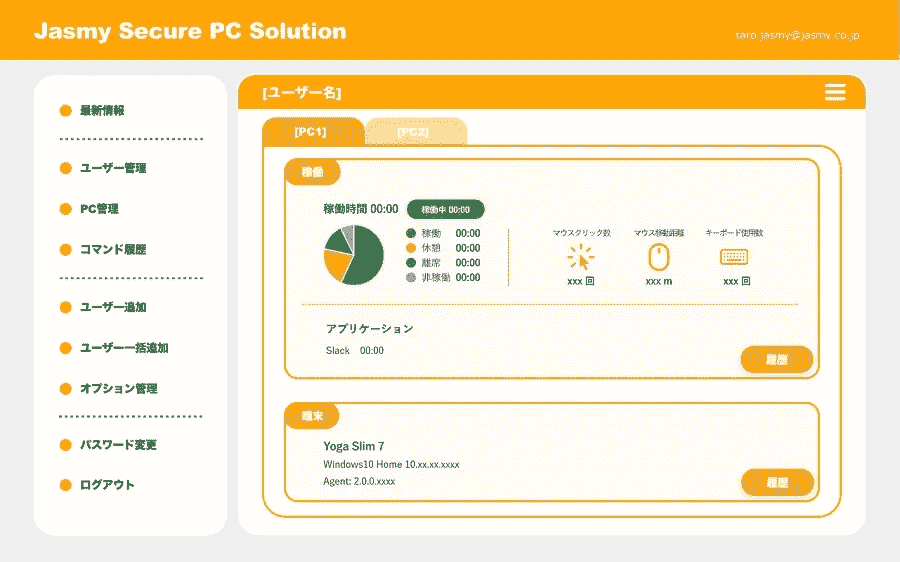
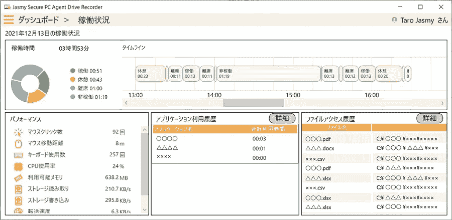

# 我们问如何看待中小企业准备远程环境时的四大头痛问题。

> 原文：<https://medium.com/coinmonks/we-asked-how-to-treat-the-four-headaches-when-smes-prepare-remote-environment-eaa151d8093a?source=collection_archive---------3----------------------->

(译自日本采访)

对于中小型企业(SME)来说，远程工作是他们希望引入但无法实现的事情。人力资源缺乏、安全问题、如何管理劳动力管理……这些担忧层出不穷。在本文中，我们询问了 Jasmy 公司的 Tanaka 先生，该公司提供在家办公解决方案“Jasmy Secure PC”，如何解决这些问题。

尽管在家工作在大公司中很受欢迎，但一些中小型企业(SME)由于涉及许多问题而无法这样做。有许多问题需要考虑，包括人力资源、成本、安全和劳动力管理，对于那些因为人手不足而无法将大量资源投入到系统相关问题上来照顾员工 IT 设备的公司来说，不仅实施而且后续运营都是一个障碍。

Jasmy Secure PC 由 jasmiy 提供，jasmiy 是一家基于区块链技术的解决方案的开发商和提供商，它极大地减少了这一障碍。Jasmy Secure PC 通过“硬盘记录器功能”提供了一个安全的远程工作环境，该功能可记录 PC 操作日志，并使用区块链管理和保护这些日志，还提供了一个“ghost drive ”,用于准备除非满足特定条件(日期和时间、连接到预先注册的网络等)否则无法访问的数据区域。).该系统易于安装，只需要在 PC 上安装一个代理。

那么，如何才能解决中小公司的顾虑和问题呢？我们向 Jasmy(关系经理)的 Yoshihiro Tanaka 询问了四个常见问题的解决方案。

**顾虑 1:我们缺乏实施在家办公的资源**
引入远程办公的两大障碍是成本和人力资源。购买远程工作 PC、瘦客户机和 VPN 环境的成本相当高，少数人无法完全处理。同样在实施后，“如何管理员工在家使用的电脑”仍然是一个主要问题，这对“被抛弃的 IT 员工”来说是一个太大的负担。

在管理器屏幕上跟踪一切。
**田中先生**一般来说，远程办公的系统往往是大规模的，需要相当大的成本来构建服务器和其他组件。有一些云产品可以以相对低廉的价格推出，但它们需要系统架构，除非系统的规模超过一定水平，否则不具成本效益。详细信息在[上一篇文章](https://jasmy-global.medium.com/how-useful-are-free-security-tools-jasmy-secure-pc-210b09e57858)中介绍，但是 Jasmy Secure PC 可以从每个员工开始部署，只需在现有 PC 上安装一个代理。Agent Pro 版本每台 PC 每月 440 日元(含税)，使用订阅管理服务的经理许可证每个帐户每月 2640 日元(含税)，使其变得负担得起。

PC 管理也很重要。借助 Jasmy Secure PC，您可以在代理屏幕上监控员工远程电脑的操作系统更新的应用程序状态。对于安全控制，该信息将有助于快速应用操作系统安全补丁。有了管理员许可证，您可以集中监控员工及其使用的电脑的运行状态。

一种方法是指派经理管理员工的电脑和工作状态。在一个小公司，通常是指派一个 it 专业人员做所有的事情，但有了 Jasmy Secure PC 的管理器许可证，您可以确保他们的一些角色将被其他员工共享，以防止过载。

**关注点二:如何准备远程电脑和网络？**

在家办公时，员工需要一台电脑在家里或其他地方使用。如果员工使用台式机或与多人共享一台终端，则必须购买一台新电脑。在使用瘦客户机时，来自服务器的屏幕传输将会继续，因此会有员工的家庭网络成为不舒适的问题的情况。

**使用“Ghost Drive”在您的计算机上创建一个安全的远程工作环境**
**田中先生**虽然设备成本是一个主要问题，但选择便宜的笔记本电脑来降低成本可以提高员工的工作效率。Jasmy Secure PC 的优势在于其“ghost drive”机制。这样，员工可以在远程网络中安全地使用他们的私人电脑。安装代理后，将在 ghost 驱动器中创建一个存储区域。可以将 Ghost 驱动器配置为仅允许在特定网络条件下或在指定时间进行访问。可以使用 Jasmy Secure PC 的“命令”功能来设置条件，该功能可以从经理的管理屏幕通过网络发送，或者在离线情况下，通过向员工的智能手机或其他设备发送二维码供 PC 读取。

与瘦客户端不同，Jasmy Secure PC 使用 PC 的资源，因此互联网连接不是瓶颈，PC 性能可以得到最大化。对于拥有用于远程网络的 VPN 线路的公司，VPN 带宽的占用是一个问题，但是有了 Jasmy Secure PC，员工只需要在需要时访问公司的文件服务器。这将扩大在家工作的机会。

**顾虑三:员工的工作量是无形的**
如果你在办公室工作，你可以看到你的员工，但在家工作就不是这样了。问题是如何理解和管理员工是否有问题，负担是否集中在某些员工身上，导致加班或在节假日工作。从管理的角度来看，我们理解未被认可的加班是一个问题，但我们不知道如何应对。

**工作状态通过“行车记录仪”日志可视化**
**田中先生** Jasmy Secure PC 使管理人员能够密切监控每个用户的工作状态。通过基于使用名为“行车记录仪”的功能记录的日志信息来累积工作时间，该系统可以可视化在家工作期间被掩盖的区域，例如您的团队正在做多少工作，他们是否进行了适当的休息，以及加班时间是否在可接受的范围内。这些数据有助于检查和跟踪员工的工作状态。

员工可能会担心他们总是被监视，或者有人未经他们允许查看他们的日志。经理必须请求该人查看日志，并且只有在该人同意后才能查看日志。即使在授予权限后，代理的屏幕也会显示谁被授予了访问日志的权限，因此匿名用户不可能看到日志。

经理的 PC 还保存了活动记录，因此任何人都可以在以后检查日志，例如，“我的老板只是在工作日结束时快速检查他或她的团队的活动状态。由于这些日志记录在区块链中，因此可以防止篡改和其他欺诈活动。这样的工具应该会带来安全感。

**顾虑 4:数据泄露**
在家中工作时必须解决的一个问题是电脑丢失或被盗时的数据泄露。有多种对策可供选择，但问题是在多大程度上？可以做些什么来最小化成本和负载？

**这可以通过使用一种系统来解决，在该系统中，数据被加密并且除非连接到注册的网络上否则是“不可见的”**
**田中先生**使用 Jasmy Secure PC，ghost drive 加密数据，并且 ghost drive 是不可见的，除非它连接到具有预先注册的网络名称(SSID)的网络上。代理和管理器可以注册授予 ghost 驱动器访问权限的网络名称。如果两者都注册了，管理器的设置优先于代理的设置，使得欺诈很难发生。

如果 PC 丢失或被盗，由于这些措施，ghost 驱动器中的数据将无法访问，从而降低了信息泄露的风险。如果代理连接到互联网，也可以从管理器远程锁定它们。Jasmy Secure PC 提供了所有必要的功能，无需安装任何防破解工具。

**允许您的员工在家工作**
在家工作是中小型企业普遍关心的问题，但有了 Jasmy Secure PC，可以用有限的人力资源和成本提供安全的远程网络。对于那些由于公司规模和预算不足而放弃在家办公的公司来说，Jasmy Secure PC 是一种现实的方式。您可以从一个终端安装它，因此向剩余的通勤员工授予 Jasmy Secure PC 以提高您的远程工作实施率也是可以想象的。

Jasmy 目前正在为订阅提供折扣优惠，优惠价格持续到 2022 年 7 月底。