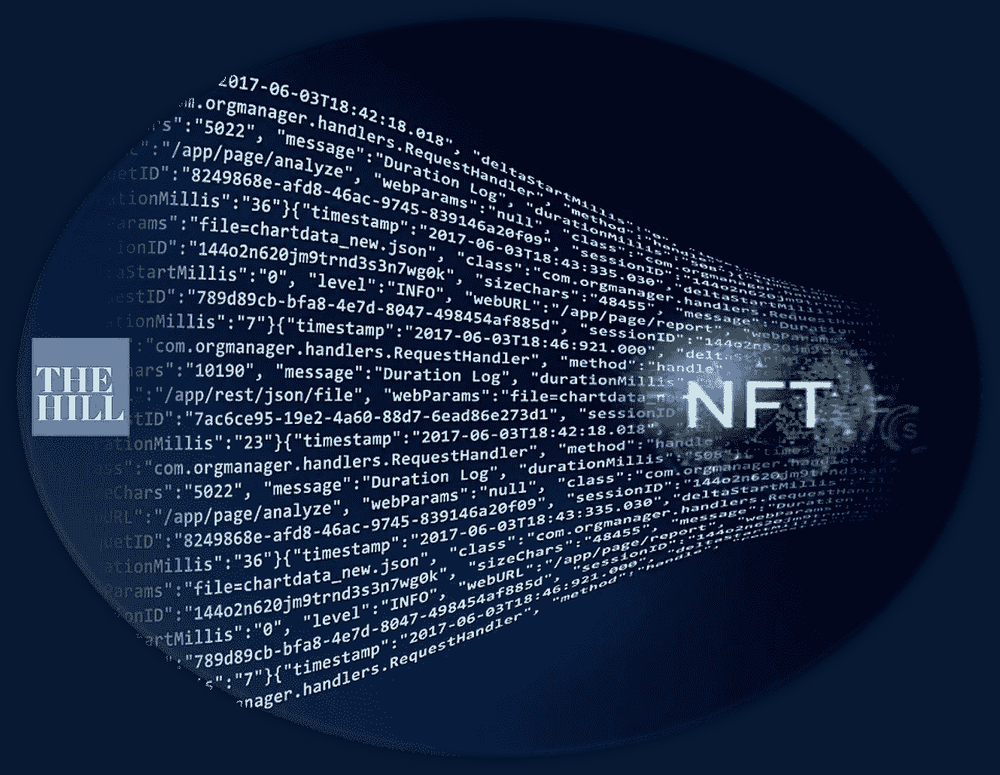

# 我们应该为我们的数据付费——NFTs 可以做到这一点

> 原文：<https://medium.com/coinmonks/we-should-get-paid-for-our-data-nfts-can-make-that-happen-14b88ba92f68?source=collection_archive---------59----------------------->

*本文原载于 2022 年 3 月 5 日《国会山》*

数据是 21 世纪最珍贵的商品，然而我们却免费赠送。当社交媒体首次出现时，这笔交易看起来相当不错；我们以观看一些个性化广告为代价获得了免费娱乐。

时间已经揭示了这些交易是多么的片面。大型科技从我们的数字行为中积累了令人垂涎的利润，我们开始意识到我们得到的回报是多么少。

这很简单，但利润丰厚。公司收集信息并出售——他们与他人交换从我们这里学到的和关于我们的一切。到 2026 年，全球数据经纪市场预计将达到 3450 亿美元的巨大规模[。与此同时，随着我们对数字世界的消费越来越多，大型科技公司正在获得更多利润。根据其](https://www.prnewswire.com/news-releases/global-big-data-market-to-reach-234-6-billion-by-2026--301322252.html) [2019 年年度报告](http://d18rn0p25nwr6d.cloudfront.net/CIK-0001326801/45290cc0-656d-4a88-a2f3-147c8de86506.pdf)，[脸书每个季度仅从加拿大和美国的每个用户那里就产生了 41.41 美元](https://www.forbes.com/sites/forbestechcouncil/2020/10/30/should-tech-companies-be-paying-us-for-our-data/)。

问题不在于大型科技公司和企业集团是否能创造价值。问题在于经济交换的公平性和我们讨价还价能力的保持。多年来，我一直在问这些问题，但仍然无法找到一条通往公平的道路。终于有答案了。

解决方案不是复杂的监管和政府干预。区块链和最引人注目的不可替代代币(NFT)可以平衡天平。通过在我们发出的数据上应用不可变的数字标记，NFTs 可以成为我们用来跟踪、管理和向最理想或最高出价者出售我们数据的私人工具。

不可替换的令牌提供了捕捉个人的唯一性的能力，并提供了防篡改结构，以通过简单的标准流程向购买者展示该唯一性。NFT 将选择权放在每个人的手中，允许他们创建一个可编程的逻辑来定义他们提供的数据的价格和性质。例如，我可以向出价最高者提供我的在线浏览数据、我的医疗数据或家庭设施使用数据。

真正的资本主义是基于供给和需求——在这种情况下，为我们的数据付费，这些数据被用来为其他人赚钱。然而，公平交易只有在对商品的价值达成共识的情况下才会发生。目前，我们依靠不透明的，故意不可读的“条款和条件”弃权来阐明交易。NFTs 为一种非常不同的参与关系打开了大门。

NFT 让分享、交易和追踪任何数字资产成为可能。当推文、艺术品甚至人类皮肤的销售被大肆宣传时，一些改变行业的想法即将推出。例如， [Snoop Dogg](https://www.coindesk.com/business/2022/02/16/snoop-dogg-plans-to-turn-death-row-records-into-the-first-nft-music-label/) 和他在 NFTs 上获得音乐创作和发行的野心可能会重新定义有创造力的音乐艺术家如何获得报酬。

如果我们抛开偏见，抛开社交媒体和广告价值，我们会收获更多。我们的医疗保健数据可以卖给制药公司来治疗疾病。随着物联网成为我们日常生活的一部分，我们对自动驾驶汽车和空调系统的使用也将具有价值。

此外，现在由忠诚卡或信用卡记录的商店交易揭示了我们在餐馆、杂货店和商场的消费模式，也可以转化为额外的收入。我们每个人都是一个数据工厂，每天每分钟都会产生一系列产品。有市场价值的数据产品。

但并不是所有的个人数据都是平等的。信息的价值因应用程序和我们的身份而异。婴儿潮一代的医学和基因数据对制药公司的价值，不同于 Z 世代买家对消费品公司产品偏好的数据。

但是隐私呢？

NFT 支持在线所有权——这种所有权也应该扩展到我们的数据，这是合乎逻辑的。他们还可以在没有政府干预的情况下解决隐私困境。我相信 NFTs 可以提供最终的技术层，推动人与公司之间合作的新时代。

我们需要将“监督资本主义”转变为“参与资本主义”

> 加入 Coinmonks [电报频道](https://t.me/coincodecap)和 [Youtube 频道](https://www.youtube.com/c/coinmonks/videos)了解加密交易和投资

# 另外，阅读

*   [Godex.io 审核](/coinmonks/godex-io-review-7366086519fb) | [邀请审核](/coinmonks/invity-review-70f3030c0502) | [BitForex 审核](https://coincodecap.com/bitforex-review)
*   [最佳比特币保证金交易](/coinmonks/bitcoin-margin-trading-exchange-bcbfcbf7b8e3) | [萝莉点评](/coinmonks/lolli-review-e6ddc7895ad8) | [比特币保证金交易](https://coincodecap.com/bityard-margin-trading)
*   [创造并出售你的第一个 NFT](https://coincodecap.com/create-nft) | [密码交易机器人](https://coincodecap.com/best-crypto-trading-bots)
*   [如何在 CoinDCX 上购买柴犬(SHIB)币？](https://coincodecap.com/buy-shiba-coindcx)
*   [CBET 评论](https://coincodecap.com/cbet-casino-review) | [库科恩 vs 比特币基地](https://coincodecap.com/kucoin-vs-coinbase) | [拜比特 vs 比特币基地](https://coincodecap.com/bybit-vs-coinbase)