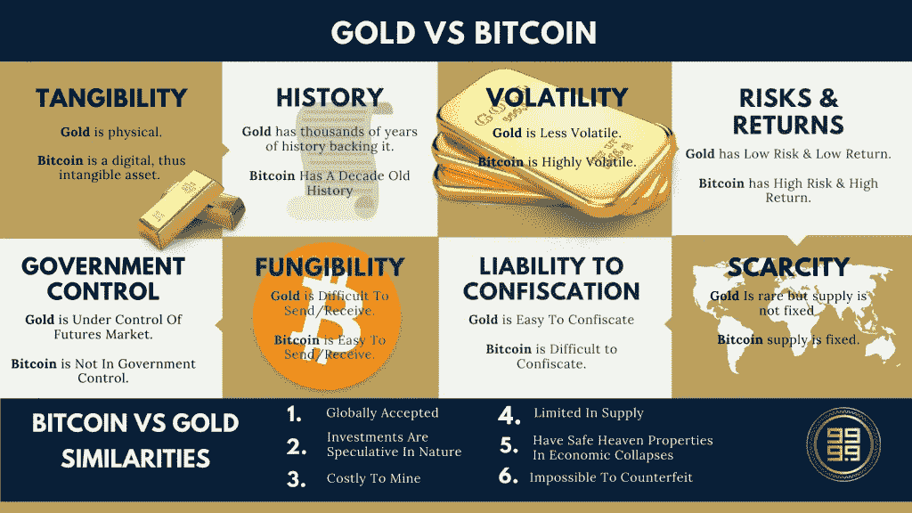
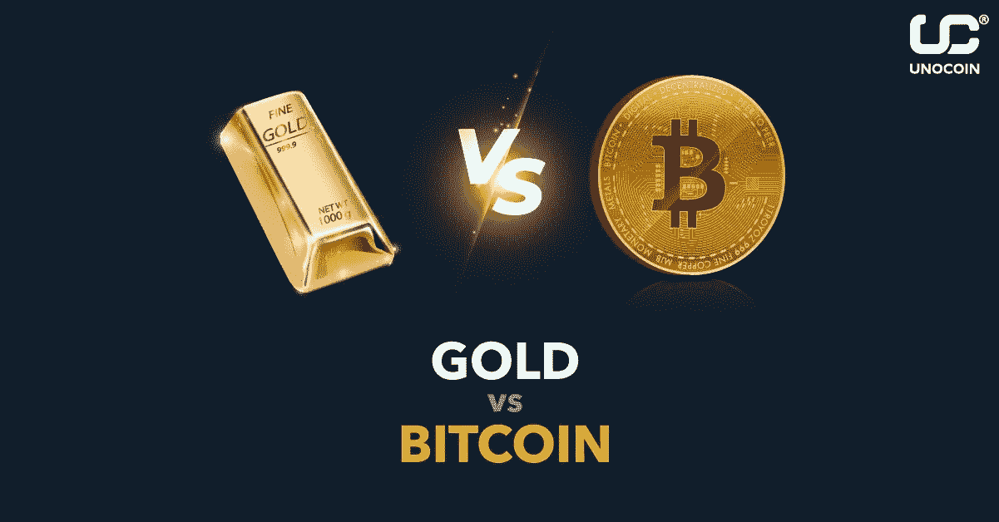

# 财富和自由

> 原文：<https://medium.com/coinmonks/wealth-and-freedom-7f88f8cf41e2?source=collection_archive---------50----------------------->

通往金融自由和繁荣的道路从未像加密货币那样简单和直接，你是你的中央银行，你是你自己的政府。随着要求引入和采用分散化金融的呼声席卷全球金融系统，很难不看到加密货币对普通人的所有变化和影响，尽管数字资产仍然面临许多政府和中央银行的严厉反对，但加密货币和分散化是不能停止的。

考虑到这一点，人们经常看到散户和机构投资者跑向数字资产和黄金，以对冲通胀风险。最近的报告显示，全球通货膨胀率创下历史新高，而美国的通货膨胀率为 8.54%。根据最新的通货膨胀数据，我们还看到欧洲各地的情况更糟，全球疫情和俄罗斯正在入侵乌克兰，这些都于事无补。

现在，投资者之间就黄金和比特币哪个更好地对冲通胀展开了激烈的辩论。

数字资产的早期投资者会支持比特币，不仅因为它作为对冲工具的能力，还因为它在投资期间为他们带来的收益。尽管黄金从有记忆以来就很值钱，但就利润而言，它的移动速度很慢，这一直被比特币创造者视为一个劣势。而其他投资者倾向于指出数字资产的波动性是一大劣势。想象一下，举办一场派对，因为你的数字资产组合上涨了 20%，而在派对结束前，你下跌了 50%。听起来很荒谬，但这是大多数投资者必须忍受的。那么我会考虑和坚持哪一个呢？

诚实回答？都是！比特币和数字资产的比例为 6:4，这是因为我个人认为，与黄金相比，数字资产的上行空间很大，尽管黄金几个世纪以来一直是一种经过测试和信任的对冲工具，但也是一种缓慢的移动。当你可以轻松地 100%使用加密货币时，为什么要满足于 2%的利息呢？

注意到法定货币甚至不是讨论的一部分了吗？是啊，菲亚特大部分时间就是这么没用。然而，每一个好的创新都有缺点，对于加密货币来说，它有波动或网络攻击的风险，以及基于 POW(工作证明)运行的数字货币的能耗。另一方面，黄金可能没有这些问题，但就可用性和金融技术实施而言，它远非数字资产可比。所以说到底，黄金只是黄金，但加密货币是创新、金融自由，最重要的是全球去中心化和金融的未来。

留下来听我的下一首曲子。这将是史诗般的。

> *加入 Coinmonks* [*电报频道*](https://t.me/coincodecap) *和* [*Youtube 频道*](https://www.youtube.com/c/coinmonks/videos) *了解加密交易和投资*

# 另外，阅读

*   [Bookmap 评论](https://coincodecap.com/bookmap-review-2021-best-trading-software) | [美国 5 大最佳加密交易所](https://coincodecap.com/crypto-exchange-usa)
*   最佳加密[硬件钱包](/coinmonks/hardware-wallets-dfa1211730c6) | [Bitbns 评论](/coinmonks/bitbns-review-38256a07e161)
*   [新加坡十大最佳加密交易所](https://coincodecap.com/crypto-exchange-in-singapore) | [购买 AXS](https://coincodecap.com/buy-axs-token)
*   [红狗赌场评论](https://coincodecap.com/red-dog-casino-review) | [Swyftx 评论](https://coincodecap.com/swyftx-review) | [CoinGate 评论](https://coincodecap.com/coingate-review)
*   [投资印度的最佳密码](https://coincodecap.com/best-crypto-to-invest-in-india-in-2021)|[WazirX P2P](https://coincodecap.com/wazirx-p2p)|[Hi Dollar Review](https://coincodecap.com/hi-dollar-review)