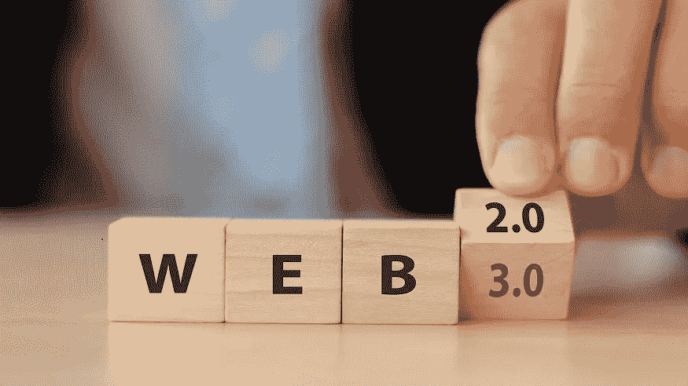
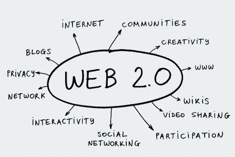
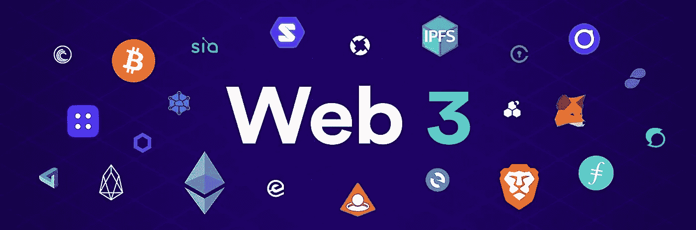
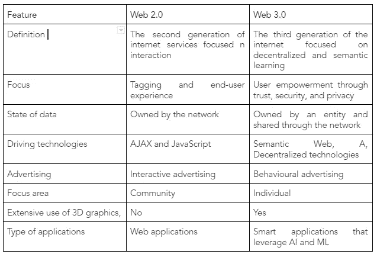

# Web 2.0 与 Web 3.0-旧与新。

> 原文：<https://medium.com/coinmonks/web-2-0-vs-web-3-0-the-old-vs-the-new-510b9daaed2f?source=collection_archive---------18----------------------->

深入我们对 Web 3 的理解。我们需要简单了解一下网络从最初版本开始的演变过程；Web 1，Web 2，最后是 Web 3。为了了解未来，我们最好做一次快速的时间旅行。让我们架起一座连接过去和现在的桥梁，开辟一条通向未来的道路。

**网络的演变**

众所周知，互联网自诞生以来，经历了不同的发展阶段。在第一阶段，我们有 Web 1.0，它包括静态网页，提供来自服务器文件系统的内容。Web 1.0 允许互联网用户从世界的几乎任何角落访问数据。然而，Web 1.0 没有提供任何与内容交互的功能。因此，web 2.0 开始变得突出，随后对 Web 2.0 中挫折的识别导致了 web 3.0 的发展。让我们先深入了解 web 2.0 和 Web 3.0，然后再讨论它们的区别。

**什么是 Web 2.0？**

Web 2.0 代表了我们今天所知道的互联网，包括所有的博客、社交媒体网站、购物、新一代等等！

它的特点是用户生成的内容、跨不同服务的互操作性、可用性、交互性和高水平的参与。虽然这似乎是 web 1.0 静态页面的巨大飞跃，但实际上，两个版本之间的核心定义几乎没有变化。

改变的是我们使用现有基础设施的方式，从这个角度来看，可以肯定地说，Web 2.0 中的大部分变化都发生在前端。

**Web 2.0 的特点**

在 Web 2.0 中，用户可以:

*   对信息进行分类
*   发送和接收来自不同来源的信息
*   创建并与他人共享动态的响应内容
*   从移动设备、多媒体控制台、电视等设备访问内容
*   为不同软件之间的互操作性创建和开发 API

web 2.0 应用展示了一场强大的前端革命，为与最终用户的互动提供了更多的机会。其中一些包括社交媒体、博客、网络内容投票、社交书签、播客、标签。

尽管这些都是 Web 2.0 技术的优秀特性，但由于缺乏内置的安全性和授权机制，它并没有在参与交互的实体之间产生信任感。

随着用户和技术变得越来越成熟，对信任、安全、隐私和控制的需求也越来越大。这导致了 Web 3.0 的发展。

**什么是 Web 3.0？**

Web 3.0 是对 Web 2.0 的一个很有希望的改进，尤其是在基础设施方面的重大转变。也被称为语义网，第三代网络利用了先进的元数据系统。元数据系统有助于组织和安排所有类型的数据，使其对人类和机器可读。

web 3.0 的最大优势可能是信息将是通用的，任何人都可以找到，这意味着不再需要花几个小时来挖掘内容以找到您想要的东西。你可能想知道它如何克服 Web 2.0 的缺点。

嗯，web 3.0 的支柱是人工智能和去中心化网络。人工智能的使用实现了机器对机器的交互、高级分析和其他智能操作，这些在网络上是不可能的。

至于去中心化网络，它将数据推到边缘，送到拥有数据的实体手中。在这个过程中，它赋予实体拥有自己的数据并决定如何共享数据的权力，从而产生了一种称为自我主权身份的哲学。

这些网络还通过加密和使用分布式账本技术(DLT)为用户提供隐私和安全，从而克服了 Web 2.0 中存在的信任障碍。

**Web 3.0 的特性**

通过理解和关注 Web 3 的特性，可以为理解 Web 2 和 Web 3 之间的差异打下更坚实的基础。以下是 Web 3.0 的一些重要亮点，有助于将其与 Web 2.0 区分开来:

*   Web 3.0 利用人工智能以更快的速度提供正确的结果，同时访问实时洞察。
*   Web 3.0 还使用户能够利用 3D 视觉和图形的潜力。
*   Web 3.0 的另一个关键特性是语义 Web 功能。语义网可以理解单词的意思，因此机器和人类都可以很容易地找到、共享和分析内容。
*   Web 3.0 通过加密和 DLTs 等高级授权机制保护用户身份和数据
*   提供高水平的安全性和隐私性。

下面是 Web 2.0 和 Web 3.0 之间的区别的鸟瞰图。

A table highlighting Web 2 and 3 differences

总之，Web 3.0 是一个巨大的飞跃，因为它创建了人类和机器进行交互、创建、查找和共享分布式数据所需的基础设施，利用人工智能进行准确预测，并通过信任、安全和隐私网络控制个人身份。

要了解更多关于 Web 3.0 技术及其创新，请关注[区块游戏](https://blockgames.gg/)、 [Nestcoin](https://nestcoin.com/) 和 [Zuriteam。](https://zuri.team/)