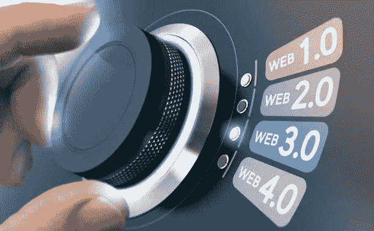
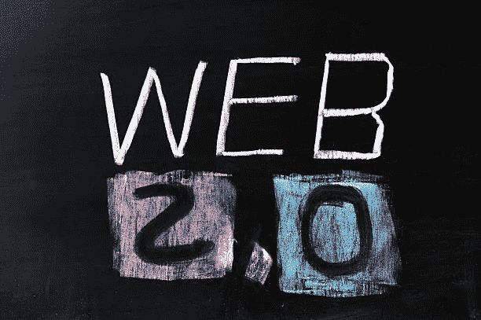
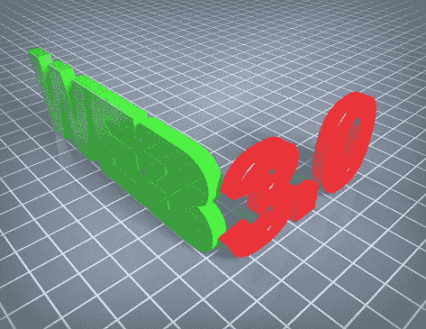

# Web 2.0 与 Web 3.0:理解差异

> 原文：<https://medium.com/coinmonks/web-2-0-vs-web-3-0-understanding-the-differences-df13fc00b32f?source=collection_archive---------21----------------------->

Photo credit: [shutterstock.com/g/olivier26](https://www.shutterstock.com/g/olivier26)

网络是在不到三十年前发明的，我们曾经没有现在是我们生存核心部分的东西，这难道不令人惊讶吗？

伯纳斯·李在 20 世纪 90 年代开创了万维网。WWW，或我们今天称之为 web，从静态网页开始，发展到我们现在使用的东西。在深入研究 web 2 和 web 3 之间的差异之前，让我们先来看一下 web 的快速介绍。

# 概观

web 背后的理念是通过互联网创建对信息和资源的全球访问。在 Web 1.0 中，我们看到了第一批网页和浏览器的出现。我们有静态网页，只有几个创建者。你可以想象，当时大多数用户都是内容消费者。

Web 1.0 不同于我们今天所拥有的光滑美观的页面。几乎没有什么互动。用户只搜索和阅读信息，而不修改内容或生成他们自己的内容。因此，web 1.0 也被称为“只读”web。

我们目前正处于 web 2.0 时代，也称为“读写”web。Web 2.0 和 web 3.0 是流行语，我们有数百万人在问:什么是 Web 3.0？Web 2.0 和 3.0 有什么区别？随着 web 3.0 的出现，我们应该期待什么？

# **Web 2.0**

Web 2.0 从 Web 1.0 引入了一个戏剧性的转变。它指的是专注于用户生成内容、社交连接和用户互操作性的万维网。使用 web 2.0，您可以贡献内容并与其他用户互动。瞬间，全球数百万人可以查看任何用户生成的内容。

人们通过虚拟空间或社区进行互动和协作。web 2.0 的发展带来了社交网络等关键创新。向 Web 2.0 过渡带来的一些主要功能是博客、内容监管、内容投票、播客、社交媒体和社交网络。

由于 YouTube、优步、抖音和脸书等主流平台的发展，我们也看到了零工经济的零星增长。人们在舒适的家中通过在线创建内容和提供服务来获得全职收入。

# **Web 3.0**

Web 3.0，也称为读写执行，是从 web 2.0 的各种路径演化而来的。根据 Berners Lee 的解释，web 3.0 就是他所说的语义网。它是当前 web 的扩展，提供了一个跨应用程序共享和重用数据的框架。

据 [W3C](https://www.w3.org/standards/semanticweb/) (万维网联盟)

> *“语义网是指链接数据的网络。它使人们能够在网络上创建数据存储，构建词汇，并编写处理数据的规则*

在 web 3.0 中，数据是不被拥有的；相反，它是共享的。Web 3.0 承诺将用户体验提升到另一个水平，并带来 Web 2.0 的范式转变。通过数据交换格式，人们可以访问数据。不仅如此，软件应用程序也将能够解释和理解这些数据。因此，我们将拥有相互交互并为人类用户分析信息的网络应用。

也就是说，Web 3.0 远远超越了语义网。它还有其他功能，如区块链和点对点网络等无许可系统。

Photocredit: [istockphoto.com/matdesign24](https://www.istockphoto.com/portfolio/matdesign24?mediatype=photography)

定义 Web 3.0 的关键概念是:

*   分散
*   无权限和不信任
*   到处存在
*   人工智能和机器学习

## 分散

去中心化是 Web 3.0 的核心规则。例如，信息不会存储在固定位置的单个服务器上。随着 Web 3.0 的出现，我们将看到信息同时存储在不同的位置。因此，对数据的更大控制权将掌握在用户手中，而不是大组织手中。

## 无权限和不信任

由于去中心化和它的开源本质，Web 3.0 也将是不可信和无权限的。这意味着人们将无需通过受信任的机构，也无需政府的任何授权就能进行互动。因此，我们将拥有运行在区块链和对等网络上的分散式应用(dApps)。

## 到处存在

此外，web 3.0 也带来了它的无处不在。信息将通过多种应用程序连接和访问。我们将拥有连接到互联网的日常设备。物联网(IoT)就是一个例子。

## 人工智能和机器学习

Web 3.0 的另一个核心特征是机器学习和人工智能。在这里，计算机将能够像人类一样理解信息。随着数据和算法的使用，计算机将模仿人类，并因此逐渐提高准确性。例如，内容创作可以从人工创作走向人工创作。

# 底线

Web 2.0 是第二代 Web，支持读写功能和参与式社交网络。相反，第三代 web，Web 3.0，更侧重于语义 Web。它使用户和分散基础设施上的机器之间的交互更好。

Web 2.0 仍然是许多 Web 应用程序的当前基础。然而，随着脸书将其名称改为 Meta，向 Web 3.0 的转变正在顺利进行。毫无疑问，Web 3.0 是一个令人兴奋的机会，也许用不了多久，我们就会看到它成为一种规范。

如果你想了解更多关于 Web 3.0 的知识并参与到参与式学习中，可以去看看像 [Blockgames](https://blockgames.gg/) 、 [Zuri](https://zuri.team/) 和 [Nestcoin](https://nestcoin.com/) 这样的组织。