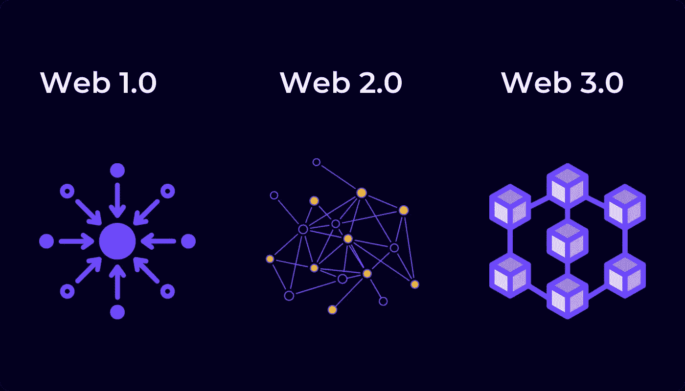

# Web 3.0:简单的解释

> 原文：<https://medium.com/coinmonks/web-3-0-a-simple-explanation-6df1cd91a345?source=collection_archive---------9----------------------->

## 了解 Web 3.0

Web3.0

在本文中，您将了解到…

*   互联网的历史从 Web1、Web2 到 Web3，
*   对 Web3 的简单解释和定义是，
*   Web3 应用程序的示例，
*   对网络未来可能发展的展望。

“Web 3.0”，简称 Web 3，是城里的新话题。如果你用谷歌搜索“Web3”这个词，你会发现各种各样的东西:大多数都非常专业，普通互联网用户无法理解。尽管如此，你应该了解更广泛的趋势和概念，尤其是作为一个投资者。因为在未来几年，网络 3 **将提供新的金融机会。**

但是按部就班:Web1 和 Web2 是什么？

# Web1、Web2 和 Web3:历史、解释和定义

第一个商业 Web1 应用程序出现在 20 世纪 90 年代初。那时，“互联网”由静态网页组成。这是一个“只读”互联网，用户只能消费信息。像脸书或网飞这样的平台当时还不存在；明星是像大英百科全书在线或雅虎这样的网站。IP、HTTP、URI 和 HTML 提供了技术基础设施。

2000 年，网络泡沫破裂，许多互联网公司从市场上消失了。尽管遇到了这一挫折，科技界的聪明人还是专注于 JavaScript、HTML5 和 CSS3 等创新的进一步发展。结果是 Web2 的逐渐兴起。

虽然 Web1 主要实现了信息的传输，但 Web2 专注于交互:用户将他们的数据提供给服务提供商，如社交媒体、电子商务或支付提供商，使这些应用程序能够运行。换句话说:Web2 用户不再仅仅是消费者；他们也是产品。

一个例子是脸书:与 Web1 网站不同，两个脸书用户可以访问同一个网站，但看到完全不同的内容。这是因为脸书从这两个用户接收不同的数据，然后向他们显示不同的广告内容或帖子。

# Web2 到 Web3:集中化有什么问题？

Web2 极大地改变了我们相互交流和互动的方式。我们通过 WhatsApp 打电话，在亚马逊购物，住在通过 Airbnb 预订的其他人的房产中，并通过在线银行和金融科技平台支付。Web2 无疑增加了我们的财富和便利，但也带来了新的挑战:

Web2 基于服务器-客户端结构，这意味着集中的私有公司控制并拥有数据。结果是这些公司拥有巨大的垄断力量，并为潜在的竞争者制造了进入壁垒。所有的 Web2 应用程序都由中央公司控制，包括整个银行和金融系统。

Web3 已经开始通过用分布式账本取代集中式服务器-客户端基础设施来打破这些集中式参与者的市场力量，最常见的类型是区块链。因此，不是所有的数据都存储在一个集中的服务器上，而是分散在一个分散的计算机网络中。因此，以前充当中介的中央集权实体将被淘汰。

这里有一个例子:今天，任何人从一家银行向另一家银行汇款都使用各自银行提供商的中央服务器。银行作为中介进行交易。用户必须将所有数据移交给相关银行，并依靠它们来正确执行交易。当然，银行对这项服务收取费用。这是网络银行。

在 Web3 中，你可以通过去中心化的区块链发送交易，比如比特币区块链。这个区块链通过使用数学和计算能力独立地验证交易的准确性。与 Web2 不同，不再需要银行作为中介。这也意味着用户保留了对其数据的控制权，而且由于没有集中的参与者从交易中赚钱，因此无需支付任何费用。

换句话说，Web3 应该将数据主权和所有权归还给用户——这至少是个想法。

# Web3 应用程序示例

回过头来看，Web1 的起点很可能是网景网络浏览器。Web3 的开始可能是比特币网络的启动。去中心化的**加密货币**既不需要银行也不需要中央银行，而是代表了一个基于区块链技术的点对点网络。比特币区块链推出五年后，同样的技术被用于开发**以太坊区块链**。以太坊使用智能合约实现了基于令牌的交易的自动化。

今天，各种各样的应用程序运行在以太坊区块链上，也运行在其他区块链上。这些应用包括[分散金融应用(DeFi)](https://blog.cryptostars.is/defi-in-crypto-the-top-5-defi-coins-to-invest-in-2022-1f25e05cf7a4) ，如**加密贷款**，储户通过 [DeFi 平台](https://blog.cryptostars.is/defi-in-crypto-the-top-5-defi-coins-to-invest-in-2022-1f25e05cf7a4)为**贷款**提供流动性，并在此过程中赚取利息。智能合约取代了银行等中央中介，创造了一个“无信任”网络。**通过消除中间商，价值链变得更高效、更便宜。**

不可替换令牌(“NFTs”)是另一个 Web3 应用。NFT 代表可唯一识别的数字资产的证券化所有权，例如图形、艺术品或域名的所有权。由于 NFT 是独一无二的，它们能够实现数字产权的透明记录及其自动转移，而无需集中的中介。这对广泛的 Web3 应用至关重要:尽管用户拥有哪种比特币无关紧要，但在数字产权(例如一块土地)的情况下，原创性很重要。

严格地说，钞票也是 NFT，因为每张钞票都有自己的序列号。这意味着钞票是独一无二的，因为没有两张钞票是相同的，这与比特币不同。但现实是，用哪张钞票付款并不重要。这对于支付手段来说无关紧要，但对于艺术品或其他产权来说却很重要。

Web3 也可以用新的决策形式取代传统类型的公司。分散的自治组织(“DAO”)可以用基于令牌的治理机制取代集中的所有权，从而取代传统的公司层级结构。在 DAOs 中，决策是通过投票民主做出的，投票权基于一个人拥有的令牌数量。阿刀的员工也是用代币补偿工作的。他们的薪酬不是由管理层设定的，而是根据他们对道的共同使命的贡献以及道的所有权来确定的。目标是创造额外的激励。

在 Web3 中，甚至民主进程也可能是基于令牌的。在代议制民主中，当选代表进行集中决策，而直接民主可能会在网络 3 中复兴。民选代表最终也是象征性治理机制可以取代的中介。

所有这些用例最终可能会聚集在所谓的元宇宙中:元宇宙是一个虚拟现实，人们在这里进行交流、交易、游戏、学习或其他互动。在 Web2 中，用户是产品，而在 Web3 中，用户也是所有者。

# Web3 的挑战

Web3 仍处于早期阶段，许多问题仍然存在:技术可扩展性是一个关键挑战，就像 Web1 一样，因为分散网络的数据处理速度明显不如集中的 Web2。例如，比特币交易比通过 Visa 或 Mastercard 网络进行的交易慢得多。Web3 应用程序的用户体验目前也赶不上 Web2 应用程序。例如，对许多用户来说，在 Web3 平台上贷款比在 Web2 金融科技或银行上更复杂。

此外，还有一个问题是 Web3 到底有多分散？至少在今天，Web3 的功能仍然依赖于 Web2 基础设施。如果基础设施提供商如 Amazon Web Services 失败，大多数 Web3 应用程序也将不再可用。许多分散的应用程序也由风险投资公司资助，这些公司持有大量令牌，因此在网络中拥有决策权。这方面的例子有**加密交易所** Uniswap 或**加密借贷**协议复合金融。

# 展望:Web3 的未来

要实现去中心化 Web3 的愿景，仍有许多创新工作要做。也就是说，Web2 也不是一夜之间形成的。它在 30 年里从信息经济发展到平台经济。代币经济是下一个合乎逻辑的进化步骤。

目前尚不清楚这种演变将如何继续。在中期内，分散式协议将可能与集中式平台共存，并继续获得市场份额。这已经发生了。如今，仅分散式金融协议就已经管理着数百亿美元的资产。虽然与传统金融行业相比，这一数字很小，但它是相关的，而且还在继续增长。

作为从 Web1 到 Web2 的过渡，从 Web2 到 Web3 将是一个渐进的创新过程。从长远来看，哪种技术和商业模式更优越将变得清晰。最终，我们将生活在一个新世界。

早期投资者有**机会**。与 Web1 和 Web2 相反，在 web 1 和 web 2 中，主要是创始人和风险资本家是大赢家，**每个人都可以更直接地从 Web3 中受益**。因此，Web3 是每个人获得更大金融主权的关键工具。

## 在 Linkedin 上关注我

[https://www.linkedin.com/in/ishanshahzad/](https://www.linkedin.com/in/ishanshahzad/)