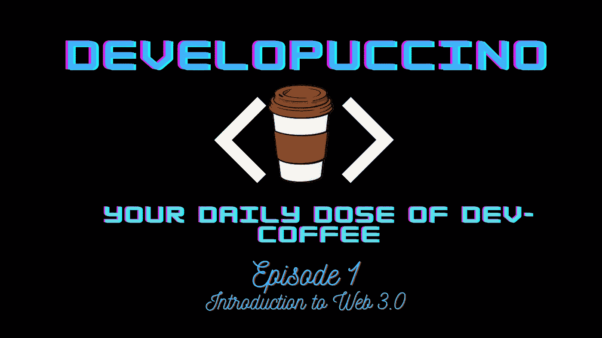

# web 3.0——充满机遇的孤岛？

> 原文：<https://medium.com/coinmonks/web-3-0-an-island-full-of-opportunities-41248d6259a5?source=collection_archive---------11----------------------->

Welcome to the Debut Episode of “Developuccino”!

欢迎阅读"**develouccino**"的第一篇文章，在这个系列中，我们大部分时间都以轻松的语气谈论学习、经验和围绕 Web3 开发者日常生活的任何事情。
我一直在想我的第一篇文章应该涵盖什么，经过一个漫长的过程后，我发现了同样的陈词滥调“**Web 3.0 简介**”，但我也会以某种方式尝试将这个想法定位为一个参与这个领域的开发者，并对这个不断增长的领域持某种中立的观点。

# 什么是 Web 3.0？

人类一直遵循着一种重复的模式，提升和加强他们所有的努力。我们已经观察到工业和信息技术领域的各种世代升级，谈到 **Web 3.0，**它被设想为互联网的去中心化未来，它以**区块链**的概念为基础。

The Generic Web Growth Image

Web 3.0 的流行可以归功于它最好的资产之一，也可以说是它的根源- **加密货币**和 **NFT** s。由于该领域是所有技术想法爆炸的中心之一，我们已经看到许多区块链不断发展，甚至一些代的升级现在正在全速进行。

# 我们为什么需要 Web 3.0？

But Why do we need an Upgrade?

很长一段时间以来，互联网一直致力于一个非常集中的结构，这有点像**“必要的邪恶”**，因为这是这个新想法安定和稳定所需要的。但是现在时代要求转变！既然互联网是人类最有影响力的部分之一，我们需要它变得更加分散，它由用户建立、运营和拥有。Web 3.0 将大部分权力掌握在人们手中而不是有影响力的大公司手中的想法摆在了桌面上。
(相信我这不是机器人先生的剧本！)

# 你为什么要进入 Web 3？

虽然成为一名开发人员很大程度上取决于你的技能，但进入特定空间的专业领域对任何开发人员来说都是一个巨大的飞跃。虽然有几个原因可以让你的救生艇倾斜到 Web 3.0 世界的巨型救援船上，但我将尝试列出一些立即进入该领域的优点。
**对优秀开发人员的高要求** Web 3.0 领域已经蓬勃发展了一段时间，无论是在理念上还是财务上都是如此。产业转移导致对优秀开发人员和其他角色的需求不断增加。
**先发优势** 虽然这个领域已经存在了相当长一段时间，但就目前该领域开发者的情况来看，我们仍有望获得某种先发优势。
**挑战和实验自由** 现在说一个领域充满挑战是很普通的，但这似乎是真的，对于第三代 Web 来说，存在竞争和许多挑战，因为我们仍在探索这个领域。它也让你试验你的视野和技能，这保证了一个非常重要的成长。

# 怎样才能进入 Web 3.0？

现在，如果你在阅读了上面的内容后确信你想进入 Web 3，你将不得不遵循一种方法(如果你想有条理，即使它总是由你决定:])

Just Another JavaScript Betrayal meme.

**向 Web 3.0 开发者转型。** 这是仅限于 Web2 的现有开发人员可以采用的路线，所需的技术堆栈非常相似，但又是新的，熟练掌握一些基础编程语言总会让你比其他人多一点优势。最流行最有影响力的 **Solidity** 总是被认为和 **JavaScript 非常相似。** 无论是使用 **API** 、**数据库**、**文件存储**还是我们自己的**前端，Web 2 和 Web 3 开发管道有很多相似之处。**

因此，对于过渡，我可以建议你先阅读更多关于空间的具体理论，这将有助于你收集具体的基础和想法的基础，[以太坊](https://ethereum.org/en/developers/docs/)和[坚固](https://docs.soliditylang.org/en/v0.8.14/)医生是生命的救星，有大量的 YouTube 视频，我最喜欢的是
[eatteblocks](https://www.youtube.com/c/EatTheBlocks)、 [Dapp 大学](https://www.youtube.com/c/DappUniversity)、[纳德·达比特](https://www.youtube.com/c/naderdabit)、 [DeFi Dad](https://www.youtube.com/c/DeFiTutorialswithDeFiDad) 和[智能合同程序员](https://www.youtube.com/channel/UCJWh7F3AFyQ_x01VKzr9eyA)

# 结论

I am gonna conclude now..

风险总是有回报的，我总是在探索自己并从我正在进行的任何旅程中学习之后，但我将重申我在整篇文章中描述的内容，我所在的空间是你可以进入的最好的社区之一，更好的想法总是值得我们这一代人尝试。我希望我试着总结了整篇文章的要点，并且在通读它们的时候，这不是一颗难以下咽的药丸。下次见。
**坚持喝咖啡，坚持发展。您的 Developuccino 已交付！**

> 加入 Coinmonks [电报频道](https://t.me/coincodecap)和 [Youtube 频道](https://www.youtube.com/c/coinmonks/videos)了解加密交易和投资

# 另外，阅读

*   [TraderWagon 回顾](https://coincodecap.com/traderwagon-review) | [北海巨妖 vs 双子座 vs BitYard](https://coincodecap.com/kraken-vs-gemini-vs-bityard)
*   [如何在 FTX 交易所交易期货](https://coincodecap.com/ftx-futures-trading) | [OKEx vs 币安](https://coincodecap.com/okex-vs-binance)
*   [OKEx vs KuCoin](https://coincodecap.com/okex-kucoin) | [摄氏替代度](https://coincodecap.com/celsius-alternatives) | [如何购买 VeChain](https://coincodecap.com/buy-vechain)
*   [ProfitFarmers 回顾](https://coincodecap.com/profitfarmers-review) | [如何使用 Cornix 交易机器人](https://coincodecap.com/cornix-trading-bot)
*   [如何匿名购买比特币](https://coincodecap.com/buy-bitcoin-anonymously) | [比特币现金钱包](https://coincodecap.com/bitcoin-cash-wallets)