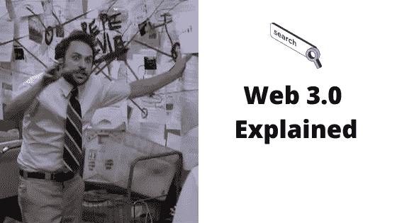
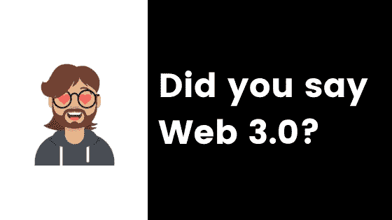
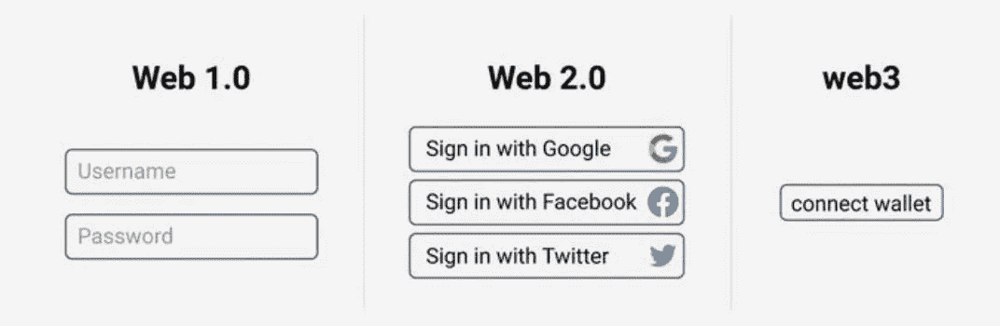
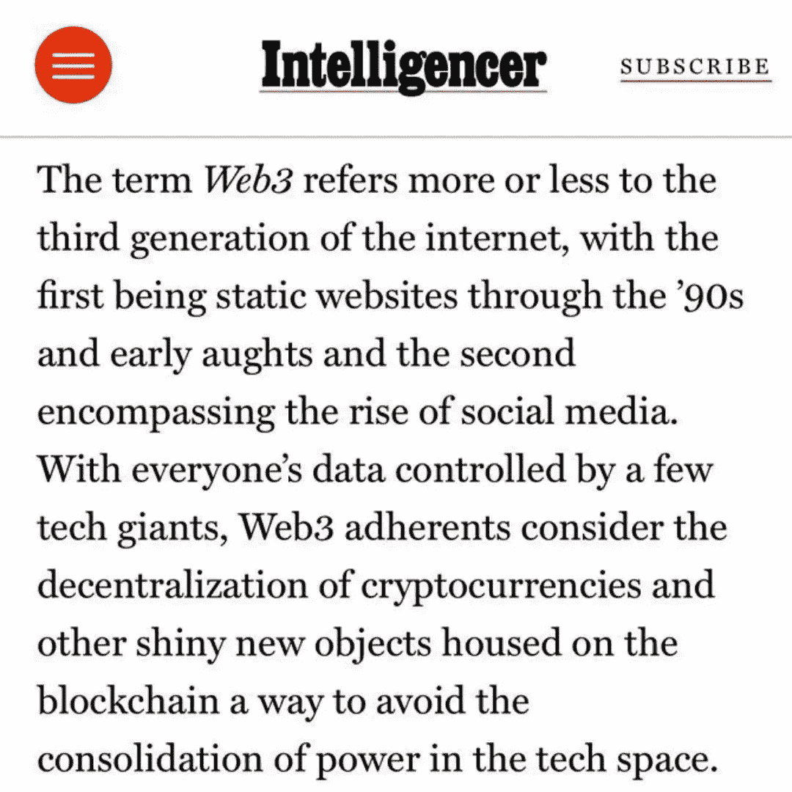
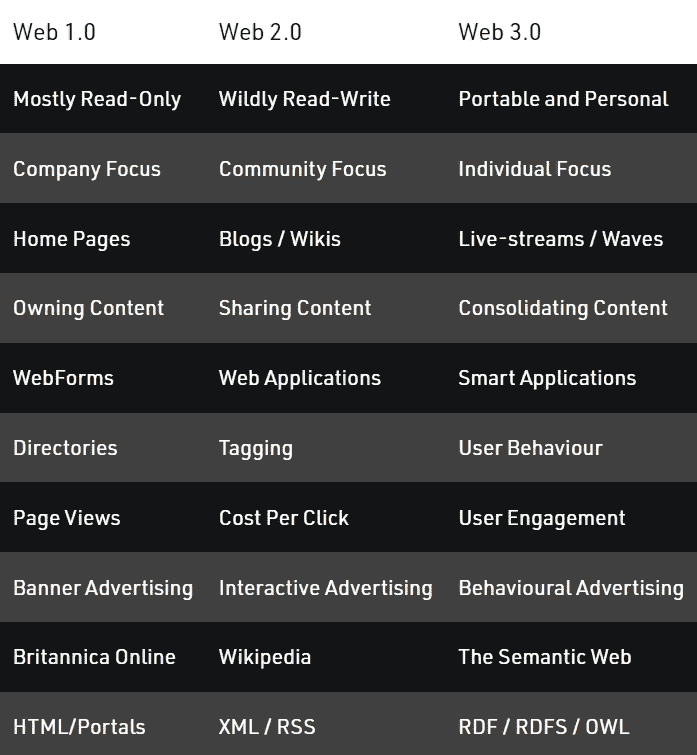

# Web 3.0 解释

> 原文：<https://medium.com/coinmonks/web-3-0-explained-6921100e9872?source=collection_archive---------17----------------------->

## 这是怎么回事？

你知道我们有不同版本和进化的网络吗？也许不是！

我很确定 99%的人都不知道，但这正是这篇文章发挥作用的地方。

最近，我在拜访我伴侣的父母时，社交媒体、数据隐私和数字身份的话题出现了。你知道，当你见到你的姻亲时。

无论如何，我的千禧一代大脑在这一点上开始觉醒，因为几代人的科技谈话的味道随时都可能消失。

期待是诱人的。

然后有人说出了这句金字……**Web 3.0**！*我知道此时是游戏时间*。

在此之前，我进入了全面的教育者模式，有大量的手势、类比、可能真实也可能不真实的历史参考，以及一个关于网络发展、数字身份以及我们如何教育大众光速技术进步的全面深入的 60 分钟研讨会。

在英格兰北部一个晴朗的周末下午，所有这一切都发生在客厅里，你还能要求什么呢？

可悲的是，没有人记录它…但话说回来，没有人会想到。

> 因此，你必须相信我的话，这是 Web 3.0 上从未有过的最伟大的研讨会。

然而，这让我思考(正如我的读者已经看到的，这可能是致命的)，我们如何帮助日常生活中的人们更好地理解他们正在使用的所有数字技术，以及它如何影响他们的日常和未来生活？

**超级宽泛的问题吧？**当然，没有人为此而解。

然而，我觉得我们可以探索一些非常基本但非常有用的见解，了解网络是如何演变的，以及这对你、我和其他人类意味着什么。

好吧，我们一起来了解一下。

# 基础知识

好的，到目前为止，我们已经有了两个版本的网络。

第一次是在 90 年代早期到中期，那是美好的 56k 拨号上网时代，当时 AOL 是世界上最大的 ISP(互联网服务提供商)。

基本上，这是人类第一次接触到我们现在所知的网络技术。这种测试版已经存在了好几年，但还不是一种公开的技术。

我们可以把网络历史上的这个时刻称为只读时代。

那是因为你所能做的就是阅读。

网站纯粹是信息性的，我们都是消费者。没有喜欢，评论，分享或任何互动。

*Web 1.0 从 1991 年运行到 2004 年，我们都只是一小撮公司创造的内容的消费者。*

当然，1 之后是 2(我的数学能力棒极了！).

W **eb 2.0** 是我们从 2004 年开始了解并一直使用到今天的网络版本。

Web 2.0 对我们所有人来说都是一个巨大的飞跃。我们从纯粹的内容消费者变成了创造者。它从只读体验演变为读写体验。

所有你现在知道、喜欢甚至讨厌的公司都诞生于 Web 2.0。

读写体验给了我们脸书、Twitter、YouTube、亚马逊和我们现在使用的其他大型应用。博客、播客和视频震撼了我们的世界，让位于影响者时代。人们能够以前所未有的方式在线赚钱、分享和联系。

听起来有点像童话，对吧？但即使是童话故事也有邪恶的女巫和黑暗森林与之抗衡。

**Web 2.0 也不例外。**

对于我们现在享受的所有创新，我们也不得不付出代价。这个代价就是我们的个人数据和身份。

Web 2.0 以其所有的内容创建工具和机会令人惊叹，但它也将我们每个人变成了一种产品。

我们已经摆脱了消费的外壳，成为 web 2.0 产品本身的主要吸引力。简而言之，我们交换了不受监管的个人数据，以获取我们日常使用的所有闪亮的应用程序和平台。

我们每个人都有数千甚至数百万条数据存在于由大型科技公司和政府控制的服务器上。包含我们对自己的一切了解甚至更多的数据文件！

这就是为什么我们中的许多人都关心当前版本的网络。我们的个人数据的使用是高度缺乏监管的，我们只是像免费的巨无霸汉堡一样毫无疑问地分发出去。

这里的主要问题是集中化，一个实体拥有、管理和处理这些数据，通常是大型科技公司。

你不能完全责怪这些科技公司，他们只是最快地找到了如何利用这些数据的方法。

通过机器学习的力量(花哨的技术术语，指了解你在数字世界中的行为)，几乎所有这些公司都发现了通过观察我们的活动来让我们参与到他们的产品中的有效方法。

这反过来导致我们的数据被出售给许多广告公司，这些公司随后会随机出现在你的收件箱中，或者在你下次访问你的社交订阅源时，根据你最近与一家大型科技公司的产品进行的活动，向你推销他们的产品。

有些人不在乎这个，而许多人在乎。

因此，读写时代对我们的社会来说是一个巨大的进化，但代价是我们都变成了产品，失去了隐私权。

# 那么接下来会发生什么呢？

是时候说说 **Web 3.0 了！**

有人称 Web 3.0 是我们隐私和数据滥用的救星。在这个世界里，我们不再是产品，而是回到了驾驶员的位置(如果你愿意，可以说是 web 1 的准版本)。

而另一些人认为，它将把我们在 Web 2.0 中已经体验到的东西提升到另一个水平，甚至可能将 Web 分成两个对立的派别，用户可以选择他们最乐意与之交互的体验，并给出他们必须交换的东西(数据或匿名)。

从本质上来说，web 3 的承诺是我们可以重新控制我们的数据。

但是我们是否已经在黄砖路上走得太远了？

一些人认为我们有，而另一些人认为 web 3 只是一个永远不会实现的乌托邦式的白日梦，这意味着我们还会被大型科技公司统治一段时间。郁闷我知道！

Web 3 不仅仅是一个大的想法，而是一系列的想法，这些想法在未来几十年里可能会实现，也可能不会实现。

Web 3.0 对像我这样的书呆子的吸引力在于它关注去中心化，这基本上意味着没有一个单一的来源可以控制你的数据。这与 Web 2.0 不同，我们知道 Web 2.0 将你的数据存储在一个数据库或云服务上。

该计划将使 Web 3 应用程序由区块链技术驱动(这是另一个完全不同的话题，我们改天再讨论)。希望 BC 技术将允许我们通过使用私人钱包来打破我们的数字和真实身份。

这意味着我们将脱离所谓的 KYC 模式，也就是“了解你的客户”模式。你可以说与社交媒体应用程序互动，而不是与你的真实身份互动。

**Web 3 的承诺会成为现实吗？** *也许吧，但我觉得我们可能还有一段路要走。*

我就是这么说的，但这里有一个简单的解释，来自我们在 [**Intelligencer**](https://nymag.com/intelligencer/) (也许比我更好的工作？我会让你决定的！).

还有一个来自⬇️的很好的总结

# 参考

[白板加密:](https://youtu.be/nHhAEkG1y2U)什么是 Web 3.0？

[火石:](https://www.youtube.com/watch?v=wHTcrmhskto&list=WL&index=3)Web 3.0 只是炒作吗？

区块链技术[讲解](https://www.youtube.com/watch?v=pSTNhBlfV_s&list=WL&index=1)

Web 1.0、2.0 和 3.0 — [有什么区别？](https://www.geeksforgeeks.org/web-1-0-web-2-0-and-web-3-0-with-their-difference/)

*最初发表于*[*【https://www.linkedin.com】*](https://www.linkedin.com/pulse/web-30-explained-ross-stevenson)*。*

> 加入 Coinmonks [电报频道](https://t.me/coincodecap)和 [Youtube 频道](https://www.youtube.com/c/coinmonks/videos)了解加密交易和投资

# 另外，阅读

*   [如何在印度购买比特币？](/coinmonks/buy-bitcoin-in-india-feb50ddfef94) | [WazirX 审查](/coinmonks/wazirx-review-5c811b074f5b)
*   [CryptoHopper 替代品](/coinmonks/cryptohopper-alternatives-d67287b16d27) | [HitBTC 审查](/coinmonks/hitbtc-review-c5143c5d53c2)
*   [CBET 评论](https://coincodecap.com/cbet-casino-review) | [库库恩 vs 比特币基地](https://coincodecap.com/kucoin-vs-coinbase)
*   [折叠 App 审核](https://coincodecap.com/fold-app-review) | [Kucoin 交易机器人](/coinmonks/kucoin-trading-bot-automate-your-trades-8cf0ca2138e0) | [Probit 审核](https://coincodecap.com/probit-review)
*   [如何匿名购买比特币](https://coincodecap.com/buy-bitcoin-anonymously) | [比特币现金钱包](https://coincodecap.com/bitcoin-cash-wallets)
*   [币安 vs FTX](https://coincodecap.com/binance-vs-ftx) | [最佳(索尔)索拉纳钱包](https://coincodecap.com/solana-wallets)