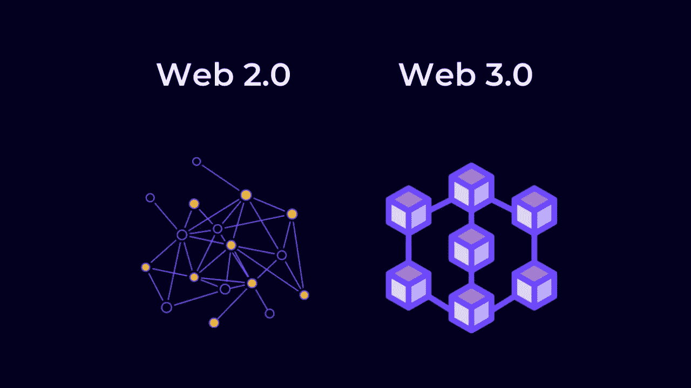

# 60 秒解释 Web 3.0

> 原文：<https://medium.com/coinmonks/web-3-0-explained-in-60-seconds-d937fa450708?source=collection_archive---------48----------------------->

第一代互联网是将电脑相互连接，第二代互联网是通过脸书、Instagram、Twitter 等社交媒体平台将人们相互连接。Web 3.0 是关于不通过任何中介直接连接人们。

Web3 将利用分散式协议，如区块链，这些协议被设计成开源、安全和透明的。

在这个新版本的互联网中，所有的数据都将存储在一个叫做区块链的分布式账本中。这意味着所有的网络流量没有一个中心枢纽，这反过来意味着互联网用户有更多的隐私，政府或公司的审查更少。

 [## 你准备好迎接加密经济了吗？加密派

### 每次你打开新闻，阅读报纸，或者浏览你的推特，你很可能会看到一些故事…

www.thecryptopie.com](https://www.thecryptopie.com/) 

> 加入 Coinmonks [电报频道](https://t.me/coincodecap)和 [Youtube 频道](https://www.youtube.com/c/coinmonks/videos)了解加密交易和投资

# 另外，阅读

*   [如何购买 Monero](https://coincodecap.com/buy-monero) | [IDEX 评论](https://coincodecap.com/idex-review) | [BitKan 交易机器人](https://coincodecap.com/bitkan-trading-bot)
*   [CoinDCX 评论](/coinmonks/coindcx-review-8444db3621a2) | [加密保证金交易交易所](https://coincodecap.com/crypto-margin-trading-exchanges)
*   [红狗赌场评论](https://coincodecap.com/red-dog-casino-review) | [Swyftx 评论](https://coincodecap.com/swyftx-review) | [CoinGate 评论](https://coincodecap.com/coingate-review)
*   [Bookmap 点评](https://coincodecap.com/bookmap-review-2021-best-trading-software) | [美国 5 大最佳加密交易所](https://coincodecap.com/crypto-exchange-usa)
*   [如何在 FTX 交易所交易期货](https://coincodecap.com/ftx-futures-trading) | [OKEx vs 币安](https://coincodecap.com/okex-vs-binance)