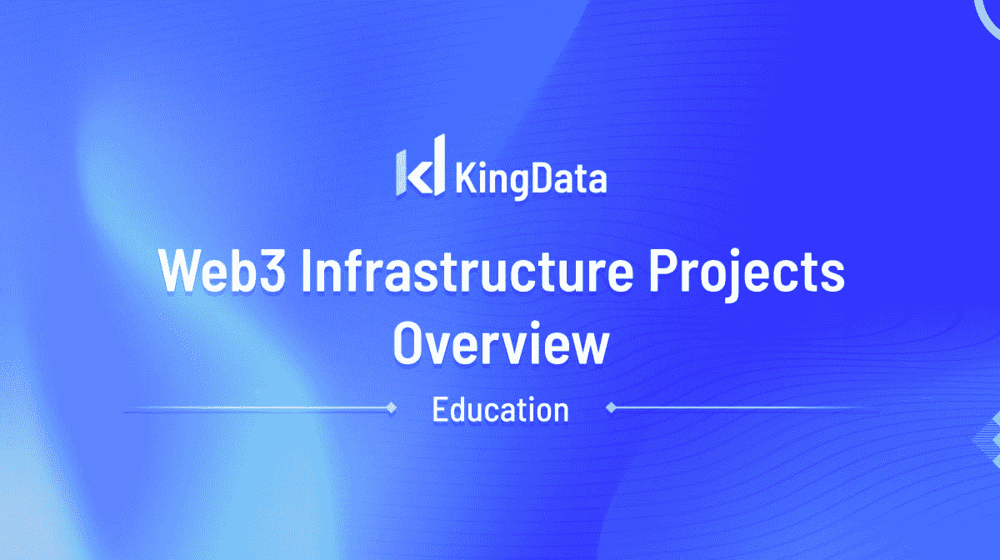
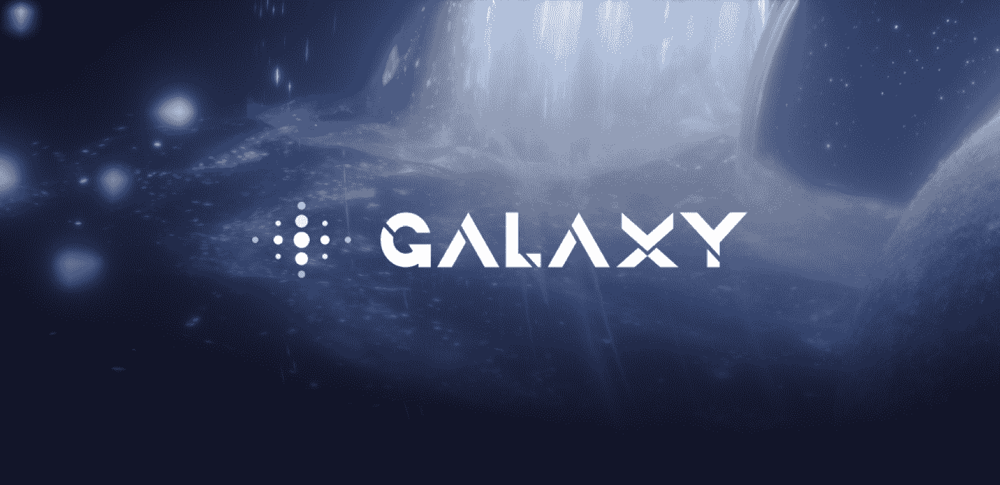
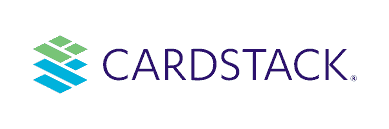
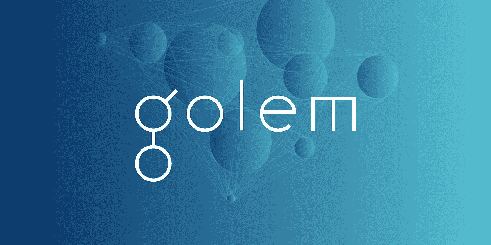
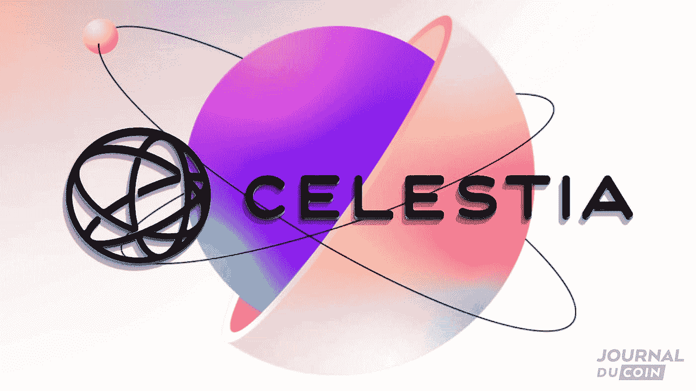

# Web 3.0 基础设施项目概述

> 原文：<https://medium.com/coinmonks/web-3-0-infrastructure-projects-overview-b6db4f3ac5ac?source=collection_archive---------13----------------------->

你对创建一个 web3 基础设施有什么好奇吗？本文将向您简要介绍使这种系统工作所需的不同组件。从节点和矿工到开发 p2p 和 P2P 网络，很多都是为了让 web3 平稳运行。请继续关注这些方面的更多信息！我们直接进去吧。

# **银河计划**

如果你想知道 Web 3.0 有多需要，一个很好地封装了它的项目是[项目银河](http://kingdata.com)。这个 Web 3 项目在不到一年前启动，已经获得了 100 多个项目和 300 万用户。

# 银河计划是做什么的？

Project Galaxy 是一个 web3 基础设施，有助于建立一个协作数据网络。它参与创建一种分散的数据交换方式。它使用一种分散的数据交换方式，解决了跨不同 web2 平台的数据隔离问题。例如，像脸书这样的平台利用你的行为数据向你推荐信息或产品。
虽然脸书使用了这些信息，但这是一种比较优势，因为其他 Web2 平台不知道这些信息。银河项目是不同的，因为这些数据提供者一旦他们的数据被使用就可以得到报酬，不管是谁使用。

# 卡片堆栈

尽管软件开发人员的数量与日俱增，但至少具有软件开发入门知识的人口比例仍然很低。CardStack 是一个 Web3 平台，致力于使 Web 开发成为每个人的规范，而不管你对这个领域的知识基础如何。

# CardStack 是做什么的？

CardStack 正在创建一个去中心化的平台，允许任何人和每个人构建应用程序、网站和创建内容，而无需任何先前的过程经验。CardStack 使用无代码工具、开源架构和统一设计系统，打破了 Web3 领域的包容性壁垒。

# 道德

Moralis 创建于 2016 年，是由 Ivan on Tech 开发的一款有用的去中心化应用程序，Ivan on Tech 是一个受欢迎的加密社交影响者。它旨在解决构建 web3 应用程序时难以使用节点的问题，与 javascript 合作似乎是一个大胆的声明。

Moralis 可用于在以太坊、币安和索拉纳上构建应用程序，只需使用一个 API。

# 假人网络

自有时间以来，稀缺-过剩的平衡从未达到过。一个人缺少的东西，另一个人拥有的比他需要的多。假人认识到了生活的这一方面，并正在寻求打破拥有额外计算资源的特权者和需要它们的人之间的鸿沟。

作为一个市场，假人已经建立了一个生态系统，这些计算资源可以在没有不信任或恐惧的情况下进行交易。

# 假人是如何工作的？

使用 GNT 令牌，假人已经为数字资产的传输创建了一个开放的、可信的、分散的协议。仅通过点对点的方式运作，为买卖双方创造性地使用该平台打开了大门。

# 塞莱斯蒂亚

大多数分散的应用程序构建者害怕共识层和执行层的纠缠，一个为开发者简化事情的 web3 平台是 Celestia。与传统的区块链不同，Celestia 只是订购和发布交易，而不是执行交易。

# Celesia 是如何工作的？

Celestia 用更模块化的类型取代了大多数传统编程语言中的整体架构。与前者相比，后者有许多优点，但值得一提的是包括

1.  分散式应用程序的智能契约可以被修改，而无需经历硬分叉。
2.  所有应用程序都有自己的空间，并且只利用 Celestia 的底层安全性。

# 结论

我们已经看到了区块链是如何重塑互联网的，但这些只是构成 [Web3 基础设施](http://kingdata.com)的众多协议中的几个。

我们相信，还有许多其他令人兴奋的协议将塑造互联网连接的下一个阶段。这些协议包括 Filecoin 和 Tezos，前者允许分散存储，后者为智能合同和治理提供了一个平台。

你看好的其他 Web3 基础设施协议有哪些？请在下面的评论中告诉我们！

> *加入 Coinmonks* [*电报频道*](https://t.me/coincodecap) *和* [*Youtube 频道*](https://www.youtube.com/c/coinmonks/videos) *了解加密交易和投资*

# 另外，阅读

*   [有哪些交易信号？](https://coincodecap.com/trading-signal) | [Bitstamp vs 比特币基地](https://coincodecap.com/bitstamp-coinbase) | [买索拉纳](https://coincodecap.com/buy-solana)
*   [ProfitFarmers 回顾](https://coincodecap.com/profitfarmers-review) | [如何使用 Cornix Trading Bot](https://coincodecap.com/cornix-trading-bot)
*   [十大最佳加密货币博客](https://coincodecap.com/best-cryptocurrency-blogs) | [YouHodler 评论](https://coincodecap.com/youhodler-review)
*   [MyConstant Review](https://coincodecap.com/myconstant-review) | [8 款最佳摇摆交易机器人](https://coincodecap.com/best-swing-trading-bots)
*   [MXC 交易所评论](/coinmonks/mxc-exchange-review-3af0ec1cba8c) | [Pionex vs 币安](https://coincodecap.com/pionex-vs-binance) | [Pionex 套利机器人](https://coincodecap.com/pionex-arbitrage-bot)