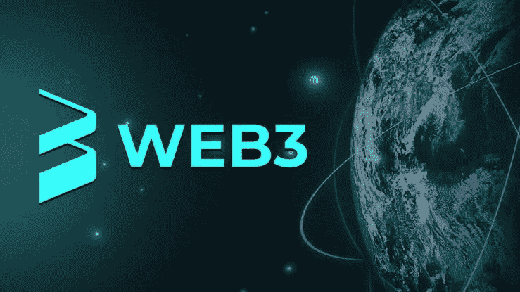
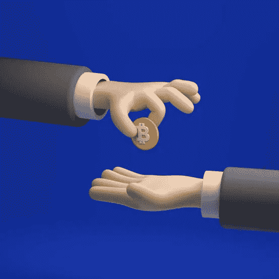

# Web 3.0 是未来:它将如何不同于 Web 2.0？

> 原文：<https://medium.com/coinmonks/web-3-0-is-the-future-how-will-it-be-different-from-web-2-0-97d88cb52a76?source=collection_archive---------3----------------------->

## …不属于任何人的互联网。

# 介绍

“拉至刷新”、“拉至刷新”、“拉至刷新”。这是当你用完了你的 feed 时，你在社交网络上做的事情。你拉得到新的饲料。[拉至刷新](https://en.wikipedia.org/wiki/Pull-to-refresh#:~:text=Pull%2Dto%2Drefresh%20is%20a,the%20contents%20of%20the%20screen.)特性是动态 web 2.0 带来的特性之一，超过了 web 1.0。在 1989 年我们有 web 1.0 的时候，喜欢按钮，喜欢，哈哈的反应，以及你可以分享你对文章或帖子的意见的评论区都不存在。从 1989 年的 web 1.0 到 2005 年的 web 2.0，万维网[已经走过了漫长的历程。Web 3.0 正在进行中。大公司正在为这一机会进行有竞争力的定位。Web 3.0 的](https://www.britannica.com/topic/World-Wide-Web)[核心](https://www.bridge-global.com/blog/what-is-web-3/)是自动化、人工智能、机器学习和以透明、安全和不变性著称的区块链技术。在这篇文章中，我将讨论为什么我认为 [Web3 是未来的](https://www.abc.net.au/news/science/2022-02-11/web3-is-it-the-future-of-the-internet/100810268#:~:text=Web3%20is%20a%20concept%20for,that%20run%20on%20the%20blockchain.),并研究 Web3 与 Web2 的区别。

# 通往 Web 3.0 之路

Web 1.0 存在于 [1989-2005](http://ijcsit.com/docs/Volume%205/vol5issue06/ijcsit20140506265.pdf) 之间。人们对 web 1.0 给他们带来的机会感到惊讶；搜索和浏览基于文本的静态网站。他们在没有算法的帮助下筛选网页并建议相关内容。他们所能做的就是在网上搜索和阅读信息。只有少数人从事内容创作。没有什么像我们今天在社交媒体、网站和博客上拥有的评论区、点赞、观点和如此多的其他功能。金融呢？没有什么像网上支付，跨境支付是不可能的使用卡，因为我们有它。用我自己的话来说，Web 1.0 可以被称为网络的黑暗时代。Web 2.0 改进了它的局限性。

Web 2.0 增加了更多的功能，这就是你今天所拥有的 Web。今天，脸书、Instagram、Snapchat、微信和其他社交媒体和网站上的赞、分享、评论按钮都是 web 2.0 下的功能示例。与静态的 web 1.0 不同，Web 2.0 是动态的。人们不仅可以搜索，还可以相互交流和联系。[算法可以筛选页面](https://www.google.com/search/howsearchworks/algorithms/)，并根据你要搜索的内容推荐相关页面。你可以在 [YouTube](https://www.youtube.com/) 上花上几个小时狂看视频，你可以在网上发布图片和视频，你可以在自己的房间里进行跨境交易，限制更少。你可以用你的 Visa 卡和万事达卡进行支付，没有卡也可以在线无缝地进行支付，几乎没有任何限制。

# 区别:Web 1.0 和 Web 2.0

区别 web 2.0 和 web 1.0 的是随之而来的社交应用。基于云的应用，如谷歌文档，微博应用，如 Twitter，社交应用，如脸书，YouTube，Pinterest 等等。正是这些应用程序包含了新的功能，并且随着消费者口味的变化而不断改进这些功能。然而，这些应用程序充当了霸主。未经许可获取和使用消费者数据的霸主。领主可以随意禁止你进入他们的平台。如果美国总统都能在推特和脸书上被禁，那你呢？

现在，你看到的广告、你在 Instagram(众多 web 2 应用程序中的一个)上看到的内容以及你的搜索引擎因人而异。这个[数据](https://www.washingtonpost.com/news/the-intersect/wp/2016/08/19/98-personal-data-points-that-facebook-uses-to-target-ads-to-you/)是你的，被用来赚大钱。当然，你在接入这些平台之前并没有付费。它们都是免费的。问题是:他们怎么赚钱？他们通过你的数据赚钱。你是他们卖的产品。如果你明白这一点，你就会明白 web3 背后的思想。

# Web 3.0 解释

Web3 的目标是创建一个分散的网络，每个人都可以控制自己的数据。也就是说，没有你的允许，像脸书和 Instagram 这样的大公司是无法访问你的数据的。此外，你不用免费使用这些应用程序，而是在使用它们的过程中获得收益。web3 革命将影响人类互动的所有方面，因为它利用区块链的力量来保存所有用户都可以访问的分类账记录，这些记录将受到保护，任何人都不能破坏。它还利用机器学习和人工智能来训练算法，以筛选针对每个人的个性化内容。像 [*Siri*](https://www.apple.com/siri/) 、Alexa、Cortana 和谷歌助手这样的 Web2 机器人正在这样做，但有局限性。他们还不能通过文字来解读情感。因此，所有这些:区块链、人工智能、机器学习和物联网将相辅相成，在 web3 中创造更好的用户体验。

# 没有人能给出准确的预测

即使没有人能给出 web 3.0 将会是什么样子的明确观点，我仍然相信它是未来。为什么？如果你看看从 web1.0 到 web2.0 的轨迹，你会发现后者是建立在前者的局限性之上的。同样，截至目前，web3.0 是建立在 web 2.0 的限制之上的，许多专注于 web3 的应用程序每天都在各个领域推出。让我们来看看金融部门。就金融而言，未来的货币是加密货币，它植根于推动 web3 的区块链技术。现在，你比以往任何时候都可以跨境汇款，无需任何中间人或集中供应商。[比特币](https://www.bitcoin.com/)、[以太坊](https://ethereum.org/en/)、 [Filecoin](https://filecoin.io/) 以及其他许多数字资产都是数字资产，其用例为正在开发中的 web3 带来解决方案。

你现在可以在 crypto 中借钱，贷款和还款都没有限制。这就是加密货币带给 web3 的解决方案 [AAVE](https://aave.com/) 。然而，目前还有其他领域正在开发中，截至目前， [Web3 仍然依赖于 Web2 基础设施](https://coinmarketcap.com/alexandria/article/what-is-web-3-0)，如果基础设施提供商如[亚马逊 Web 服务](https://aws.amazon.com/blockchain/)失败，大多数 Web3 应用程序也将不再可用。

# Web2.0 和 Web 3.0 的主要区别

总结一下，让我们看看 Web 2.0 和 Web 3.0 之间的一些关键区别

1.**集中/分散问题:**在 Web3 中，你可以通过一个分散的区块链(如区块链以太坊)发送你的交易。而在 web2 上，你需要使用像银行或金融科技这样的集中平台。根据记录，所有的 web2 应用程序都是由中央集权的公司控制的。

2.**身份、信息、数据和数字资产的所有权:**您拥有并控制您在 web3 中的身份、数据和数字资产。只要你记得你的私钥和密码，没人能篡改你的数字资产。你安全了。然而，在 web2 中，你的钱在银行和金融科技公司的控制之下。你的身份和数据被大公司控制，这些大公司使用它们，并在未经你允许的情况下将它们出售给第三方使用。

3.**支持两个 web 的技术:** Web2 由 HTML5、PHP、CSS3、JavaScript 等编程语言支持，而 web 3 将由人工智能、机器学习、区块链技术和物联网支持。

# 结论

没有人能明确给出 web3 将遵循的轨迹，因为它仍处于发展阶段。因此，不要袖手旁观，要尽早构建、互动和进入，因为从长远来看，早期采用者会获得最大的回报。对集中交易的信任使得 web2.0 蓬勃发展。同样的信任是 Web 3.0 的动力。信任，不是在任何集中的交易所，而是对一个实体的信任，这个实体是不可改变的，并拥有永久的交易记录。对区块链的信任。

PS:感谢像 https://blockgames.gg/,·https://nestcoin.com/,和 https://zuri.team/这样的平台提供区块链知识，帮助热情的个人学习和建立区块链。