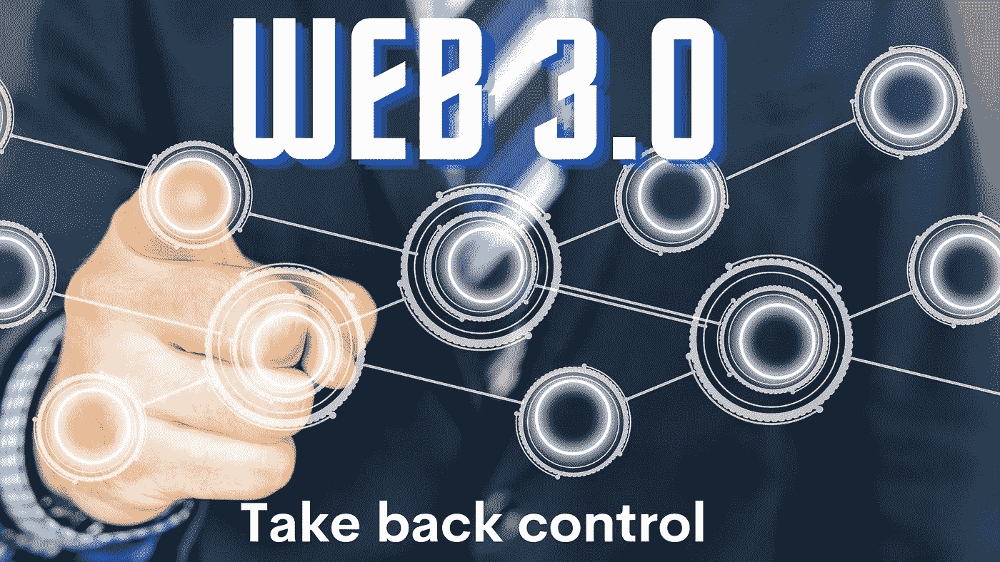
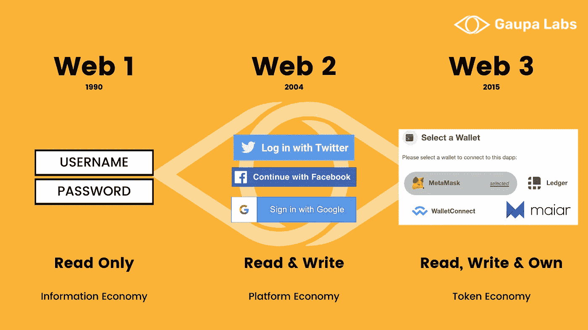

# Web 3.0:夺回控制权

> 原文：<https://medium.com/coinmonks/web-3-0-taking-back-control-8124785723d6?source=collection_archive---------35----------------------->

自从互联网民主化以来，我们已经看到了快速和令人着迷的增长，给了我们日常生活中使用的各种工具。伴随着这些令人难以置信的进步而来的是相当多的挑战。让我们开始吧！

为了能够完全理解 Web 3.0，我们需要沿着记忆的轨迹回到互联网的早期；Web 1.0 时代

**Web 1.0:**

Web 1.0 出现于 20 世纪 90 年代初，也被称为“只读”互联网。可以访问网站，但几乎不可能进行互动。最重要的收入来自网站上的广告。

除此之外，网页不提供任何互动功能；无论访问者的行为如何，网站都会保持不变。

留言簿；旧的评论区。虽然现在大多数社交和新闻网站允许任何人发表评论，但情况并非总是如此。为了节省内容页面的加载时间，网站会创建一个独立于文章的“留言簿”页面，用户可以在这里分享他们的想法。

数据库和脚本:

这一时期的大多数网站没有数据库，将所有内容存储在网站文件中。大大增加了他们添加的每个新文件的加载时间。

运行在 web 服务器上的脚本也不是一个东西，所以像填写表格这样的动作只是打开一封已经填写了收件人的新邮件的触发器。

向 Web 2.0 的过渡不是一夜之间的现象，而是缓慢而稳定的。允许升级的主要变化是由于服务器性能和连接速度的提高。

**Web 2.0:**

它在 2004/2005 年左右得到了很好的确立；Web 2.0 是我们今天在互联网的大多数角落使用的。

Web 1.0 的主要变化是可以发布用户生成的内容，允许访问者创建内容并分享他们对任何事情的看法和经验。

在开发网站、创建互动和个性化内容时，用户体验也成为优先考虑的因素。

API(应用编程接口)的使用也提高了网站和服务之间的互操作性。

说到典型的 Web 2.0 网站，社交媒体平台是一个很好的例子；它们允许你分享你的内容，定制你的新闻源，并直接从页面发送信息。

虽然 Web 2.0 让我们的生活变得更加轻松，但我们也发现了与公司共享个人数据的风险。随着时间的推移，这些网站的目的在一开始可能是真实的。我们现在已经一次又一次地被证明，我们的数据、注意力范围甚至观点被卖给第三方以谋取私利。虽然你的数据可能对他们有很高的价值，但他们无意与你分享。

我们已经到了依赖谷歌、Meta、亚马逊等大型科技公司的地步

从我们醒来的那一刻起，我们的日常生活就被跟踪，这让我们更接近一个反乌托邦，在那里我们唯一的目的就是消费。

虽然 Web 2.0 无疑改善了我们使用互联网的方式，但它也显示出了自己的弱点，因为它将过多的信任和权力交给了少数实体。

接下来的问题当然是:我们如何改变这种情况，最重要的是，Web 3.0 允许我们做以前做不到的事情？

**Web 3.0:**

达到 Web 3.0 所需的里程碑包括但不限于大数据、人工智能、机器学习和去中心化账本技术。在本文的剩余部分，我们将重点讨论后者。

如前所述，Web 2.0 允许一些公司统治互联网，使万维网成为一个非常集中的空间。大多数网站由大实体托管，如亚马逊网络服务或 Azure 云托管(微软)；这不仅会在服务中断时造成严重的服务中断，还会给他们带来难以置信的影响。

随着对集权化风险的认识不断提高，各方都在寻找其他选择。这就是区块链和加密货币发挥作用的地方。使用这样的技术允许创建 P2P(点对点)交互，这在过去不信任另一方是不可能的。

例如，Akash Network 创建了一个允许 P2P 云计算的基础设施。这意味着任何人都可以在网络上提供他们的机器作为服务器。它允许保护免受审查，因为你的网站可以由任何人托管，甚至在几个服务器上！

我们的网站(【gaupalabs.com】T2)位于阿卡什。

我们之前也提到过我们的注意力持续时间是如何被公司通过广告货币化的；而用户看不到任何回报。Brave，一个网络浏览器，决定对此做些什么，并允许你赚取他们的 BAT token(基本注意力 token)。每当你看到一个广告，你就会得到一部分代币作为奖励。如果是在 Twitter、Twitch 或 Medium 上，代币也可以用来给创作者小费！

去中心化的金融也是 Web 3.0 的迷人之处。无需分享任何数据，你可以连接你的加密钱包交换密码，贷款或借款，增加流动性，并获得利润分成。

个人数据是 Web 3.0 的另一个关键点。我们已经习惯于登录谷歌、脸书或 Twitter 等账户来使用他们的服务。大多数 dApps(与区块链交互的应用程序)要求你连接到你的加密钱包(Metamask，Phantom，xDefi，Maiar，你能想到的)，只分享你的公共地址。

你可以决定使用一个像社交媒体平台一样分享内容的平台，但你是数据的保管者。

你可能想知道高帕实验室的项目如何适应 Web 3.0 时代；让我们展示给你看！

**高帕实验室和 Web 3.0:**

我们正在创建一个网络和软件工具，使供应链的管理及其透明度可以为任何人所用。

在公司方面，我们正在创建与区块链直接交互的 ERP 和供应链管理工具。该软件的设计风格是用户可以简单地进行交互，而不必关注交易、私有/公共密钥等

这个 dApp 的原则和前面讨论的一样，给予公司对数据的完全控制权和所有权。

与类似软件相比，我们的优势不仅在于数据库的分散化，还在于我们的解决方案是以极具竞争力的价格量身定制的。

对于日常用户来说，他们将能够跟踪他们购买的任何产品，而无需共享任何信息，跟踪网站直接与区块链互动，以显示所有所需信息的清晰界面。还可以通过浏览器进一步查看所有交易。

我们的奖励系统允许您申领 GAUPA 代币，参与网络并发表您的意见。只需提供您的钱包地址，不需要其他信息。

更多关于奖励系统的信息将在以后分享。

我们的白皮书可以在这里阅读[，不要忘了](https://a.storyblok.com/f/124649/x/7628d96e73/gaupalabs-whitepaper.pdf)[订阅我们的时事通讯](https://gaupalabs.com)，了解最新动态，抢占先机！

> 加入 Coinmonks [电报频道](https://t.me/coincodecap)和 [Youtube 频道](https://www.youtube.com/c/coinmonks/videos)了解加密交易和投资

# 另外，阅读

*   [交易杠杆代币的最佳交易所](https://coincodecap.com/leveraged-token-exchanges) | [购买 Floki](https://coincodecap.com/buy-floki-inu-token)
*   [3 commas vs . Pionex vs . crypto hopper](https://coincodecap.com/3commas-vs-pionex-vs-cryptohopper)|[Bingbon Review](https://coincodecap.com/bingbon-review)
*   [加密复制交易平台](/coinmonks/top-10-crypto-copy-trading-platforms-for-beginners-d0c37c7d698c) | [如何在 WazirX 上购买比特币](/coinmonks/buy-bitcoin-on-wazirx-2d12b7989af1)
*   [CoinLoan 评论【Crypto.com】|](https://coincodecap.com/coinloan-review)[评论](/coinmonks/crypto-com-review-f143dca1f74c)
*   [如何在加拿大购买加密货币？](https://coincodecap.com/how-to-buy-cryptocurrency-in-canada)
*   [无聊猿游艇俱乐部(BAYC)评论](https://coincodecap.com/bored-ape-yacht-club-bayc-review)