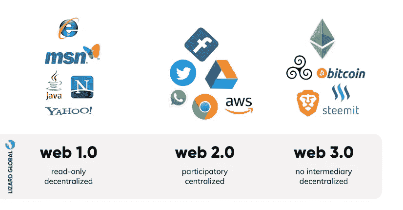
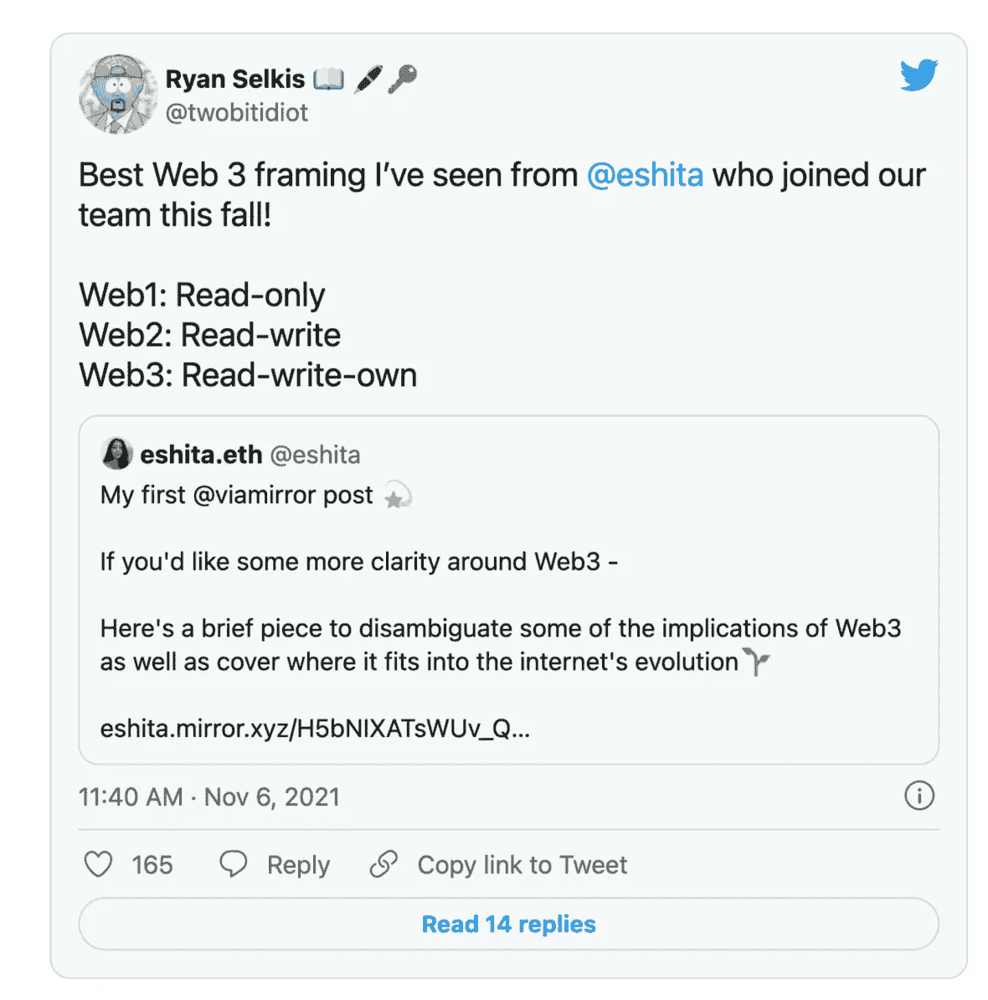
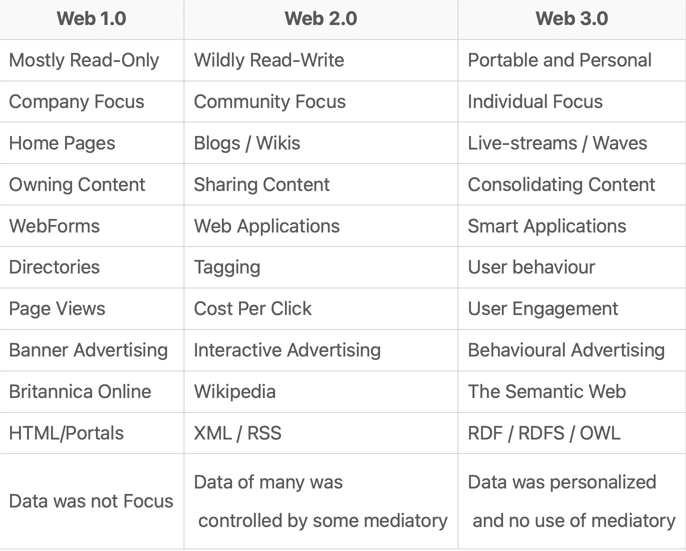

# Web 3.0:技术堆栈和层

> 原文：<https://medium.com/coinmonks/web-3-0-tech-stack-and-layers-8adf48534ad6?source=collection_archive---------11----------------------->

Web 3.0 是基于区块链技术的互联网进化。让我们回到 Web 1.0、2.0，并与 Web 3.0 进行比较。Web 1.0 是互联网在 90 年代起飞的第一个版本，由静态的、基于内容的网站组成，很少有内容创作者。Web 2.0 在 21 世纪初起飞，由用户生成的内容定义，比如博客、YouTube、脸书和 Twitter。如果 Web 1.0 有一些内容创建者，那么 Web 2.0 允许每个人都成为内容创建者。我们目前正处于 Web 3.0 的早期，这个时期将由用户拥有部分互联网的能力来定义。Web 3.0 是一个去中心化的互联网，数据存储在分布式分类帐技术或区块链中。这使得加密货币、NFT、Dao 或分散自治组织和元宇宙得以兴起。

在这篇文章中，我想让你关注 Web 3.0 的不同技术层。数十亿美元的企业已经被创造出来，以解决问题并在技术堆栈的每一层进行创新，在未来十年左右还会出现更多的企业。Web 3.0 基础设施是基于点对点网络，去掉了中间人。它看起来是这样的:

**协议层:**这一层包括以太坊(最流行)、Polygon、币安智能链、Solana 等区块链。这是所有数据存储的地方。以太坊以其高昂的交易费用而闻名，这也是为什么一些人涌向其他天然气费用较低的区块链的原因。随着以太坊从工作证明转向利益证明方法，费用逐渐下降。(以太坊 2.0 也在开发中，它将显著增加每秒的交易次数。

**节点层:**节点需要与区块链通信。开发者可以运行他们自己的节点与网络上的其他节点进行通信，但是这是一项全职工作，值得庆幸的是其他组织会负责这项工作。Infura、Alchemy、Chainstack、Getblock、Pocket Network、Quicknode 和 RunNode 使您能够使用它们的节点。

**API 层:**如果你正在构建一个 dApp 或者一个去中心化的应用，这是你将要与之交流的层。该级别允许软件在稳定和安全的环境中与其他软件进行交互。这个级别的提供者包括 Moralis、共价、图形、Quicknode、Alchemy、Bitquery 和 Biconomy

**用例层:**这是所有内容汇集的地方，包括像 Axie Infinity 和 Sandbox 这样的游戏，像 OpenSea 这样的 NFT 市场，这是一个用户界面层，供人们稍后与协议进行交互。

**来源:**

[https://moralis . io/exploring-the-web 3-tech-stack-full-guide/](https://101blockchains.com/web-3-0-blockchain-technology-stack/)

[https://www . coin base . com/learn/market-updates/around-the-block-issue-22](https://www.coinbase.com/learn/market-updates/around-the-block-issue-22)

[https://101 block chains . com/we B- 3-0-区块链-技术-堆栈/](https://101blockchains.com/web-3-0-blockchain-technology-stack/)

 [## Web 1.0、Web 2.0 和 Web 3.0 及其差异

### Web 1.0 - Web 1.0 是指万维网发展的第一阶段。早些时候，只有几个内容…

www.geeksforgeeks.org](https://www.geeksforgeeks.org/web-1-0-web-2-0-and-web-3-0-with-their-difference/) 

> 加入 Coinmonks [电报频道](https://t.me/coincodecap)和 [Youtube 频道](https://www.youtube.com/c/coinmonks/videos)了解加密交易和投资

# 另外，阅读

*   [Bitget 回顾](https://coincodecap.com/bitget-review)|[Gemini vs block fi](https://coincodecap.com/gemini-vs-blockfi)cmd |[OKEx 期货交易](https://coincodecap.com/okex-futures-trading)
*   [AscendEx Staking](https://coincodecap.com/ascendex-staking)|[Bot Ocean Review](https://coincodecap.com/bot-ocean-review)|[最佳比特币钱包](https://coincodecap.com/bitcoin-wallets-india)
*   [霍比评论](https://coincodecap.com/huobi-review) | [OKEx 保证金交易](https://coincodecap.com/okex-margin-trading) | [期货交易](https://coincodecap.com/futures-trading)
*   [网格交易机器人](https://coincodecap.com/grid-trading) | [Cryptohopper 审查](/coinmonks/cryptohopper-review-a388ff5bae88) | [Bexplus 审查](https://coincodecap.com/bexplus-review)
*   [7 个最佳零费用加密交换平台](https://coincodecap.com/zero-fee-crypto-exchanges)
*   [氹欞侊贸易评论](https://coincodecap.com/anny-trade-review) | [火币保证金交易](/coinmonks/huobi-margin-trading-b3b06cdc1519)