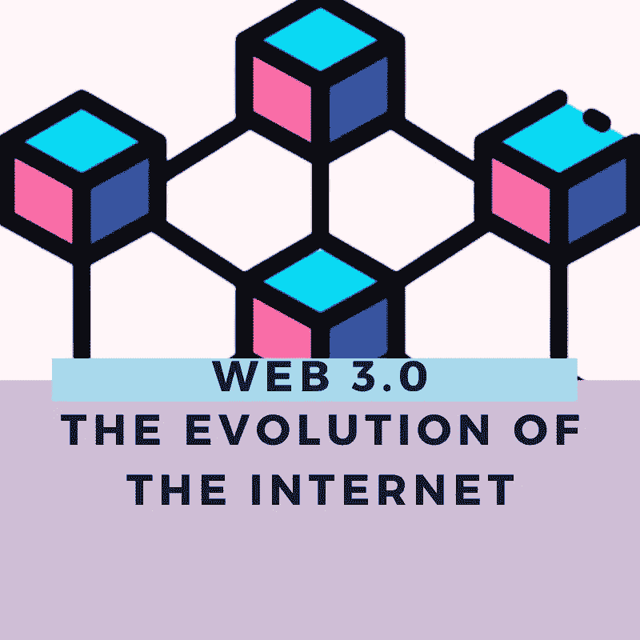

# Web 3.0，互联网的进化

> 原文：<https://medium.com/coinmonks/web-3-0-the-evolution-of-the-internet-7becbbf2e54c?source=collection_archive---------28----------------------->

## 如果你一直在关注潮流，你会注意到每个人都在谈论 web 3.0。什么是真正的 WEB 3.0？

事实是，web3.0 没有官方定义，而是有对 web 3.0 的预期的解释。然而，在我们进入 web 3.0 之前，让我们先来看看 web 1.0。

Web 1 是第一代 Web，也称为静态 web。那时建立的网站非常简单，没有交互性。事实上，它只是一个只读网站，用户只是消费者，没有办法贡献和交流他们的想法。

1999 年晚些时候，web 2.0 开始亮相，催生了网络应用、博客甚至社交媒体。当人们被鼓励提供内容，而不仅仅是浏览页面时，这引起了范式的转变，这就是为什么我们能够在社交媒体网站如脸书、推特甚至博客上发帖。

Web 2.0。现在的互联网，更像是 21 世纪的网络，几乎在生活的所有领域都引起了巨大的变化，每个人都很开心。

## 那么，还需要另一个网络吗？

尽管 web 2.0 已经引起了巨大的增长和转变。这也有一个严重的问题。

*   其中一些是低安全性和隐私问题。例如，当你自由地将你的数据提供给那些社交媒体平台时，他们会出售这些数据来积累财富。有没有想过为什么你会收到一些你从未注册过的电子邮件？想想吧。
*   没有竞争的空间:像谷歌、亚马逊、苹果、脸书、微软之类的公司有太多的钱，甚至雇佣最优秀的人才。所以，几乎所有你需要或能做的事情，他们都有最好的，所以小企业无法与之竞争。但 web 3.0 旨在为平等竞争提供自由机会，等等。

Web 3.0。是建立在某种去中心化的概念上的，在某种意义上，它不是将你的详细信息保存在像 google 这样的中央服务器上，而是存储在与其他节点相互连接的节点上。多亏了区块链技术。

有没有想过 2021 年发生了什么，脸书和其他一些社交平台被击落了？到处都是恐慌，因为许多人的生意非常依赖他们。但是使用一个去中心化的网络，你的信息存储在节点中，这些节点连接到其他节点，这使得它是安全的和不可改变的。

所以基于这个互联网，在 web 3 上运行的应用程序被称为 Dapps。

## web 3.0 将如何改变互联网

*   我们如何使用用户名登录网站并给出我们的数据，包括姓名、年龄、电子邮件、密码等，将会停止，因为我们将能够使用区块链登录。
*   能够管理您自己的身份，并保留您数据的所有权
*   零证明:在不暴露真实身份的情况下证明你的身份。
*   增强用户体验，使用指纹登录

因此，当你使用 web 3.0 时，你使用的是整个网络，而不是一个特定的应用程序。

这些以及更多的只是 web 2 和 Web3 之间的一些主要区别。

要了解更多关于如何在 web 3.0 中扩展的信息，值得一提的是，加密投资公司@ nest coin[https://nestcoin.com/](https://nestcoin.com/)与技术培训机构@theZuriTeam、[https://zuri.team/](https://zuri.team/)合作，创建了@ Blockgamesgg[https://blockgames.gg/](https://blockgames.gg/)，这是一个为期 8 周的强化项目，重点是培训开发人员如何使用区块链技术解决问题。立即访问开始。

# 关于作者

Igwe Ihuoma Patience 是一名自学成才的创意和行业特定内容作家，加密货币爱好者，拥有 2 年多的经验和不断发展的区块链空间的知识。

我擅长内容创作、文案写作、字幕管理、视频编辑和手机图形设计，我教其他人如何在加密货币和区块链领域起步，我的目标是让区块链的学习和更新易于任何人理解。

> 加入 Coinmonks [电报频道](https://t.me/coincodecap)和 [Youtube 频道](https://www.youtube.com/c/coinmonks/videos)了解加密交易和投资

# 另外，阅读

*   [阿联酋 5 大最佳加密交易所](https://coincodecap.com/best-crypto-exchanges-in-uae) | [SimpleSwap 评论](https://coincodecap.com/simpleswap-review)
*   购买 Dogecoin 的 7 种最佳方式
*   [最佳期货交易信号](https://coincodecap.com/futures-trading-signals) | [流动性交易所评论](https://coincodecap.com/liquid-exchange-review)
*   [用于 Huobi 的加密交易信号](https://coincodecap.com/huobi-crypto-trading-signals) | [Swapzone 审查](/coinmonks/swapzone-review-crypto-exchange-data-aggregator-e0ad78e55ed7)
*   最佳[密码交易机器人](https://coincodecap.com/best-crypto-trading-bots) | [购买索拉纳](https://coincodecap.com/buy-solana) | [矩阵导出审查](https://coincodecap.com/matrixport-review)
*   [Coldcard 评论](https://coincodecap.com/coldcard-review) | [BOXtradEX 评论](https://coincodecap.com/boxtradex-review)|[uni swap 指南](https://coincodecap.com/uniswap)
*   [比特币基地评论](/coinmonks/coinbase-review-6ef4e0f56064) | [德里比特评论](/coinmonks/deribit-review-options-fees-apis-and-testnet-2ca16c4bbdb2) | [FTX 评论](/coinmonks/ftx-crypto-exchange-review-53664ac1198f)
*   [n ave 零点回顾](/coinmonks/ngrave-zero-review-c465cf8307fc) | [Phemex 回顾](/coinmonks/phemex-review-4cfba0b49e28) | [PrimeXBT 回顾](/coinmonks/primexbt-review-88e0815be858)
*   最佳[区块链分析](https://bitquery.io/blog/best-blockchain-analysis-tools-and-software)工具| [赚比特币](/coinmonks/earn-bitcoin-6e8bd3c592d9)
*   [Cloudbet 赌场评论](https://coincodecap.com/cloudbet-casino-review) | [点火赌场评论](https://coincodecap.com/ignition-casino-review)