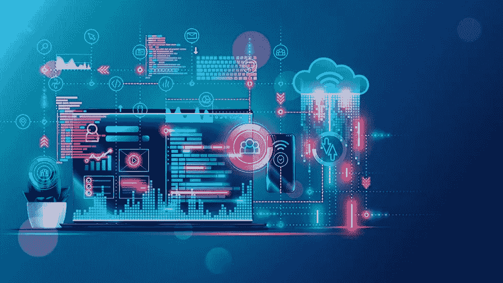
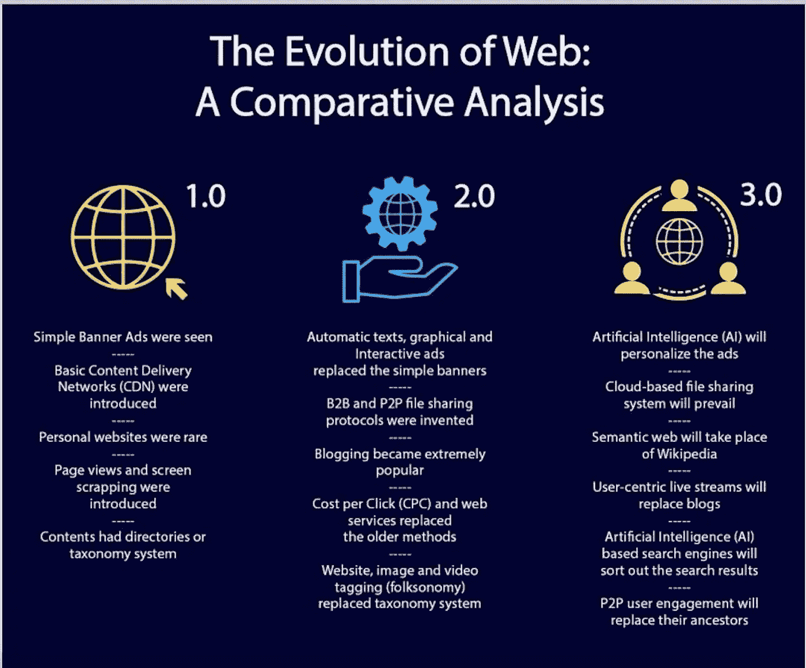
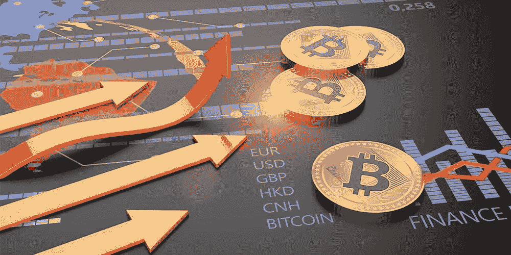

# Web 3.0 互联网的未来

> 原文：<https://medium.com/coinmonks/web-3-0-the-future-of-the-internet-b3d22d642a60?source=collection_archive---------45----------------------->

在技术领域，我们目前正处于一场革命之中。Web 3.0 是互联网世界的革命。这种新模式被一些人称为“价值互联网”。原因在于它将允许更有效的方式来共享和存储信息，包括关于商品和服务的数据。

问题是，是什么让它值得等待？答案在于一个术语“集权”。集中化帮助数十亿人登上了万维网，并创造了它赖以生存的稳定、健壮的基础设施。与此同时，少数几个中央集权的实体牢牢控制着万维网的大片区域，单方面决定什么应该被允许，什么不应该被允许。这意味着我们不自由，而且到目前为止还很遥远。除此之外，我们目前的中央互联网还存在一些问题——比如审查、[安全漏洞、](https://softwarehub.io/softwares_listing/data-privacy-softwares)以及内容分发垄断等问题。

**别担心！Web 3.0 来拯救我们了。**

如果先驱是可信的，Web 3.0 被认为是所有权、民主和自由的缩影。这是迄今为止为用户构建的最好的网络版本之一。很难准确预测它会是什么样子，因为我们以前从未见过它——它仍在开发中——但我们知道它将是一个比我们现在更安全的系统。

# 什么是 web 3.0？

Web 3.0 是万维网的第三次重大迭代。Web 3.0 是一个用来描述下一代互联网的术语，它是去中心化、安全和自治的。它没有授权给大型科技公司。相反，它使网络变得方便易用。

这不仅仅是关于应用程序或网站；它是关于我们如何在日常生活中与技术互动。这是一个即将到来的互联网版本，它将使开发人员编写和部署分散式应用程序(dApps)变得更加容易。有了这个新标准，dApps 将能够在不需要中央服务器的情况下相互通信，这使得它们更能抵抗审查和关闭。

回顾过去

万维网最初是由当时在欧洲粒子物理研究所工作的蒂姆·伯纳斯·李爵士于 1989 年创建的。他希望创建一个开放的平台，让人们可以共享信息并在项目上合作，而不需要像公司或组织这样的中介在其服务器上托管他们的内容。它最初被称为万维网(WWW)，但我们现在称它为“互联网”

自那以来，互联网已经走过了漫长的道路，现在除了文本文档和图像之外，还包括许多不同类型的应用程序和服务:电子邮件，脸书和 Twitter 等社交媒体平台，网飞和 YouTube 等视频流媒体服务。以前我们有 Web 1.0 和 2.0 版本。但是随着技术的发展，升级的需求也在增加。第一个是最初的互联网，它没有图形用户界面(GUI ),只能通过命令行访问。第二次迭代是图形用户界面的出现，它为用户提供了与计算机交互的菜单和按钮。

# Web 3.0 区块链加密货币

我们生活在 web 3.0 时代，一切都是关于加密货币和区块链。

在过去的几年里，我们看到了对加密货币的兴趣激增，区块链技术是我们这个时代最具革命性的创新之一。

区块链可以让你在不使用第三方的情况下安全地存储数据。这是一个分散的系统，允许人们在没有中央权力机构控制的情况下验证交易。这意味着没有人可以篡改您的记录-您的信息是安全可靠的！

随着 Web 3.0 网络将通过分散协议运行——区块链和[加密货币](https://coinmarketcap.com/alexandria/article/what-is-crypto-market-cap)技术的基础——我们可以期待看到这三种技术和其他领域之间的强大融合和共生关系。这场网络革命由加密货币和区块链技术推动。互联网现在是一个巨大的开放市场，人们可以在这里买卖商品和服务，而不必依赖银行或其他金融机构。你可以在网上找到任何东西，从一杯咖啡到一辆汽车——这一切都是通过数字货币完成的。

阅读全文，网址:[https://www . software hub . io/blog/we b-30-the-future-of-the-internet](https://www.softwarehub.io/blog/web-30-the-future-of-the-internet)

> 加入 Coinmonks [电报频道](https://t.me/coincodecap)和 [Youtube 频道](https://www.youtube.com/c/coinmonks/videos)了解加密交易和投资

# 另外，阅读

*   [十大最佳加密货币博客](https://coincodecap.com/best-cryptocurrency-blogs) | [YouHodler 评论](https://coincodecap.com/youhodler-review)
*   [MyConstant Review](https://coincodecap.com/myconstant-review) | [8 款最佳摇摆交易机器人](https://coincodecap.com/best-swing-trading-bots)
*   [MXC 交易所评论](/coinmonks/mxc-exchange-review-3af0ec1cba8c) | [Pionex vs 币安](https://coincodecap.com/pionex-vs-binance) | [Pionex 套利机器人](https://coincodecap.com/pionex-arbitrage-bot)
*   [我的加密副本交易经历](/coinmonks/my-experience-with-crypto-copy-trading-d6feb2ce3ac5) | [比特币基地评论](/coinmonks/coinbase-review-6ef4e0f56064)
*   [CoinFLEX 评论](https://coincodecap.com/coinflex-review) | [AEX 交易所评论](https://coincodecap.com/aex-exchange-review) | [UPbit 评论](https://coincodecap.com/upbit-review)