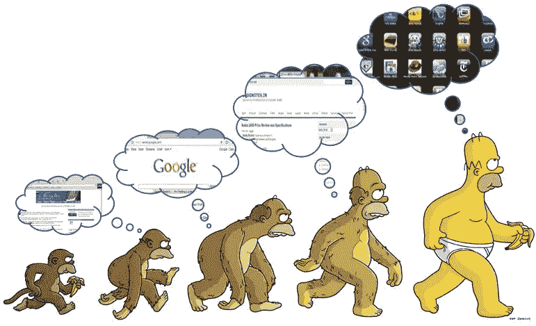
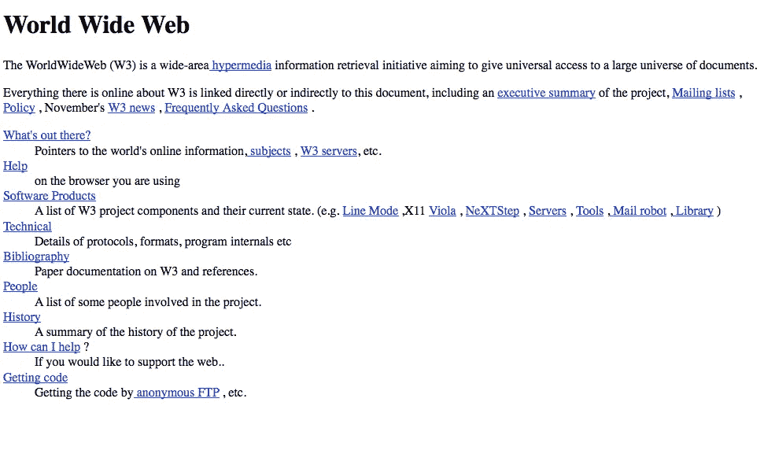
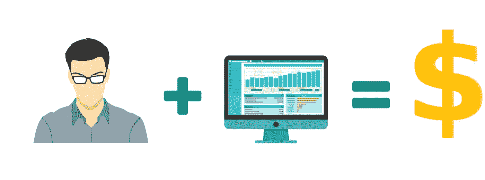
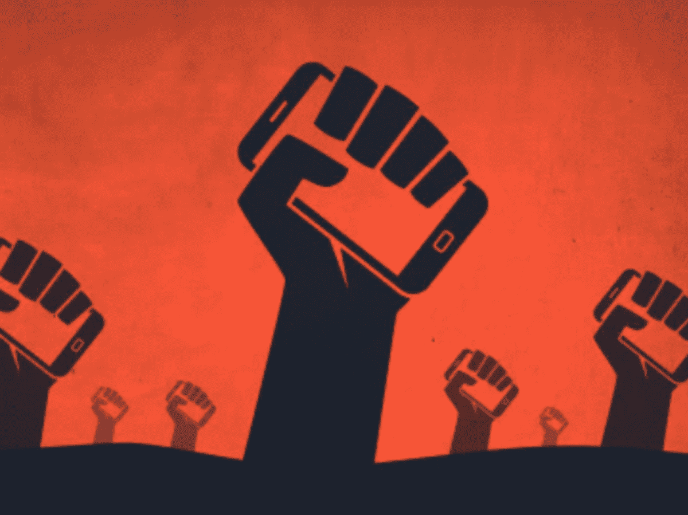

# web 3.0——互联网的下一个发展阶段

> 原文：<https://medium.com/coinmonks/web-3-0-the-next-evolutionary-step-of-the-internet-fc6146202a90?source=collection_archive---------6----------------------->

## 第三部分——互联网的自然演变还是一个炒作的现象？

> **如果你正在读这篇文章，那么你就是现代网络的参与者……**

我们今天所经历的网络与 10 年前大不相同。网络是如何发展的，更重要的是，它下一步将走向何方？此外，为什么这些事情都很重要？

## 如果说历史教会了我们什么的话，这些变化将非常重要。

想想互联网是如何影响你的日常生活的。想想互联网给社会带来了怎样的变化。社交媒体平台。移动应用。现在互联网正在经历另一场范式转变，我们称之为 **WEB 3.0** ，你准备好了吗？

*让我们来看看。*

# 网络的演变

这些年来，网络已经有了很大的发展，今天它的应用几乎与最早期的不可同日而语。web 的发展通常分为三个独立的阶段: **Web 1.0、Web 2.0 和 Web 3.0** 。

# **什么是 Web 1.0？**

**Tim Berners-Lee created the first web browser and World Wide Web on August 6, 1991.**

WEB 1.0 是 web 的第一次迭代。大多数参与者是内容的消费者，创建者通常是开发人员，他们建立的网站包含的信息主要以文本或图像格式提供。Web 1.0 大约从 1991 年的*持续到 2004 年的*。

Web 1.0 由提供静态内容而不是动态 HTML 的网站组成。数据和内容是由静态文件系统而不是数据库提供的，网站根本没有什么交互性。

> 你可以把 Web 1.0 想象成只读的 Web。

# **什么是 Web 2.0？**

我们大多数人最初体验的是当前形式的网络，通常被称为 Web2。

> 你可以把 Web2 想象成一个交互式的社交网络。

在 Web2 的世界里，你不一定要成为开发者才能参与到创建过程中。许多应用程序的构建方式很容易让任何人成为创作者。

如果你想构思一个想法并与世界分享，你可以。如果你想上传一个视频，让数百万人看到它，与它互动，并对它发表评论，你也可以这样做。

Web2 很简单，真的，因为它的简单，世界上越来越多的人成为创造者。

目前形式的网络在很多方面确实很棒，但在一些领域我们可以做得更好，因为整个基础设施存在一些问题。

# **Web 2.0 货币化和安全性**

在web 2 世界中，许多流行的应用程序在其生命周期中都遵循着一个共同的模式。想一想您日常使用的一些应用程序，以及以下示例如何适用于它们:

想象一下像 **Instagram、Twitter、LinkedIn 或 YouTube** 这样的流行应用的早期，以及它们今天有多么不同。这个过程通常是这样的:

1.  **公司推出一款应用**
2.  **它搭载了尽可能多的用户**
3.  **然后它将其用户群货币化**

当一个开发者或公司推出一个受欢迎的应用程序时，随着应用程序的受欢迎程度不断上升，用户体验通常非常流畅。这是他们能够首先迅速获得牵引力的原因。

起初，许多软件公司并不担心货币化。他们严格关注增长和锁定新用户——但最终，他们必须开始盈利。

他们还需要考虑外部投资者的角色。通常，接受风险投资的约束会对我们今天使用的许多应用程序的生命周期产生负面影响，并最终影响用户体验。

> 如果一家开发应用程序的公司获得了风险投资，其投资者通常期望获得几十倍或几百倍的投资回报。

这意味着，公司通常会被推上两条路:广告或出售个人数据，而不是去寻找某种可以以某种有机方式维持的可持续增长模式。

对于许多网络 2 公司来说，如 ***、谷歌、脸书、推特和其他*** 公司，更多的数据带来更多个性化的广告。

# 更多广告=更多点击=更多收入$$$

这是一个简单而有效的等式，基于用户数据的利用和集中是我们今天所知道和使用的网络如何运行的核心。

# **安全和隐私**

W eb2 应用反复经历[数据泄露](https://en.wikipedia.org/wiki/List_of_data_breaches)。甚至有[网站](https://haveibeenpwned.com/)致力于跟踪这些漏洞，并在你的数据遭到破坏时告诉你。

> 在 Web2 中，你无法控制你的数据或数据的存储方式。

事实上，公司经常在未经用户同意的情况下跟踪和保存用户数据。所有这些数据都由负责这些平台的公司拥有和控制，而那些生活在不得不担心言论自由负面后果的国家的用户也面临风险。

如果政府认为一个人表达了与他们宣传相反的观点，他们通常会关闭服务器或查封银行账户。有了中央服务器，政府可以很容易地干预、控制或关闭他们认为合适的应用程序。

因为银行也是数字化的，处于集中控制之下，政府也经常干预。在市场动荡、极度通货膨胀或其他政治动荡时期，他们可以关闭银行账户或限制资金的使用。

> Web3 旨在通过从根本上重新思考我们如何从头开始构建应用程序以及如何与应用程序交互来解决这些缺点。

# 通往 WEB 3.0 的道路

在最基本的层面上，Web3 指的是基于区块链的去中心化在线生态系统。建立在 Web3 基础上的平台和应用将不会被一个中心看门人拥有，而是由用户拥有，用户将通过帮助开发和维护这些服务来获得他们的所有权。

> [**加文伍德**](https://en.wikipedia.org/wiki/Gavin_Wood) *杜撰了术语* ***Web3*** *(原****Web 3.0****)中的****2014****。当时，他刚刚开始帮助开发* [***以太坊***](/the-capital/beyond-the-skies-of-ether-54a4a9976c44) *，这是一种在知名度和市场规模上仅次于* [***比特币***](/the-capital/a-tale-called-bitcoin-58ec764ff119) *的加密货币。如今，他管理着 Web3 基金会，该基金会支持分散化的技术项目，以及致力于为 Web3 构建区块链基础设施的公司 Parity Technologies。*

Web3 增强了我们今天所知的互联网，并增加了一些其他特性。web3 是:

*   能证实的
*   不可靠的
*   自治的
*   未经许可
*   分布式和健壮的
*   宏伟威严的
*   本机内置支付

Web3 还引入了“**本地资产**的概念，称为 ***令牌*** ，用于结算，并通过托管它们的本地链作为信息载体。

代币还引入了完全无边界、无摩擦的原生支付层。像 Stripe 和 Paypal 这样的公司在实现电子支付方面已经创造了数十亿美元的价值。

这些系统过于复杂，并且仍然不能在参与者之间实现真正的国际互操作性。他们还要求您交出您的敏感信息和个人数据，以便使用它们。

整个令牌经济的众多*见证了 web 浏览器扩展的发展和成功实现比如像[***meta mask***](https://metamask.io/)*[***Torus***](https://toruswallet.io/)*和[***Phantom***](https://phantom.app/)使能***

**像[***【Solana】***](https://solana.com/)这样的网络提供了几百位毫秒的延迟，而交易成本却只有几分之一便士。与当前的金融系统不同，用户不必经历传统的众多、充满摩擦的步骤来与网络互动和参与网络。他们需要做的只是下载或安装一个钱包，他们就可以开始发送和接收付款，而无需任何把关。**

# ****建立公司的新方式****

****

**代言人也带来了代币化的想法和 T42 代币经济的实现。**

**以*为例*，建设软件公司的现状。有人提出了一个想法，但为了开始建设，他们需要钱来养活自己。**

**为了获得资金，他们接受风险投资，并拿出一定比例的公司股份。这种投资立即引入了不一致的激励，从长远来看，这与构建最佳用户体验并不一致。**

**此外，如果公司真的成功了，任何相关人员都需要很长时间才能意识到其中的价值，这往往会导致多年的工作没有任何真正的投资回报。**

**相反，想象一下，一个新的令人兴奋的项目宣布了，它解决了一个真正的问题。任何人都可以从第一天开始参与建设或投资。该公司宣布发行 x 个令牌，并将 10%给早期的建设者，将 10%向公众出售，其余部分留作将来支付贡献者和项目的资金。**

**利益相关者可以使用他们的代币对项目未来的变化进行投票，帮助建设项目的人可以在代币发布后出售他们的一些股份来赚钱。**

**相信项目的人可以购买并持有所有权，认为项目走向错误的人可以通过出售他们的股份来表明这一点。**

**因为区块链的数据是完全公开的，购买者对正在发生的事情完全透明。这与购买私人或中央集权企业的股权形成了对比，在这些企业中，许多事情通常都是秘密进行的。**

> **这已经在 Web3 领域发生了。**

**一个例子是 app[**Radicle**](https://radicle.xyz/blog/introducing-rad.html)**(一个分散的 GitHub 替代方案)，它允许涉众参与他们项目的[治理](https://everest.link/category/0x46aff9a161267c2c01f5ce1b6e3b717a77f21480/)。[**git coin**](https://gitcoin.co/)**是另一个允许开发者在开源问题上投入工作并获得加密货币报酬的工具。****允许利益相关者参与决策和对提案的投票。 [**Uniswap**](https://uniswap.org/blog/uni/) ， [**SuperRare**](https://superrare.com/rare) ， [The **Graph**](https://thegraph.com/blog/the-graph-grt-token-economics) ， [**Audius**](https://audius.co/) ，以及无数其他协议和项目都发布了令牌，作为一种实现所有权、参与和治理的方式。**********

******DAOs(去中心化的自治组织)提供了另一种方式来建立我们传统上认为的公司，它正在获得传统开发商和风险投资公司的巨大动力和投资。******

******这些类型的组织被符号化，并彻底改变了组织结构的概念，为更大部分的利益相关者提供真实、流动和公平的所有权，并以新的有趣的方式调整激励。******

******例如，**好友是 Web3 的建设者和艺术家 [**道**](/the-capital/the-way-of-the-dao-ad4185e39697) ，大约一岁，截至本文撰写时，市值约为*7950 万美元*，并于 2021 年 9 月 10 日[获得来自](https://tittlepress.com/crypto/1146487/) [**a16z**](https://a16z.com/) 的 1000 万美元 a 轮投资。********

******DAOs 可以包含一个完整的帖子，但现在，我只想说，我认为他们是建筑产品和(我们过去认为的)公司的未来。******

# ********web 2.0 的争论********

************

******我们现在正在经历的 Web 2.0 是一个集中化的时代，其中很大一部分通信和商务发生在少数超级强大的公司拥有的封闭平台上——比如谷歌、脸书、亚马逊——受中央政府监管机构名义上的控制。******

******Web 2.0 的模型与互联网出现之前的社会模型非常相似。如果我们回到 500 年前，人们基本上只是停留在他们的小村庄和乡镇。他们和认识的人交易。从广义上来说，他们依赖于社会结构，以确保预期是可信的，可能会真正发生。******

******这种结构运作得相当好，因为在城镇之间移动很困难，而且非常耗时和昂贵。******

******但是随着社会发展到更大的规模，我们有了城市、国家和国际组织，我们就进入了这种奇怪的品牌声誉问题。我们创建了这些强大但受监管的机构，原则上，监管者确保我们的期望得到满足。要在特定行业经营，你必须满足某些法定要求。******

******出于几个原因，这不是一个很好的解决方案。其中之一是，监管新产业非常困难。政府行动缓慢，需要一段时间才能赶上。另一个是**监管者不完善**。尤其是当他们与行业密切合作时，行业和监管者之间往往存在某种旋转门关系。******

******另一个简单的例子是**监管机构的火力非常有限。**是政府投入多少钱。因此，监管必然是不完整的。他们可能能够监管最大的违规者，但他们无法始终在任何地方保持真正强大的影响力。当然，监管机构和法律因司法管辖区而异。如果你去欧盟的某个地方，那么 X 公司没问题；如果你去别的地方，那就不好了。随着我们成为一个非常国际化的社会，这实际上意味着你的期望仍然没有得到满足。******

******所以我们需要超越这一点。但不幸的是，Web 2.0 仍然存在于这种非常集中的模式中。******

******我们今天拥有的互联网坏了。我们不控制我们的数据，也没有本地价值结算层。互联网大规模采用已有三十年，我们的数据架构仍然基于独立计算机的概念，数据在服务器上集中存储和管理，并由客户端发送或检索。每次我们在互联网上互动时，我们的数据副本都会被发送到服务提供商的服务器上，每次发生这种情况，我们都会失去对数据的控制。尽管我们生活在一个互联的世界，越来越多的设备与互联网相连，包括我们的手表、汽车、电视和冰箱，但我们的数据仍然集中存储在我们的电脑或其他设备上，在 u 盘上，甚至在云中。******

# ******这引发了信任问题。******

******我能相信那些存储和管理我的数据的人和机构不会遭到任何形式的破坏吗——内部的或外部的，有意的还是无意的？******

# ******Web 3.0 成为新规范？******

************

## ******Web2 是前端革命，而 Web3 是后端革命。******

******它是由**区块链**主导的一套协议，意在彻底改造互联网在后端的有线方式，将互联网的逻辑与计算机的逻辑结合起来。这就是为什么有些人把区块链称为分布式世界计算机。这可能是计算机和互联网发展的下一个重大进展。******

******一些专家说，对 Web3 爱好者来说，在最好的情况下，这项技术将与 Web 2.0 并行，而不是完全取代它。******

******换句话说，以区块链为基地的社交网络、交易和商业在未来几年可以而且将会发展壮大。然而，在我看来，彻底击败脸书、推特或谷歌以及其他科技巨头是不可能的。******

# ******Web 3.0 通过让个人成为主权者，向更公平的互联网迈出了切实的第一步。******

******区块链分布式分类账和存储等技术的兴起将允许数据去中心化，并创造一个透明和安全的环境，超越 Web 2.0 的集中化、监控和剥削性广告。分散的基础设施和应用平台将取代集中的科技巨头，个人将能够合法地拥有自己的数据。******

******事实上，去中心化和区块链技术最重要的影响之一是在数据所有权和补偿领域。随着我们向 Web 3.0 迈进，支持 Web 3.0 的技术逐渐成熟并变得可扩展，我相信 Web 将会反映出它的初衷。******

******当然，伯纳斯-李没有预见到互联网巨头将主宰网络，成为我们数据的所有者和获利者。在 Web 2.0 中已经成为常态的慢性中断将会消失，因为去中心化也使透明、自愿加入的点对点通信成为可能，这种通信允许个人拥有他们的宝贵时间。******

******真正的主权意味着拥有并能够控制谁从自己的时间和信息中获利。Web 3.0 的去中心化区块链协议将使个人能够连接到互联网，在那里他们可以拥有自己的时间和数据并获得适当的补偿，使剥削性和不公正的 Web 黯然失色，在 web 3.0 中，只有巨大的集中式存储库拥有并从中获利。******

************

> ******第 3 部分结束******

********了解我们的新平台**👉**[**【https://thecapital.io/】**](https://thecapital.io/)********

******[https://twitter.com/thecapital_io](https://twitter.com/thecapital_io)******

> ******加入 Coinmonks [电报频道](https://t.me/coincodecap)和 [Youtube 频道](https://www.youtube.com/c/coinmonks/videos)了解加密交易和投资******

# ******另外，阅读******

*   ******[什么是保证金交易](https://coincodecap.com/margin-trading) | [美元成本平均法](https://coincodecap.com/dca)******
*   ******[维护卡审核](https://coincodecap.com/uphold-card-review) | [信任钱包 vs MetaMask](https://coincodecap.com/trust-wallet-vs-metamask)******
*   ******[Exness 点评](https://coincodecap.com/exness-review)|[moon xbt Vs bit get Vs Bingbon](https://coincodecap.com/bingbon-vs-bitget-vs-moonxbt)******
*   ******[如何开始通过加密贷款赚取被动收入](https://coincodecap.com/passive-income-crypto-lending)******
*   ******[BigONE 交易所评论](/coinmonks/bigone-exchange-review-64705d85a1d4) | [电网交易机器人](https://coincodecap.com/grid-trading)******