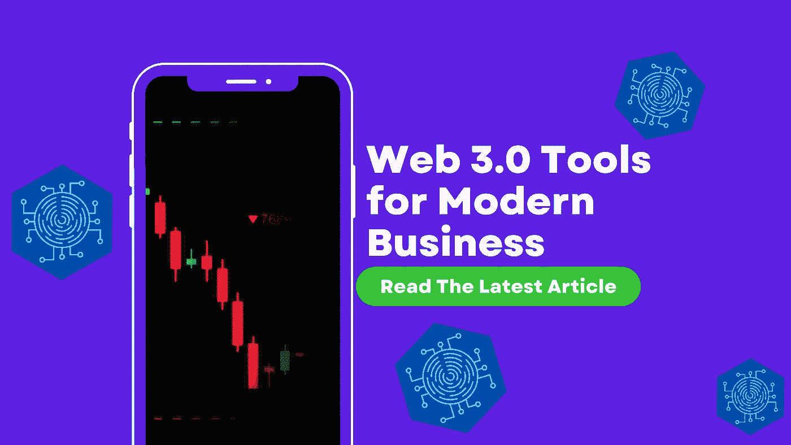

# 现代商业的 Web 3.0 工具

> 原文：<https://medium.com/coinmonks/web-3-0-tools-for-modern-business-b972af8794af?source=collection_archive---------33----------------------->

W 当我们开始 [**理解加密**](https://tinyurl.com/understandingcryptopodcast) 播客时，它诞生于我们的社交音频平台上的大型创业社区的多次请求，以帮助现实世界的企业主更好地了解 Web 3.0 已经到来的基线知识*加上*此时此地正在对日常业务产生影响的是什么。

因此，*在这篇博客*中，我们将讨论将 web3 工具、策略和平台融入现实世界业务的实用技术。我们研究了实现这一目标的各种方式，我们还将研究企业家最重要的考虑因素之一，即**了解你的目标市场的需求；然后决定如何整合这些下一代工具来满足这些需求。**

正如我们在一个关于这个主题的播客中提到的，[“把加密想象成一个新的数字工具箱…找到符合你要求的工具”。](https://tinyurl.com/web3tools)

**将加密货币带入主流**

最近有消息称，法国奢侈品牌巴黎世家[将接受比特币和以太坊作为支付方式](https://decrypt.co/101183/balenciaga-accept-bitcoin-ethereum-metaverse)，这凸显了某些奢侈品公司将加密货币作为支付方式的趋势。可以认为，这种声明预示着数字货币“主流化”的开始… *如果你能认为一个品牌创造的运动鞋每双价值几千美元就是主流。*

但是，无论这里讨论的商品的价格如何，这条新闻都必须被视为让加密货币变得更加普遍的进步之举。此外，这一举措*——目前主要来自奢侈品牌*——可能会给其他对加密感兴趣的企业主提供一个教训。

如果你看看现在谁是这个领域的零售早期采用者，他们是高端品牌，在市场上定位于奢侈品，他们对目标人群有深刻的了解，他们知道——对于高净值行业来说*——加密最终肯定会成为首选的支付方式之一。*

*比你想象的更快，crypto 将帮助企业主扩大他们的客户群。*

*作为企业主，你必须了解你的客户。很可能巴黎世家的客户群中有很大一部分属于“成熟投资者”的类别，因此从金融角度来看，他们很可能精通并受过良好教育，或许他们自己也持有加密货币。*

***商业模式***

*因此，虽然奢侈品牌拥有转向加密货币支付的消费者力量，但由于客户的原因，普通企业主现在可能无法做到这一点。*

*这并不是说你需要成为一个庞大的奢侈品零售商才能使用这些支付工具！当然，目标市场不同的小企业可能希望*将 Web 3.0 选项整合到他们典型的公司模式中，以增加更多价值，从而使他们更有价值。**

*例如， **NFTs 和数字资产**绝对应该是会员制商业模式的*核心*。**创造者币和社交令牌**可以在基于社区的框架中用作奖励。DAOs 可能是让利益相关者感觉像股东的一种万无一失的方式。*

*我们上面提到了几个稍微复杂一点的例子，但是简单地接受加密货币支付——就像巴黎世家的例子一样——是朝着正确方向迈出的一步，对于许多中小企业来说，使用比特币基地、Moonpay 和 Bitpay *等平台接受加密支付相对容易。**

***现在，我们正处于加密革命的中期，因此许多企业需要数字和现实世界机制的平衡组合才能蓬勃发展。***

***创新应用***

*通过创造性的应用，Web 3.0 有能力解决现实世界的问题。对于那些能够在 web 2 + 3 之间架起桥梁的人来说，这是一个巨大的机会。Crypto 和/或区块链有能力解决世界上最大的问题，如果合适的人掌握它，并开发解决这些问题的解决方案或平台。*

*至少对我来说，*，似乎是现在的最佳地点；那些能够用看似明天的技术解决今天的问题的品牌、企业、组织、企业家和开发商将会大获全胜。**

***想要一个例子吗*，这是我的商业伙伴和《理解》的联合主持人保罗一直在玩弄的东西……生物识别跟踪，使用区块链作为实现交易的分类账，为建筑行业实现更快的支付。**

**迷茫…？是啊，我本来也要开始的！**

**但这是他告诉我的。全国建筑工地上的大量工人是临时工或短期承包商。这些男孩和女孩仍然使用纸质考勤卡打卡上班。这些时间卡需要由现场经理收集，然后发送给某人*(很可能是很多人！)*然后由谁将它们传递到账户上以供他们核实。在给它开绿灯之前，账户做他们的*检查和平衡，然后给客户开发票。客户在“应收账款”部门会有一个人*(或人员)*，他现在必须检查他们的系统，以确保他们应支付的金额与正在完成的工作量相关联，然后他们发放款项。这笔钱支付给承包公司，承包公司然后*最后*——把钱发给工人！***

*仅仅是追踪事件的线索都很难，更不用说做实际的工作了！*

*因此，就在这个例子中，这个链条可能至少有 5 个人或部门参与该流程，3 家银行参与交易，以及数十个工作时间… *支付一笔款项！**

***这些人、步骤或组织中的每一个都有成本影响。***

*这就是 Web 3.0 发挥作用的地方——加速系统、建立数字信任和简化流程。*

*在保罗的乌托邦梦想中，区块链技术的使用可以彻底改变建筑业。现场的生物识别机器可以与区块链对话，证明那个人在那里。这将是一个数字账本，有一个智能合同，以加快服务与支付过程，大规模。付款会快得多。这种交易速度非常有价值——尤其是在建筑这样的行业，付款期限传统上很长，延迟付款导致现金流紧张，在很多情况下已经到了破产的地步。*

*当然，更快速、自动化和自主的支付流程并不适合所有各方，可以肯定的是，某些利益相关方会积极争取维持现状*，如果这符合他们的议程。**

*创新也将是昂贵的，但随着像 DOAs 这样的组织结构的出现，找到你的部落与你一起踏上创新之旅可能比以往任何时候都更容易。*

*总的来说，我认为 Web 3.0 不是每个企业现在都需要参与的东西，但是小企业主确实需要以热情的兴趣关注这个领域，因为它即将到来。*