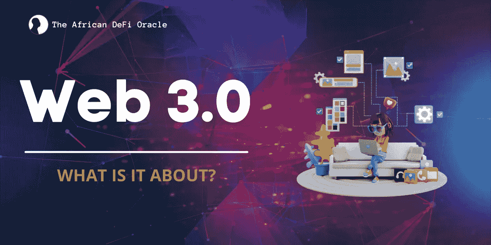

# WEB 3.0:理解互联网的去中心化未来

> 原文：<https://medium.com/coinmonks/web-3-0-understanding-the-decentralized-future-of-the-internet-46e6198d3043?source=collection_archive---------63----------------------->

术语“web 3”或“web 3.0”最近已经成为最热门的讨论话题之一。它只是指互联网的下一个阶段，强调现代网络的演变。因为网络已经发展并继续发展。问题是，这种进化已经发生了多少，下一步会走向何方？此外，为什么要关注这些问题呢？每天，互联网对我们的个人生活和整个社会都有重大影响。现在，它正在经历又一次范式转变。所以，我们需要关注这种变化。

## **网络的演变**

他们说，“变化是持续的”，当今世界的技术进步也不例外。网络已经见证了它的进化，今天存在的网络和几年前存在的已经不一样了。要完全理解 web 3 是什么，理解它之前的事物是至关重要的。

## **Web 1.0**

互联网的第一个版本被称为 Web 1.0，发布于 20 世纪 90 年代末。它由从静态文件系统而不是从数据库提供数据和内容的站点组成。这是一个典型的只读网站。网站不允许用户互动，大多数参与者是内容消费者。

## **Web 2.0**

这是当前状态下的网络。如果你正在读这篇文章，你已经体验了现代网络，就在我们说话的时候。

这个版本的网站是对原始互联网的改进。它鼓励用户互动，允许人们不仅消费内容，还可以在博客、市场和互联网论坛上创建和发布自己的内容。它被一些人称为“互动和社交网络”。

web 2 的简单性是它的最大优点之一。因此，每个用户都可以成为创作者。人们可以打开文件并编辑它们，而不仅仅是查看它们。

## **安全和隐私**

Web 2.0 应用程序为世界提供了令人难以置信的免费服务。它极大地影响了沟通和我们相互交流的方式。想象一下没有谷歌、脸书、推特和其他 web 2.0 公司的世界。

然而，用户数据的利用和集中是我们今天所知的网络设计的基础。

## **集权问题？**

说实话，毫无疑问，Web2 让生活变得更容易，尤其是在交流方面，但它也带来了自己的挫折:

web 2 中的用户无法控制他们的数据或数据的存储方式，公司控制并拥有数据。这些集中化的私营公司经常在未经用户同意的情况下跟踪和保存用户数据。从本质上讲，这些公司掌握着巨大的垄断权力，并对潜在竞争对手的进入设置障碍。所有的 Web2 应用程序，包括整个银行和金融系统，都由中央集权的公司控制。

## **进入 Web 3**

这就是 Web 3 发挥作用的地方。去中心化是 web3 的核心。Web3 是去中心化网络的未来，用户拥有控制权。本质上，它是一个整合了用户参与和所有权的网络。Web3 旨在赋予网络中的任何参与者自己的权力和控制权。

用户可以参与协议的治理和管理，而不仅仅是使用免费的技术平台来交换我们的数据。这意味着，人们现在可以成为参与者和股东，而不是客户或商品。

Web 3 由基于去中心化区块链的技术驱动，这鼓励了新的商业和社会模式的出现。由于用户现在通过拥有协议的加密货币或令牌来拥有和控制他们的数据、内容、算法和身份，该系统将权力和金钱从集中的 web 2“技术巨头”手中转移出去。因此，他们作为股东参与。

## 结束语

Web3 仍在发展中，还没有完全定义。然而，关键的前提是，它将是去中心化的，而不是像今天的互联网那样由政府和公司控制。每天都有新的发现，这很可能在未来几年影响投资界和更广泛的经济。

> 加入 Coinmonks [电报频道](https://t.me/coincodecap)和 [Youtube 频道](https://www.youtube.com/c/coinmonks/videos)了解加密交易和投资

# 另外，阅读

*   [Bitsgap 审查](/coinmonks/bitsgap-review-a-crypto-trading-bot-that-makes-easy-money-a5d88a336df2) | [Quadency 审查](/coinmonks/quadency-review-a-crypto-trading-automation-platform-3068eaa374e1) | [Bitbns 审查](/coinmonks/bitbns-review-38256a07e161)
*   [密码本交易平台](/coinmonks/top-10-crypto-copy-trading-platforms-for-beginners-d0c37c7d698c) | [Coinmama 审核](/coinmonks/coinmama-review-ace5641bde6e)
*   [印度的加密交易所](/coinmonks/bitcoin-exchange-in-india-7f1fe79715c9) | [比特币储蓄账户](/coinmonks/bitcoin-savings-account-e65b13f92451)
*   [OKEx vs KuCoin](https://coincodecap.com/okex-kucoin) | [摄氏替代度](https://coincodecap.com/celsius-alternatives) | [如何购买 VeChain](https://coincodecap.com/buy-vechain)
*   [币安期货交易](https://coincodecap.com/binance-futures-trading)|[3 commas vs Mudrex vs eToro](https://coincodecap.com/mudrex-3commas-etoro)
*   [如何购买 Monero](https://coincodecap.com/buy-monero) | [IDEX 评论](https://coincodecap.com/idex-review) | [BitKan 交易机器人](https://coincodecap.com/bitkan-trading-bot)