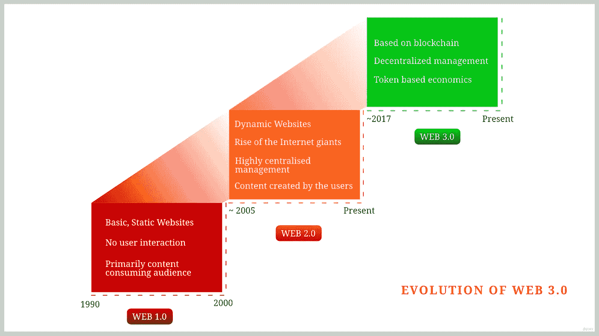
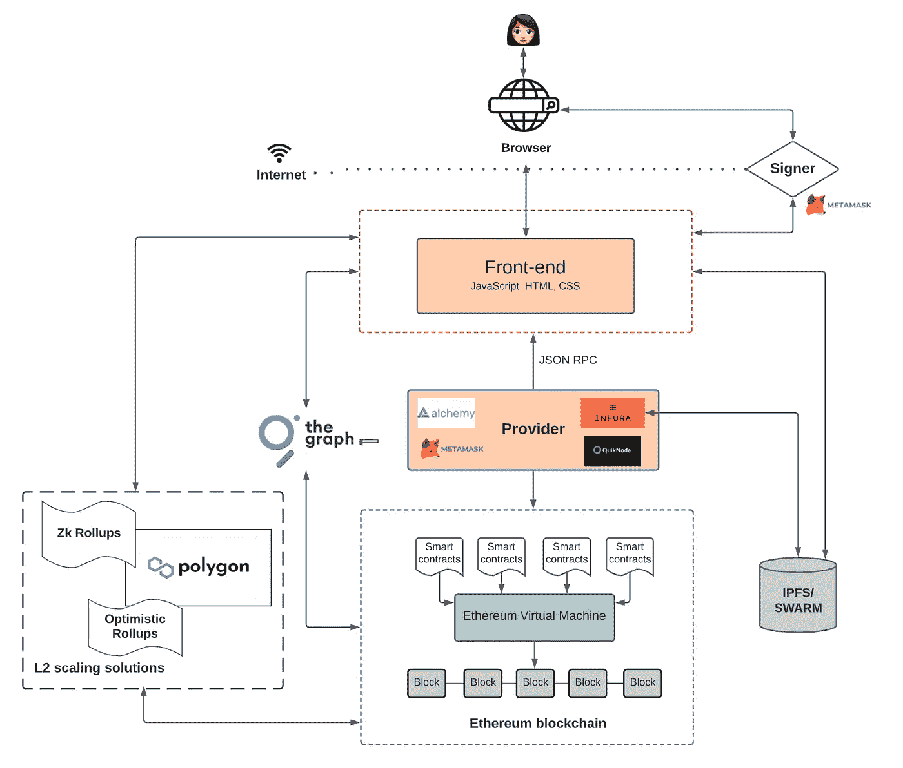
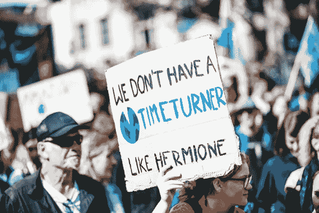
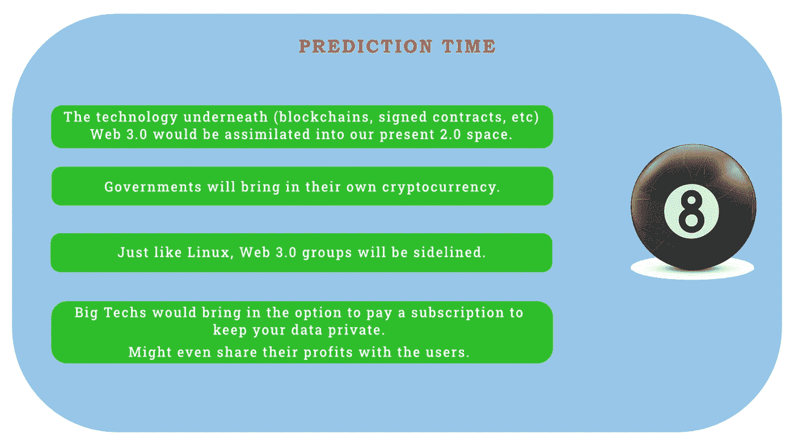

# Web 3.0 —它对世界上 99%的人意味着什么？

> 原文：<https://medium.com/coinmonks/web-3-0-what-does-it-mean-to-99-of-the-world-bcd5f10f6d86?source=collection_archive---------20----------------------->

What is Web 3.0?

现在还早。尽管这个想法已经存在了几年，市场价值已经达到万亿美元，而且每分钟都在成倍增长，但现在确定下来还为时过早。我们甚至还没有对 Web 3.0 达成一致的定义。那么，发生了什么事？

3.0 的支持者提出了多种理由来摆脱 Web 2.0:高度集中的大型技术公司、安全和隐私问题、数据的存储和出售、审查和缺乏透明度、将控制权还给普通用户、消除中间人等等。

Web 3.0 真的像他们声称的那样是治疗 Web 2.0 弊病的灵丹妙药吗？它给非 3.0 说话世界带来了什么价值？

# 陈词滥调“下一件大事”

随着技术、基础设施和通信的进步，我们的联系比以往任何时候都更加紧密。同时，也不稳定。随之而来的是巨大的挑战。

少数公司拥有的财富和权力超过了大多数国家的总和。我们的安全和隐私以我们无法理解的方式受到损害。我们无法控制我们的数据，这些公司也不愿意公开他们是如何处理数据的。与此同时，他们通过操纵我们的思想和泄露我们的数据来赚钱。

没有丝毫犹豫，这不是闲置，需要改变。但是(顺便说一句，第一句不是废话)在我们在这个场景中注入 Web 3.0 之前，我们在我们的 2.0 空间中是否有上述问题的替代解决方案？(问题没有比较 2.0 & 3.0 下面的技术。)

是的，我们可以。3.0 的大部分优势可以给 2.0 用户。

*   在 Web 2.0 中，我们也可以选择在一个安全、可靠、私密的网络空间中生活和发展。通过改变我们的上网习惯，并在日常生活中采用一些乏味的方法，我们可以保护我们的隐私和安全。
*   此外，对于所有大型科技产品，我们都有保护我们数据隐私的替代解决方案，并且这些解决方案在一定程度上是透明的。然而，大多数人没有给他们公平的机会成为主流。

看看 Linux 和 Windows 的对比。Linux 已经在市场上存在了 25-30 年，但它从未成为主流。它向世界提供了一个免费、开源的选择，然而大多数人选择了 Windows。Linux 用户会责怪制造商不支持&不提供 Linux 定制的硬件。制造商会引用“Linux 在大众中接受度低”作为不进入 Linux 的理由。指责循环继续，没有任何解决办法。

遗憾的是，我们还没有到可以讨论是否继续使用 2.0 的阶段。我们显然已经过了那个时刻。Web 3.0 已经到来。说实话，一个 nook 在 3.0 左右被捆绑，并被 FOMO 培养资本家&自称的密码大师推到了中心舞台(以前所未有的水平和规模)。请注意，当 3.0 成为主流时，早期采用者将会大获全胜。

Web 3.0、区块链、加密、Defi、D-apps 和 NFT 是下一个大事件。我们不能成为反对新技术的勒德分子，但我们必须提出正确的问题并进行分析，以确保制衡。

# Web 3.0 的高调宣称

理论上，Web 3.0 是完美的。

数据将分布在区块链的所有节点上，而不是存储在一个地方。无论你在网上做什么，你的数据都会被集中在一起，你不需要注册/登录来使用单独的服务。由于加密，没有人可以访问你的数据，也没有人可以篡改你的数据，因为区块链时间戳。

*   如果这种空闲场景发生，无论谁提供 Web 3.0 服务，都必须在区块链上拥有自己的节点。运行他们自己的节点非常昂贵和复杂。不是每个人都有能力做那件事。为了进行调整，他们不得不使用第三方节点服务。不利的一面是，它创造了一个 Web 3.0 难以摆脱的集中瓶颈。为了避免堵塞，必须引入分散存储解决方案。(查看 Preethi Kasi Reddy 的这个 [Web 3.0 架构](https://www.preethikasireddy.com/post/the-architecture-of-a-web-3-0-application))。所有这些都使网络变得复杂，并产生了易受攻击的点。

到目前为止，区块链是不可伸缩的。为了使它具有可伸缩性，必须引入许多元素，这将进一步扩展系统。

Web 3.0 Architecture (Image Source: [Preethi Kasi Reddy](https://www.preethikasireddy.com/post/the-architecture-of-a-web-3-0-application))

*   据预测，到 2025 年，我们的数据消耗量将是 2010 年的 160 倍。为了构建区块链以支持数据消耗的增长，必须引入大量新节点。这引起了环境问题，我们稍后会讨论。

Web 2.0 公司的大部分收入来自广告，也就是出售你的数据。这就是为什么你使用的服务是免费使用的。在 Web 3.0 的世界中，这将如何工作呢？(目前)对于广告业在这片土地上将如何发展，还没有令人信服的观点。

*   因为数据分散，不会有足够的数据来创建有针对性的个人资料，就像他们现在在谷歌和脸书做的那样。这是一件好事，但那些习惯了大公司提供的当前广告选择的舒适性的人会失望的。3.0 公司的收入也减少了。为了纠正这一点，D-apps 可以收集数据并与用户分享部分利润(这也将违背 Web 3.0 的创建原则)

这些技术问题可以在未来的迭代中得到解决，但仍然会给我们留下环境和管理方面的问题。

## Web 3.0 的环境问题

Web 3.0 Environmental Concerns (Image Source: [Markus Spiske](https://unsplash.com/@markusspiske))

所有国家在 2015 年召集并签署了巴黎协定，以限制全球气温上升。即使在七年后(在这个中央集权的世界里)，我们也几乎没有关于它的实施和效果的材料。我们当时没有 2.0 的计划，现在也没有 3.0 的计划。

国际能源署估计可再生能源产量约占 30%,但主要份额仍来自化石燃料。截至目前，矿物燃料正在为矿工和采矿电网提供动力。由于电力消耗和碳排放增加，许多国家正在禁止秘密采矿。

> *仅比特币区块链估计消耗的能量就和芬兰* [*差不多~ 128 万万亿焦耳*](https://www.stat.fi/til/ehk/2020/04/ehk_2020_04_2021-04-16_tie_001_en.html) *。*

市场上有数千种区块链&超过 10，000 种加密货币，未来还会有更多。

> *今年(2021 年)与能源相关的二氧化碳排放量可能会增加 15 亿吨，这将是历史上第二大增幅—* [能源监测](https://www.energymonitor.ai/tech/renewables/iea-strong-renewables-growth-continues-in-2021)

现在的情况并没有变好，但是我们能承受 Web 3.0 让它变得更糟吗？

## 管理分散的自治组织

Web 3.0 最大的营销点之一是“把控制权还给用户”。为了实现这一点，他们引入了向用户提供“治理令牌”的选项。当用户对应用程序做出贡献时，他们将获得代币形式的报酬(比如购买公司的股票)。当你拥有相当数量的代币时，你就可以参与公司的管理决策。

理论上，应该可以。成千上万的用户聚集在一起，为成千上万人使用的应用程序做出管理决策。现实中，我们怎么能确定呢？

几个世纪以来，我们一直试图完善民主，但我们仍然没有一个完美的民主。以民主的名义，我们只是成功地创造了一个多数-少数的场景。

传授这种经营 Web 3.0 公司的情况。更别说成千上万了。想象一下，即使只有一百个用户拥有管理级别的治理令牌，也不会出现混乱。这显然会在用户中造成多数-少数的局面。一段时间后，少数人会离开去创建一个新公司，或者这一百个治理用户会缩成一小撮，形成寡头。(再次违背 3.0 的原则)。

> 区块链网络的所有权并不是平均分配的，而是集中在早期采用者和风险资本家手中。就几个人拿着上亿美元的钥匙，都是去中心化剧场(名不副实的去中心化)的例子。例如，以太坊的联合创始人 Vitalik Buterin 继续在网络上拥有巨大的权力，尽管他不再参与其开发。— [Coindesk](https://www.coindesk.com/learn/what-is-web-3-and-why-is-everyone-talking-about-it/)

在一个四人小组中，总会有一个谢尔顿·库珀(Sheldon Cooper)在为自己争取利益。在一个 100 人的群体中，会有几十个谢尔顿·库珀为了占上风而互相操纵。即使他们团结在一起，也很难迅速做出决定，与他人竞争。

就像莫邪·马林斯派克(Signal 的联合创始人)提到的-

> *“如果事情真的分散了，那就很难改变，而且经常会停滞不前。这是技术的问题，因为生态系统的其他部分正在快速发展，如果你跟不上，你就会失败。*

最终，网络将由人类来管理，这在任何网络中都是一个风险因素。

## 政府——房间里的大象

在 1996 年的网络空间独立宣言中，约翰·佩里·巴洛写道:

> 我们没有选举产生的政府，也不可能有，所以我并没有比自由本身更大的权威来对你们讲话。我宣布，我们正在建设的全球社会空间将自然地独立于你们试图强加给我们的暴政。你没有统治我们的道德权利，也没有任何我们有理由害怕的强制手段。”

1996 年，可能需要有一个公平的地方。大约 25 年后，如果 Web 3.0 的支持者提出同样的理由，我们正在北极寻找企鹅。

网络不是问题。政府是。我们认为创造下一代互联网将把我们从政府中解放出来，而不是改变那些统治我们并拥有更好政策的人。政府会一直在这里。如果 Web 1.0 不能改变它，Web 3.0 也不能。如果我们想要一个更美好的未来，科技和政府应该携手前进。远离政府不是解决办法。

这就是硅谷的问题。他们对解决方案的看法很狭隘，他们把“下一件大事”作为解决世界上所有疾病的灵丹妙药。是的，技术是改善我们生活的工具。可悲的是，湾区不接受科技只是我们生活的一部分。

# 历史对我们不利

你可以试着说服我，以上都只是假设。Web 3.0 可能会让这种夸张的说法成为现实。如果发生这种情况，我会很高兴地欢迎这种变化。可悲的是，历史对我们不利。

当有选择的时候，人们总是会选择只对自己有利的一方。很简单的心理学。这是我们的基因。没有比下图更好的解释了。

Image Source: [News Text Area](https://newstextarea.com/times-covers-with-zuckerberg-11-years-away/)

但在某种程度上，我也必须为脸书辩护。我仍然记得 2011 年创建我的脸书账户时的激动心情。在当时，它开启了一个全新的世界和大量的机会。

任何新事物都会失去光泽。这就是世界运转的方式。但这仅仅是脸书(不仅仅限于脸书，还有其他社交平台)的错吗？

脸书管理层是垮台的一部分原因，用户是另一部分原因。我们没有关于处理这个数字怪物的实践教育，它造成了一系列大规模的问题。

假新闻，仇恨内容，操纵大众，金融诈骗，黑客和盗窃等。不是平台创造了他们，而是人创造了他们。我们很可能在未来拥有一个完美的 Web 3.0，但是如果人们和他们的方法没有改变，我们将会看到一个和上面一样的图像。那么下一代 1%的人会宣称 Web 4.0 将是有史以来的游戏规则改变者。循环往复。

那么，Web 3.0 对世界上 99%的人意味着什么呢？

Web 3.0 & the 99%

**剥去 Web 3.0 的华丽的、吸引人的理由/优势，我们看到的是一个没有给大众增加多少价值的空洞的精髓。(暂时)**

*PS:我没有完全从技术角度出发，而是尝试引入“人”的元素来剖析这个主题，并给出我的观点。如果你觉得观点模棱两可，那就是有意的。如果你发现任何错误，一定要让我知道。*

## 预测时间

Web 3.0 Predictions

## 需要澄清

*   比特币(或任何其他流行的加密货币)是如何不受通胀影响的？供求平衡通货膨胀。比特币的供应量有限。那怎么是无通胀的呢？

> 加入 Coinmonks [电报频道](https://t.me/coincodecap)和 [Youtube 频道](https://www.youtube.com/c/coinmonks/videos)了解加密交易和投资

*   [如何开始通过加密贷款赚取被动收入](https://coincodecap.com/passive-income-crypto-lending)
*   [加密货币储蓄账户](/coinmonks/cryptocurrency-savings-accounts-be3bc0feffbf) | [加密交易机器人](https://coincodecap.com/best-crypto-trading-bots)
*   [BigONE 交易所评论](/coinmonks/bigone-exchange-review-64705d85a1d4) | [CEX。IO 审查](https://coincodecap.com/cex-io-review) | [Swapzone 审查](/coinmonks/swapzone-review-crypto-exchange-data-aggregator-e0ad78e55ed7)
*   [最佳比特币保证金交易](/coinmonks/bitcoin-margin-trading-exchange-bcbfcbf7b8e3) | [比特币保证金交易](https://coincodecap.com/bityard-margin-trading)
*   [加密保证金交易交易所](/coinmonks/crypto-margin-trading-exchanges-428b1f7ad108) | [赚取比特币](/coinmonks/earn-bitcoin-6e8bd3c592d9)
*   [WazirX vs CoinDCX vs bit bns](/coinmonks/wazirx-vs-coindcx-vs-bitbns-149f4f19a2f1)|[block fi vs coin loan vs Nexo](/coinmonks/blockfi-vs-coinloan-vs-nexo-cb624635230d)
*   [BlockFi 信用卡](https://coincodecap.com/blockfi-credit-card) | [如何在币安购买比特币](https://coincodecap.com/buy-bitcoin-binance)
*   [火币交易 Bot](https://coincodecap.com/huobi-trading-bot) | [如何购买 ADA](https://coincodecap.com/buy-ada-cardano) | [Geco？一次审查](https://coincodecap.com/geco-one-review)
*   [加密副本交易平台](/coinmonks/top-10-crypto-copy-trading-platforms-for-beginners-d0c37c7d698c) | [五大 BlockFi 替代方案](https://coincodecap.com/blockfi-alternatives)