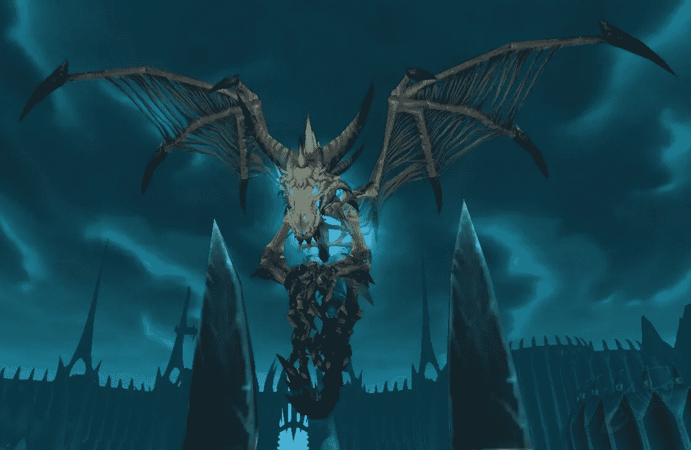
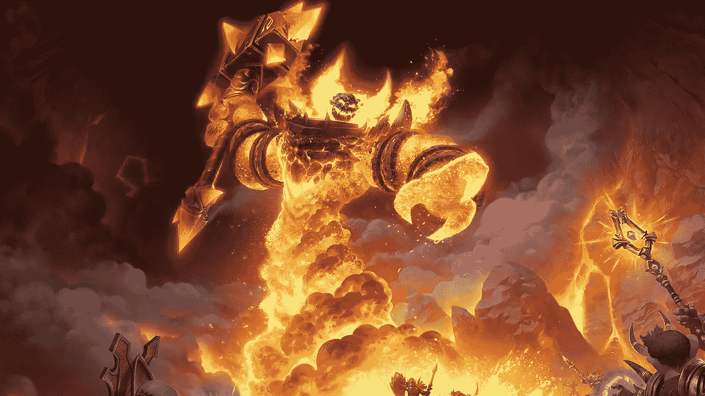
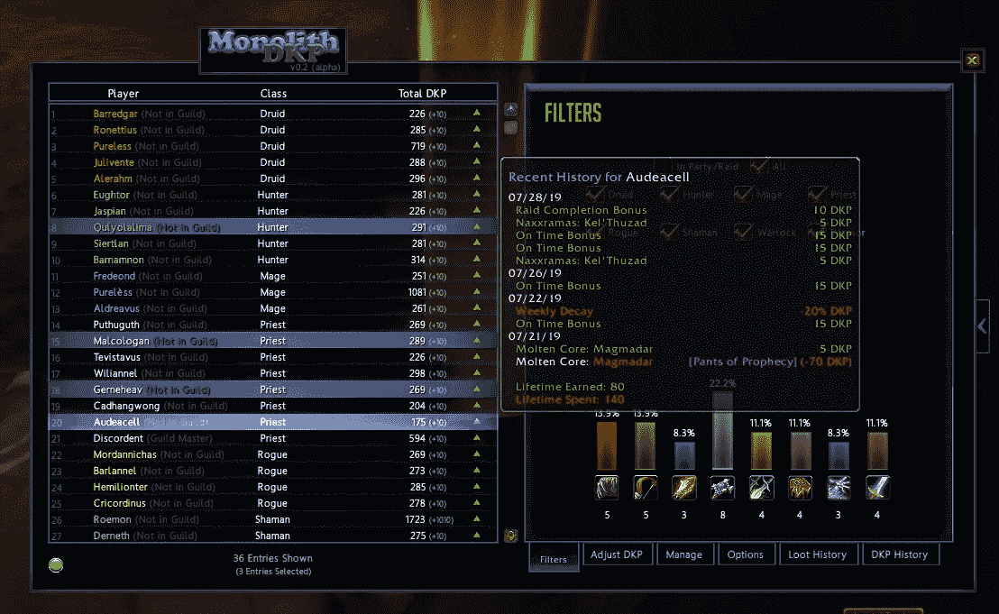

# Web 3 和魔兽世界第五部分——DKP 和代币经济学

> 原文：<https://medium.com/coinmonks/web-3-and-world-of-warcraft-part-5-dkp-and-token-economies-9b2b314b7bef?source=collection_archive---------51----------------------->

经过一场苦战，我们终于拿下了霜龙 Syndragosa，然后我第一次见到了巫妖王阿尔萨斯。我和一个顶级公会一起在我们的服务器上进行突袭，在突袭结束时，组织者给所有参加的公会成员分发了一个叫做 DKP 的东西——杀龙点数。这是我第一次接触这个系统，在研究它时，我发现了一种围绕游戏公会建立的代币经济的早期形式。虽然 DKP 是公会协调的一种方式，但它也可以被视为今天如何建立代币经济的先驱。

龙族杀戮点或 DKP 来自 MMORPGs，其主要目标通常是和你的公会成员一起杀死一条恶龙。许多玩家经常被卷入一次突袭，在干掉一条龙后，可供分配的战利品是有限的。通常一个 25 人的团队中只有 4-5 名玩家获得战利品。鉴于奖励的稀缺性，顶级公会建立了一个非正式的令牌结构来激励更多的玩家参与。

这是龙杀点的功能。DKP 奖励给参与重要公会任务的公会成员，例如突袭和屠龙。参与突袭的公会成员将获得 DKP，并且持续突袭的 DKP 数量将随着时间累积。当战利品从一个杀龙者身上掉落，且有多个玩家想要这个战利品时，累积 DKP 的数量将决定优先权。获得战利品的玩家将会交换与战利品价值成比例的 DKP，而失去的 DKP 将会重新分配给所有参与突袭的玩家。这给了大家一个加入突袭的理由。即使你没有战利品，你仍然可以获得 DKP，它与公会的战利品奖励有交换价值。

World of Warcraft Add On for DKP tooling

虽然 DKP 是一种革命性的公会协调方式，但它仍然是一种非正式的系统，存在于游戏内货币之外。分发是在共享的电子表格或公会网站上跟踪的，数据可能容易出错。尽管这个系统还很初级，DKP 实际上是一个由行会设计的替代货币系统，为他们的成员创造激励。尽管 DKP 是中央集权的，不能被转移到某个特定的公会之外，但是这个系统具有许多被 P2E 代币经济甚至是 Web 3 中的 DAO 治理结构所继承的特征。

WoW 的很多方面都影响了 Web 3 的构建方式，这在一篇文章中是无法涵盖的。这是 Web 3 DNA 和魔兽世界系列的第 5 部分。

感谢您的阅读。

查看我的 Web 3 之旅:

[https://twitter.com/wasifmrahman](https://twitter.com/wasifmrahman)

在 LinkedIn 上关注我:

 [## Wasif Rahman -营销伙伴关系总监- Ex Populus | LinkedIn

### 查看 Wasif Rahman 在全球最大的职业社区 LinkedIn 上的个人资料。Wasif 有 4 个工作列在他们的…

www.linkedin.com](https://www.linkedin.com/in/wasif-rahman-91114a85/) 

我的 Web 3 淋浴想法:

 [## 瓦西夫·拉赫曼-中号

### 阅读瓦西夫·拉赫曼在媒介上的作品。Web 3 德根 Ex Populus 营销伙伴关系总监。每天…

medium.com](/@wasifmrahman) 

阅读第 1 部分:灵魂绑定

 [## Web 3 的 DNA 和魔兽世界第一部分——灵魂绑定

### 我从大学开始就试图超越书呆子游戏玩家的刻板印象。这一年我将变得更好相处…

medium.com](/@wasifmrahman/web-3s-dna-and-world-of-warcraft-part-1-soulbound-e53d85af4fbf) 

阅读第二部分:中国淘金者

 [## Web 3 DNA 和魔兽世界第二部分——中国淘金者

### 我登录了我的魔兽世界账户，发现我的 80 级战士一丝不挂地坐在暴风城。我的用户界面看起来不一样…我…

medium.com](/@wasifmrahman/web-3-dna-and-world-of-warcraft-part-2-chinese-gold-farmers-b71b1e7b5ac6) 

阅读第 3 部分:有组织的网络流氓

 [## 网络 3 DNA 和魔兽世界第 3 部分-有组织的网上歹徒

### 你发现自己在经典 WoW 的 Un Goro 火山口。你正在猎杀传说中的恶魔龙，为它剥皮…

medium.com](/@wasifmrahman/web-3-dna-and-world-of-warcraft-part-3-organized-online-gangsters-92d9d68f9038) 

阅读第 4 部分:从游戏公会到 Web 3 社区

 [## Web 3 DNA 和魔兽世界第 4 部分——从游戏公会到 Web 3 社区

### 我记得我魔兽世界职业生涯中最难忘的一天。我已经成功地带领我的公会通过了整个…

medium.com](/@wasifmrahman/web-3-dna-and-world-of-warcraft-part-4-from-gaming-guilds-to-web-3-communities-3efc3b5b8674) 

阅读:高潮与低谷:网络 3 的一年

 [## 高潮与低谷:Web 3 的一年

### 我在去年 6 月 22 日买了我的第一个密码。我清楚地记得这是自加密以来的第一次重大下跌…

medium.com](/@wasifmrahman/the-highs-and-lows-a-year-in-web-3-eed764aa6efb) 

> 加入 Coinmonks [电报频道](https://t.me/coincodecap)和 [Youtube 频道](https://www.youtube.com/c/coinmonks/videos)了解加密交易和投资

# 另外，阅读

*   [如何在 FTX 交易所交易期货](https://coincodecap.com/ftx-futures-trading) | [OKEx vs 币安](https://coincodecap.com/okex-vs-binance)
*   [CoinLoan 评论](https://coincodecap.com/coinloan-review) | [YouHodler 评论](/coinmonks/youhodler-4-easy-ways-to-make-money-98969b9689f2) | [BlockFi 评论](https://coincodecap.com/blockfi-review)
*   [XT.COM 评论](https://coincodecap.com/profittradingapp-for-binance)币安评论 |
*   [SmithBot 评论](https://coincodecap.com/smithbot-review) | [4 款最佳免费开源交易机器人](https://coincodecap.com/free-open-source-trading-bots)
*   [比特币基地僵尸程序](/coinmonks/coinbase-bots-ac6359e897f3) | [AscendEX 审查](/coinmonks/ascendex-review-53e829cf75fa) | [OKEx 交易僵尸程序](/coinmonks/okex-trading-bots-234920f61e60)
*   [如何在印度购买比特币？](/coinmonks/buy-bitcoin-in-india-feb50ddfef94) | [WazirX 评论](/coinmonks/wazirx-review-5c811b074f5b)