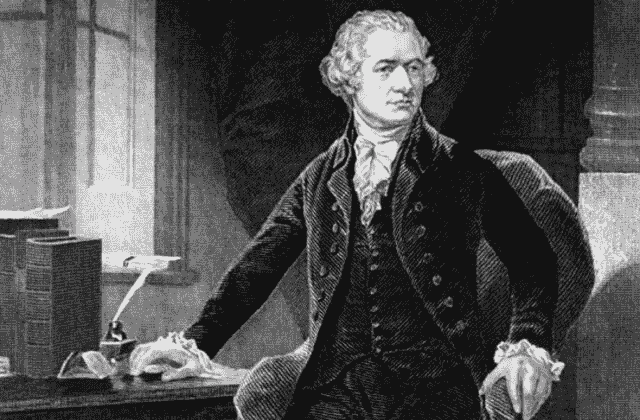

# web 3-笨重、吵闹-一只有待征服的野兽？但是哦…

> 原文：<https://medium.com/coinmonks/web-3-clunky-loud-a-beast-to-be-conquered-but-oh-64859a77a60f?source=collection_archive---------41----------------------->

# 关于为什么区块链和人工智能会盛行的思考

photo by ©ddeewilson

*   ***缝纫机和织网 3。o？***
*   ***缝纫机如何解开社会织物***
*   ***区块链与 M2M AI——与人性……***
*   ***独立于谁，为什么？***
*   ***任何可能交易的全球库***
*   ***1000 年的知识毁于一旦***
*   ***聪的愿景:让世界上的每个人都参与贸易***
*   ***为你工作的个人机器人***
*   ***星巴克最终会迁移到区块链***
*   ***历史回眸—亚历山大·汉密尔顿***
*   ***数字货币是否与政府发行的货币分开？***
*   ***比特币能否抵御美元贬值？***
*   今天的政府规章制度是否与未来不同步？

## 决心征服野兽

**缝纫机与 Web 3 有什么共同点。o 上区块链？嗯，没什么。然而，令人震惊的是新技术是如何扰乱生活和改变思想的。所以，让我们从头开始。**

在第一台商用缝纫机(伊莱亚斯·豪于 1848 年获得专利)因其“致敬、笨重、噪音大、机械性能不如即将更新的机型”而问世后，两年后，所有社会阶层的女性联合起来成立了女权运动，这绝非巧合。

"女性天生不擅长操作机器。"一个观点，女人经常和男人分享。中产阶级妇女决心征服这头野兽的所有机械故障，她们在自己的家中设立了缝纫室。

其他人被迫整天用机器生产服装，他们的汗水在微薄的工资中被放大，出于侮辱的原因，还不公平地偏袒某一性别。

所有这些，无论是成功还是明显的劣势，都引发了愤怒和困惑。

因此，尽管缝纫机看起来不起眼，但它却成为了所有社会阶层的女性最终要求获得与男性几个世纪以来所获得的同等权利的驱动力。

无论如何，这些事件将改变美国。

## 向前 172 年后，大变化再次发生

这一次是另一项技术创新，区块链和 M2M(机器对机器)人工智能——推动人类走向个人和企业独立…

## 独立于谁，为什么？

2009 年，中本聪编码了第一个数字货币“比特币”,在这个过程中，他赋予了第一个区块链数据库生命，记录了第一次数字交易，这将成为一个全球性的记录保存系统。想一想:无论我们生活在地球上的哪个角落，这些记录都被很好地分类并易于获取。各方之间任何可能交易的全球资料库，已验证且真实，不可编辑。更好的是，除非天体撞击地球，否则这些记录不会被销毁。在一群相互连接的计算机中编写、存储和分发的不可变代码。

## 1000 年的知识毁于一旦，这是多么的耻辱

> [**君士坦丁堡**](https://en.wikipedia.org/wiki/Constantinople) 的**帝国图书馆，位于[拜占庭帝国](https://en.wikipedia.org/wiki/Byzantine_Empire)的首都，是古代世界[大图书馆](https://en.wikipedia.org/wiki/Great_libraries_of_the_ancient_world)中的最后一座。在亚历山大图书馆和其他古代图书馆被毁后很久，它保存了古希腊人和古罗马人的知识近 1000 年。[【1】](https://en.wikipedia.org/wiki/Imperial_Library_of_Constantinople#cite_note-:0-1)多年来一系列无意的火灾和战时破坏，包括 1204 年[第四次十字军](https://en.wikipedia.org/wiki/Fourth_Crusade)的突袭，影响了建筑本身及其内容。”**

**Imperial Library of** [**Constantinople**](https://www.justgoplacesblog.com/an-imperial-library-that-continues-to-inspire-awe/)

## Satoshi 的愿景是:让世界上的每个人都可以快速安全地进行交易，而不需要一个中心看门人。

为什么？你可能会问。当我们已经在使用银行系统，利用我们的银行卡，并享受轻松访问在线交易系统。电话是我们的办公室，谷歌是我们的秘书和研究助理。饿吗？只要在 Grub 应用程序上摩擦精灵，一份健康的沙拉就会在午餐时间准时出现。见鬼，一杯热拿铁摩卡咖啡正在星巴克等着你，而不是你排队等着被购买和付款。或者，如果你是一名雇主，只需在网上填写一份表格，瞧，完美的人敲敲你的屏幕，可能一天之内就会被录用。旅行顾问不仅会预订想要的直飞航班，还会负责酒店预订和汽车租赁。或者乘火车或公共汽车去目的地的最佳路线是什么？嗯，你知道，你所要做的就是点击应用程序来找到答案，或者点击另一个应用程序并给优步打电话。

# 区块链技术和 AI 如何改善你的生活？

## 区块链上的人工智能代理是为你工作的个人机器人。

当你提出请求时，人工智能代理使用手机上的 dApp(去中心化应用程序)搜索解决方案。他们联系系统内的其他代理，执行智能合同——可能是叫出租车的工作订单——交易已经支付并为您准备好，您是唯一参与的人。信任也是一个问题，因为人工智能代理是公正的，他们不会犯错误，他们需要数据点，从数据中学习，以返回你要求的数据。**此外，自动化的分散网络通过加密削减开支并保护隐私——因为公司或授权个人可以直接访问或共享工厂、交通、教育、医学研究或患者记录等信息，甚至是虚拟家庭办公室计算机(也由 AI 提供)上的公司文件**。区块链的人工智能和智能合约让人们可以直接获得他们所需要的服务和信息。

## 上面提到的所有应用，包括星巴克，最终都会迁移到区块链。

人工智能和物联网(物联网)，可以包括你的冰箱统计数据或你房子周围的安全摄像头，最终都将驻留在安全的区块链上，并可以独立访问。那是我的看法。

**尽管，在 Web 3 取代集中式 Web 2 经济，让世界变得公平之前，正如中本聪在创造货币的数字版本时所设想的那样——政府必须赶上——或者区块链必须整合政府。那么，会是什么呢？**

**让我们再回顾一下历史。**美国的建国者从英国得知，他们不喜欢君主专制的权力，并根据宪法《民权法案》将行政、司法和立法三权分立——政府分权**。**

**美国的缔造者之一亚历山大·汉密尔顿建立了第一家 T2 银行和一份至今仍在流通的报纸《T4 邮报》。作为一个多才多艺的作家，他利用这一点在他深信不疑的精心构思的论点中操纵人们的观点。**

## **亚历山大·汉密尔顿的银行仍然统治着…**

**随着数字货币，也就是加密货币，越来越受到人们和机构的青睐，它们**对旧的银行系统**造成了重大破坏，扩展到信用、储蓄和贷款账户。**

****

**[Alexander Hamilton](https://www.usnews.com/opinion/articles/2008/09/18/past-present-alexander-hamilton-and-the-start-of-the-national-debt) — American Statesman in his office (1757–1804)**

**人工智能和 M2M 学习的优势，以及区块链的智能合约——个人对个人的数字经济，似乎仍然是未来的。然而，政治分裂和严重通货膨胀的弊端——对我们选举制度的不信任——战争和犯罪——贫困——必然会导致沸点的产生……区块链教为我们的生活提供了某种控制。比如你的投票。**

## **数字货币在这里，但它是从政府发行的货币中分离出来的吗？**

**当然不是。如果我想购买比特币，我会使用我的一些美元应税收入。如果我的初始加密投资增长，在年底，我将被收取资本收益税。通常对散户投资者来说，这并不能阻止他们将法定货币转换成加密基金。**

****传统的银行业务正受到创新的 DeFi** (分散金融)解决方案的挑战，这种解决方案可以提供更快的交易、更高的存款利率以及更方便的抵押借款。**

****通货膨胀本身就是一头野兽，我不相信加密货币本身能够抵御美元的贬值。在经济困难时期，比特币的价值同样会大幅下跌。但是，也许数字基金可以通过在价格低的时候投资来帮助对冲美元，并持有你的加密投资组合，因为优质硬币在更好的时候肯定会升值。这意味着，你的比特币现在比你购买时的美元价值更高。虽然，我把它看作是绷带，而不是解决问题的方法。****

## **政府规章制度是否与当今技术不同步？**

**什么时候我们可以利用进步，预示不可避免的未来？**

**尽管区块链和人工智能无缝融入社会还需要时间、耐心和妥协，但 DeFi 无疑是对我们传统银行系统的改进。同样改变游戏规则的是，你的医疗记录存放在一个地址下，无论你去哪里旅行，你都可以方便地获取。当在神经网络上利用人工智能代理时，收集的研究可以发现癌症或其他渐进疾病的最佳可能治疗方法——这是让生活更美好的一些例子。而且进步是有弹性的——而且必然会让时光倒流。**

**我相信，区块链、数字货币、智能合约，结合人工智能和 M2M(机器对机器)学习，是未来的工具，不能再希望它们消失了。然而，今天的政府规章制度与未来不同步，未来肯定会像第一台缝纫机的发明一样。世界各国政府必须解决的问题。**

*****就是这样……你怎么看去中心化的未来？*** ***爱读你的输入:)*****

> **加入 Coinmonks [Telegram group](https://t.me/joinchat/Trz8jaxd6xEsBI4p) 并了解加密交易和投资**