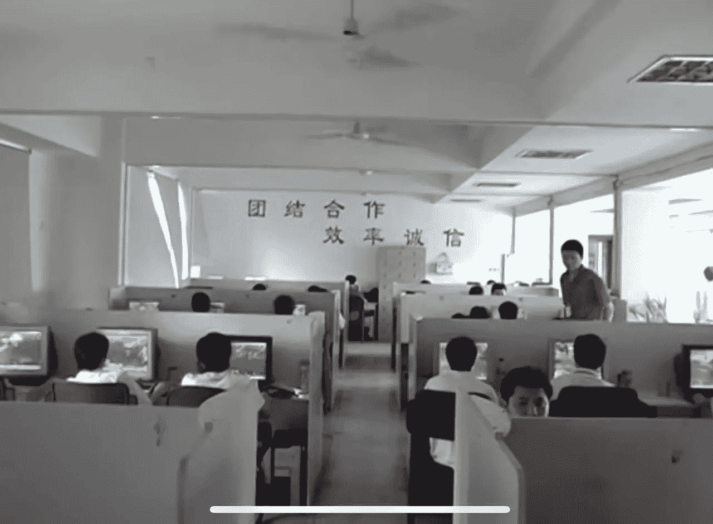
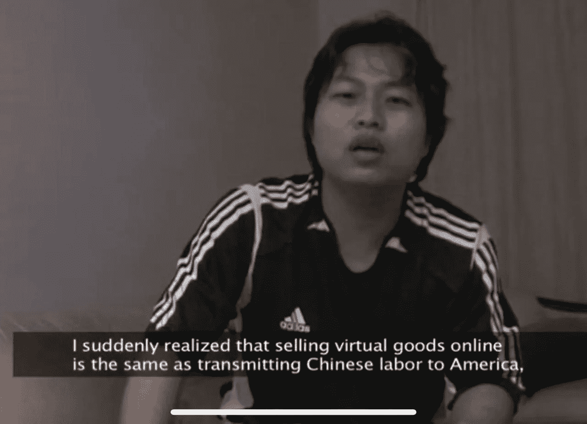
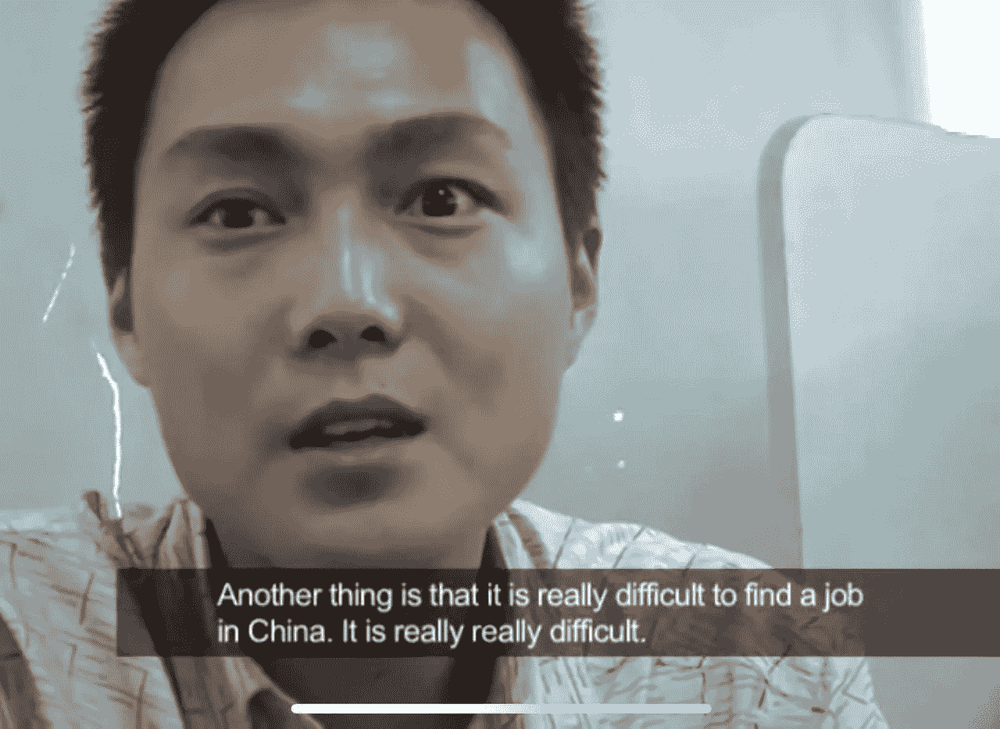
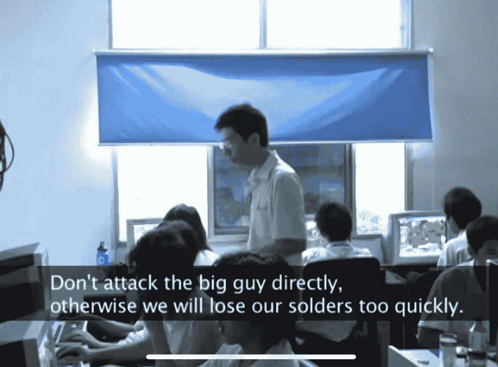

# 网络 3 和魔兽世界第二部分——中国淘金者

> 原文：<https://medium.com/coinmonks/web-3-dna-and-world-of-warcraft-part-2-chinese-gold-farmers-b71b1e7b5ac6?source=collection_archive---------29----------------------->

我登录了我的魔兽世界账户，发现我的 80 级战士一丝不挂地坐在暴风城。我的用户界面看起来不一样了…我打开了所有的包…都不见了…我拥有和收藏了 4 年的所有东西都被卖掉了。在我的金卡上，我看到 7000 块黄金。那是几个月的黄金耕种。就像我醒来时发现一堆偷来的钱。黑客们利用我的账户作为摇钱树，将黄金兑换成现金。他们卖掉了我所有的东西，在我的账户上增加了更多的黄金，并准备进行一笔大交易。我立即联系了一个服务器管理员，但在他恢复我的账户之前，我去拿了一个 5000 金的史诗坐骑…我对从黑客那里偷东西没有任何罪恶感。这是我第一次接触中国的淘金者，也是我第一次接触一种经济模式，这种模式最终成为了 Web 3 中游戏赚钱模式的基础。

早在 P2E 和 Gamefi 成为流行词汇之前，人们就有办法将现实世界的货币兑换成数字货币。它开始于像天堂 2 这样的旧 MMORPGs，然后随着魔兽世界成为一个更成熟的行业。Youtube 上有一个十年前的系列节目，名为“黄金农民第 1、2 和 3 部分”，讲述了中国黄金农民的模糊世界，以及他们作为职业劳工为 MMORPG 西部玩家服务的生活。

“我突然意识到，在网上卖虚拟商品和把中国劳动力输送到美国是一样的。”—牵引带

职业淘金是指你有一个玩家在游戏中专门为了获得黄金和物品而杀死敌人的暴徒，他们打算将这些物品转售给其他玩家以换取现实世界的现金。大量的农业生产将会在海外世界的贫困地区进行。这些地区的玩家发现，种植魔兽世界黄金并将其出售给西方玩家可以获得丰厚的利润。在中国浙江省等地设立了完整的办公室，职业玩家将在那里协调努力以获得金牌。虽然他们的生活方式看起来并不迷人，但动机是明确的。

“在中国很难找到工作。真的真的很难。作为一名职业游戏玩家，你可以有一份收入，虽然不多，但仍然是一件快乐的事情。”

当时，暴雪不支持玩家直接购买黄金的任何方式，鉴于这些交易的非法性质，真正的货币交易将主要通过粗略的网站进行。中国的农业账号经常会被封禁，很多农民求助于黑掉西方玩家，并利用他们的角色作为金骡子。我的账户和我经历的黑客攻击就是如此。

不管你喜不喜欢，这整个经济是先玩后赚模式的先驱，现在这种模式越来越容易通过 Web 3 获得。

WoW 的许多方面影响了 Web 3 的构建方式，这在一篇文章中是无法涵盖的。这是 Web 3 DNA 和魔兽世界系列的第 2 部分。

感谢您的阅读。

查看我的 Web 3 之旅:

[https://twitter.com/wasifmrahman](https://twitter.com/wasifmrahman)

在 LinkedIn 上关注我:

 [## Wasif Rahman -营销伙伴关系总监- Ex Populus | LinkedIn

### 查看 Wasif Rahman 在全球最大的职业社区 LinkedIn 上的个人资料。Wasif 有 4 个工作列在他们的…

www.linkedin.com](https://www.linkedin.com/in/wasif-rahman-91114a85/) 

我的 Web 3 淋浴想法:

 [## 瓦西夫·拉赫曼-中号

### 阅读瓦西夫·拉赫曼在媒介上的作品。Web 3 德根 Ex Populus 营销伙伴关系总监。每天…

medium.com](/@wasifmrahman) 

阅读第 1 部分:灵魂绑定

 [## Web 3 的 DNA 和魔兽世界第一部分——灵魂绑定

### 我从大学开始就试图超越书呆子游戏玩家的刻板印象。这一年我将变得更好相处…

medium.com](/@wasifmrahman/web-3s-dna-and-world-of-warcraft-part-1-soulbound-e53d85af4fbf) 

阅读第 3 部分:有组织的网络流氓

 [## 网络 3 DNA 和魔兽世界第 3 部分-有组织的网上歹徒

### 你发现自己在经典 WoW 的 Un Goro 火山口。你正在猎杀传说中的恶魔龙，为它剥皮…

medium.com](/@wasifmrahman/web-3-dna-and-world-of-warcraft-part-3-organized-online-gangsters-92d9d68f9038) 

阅读第 4 部分:从游戏公会到 Web 3 社区

 [## Web 3 DNA 和魔兽世界第 4 部分——从游戏公会到 Web 3 社区

### 我记得我魔兽世界职业生涯中最难忘的一天。我已经成功地带领我的公会通过了整个…

medium.com](/@wasifmrahman/web-3-dna-and-world-of-warcraft-part-4-from-gaming-guilds-to-web-3-communities-3efc3b5b8674) 

阅读第五部分:DKP 和代币经济学

 [## 网络 3 和魔兽世界第五部分——DKP 和代币经济

### 经过一场艰苦的战斗，我们终于拿下了霜龙 Syndragosa，然后我见到了阿尔萨斯，巫妖王…

medium.com](/@wasifmrahman/web-3-and-world-of-warcraft-part-5-dkp-and-token-economies-9b2b314b7bef) 

阅读:高潮与低谷:网络 3 的一年

 [## 高潮与低谷:Web 3 的一年

### 我在去年 6 月 22 日买了我的第一个密码。我清楚地记得这是自加密以来的第一次重大下跌…

medium.com](/@wasifmrahman/the-highs-and-lows-a-year-in-web-3-eed764aa6efb) 

你可以在这里看到关于黄金农民的整个系列:

第一部分:

第二部分:

第三部分:

> 加入 Coinmonks [电报频道](https://t.me/coincodecap)和 [Youtube 频道](https://www.youtube.com/c/coinmonks/videos)了解加密交易和投资

# 另外，阅读

*   [WazirX vs coin dcx vs bit bns](/coinmonks/wazirx-vs-coindcx-vs-bitbns-149f4f19a2f1)|[block fi vs coin loan vs Nexo](/coinmonks/blockfi-vs-coinloan-vs-nexo-cb624635230d)
*   [本地比特币评论](/coinmonks/localbitcoins-review-6cc001c6ed56) | [加密货币储蓄账户](https://coincodecap.com/cryptocurrency-savings-accounts)
*   [什么是融资融券交易](https://coincodecap.com/margin-trading) | [美元成本平均法](https://coincodecap.com/dca)
*   [拥护卡审核](https://coincodecap.com/uphold-card-review) | [信任钱包 vs MetaMask](https://coincodecap.com/trust-wallet-vs-metamask)
*   [Exness 评测](https://coincodecap.com/exness-review)|[moon xbt Vs bit get Vs Bingbon](https://coincodecap.com/bingbon-vs-bitget-vs-moonxbt)
*   [如何开始通过加密贷款赚取被动收入](https://coincodecap.com/passive-income-crypto-lending)