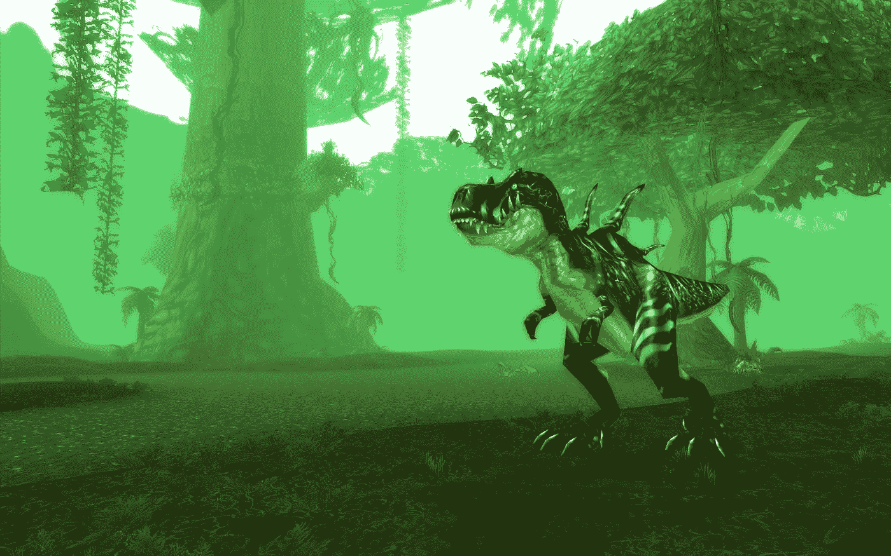
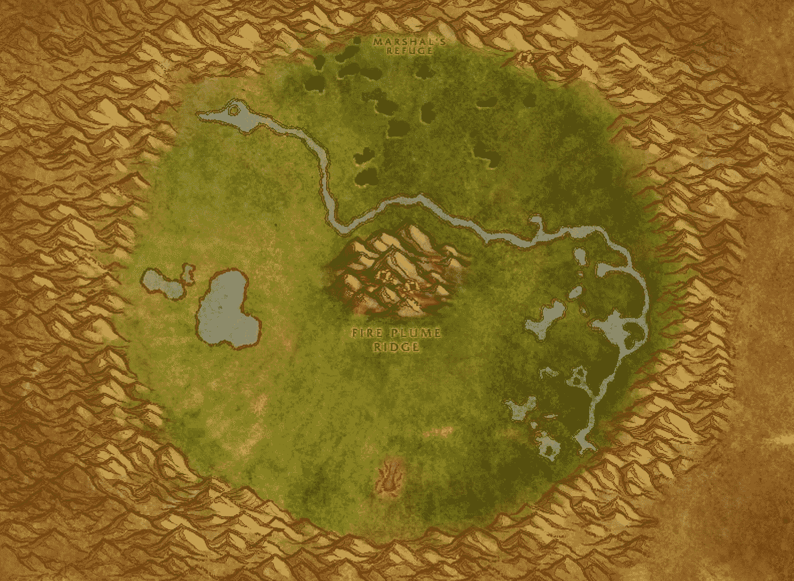

# 网络 3 和魔兽世界第三部分——有组织的网络流氓

> 原文：<https://medium.com/coinmonks/web-3-dna-and-world-of-warcraft-part-3-organized-online-gangsters-92d9d68f9038?source=collection_archive---------46----------------------->

你发现自己在经典 WoW 的 Un Goro 火山口。你正在猎杀传说中的恶魔龙，用它的皮制作恶魔龙皮革，这是魔兽世界最终游戏内容的关键制作材料。突然你的角色被一群敌方玩家攻击。你被杀了又杀，一次又一次。他们在给你产卵。沮丧之余，你向你的公会寻求帮助。你的公会成员响应号召，出现并发现一群非常强大的敌人玩家。一场小冲突爆发了。他们的配合无与伦比，你的公会全军覆没。

事实证明，服务器上没有人能够成功地养殖恶魔龙皮革。整个地区都在一个中国金矿集团的控制之下。这是一个关于有组织的玩家团体如何操纵 WoW 的经济来赚钱的故事。

“这只是一份工作。只要不道德，我们如何赚钱并不重要。”—明庆海

在我的上一篇文章中，我报道了中国的金农以及“真实货币交易”RMT 是 GameFi 的早期版本之一。今天我们将讲述这些淘金团体是如何演变成有组织的网络犯罪团伙的。策略很简单。农民们会开拓领地，封锁整个地区，杀死任何入侵者，所有的目的都是为了在恩戈罗陨石坑养殖恶魔龙。

然后，农民们会联合起来操纵服务器的拍卖行，将 Devilsaur 皮革的统一价格定在 20-30 黄金。想要这种价值不菲的工艺品的玩家别无选择，只能支付额外费用。使用这种方法，农民可以从黄金中获得巨额利润，然后可以与绝望的玩家交换现实世界的现金。服务器上的玩家很可能会诉诸真钱交易来购买极难耕种的恶魔龙皮革。这是一个完美的循环。

Julian Dibbell author of Play Money

“当你有…不是真正玩家的农民…一个帐号将会一天 24 小时被使用…以正常人无法玩游戏的方式。这往往会扭曲经济。这产生了比经济设计吸收的更多的黄金，导致了通货膨胀。”—朱利安·迪贝尔

电子游戏经济体用货币汇来平衡货币分配，以维持平衡。然而，精明的团体可以很容易地找到操纵游戏经济的方法。这种做法加上游戏内货币的真实货币交换会导致猖獗的通货膨胀和不尽如人意的玩家体验。

当游戏经济开始被金农操纵，它就不再是游戏了吗？魔兽世界是一个让你在艾泽拉斯冒险的地方，还是中国职业玩家谋生的一种方式？

WoW 的许多方面影响了 Web 3 的构建方式，这在一篇文章中是无法涵盖的。这是 Web 3 DNA 和魔兽世界系列的第 3 部分。

感谢您的阅读。

查看我的 Web 3 之旅:

[https://twitter.com/wasifmrahman](https://twitter.com/wasifmrahman)

在 LinkedIn 上关注我:

 [## Wasif Rahman -营销伙伴关系总监- Ex Populus | LinkedIn

### 查看 Wasif Rahman 在全球最大的职业社区 LinkedIn 上的个人资料。Wasif 有 4 个工作列在他们的…

www.linkedin.com](https://www.linkedin.com/in/wasif-rahman-91114a85/) 

我的 Web 3 淋浴想法:

 [## 瓦西夫·拉赫曼-中号

### 阅读瓦西夫·拉赫曼在媒介上的作品。Web 3 德根 Ex Populus 营销伙伴关系总监。每天…

medium.com](/@wasifmrahman) 

阅读第 1 部分:灵魂绑定

 [## Web 3 的 DNA 和魔兽世界第一部分——灵魂绑定

### 我从大学开始就试图超越书呆子游戏玩家的刻板印象。这一年我将变得更好相处…

medium.com](/@wasifmrahman/web-3s-dna-and-world-of-warcraft-part-1-soulbound-e53d85af4fbf) 

阅读第二部分:中国淘金者

 [## Web 3 DNA 和魔兽世界第二部分——中国淘金者

### 我登录了我的魔兽世界账户，发现我的 80 级战士一丝不挂地坐在暴风城。我的用户界面看起来不一样…我…

medium.com](/@wasifmrahman/web-3-dna-and-world-of-warcraft-part-2-chinese-gold-farmers-b71b1e7b5ac6) 

阅读第 4 部分:从游戏公会到 Web 3 社区

 [## Web 3 DNA 和魔兽世界第 4 部分——从游戏公会到 Web 3 社区

### 我记得我魔兽世界职业生涯中最难忘的一天。我已经成功地带领我的公会通过了整个…

medium.com](/@wasifmrahman/web-3-dna-and-world-of-warcraft-part-4-from-gaming-guilds-to-web-3-communities-3efc3b5b8674) 

阅读第五部分:DKP 和代币经济学

 [## 网络 3 和魔兽世界第五部分——DKP 和代币经济

### 经过一场艰苦的战斗，我们终于拿下了霜龙 Syndragosa，然后我见到了阿尔萨斯，巫妖王…

medium.com](/@wasifmrahman/web-3-and-world-of-warcraft-part-5-dkp-and-token-economies-9b2b314b7bef) 

阅读:高潮与低谷:网络 3 的一年

 [## 高潮与低谷:Web 3 的一年

### 我在去年 6 月 22 日买了我的第一个密码。我清楚地记得这是自加密以来的第一次重大下跌…

medium.com](/@wasifmrahman/the-highs-and-lows-a-year-in-web-3-eed764aa6efb) 

> 加入 Coinmonks [电报频道](https://t.me/coincodecap)和 [Youtube 频道](https://www.youtube.com/c/coinmonks/videos)了解加密交易和投资

# 另外，阅读

*   [3 商业评论](/coinmonks/3commas-review-an-excellent-crypto-trading-bot-2020-1313a58bec92) | [Pionex 评论](https://coincodecap.com/pionex-review-exchange-with-crypto-trading-bot) | [Coinrule 评论](/coinmonks/coinrule-review-2021-a-beginner-friendly-crypto-trading-bot-daf0504848ba)
*   [莱杰 vs n rave](/coinmonks/ledger-vs-ngrave-zero-7e40f0c1d694)|[莱杰 nano s vs x](/coinmonks/ledger-nano-s-vs-x-battery-hardware-price-storage-59a6663fe3b0) | [币安评论](/coinmonks/binance-review-ee10d3bf3b6e)
*   [加密交易机器人](/coinmonks/crypto-trading-bot-c2ffce8acb2a) | [Bingbon 审查](https://coincodecap.com/bingbon-review)
*   [Bybit Exchange 评论](/coinmonks/bybit-exchange-review-dbd570019b71) | [Bityard 评论](https://coincodecap.com/bityard-reivew) | [Jet-Bot 评论](https://coincodecap.com/jet-bot-review)
*   [3 commas vs crypto hopper](/coinmonks/3commas-vs-pionex-vs-cryptohopper-best-crypto-bot-6a98d2baa203)|[赚取加密利息](/coinmonks/earn-crypto-interest-b10b810fdda3)