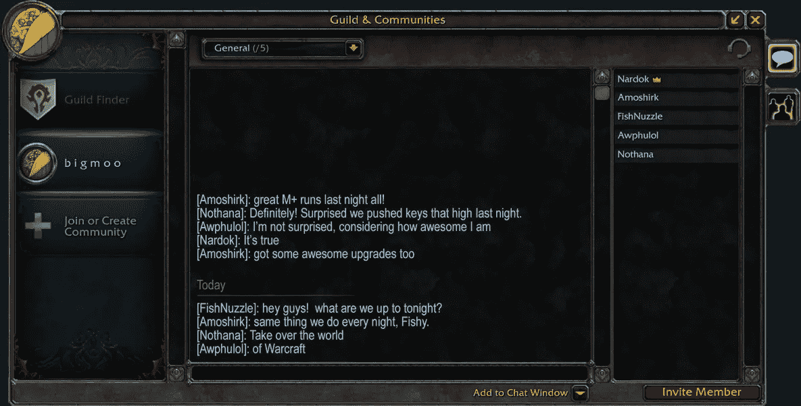

# Web 3 和魔兽世界第四部分——从游戏公会到 Web 3 社区

> 原文：<https://medium.com/coinmonks/web-3-dna-and-world-of-warcraft-part-4-from-gaming-guilds-to-web-3-communities-3efc3b5b8674?source=collection_archive---------33----------------------->

我记得我魔兽世界职业生涯中最难忘的一天。我成功地带领我的公会穿越了整个纳克萨玛斯。这是我们公会的第一次。我没有赢得任何战利品，但是在突袭之后，我们的公会会长将我提升为突袭将军。在我的职业生涯中，我已经被提升了很多次，但成为我的魔兽公会的新队长感觉更特别。

如果你追溯得足够远，你可以找到从 MMORPGs 到现代 Web 3 社区(如 NFT 集体和 DAOs)之间的联系。从本质上讲，它们都有两个共同点:一个群聊和一个集体银行账户。

游戏集体已经存在了很长时间，但随着 MMORPGs 的兴起，它们真正成为了游戏的核心特征。公会是玩家的集合，他们在一面旗帜下协调处理游戏中的各种元素。这些计划包括升级，结束游戏突袭，甚至 pvp 战斗。WoW 需要玩家之间的大量协调，游戏公会成为任何寻求进步的人的体验中不可或缺的一部分。

Guild Chat

鉴于游戏公会的重要性，WoW 直接在游戏中实现了公会工具。WoW 中的玩家可以创建一个公会，用名字+图标标记它，并招募其他玩家。公会通常使用游戏中的公会聊天来协调，并使用公会银行来资助计划，会员可以在公会银行存取黄金和游戏中的物品。公会银行通常由官员管理，规则可以围绕公会资产的使用来制定。更先进的游戏公会有网站，包括论坛，购物中心，袭击日历，和他们的 DKP 结构…他们几乎类似于正式的组织。

WoW Guild Website from 2008

公会工具支持创建许多新的在线社区，包括治理结构和数字资产库。在许多方面，现代的道社区和社区以相似的方式运作。这些 Web 3 社区通常围绕着一个目的联合在一起。然后，他们将筹集资金并部署资产以实现他们的目标。所有这些都可以通过投票和智能合同的执行以分散的方式发生。这使得数字集体能够筹集资金并实现更大的目标，而无需创建正式的公司或组织。

Guild Bank — Raid Supply

许多道和 NFT 集体最终发展成正式组织，以便符合法律规定。然而，Web 3 为数字社区的形成、组织和融资提供了分散的基础设施，这仍然是值得注意的。

WoW 的很多方面都影响了 Web 3 的构建方式，这在一篇文章中是无法涵盖的。这是 Web 3 DNA 和魔兽世界系列的第 4 部分。

感谢您的阅读。

查看我的 Web 3 之旅:

[https://twitter.com/wasifmrahman](https://twitter.com/wasifmrahman)

在 LinkedIn 上关注我:

 [## Wasif Rahman -营销伙伴关系总监- Ex Populus | LinkedIn

### 查看 Wasif Rahman 在全球最大的职业社区 LinkedIn 上的个人资料。Wasif 有 4 个工作列在他们的…

www.linkedin.com](https://www.linkedin.com/in/wasif-rahman-91114a85/) 

我的 Web 3 淋浴想法:

 [## 瓦西夫·拉赫曼-中号

### 阅读瓦西夫·拉赫曼在媒介上的作品。Web 3 德根 Ex Populus 营销伙伴关系总监。每天…

medium.com](/@wasifmrahman) 

阅读第 1 部分:灵魂绑定

 [## Web 3 的 DNA 和魔兽世界第一部分——灵魂绑定

### 我从大学开始就试图超越书呆子游戏玩家的刻板印象。这一年我将变得更好相处…

medium.com](/@wasifmrahman/web-3s-dna-and-world-of-warcraft-part-1-soulbound-e53d85af4fbf) 

阅读第二部分:中国淘金者

 [## Web 3 DNA 和魔兽世界第二部分——中国淘金者

### 我登录了我的魔兽世界账户，发现我的 80 级战士一丝不挂地坐在暴风城。我的用户界面看起来不一样…我…

medium.com](/@wasifmrahman/web-3-dna-and-world-of-warcraft-part-2-chinese-gold-farmers-b71b1e7b5ac6) 

阅读第 3 部分:有组织的网络流氓

 [## 网络 3 DNA 和魔兽世界第 3 部分-有组织的网上歹徒

### 你发现自己在经典 WoW 的 Un Goro 火山口。你正在猎杀传说中的恶魔龙，为它剥皮…

medium.com](/@wasifmrahman/web-3-dna-and-world-of-warcraft-part-3-organized-online-gangsters-92d9d68f9038) 

阅读第五部分:DKP 和代币经济学

 [## 网络 3 和魔兽世界第五部分——DKP 和代币经济

### 经过一场艰苦的战斗，我们终于拿下了霜龙 Syndragosa，然后我见到了阿尔萨斯，巫妖王…

medium.com](/@wasifmrahman/web-3-and-world-of-warcraft-part-5-dkp-and-token-economies-9b2b314b7bef) 

阅读:高潮与低谷:网络 3 的一年

 [## 高潮与低谷:Web 3 的一年

### 我在去年 6 月 22 日买了我的第一个密码。我清楚地记得这是自加密以来的第一次重大下跌…

medium.com](/@wasifmrahman/the-highs-and-lows-a-year-in-web-3-eed764aa6efb) 

> 加入 Coinmonks [电报频道](https://t.me/coincodecap)和 [Youtube 频道](https://www.youtube.com/c/coinmonks/videos)了解加密交易和投资

# 另外，阅读

*   [比斯勒评论](https://coincodecap.com/bitsler-review)|[WazirX vs coin switch vs coin dcx](https://coincodecap.com/wazirx-vs-coinswitch-vs-coindcx)
*   [7 大副本交易平台](https://coincodecap.com/copy-trading-platforms) | [BuyCoins 点评](https://coincodecap.com/buycoins-review)
*   [XT.COM 评论](https://coincodecap.com/profittradingapp-for-binance)币安评论 |
*   [SmithBot 评论](https://coincodecap.com/smithbot-review) | [4 款最佳免费开源交易机器人](https://coincodecap.com/free-open-source-trading-bots)
*   [杠杆代币](/coinmonks/leveraged-token-3f5257808b22) | [最佳密码交易所](/coinmonks/crypto-exchange-dd2f9d6f3769) | [Paxful 点评](/coinmonks/paxful-review-4daf2354ab70)
*   [加密套利](/coinmonks/crypto-arbitrage-guide-how-to-make-money-as-a-beginner-62bfe5c868f6)指南| [如何做空比特币](/coinmonks/how-to-short-bitcoin-568a2d0b4ae5)