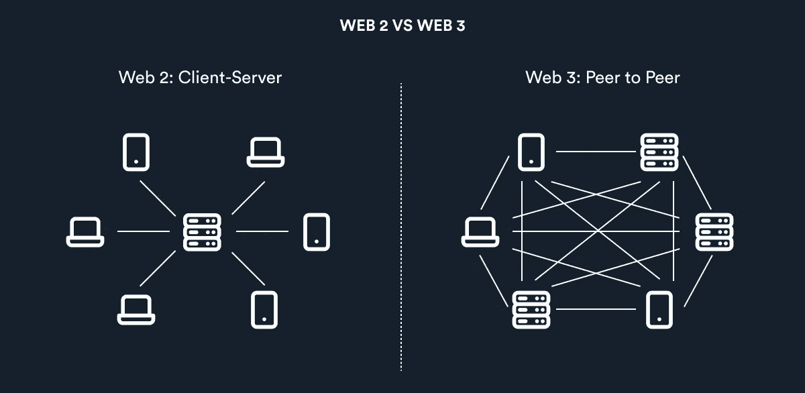

# Web 3，Web 2 et Web 1；初学者的观点

> 原文：<https://medium.com/coinmonks/web-3-et-al-web-2-a-beginners-view-dc97220fef56?source=collection_archive---------52----------------------->

有很多关于 web 3.0 及其将给行业带来的巨大变化的讨论，但很少有人真正理解它为什么会发生以及它将意味着什么。为了理解这一点，有必要回到过去，看看它的祖先 Web 1.0 和 2.0。

万维网的起源始于 1989 年英国计算机科学家蒂姆·伯纳斯·李爵士与罗伯特·卡里奥共同发明了万维网。他发现不同计算机上的文档可以通过超链接互连，并可以通过互联网访问，超文本传输协议(HTTP)可用于传输 web 资源，用户可以通过称为 web 浏览器的软件应用程序访问这些资源，并通过称为 Web 服务器的软件应用程序发布这些资源。万维网是建立在互联网的基础上的，互联网比万维网早了二十多年。他在 1990 年编写了第一个网络浏览器，由此诞生了第一个网络版本，我们称之为 web 1。

Web 1.0 直到死亡才被赋予名称，很像中世纪。当时人们所知的“万维网”只不过是一堆静态网页，包含大量信息，但没有交互功能。连接意味着使用不稳定的调制解调器，并阻止房子里的其他人使用电话。那是美国在线聊天室和 MSN messenger 的互联网，是 AltaVista 和 Ask Jeeves 的互联网，是 AltaVista 和 Ask Jeeves 的互联网。它慢得令人难以忍受。流媒体音乐和视频？别提了。下载一首歌至少要花一天时间。Web 1 基本上只是一个内容交付网络(CDN ),能够在网站上展示信息。

# **Web 2.0 开始**

记忆迟钝的用户界面大多已经褪色。更快的互联网连接为互动内容扫清了道路；网络不再是观看和阅读，而是参与。“社交媒体”时代始于全球信息交流。Youtube、维基百科、Flickr 和脸书为无声者提供了声音，并为志同道合的社区提供了繁荣的平台。

我将花 30 秒的时间来发表这篇博文，这是一个显著的进步，因为在过去，做一个简单的网站更改需要设计师、开发人员和管理员之间的协调努力。这是一个读写出版的时代，传播信息就像说这三个字一样简单。

Web 2.0 有一个弱点，听起来很棒。

**数据隐私和所有权**

互联网用户的数量开始大幅增长，这又增加了每天实现的数据量。大型数字公司开始发现个人数据是非常有价值的资产。结果，大量数据开始存储在中央服务器中，亚马逊、脸书和 Twitter 成为主要保管者。人们为了这些服务的便捷性放弃了安全性，他们的身份、浏览习惯、搜索和在线购买信息都被出售给了出价最高的人，不管他们是否意识到这一点。

**安全**

Web 2 是集中式的，因为它具有单个控制点和单个数据源。如果出现安全问题，网络将会离线，人们可能会丢失有价值的信息。即使是大型数字组织的集中式服务器也会不时停机，这可能会扰乱人们的日常活动。

# **Web 3.0 开始**

虽然 Web 2.0 有助于许多权力结构的民主化和创造新的可能性，但经济引擎大多是私人的和垄断的。脸书、优步和 AirBnB 已经为它们控制的公共基础设施开发了专用网络。Web 3.0 与此截然相反，几个利润中心通过开放的网络交换价值。
不难预见，在不久的将来，基于密码的电话、虚拟专用网络、分散存储和加密货币钱包将变得司空见惯。一个不需要网络和手机运营商停止或监控我们数据的未来。如果我们不想梦游进入黑镜式的隐私反乌托邦，这些就是我们需要的工具。

Web 3.0 代表了 web/Internet 发展的下一个迭代或阶段，可能会像 Web 2.0 一样具有破坏性，代表着一个巨大的范式转变。Web 3.0 建立在去中心化、开放性和更大的用户效用的核心概念之上。

# **一个分散的未来**

Major Difference between web3 and web2

web2 和 web3 之间的主要区别是 web3 的去中心化性质，其中，不是具有包含用户在特定平台上促进的所有数据的中央数据库，而是数据在用户的移动设备上沿着用户分布，每个人在他或她的设备(节点)上具有数据库的一部分。Web 3.0 旨在通过让每个人选择如何查看和利用自己的数据，赋予个人更多权力，类似于互联网的民主化。

我是 B [lockgames](http://www.blockgames.gg) 的区块链实习生，感谢 [ZuriTeam](https://zuri.team) 和 [Nestcoin](https://nestcoin.com/)

> 加入 Coinmonks [电报频道](https://t.me/coincodecap)和 [Youtube 频道](https://www.youtube.com/c/coinmonks/videos)了解加密交易和投资

# 另外，阅读

*   [Bookmap 点评](https://coincodecap.com/bookmap-review-2021-best-trading-software) | [美国 5 大最佳加密交易所](https://coincodecap.com/crypto-exchange-usa)
*   最佳加密[硬件钱包](/coinmonks/hardware-wallets-dfa1211730c6) | [Bitbns 评论](/coinmonks/bitbns-review-38256a07e161)
*   [新加坡十大最佳加密交易所](https://coincodecap.com/crypto-exchange-in-singapore) | [购买 AXS](https://coincodecap.com/buy-axs-token)
*   [红狗赌场评论](https://coincodecap.com/red-dog-casino-review) | [Swyftx 评论](https://coincodecap.com/swyftx-review) | [CoinGate 评论](https://coincodecap.com/coingate-review)
*   [投资印度的最佳密码](https://coincodecap.com/best-crypto-to-invest-in-india-in-2021)|[WazirX P2P](https://coincodecap.com/wazirx-p2p)|[Hi Dollar Review](https://coincodecap.com/hi-dollar-review)