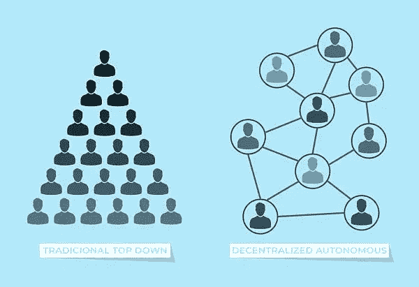
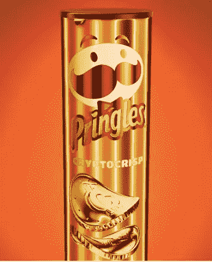
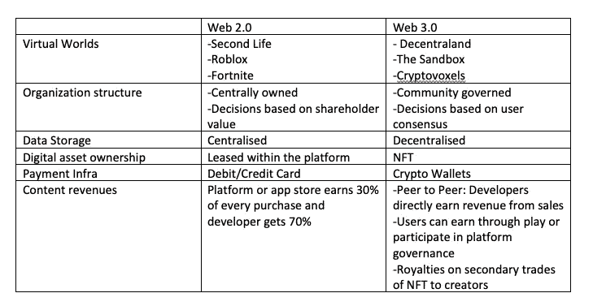

# 网络 3 傻瓜:快速阅读让你跟上速度！

> 原文：<https://medium.com/coinmonks/web-3-for-dummies-de23ff218074?source=collection_archive---------14----------------------->

它是什么，为什么重要？

Web 1 -开放协议(HTTP，IP)这是互联网生态系统建立的时候。

**Web 2** -互联网开放协议之上的封闭协议，这是一个集中化的时期，facebook、google、Amazon 都是在这个时期建立的。这些被称为集中式平台。

**Web 2 的问题**——“如果你不付钱，你就不是顾客。你是产品”。例如，个人不会为 gmail 向谷歌付费，而是根据用户收集的数据，向其投放广告。

-拥有网络的公司在一些重要问题上拥有单方面的权力，如谁获得网络访问权、收入如何分配、屏蔽谁的声音、支持哪些功能、用户数据的安全性如何。

-集中式平台不断改变规则，这成为创作者的问题，因为平台夺走了观众和利润。例如:在 youtube 上赚钱变得越来越难，亚马逊删除了该产品经过验证的评论。

**为什么没有分散的平台？**

分散网络的问题:分散网络是公共产品。如果没有中央权力来控制决策和获取利润，就很难激励维护和开发。

Crypto 通过分散协调和为发展提供经济激励来解决这个问题。

Web 3 :社区因维护和开发核心基础设施而受到激励和奖励。

将权力交到社区和企业手中。

# **DAOs-分散自治组织**

Dao 是由会员拥有的在线社区，由会员的共识而不是集中的领导来管理。

分散式——规则不能由单个个人或中央集权的一方来改变。

自主——根据写入智能合同的逻辑计算票数并实施决策，无需人工干预。

组织——在分散的利益相关者社区中协调活动的实体

这类似于雇员拥有的企业，如 Dabbawala、印度的印度咖啡屋或 Publix 杂货店和绿湾包装工。道组织的原则与非营利组织、集体组织和合作社的原则相似。

在传统的公司治理中，公司有章程规定诸如如何选举董事会等政策。通过将策略编码到智能契约中，DAO 将这一概念扩展到了数字世界。智能合同就像在区块链网络上运行的法律合同，它们是写入计算机代码的承诺，可以自动、自主地执行。

# **去中心化融资**

DeFi 指的是分散的金融，如储蓄、贷款和交换

# **dApps-分散式应用**

dApps 是计算机应用程序，其代码是用一系列智能合约编写的。一系列智能合约被称为协议。dApps 是永久的，而常规应用不是，只要托管协议(一系列智能合约)的区块链存在，它们就将存在，并且不能被改变或操纵。它们是开放的，这意味着任何计算机都可以加入网络，并且访问不限于单个/预定义的组。

# **支付区块链**

支付区块链支持点对点数字交易。所有交易记录都在区块链分类帐中更新，并且不能更改。到目前为止，银行和信用卡公司是所有交易的集中记录者，无论是 Paytm 还是 Venmo。

# **加密货币**

密码是被认为是系统内的记账单位、价值存储和交换媒介的货币。没有集中的第三方，资金可以进行数字转移。

加密允许低成本、即时、无边界、点对点的实际价值转移。不受传统金融机构规则的约束。对于农民工来说，手机钱包将使汇款回家更便宜。加密为金融可及性带来了更多的多样性和包容性。全球仍有 20 亿人没有银行账户。

Paytm、Googlepay、Venmo 等金融科技公司彻底改变了客户金融的前端，DeFi 彻底改变了后端，如审计、使用、访问、更便宜和更快的支付。

# **Stablecoins**

稳定币是一种私人发行的加密货币，相对于另一种资产(如美元或黄金)保持稳定的价值。Stablecoins 已经获得了牵引力，因为他们试图提供两个世界的最佳即时处理，安全，隐私和稳定的估价。比特币和以太坊可能会在一天内经历巨大的价格波动，stablecoins 旨在保持价格不变。这使得稳定的硬币成为有效的交换媒介。

**CBDC-中央银行数字货币-** 提供稳定硬币的好处，但不能解决隐私和安全问题。

# **创造者经济/NFT**

创作者经济指的是创作者的新兴社区——艺术家、音乐、“如何做”创作者——他们可以直接与支持者和粉丝联系，而无需像 Youtube 这样的中间人。这有助于创作者开发独立的收入来源。

NFT-不可替代令牌

NFT 是一种不可替代的数字资产，这意味着财产是一种独特的商品，艺术品，收藏品等，并因其独特性而实现其价值，例如一件房地产。NFT 是可以交换的。

Z 世代想要拥有一个数字版本的实物资产，如书籍、照片、电影。NFT 为你提供了与实物商品相似的控制权——你可以转让、出售、抵押、借出和自己持有。NFT 的早期用例是数字艺术、游戏、体育和收藏品。NFT 为创作者提供赚钱的方法，绕过传统的把关者，让粉丝直接获得内容。创作者可以直接出售作品，不需要依靠中间商。NFT 提供了一个独特的好处，跟踪资产的二次销售，帮助艺术家赚取佣金。

# **玩赚取游戏**

基于区块链的游戏(Axie Infinity，分散的土地，沙盒)和其他流行的游戏(堡垒之夜，Roblox)之间的关键区别是，在基于区块链的游戏中，玩家实际上拥有对象，努力获得对象，购买或出售对象。区块链电子游戏中的工具、升级、头像和经验值等物品是 NFT，归玩家所有，在现实世界中出售，在二级市场上交易，并在游戏之间转移。在 Axie Infinity，人们可以通过玩电子游戏赚取真实世界的钱。

# **元宇宙**

元宇宙是现实生活和数字生活的无缝融合，创造了一个统一的虚拟社区来工作、娱乐、休闲和社交。

数字时代的元素正在大规模融合。元宇宙是将这些元素整合到统一的沉浸式体验中的驱动力。进入元宇宙的公司有沃尔玛、耐克、Gap、威瑞森、普华永道、阿迪达斯等。

> 加入 Coinmonks [电报频道](https://t.me/coincodecap)和 [Youtube 频道](https://www.youtube.com/c/coinmonks/videos)了解加密交易和投资

# 另外，阅读

*   [Bookmap 评论](https://coincodecap.com/bookmap-review-2021-best-trading-software) | [美国 5 大最佳加密交易所](https://coincodecap.com/crypto-exchange-usa)
*   最佳加密[硬件钱包](/coinmonks/hardware-wallets-dfa1211730c6) | [Bitbns 评论](/coinmonks/bitbns-review-38256a07e161)
*   [新加坡十大最佳加密交易所](https://coincodecap.com/crypto-exchange-in-singapore) | [购买 AXS](https://coincodecap.com/buy-axs-token)
*   [红狗赌场评论](https://coincodecap.com/red-dog-casino-review) | [Swyftx 评论](https://coincodecap.com/swyftx-review) | [造币厂评论](https://coincodecap.com/coingate-review)
*   [投资印度的最佳密码](https://coincodecap.com/best-crypto-to-invest-in-india-in-2021)|[WazirX P2P](https://coincodecap.com/wazirx-p2p)|[Hi Dollar Review](https://coincodecap.com/hi-dollar-review)