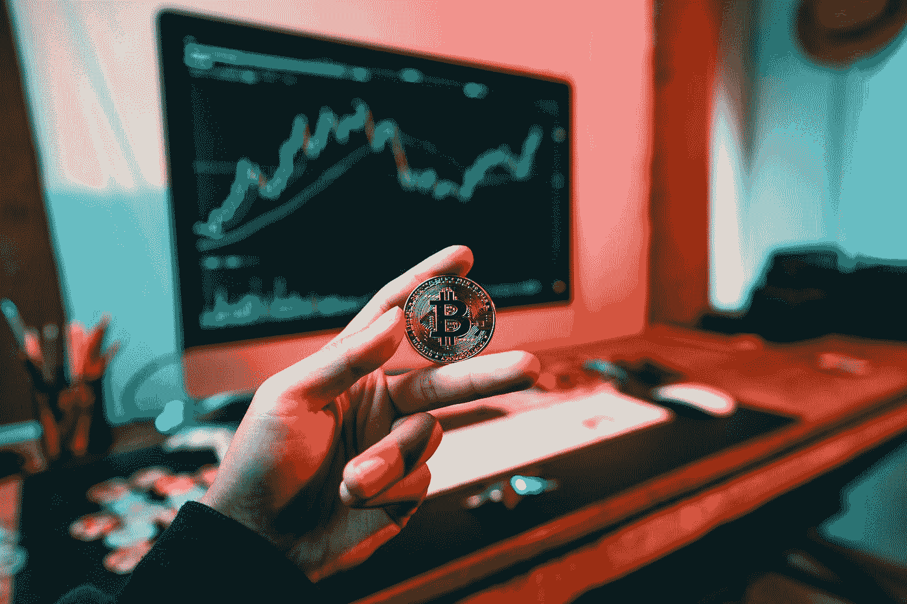

# 开始您的加密/DeFi 之旅的 Web 3 学习资源

> 原文：<https://medium.com/coinmonks/web-3-learning-resources-for-starting-your-crypto-defi-journey-9c33342482d3?source=collection_archive---------24----------------------->

Photo by [Art Rachen](https://unsplash.com/@artrachen?utm_source=medium&utm_medium=referral) on [Unsplash](https://unsplash.com?utm_source=medium&utm_medium=referral)

Crypto 和 DeFi 可能会混淆。当我开始的时候，我被你可以用 crypto 做的大量的交换、池和其他事情弄得不知所措。我试着在 youtube 上阅读和观看了很多视频，但不可否认的是，最好的学习方法是把手弄脏。

> 所以在深入兔子洞之前，你需要**承诺做的第一件事就是**。

**第一步:**注册一个交易所，确保你通过了 KYC 认证，这意味着你的身份得到了验证。这里有一些[链接](https://linktr.ee/nataliekhoo)，如果你注册使用它们的话，它们可以帮助我。

第二步:买一些密码。通过电汇为钱包提供资金要便宜得多。

**第三步:**在 Metamask 上创建钱包。当你这样做的时候，创建其他钱包(BNB 链，开普勒，Fantom，Terra)来体验一下入职是如何变化的。当你想开始涉足 DeFi 时，这将对你有所帮助。

**第四步:**尝试交易！网上有很多教程，像这个[一个](https://decentralizedcreator.com/withdraw-ethereum-from-binance/?amp=1)。我刚刚谷歌了一下。

**第五步**:创建一个 OpenSea 账户，购买一个 NFT，或者你可以浏览一下。

你可以创建许多钱包，所以只需创建一个来测试一下，只保留很少的价值。交易是公开的，可追踪的。

第六步:为被动收入下注，这是我的最爱。我以前在上面写过东西，看看这里的。

现在为一些阅读资源！

# 列表

*   加布·戈德堡的观点阅读清单
*   [Web3 LinkedIn 内容创建者](https://airtable.com/shrPIbJqeJDiTvBN3/tblA3xKgIgYohjqj8/viwjHfHkD5wXecT50)

一个非常好的分类列表，附有摘要和链接。

*   [道斯一炮](https://future.a16z.com/dao-canon/)

为那些寻求理解、建立或参与分散自治组织的人提供的精选资源列表

## 播客

1.  他们自称是“加密金融的终极指南”他们讨论所有 DeFi、NFTs 和加密货币的事情。
2.  蒂姆·费里斯秀:他是《每周 4 小时工作制》的畅销书作家，经常邀请不同领域的人(投资、国际象棋、职业体育等。)，深入挖掘寻找听众可以使用的工具、战术、技巧。

## 时事通讯

1.  [科比](https://cobie.substack.com/):长篇写作，讲述他们对密码、货币、市场等的想法。
2.  [解密](https://decrypt.co/):加密新闻

## 推特用户

1.  [@cobie](https://twitter.com/cobie)
2.  [@ kainne](https://twitter.com/kaiynne)
3.  [@smc90](https://twitter.com/smc90)
4.  [@硬币局](https://twitter.com/coinbureau)
5.  [@blakeaburge](https://twitter.com/blakeaburge)
6.  [@Shaanvp](https://twitter.com/ShaanVP)

## Youtube 教程

1.  [蓝边金融](https://www.youtube.com/c/BlueEdgeFinancial)
2.  [汉弗莱杨](https://www.youtube.com/c/HumphreyYang)
3.  [钱币局](https://www.youtube.com/c/CoinBureau)
4.  [雷神密码](https://www.youtube.com/c/ThorCrypto)
5.  [白板加密](https://www.youtube.com/c/WhiteboardCrypto)

# 奖励:用于更新/洞察的电报组

[树屋洞见](https://t.me/treehouseinsights)

[币安挥挥手](https://t.me/BinanceWaves)

当然，学习 crypto 的方法有很多，随着我们的深入，我可能会编译更多的资源——但这些是在我开始时真正帮助我的几个。

有推荐的就告诉我吧！总是寻求学习。