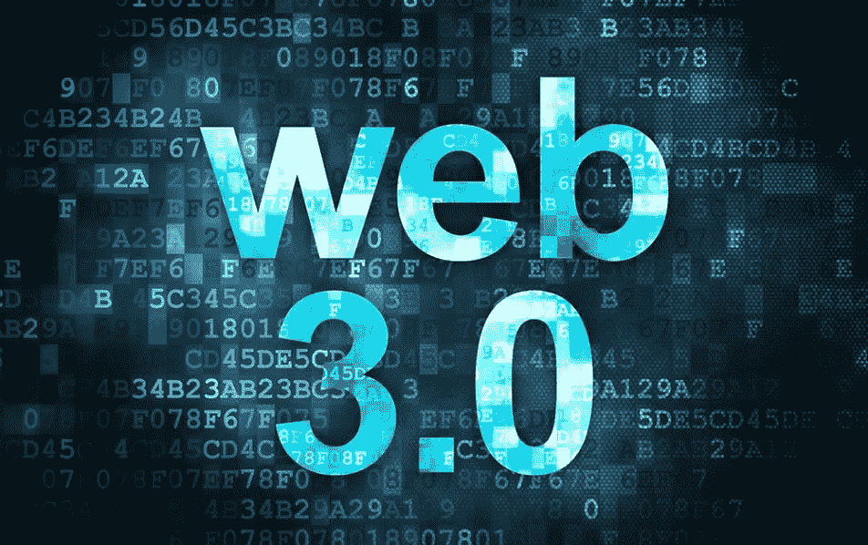

# WEB 3 生存工具包

> 原文：<https://medium.com/coinmonks/web-3-survival-kit-462a7aefaba9?source=collection_archive---------24----------------------->

## 21 世纪 20 年代的生存已经从仅仅有一个睡觉的地方和吃的食物发展到用数字保护我们自己。

世界正以光速前进。你把视线从手机或笔记本电脑屏幕上移开五分钟，砰！城里有一项新技术。跟踪每一项创新变得越来越困难，因为它们不停地向你袭来。

[web 3.0 | Insights](https://guardian.ng/wp-content/uploads/2022/01/web-3.0-Insights-952x598.jpg)

我们看到加密货币、区块链技术、Defi、DAOs 被大量采用，所有这些新技术带来了新的数字威胁。我们现在面临着无数的数字威胁，我们必须准备好征服它们，否则就有失去身份、破产或被黑客攻击的风险。

21 世纪 20 年代不再是计算机怪才和书呆子的时代，而是全人类的时代。如果我们必须生存并参与这个展现在我们眼前的新世界，我们必须采取激烈的措施来保护自己。所以先生们女士们，让我们系好安全带，开始我们的未知之旅。你要么努力，要么回家。

## 那么，你如何跟上这些新的创新，同时保护自己呢？

答案很简单。我们通过拥有自己的 web 3 生存工具包来跟上。这个救生包就像我们在家里都有的急救包一样，唯一的不同是这里没有绷带或膏药，而是有能保护我们安全的技术。我们以毒攻毒。以技术换技术。

## 1:冷藏。

我们救生包的第一项是冷藏。黑客们正在伺机寻找下一个毫无防备的猎物。保护我们的加密货币免受钱包入侵者的攻击现在是一项必备技能。与以前在模拟世界中由一个中央机构负责你银行账户的安全不同，web 3 让用户能够以他们认为合适的方式持有和保护他们的加密钱包，其中一种方法就是冷藏。

冷存储是没有连接到互联网的钱包，它们是加密货币的离线存储。将你的加密货币储存在一个冰冷的钱包里有很多好处，其中一个好处是防止黑客攻击。

## 2:管理您的私钥。

你可能想知道为什么你会看到这个，但 web3 的很大一部分都与加密货币有关。谈论 web 3 而不谈论加密货币几乎是不可能的。它们是一枚硬币的两面。那么什么是私钥管理呢？首先，私钥可以说是一串莫名其妙的字母和数字，当密码被忘记时，它们被某种计算机算法丢弃在一起，以获得对加密钱包的访问权。

私人钥匙就像你放在母亲或朋友那里的备用钥匙，以防你丢失了自己的。既然定义已经出来了，私钥管理就是保护您的备用密钥并知道在哪里保存它们以便于检索和防止钱包入侵者的简单行为。

## 3:加密

你有没有注意到当你要和一个新朋友聊天时看到的 Whatsapp 通知信息？消息是这样的“消息是端到端加密的”。这个世界发展如此之快，以至于一个 10 岁的高中生就能黑进你的信息平台，泄露你的私人聊天记录，给你带来大麻烦。

加密是保护你的信息的过程，这些信息来自那些未经你允许就想看的人。加密已经从保护你的信息发展到做一些复杂和酷的事情，比如验证和证明身份。确保一个人是他们所说的那个人。

## 4:数字作品定位

工作申请和招聘的构造板块正在以令人难以置信的速度移动和变化，因此我们必须改变和移动它。Web3 不仅仅是互联网的未来。这是一切的未来。数字工作定位是必备的生存技能。

如果我们必须生存和发展，我们必须弄清楚在 web3 生态系统中需要和需求的技能，并弄清楚如何为这些技能带来的机会定位自己。去大学学习一门课程几年，然后最终失业的日子已经一去不复返了。在 web3 领域，事情并非如此。你对你感兴趣的领域所需要的技能进行研究，然后努力去做。

## 5: Defi

分散融资是我们 web3 生存套件的重要组成部分。分散式金融将区块链技术的梦想变为现实，即金融交易中第三方的完全分散和消除。Defi 将我们从传统金融机构的束缚和审查中解放出来。学习 Defi 及其工作原理是一项必备的 web3 生存技能。

## 结论

物理边界和地理限制即将成为过去。我们正在进入一个没有许可和边界的经济，任何拥有智能手机和互联网连接的人都可以参与其中并产生影响。Web3 为志同道合的人提供了联系和创造奇迹的能力，但它也向怀有恶意的捕食者敞开了大门，这就是为什么我们必须准备好我们的 web3 生存工具包。

# 👏鼓掌，分享，留下你的评论

如果你觉得这篇文章很有帮助，请在下面尽可能多地添加一些掌声，并与你的朋友分享，同时在下面留下你的想法。