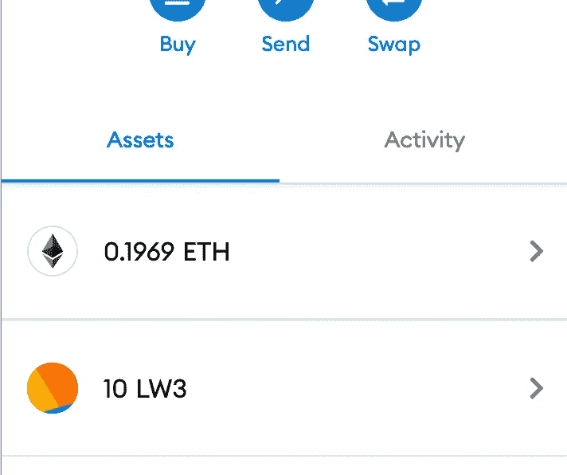

# 作为初学者你需要知道的 Web 3 术语

> 原文：<https://medium.com/coinmonks/web-3-terms-you-need-to-know-as-a-beginner-2677e4a0918c?source=collection_archive---------10----------------------->

我是一名开发人员，最近开始了我从传统背景到 web3 的旅程，我觉得 Web3、NFTs 和区块链有很多令人困惑的词汇，在 web3 领域中经常出现。了解这些术语对你的 Web3 之旅有很大帮助。

> 网络从 10 年前开始发展，如果历史教会了我们什么的话，这些变化非常重要。

首先，有了 web1，也就是我们都知道并喜爱的互联网。然后是 web 2——由用户生成的网络，社交媒体的到来宣告了这一点。现在，无论我们看哪里，人们都在谈论 web3(或者有时是 web 3.0)——互联网的下一个重大进化飞跃。但是到底是什么呢？

Web3(也称为 Web 3.0，有时风格化为 Web 3)是基于区块链技术的第三代万维网的概念，它融合了包括去中心化和基于令牌的经济学在内的概念。

> Web3 增强了我们今天所知的互联网，增加了一些其他特征，如:
> *可验证的
> *无信任的
> *自治的
> *无许可的
> *分布式和健壮的
> *有状态的
> *本地内置支付

> 虽然 web3 仍然是一项正在进行的工作，但作为初学者，这里有一些你需要知道的常见概念。

首先，什么是区块链？
区块链是一个分布式账本，承载着其网络中曾经发生的所有交易的有序列表。事务被分组并存储在块中。整个区块链实质上是一串街区(因此得名)。创建这些块的计算成本很高，并且通过加密技术彼此紧密相连。他们记录数据的方式使得修改或入侵系统在概率上是不可能的。区块链在 2008 年发布比特币网络时，被化名为中本聪的匿名人士(或团体)推广开来。

> 区块链发射时以创世状态开始。比特币的起源状态发生在 2009 年公共网络推出的时候。以太坊的创世纪状态发生在 2015 年推出的时候。

**节点**
通过计算机节点的[对等](https://en.wikipedia.org/wiki/Peer-to-peer)分布式网络自主管理区块链网络。挖掘器是试图计算散列(通过暴力)的节点。这些挖掘者相互竞争，看谁能得出一个随机字符串(称为 nonce ),当它与内容结合时，就产生了前面提到的散列。一旦有人找到正确的随机数——他就向整个网络广播。然后，所述串由每个节点自己验证，并被接受到它们的链中。

**去中心化**
通过将数据存储在节点对等的网络中，区块链是一个去中心化的网络。这比以集中方式存储数据的传统方法具有显著的优势。

集中化问题有很多重要的例子，其中一些是:
- Web2 应用程序经常遇到数据泄露
-在 Web2 中，您无法控制您的数据或数据的存储方式。
-有了中央服务器，政府可以轻松干预、控制或关闭他们认为合适的应用程序，并在动荡、极端通货膨胀或其他政治动荡时期关闭银行账户或限制资金访问。

Web3 旨在通过从根本上重新评估我们如何构建应用程序以及如何与应用程序交互来解决这些问题。

# 以太坊基础

**以太坊是什么？以太坊是一个支持智能合约的去中心化区块链。与仅支持比特币令牌在网络中转移的比特币不同，以太坊具有更广泛的用途。
开发者可以构建 dApps，或者说去中心化的应用，可以在以太坊网络上执行。因此，以太坊的全球状态不仅包括每个账户的余额，还包括每个 dApp 的状态。
它使用[工作证明(PoW)](https://en.wikipedia.org/wiki/Proof_of_work) 维护其网络中所有计算机的一致性。很快，以太坊将转向一种[利益证明(PoS)](https://en.wikipedia.org/wiki/Proof_of_stake) 机制。**

**什么是以太？**
以太坊有一种土生土长的货币叫“以太”，或者叫“Eth”。需要此令牌来支付在以太网上完成的交易的交易费。

什么是智能合约？
智能合约是小型计算机程序或代码片段，在以太坊网络上的所有计算机上复制和处理，无需中央协调器。智能合约允许您编写可以由计算机代码自动实现的合约。

**ERC20 令牌**
ERC 代表以太坊请求评论。除了以太，人们还可以在以太坊上创造和使用自己的货币。最常见的货币形式是 ERC20 代币。ERC20 令牌是符合特定标准的智能合约。开发人员可以扩展标准，但在制作令牌时应满足最低要求。该标准化允许数字钱包轻松支持所有类型的令牌，而不需要为创建的每个令牌专门编码。

My first minted and deployed ERC20 token

**ERC721 和 ERC1155 代币**
这些也称为非功能性交易。这两个标准与 ERC20 相似，为创建 NFT 时应满足的要求提供了基线。它们也提供了类似的好处，允许钱包和 NFT 市场立即与所有 NFT 系列兼容，因为它们都遵循这两个标准中的一个甚至更多…

> 可替换令牌是指令牌的所有“部分”都相同的令牌。用一个 ETH 换另一个 ETH 不会改变什么。你还有 1 ETH。因此，ETH 是一个可替换的令牌。所有法定货币也是可替代的。
> NFT 是不可替换令牌的例子，其中每个令牌不同于不同的令牌。

# **加密钱包**

什么是地址？
地址是使用加密技术生成的一串文本，代表你在区块链上的账户。您可以发送和接收资金，也可以使用您的地址与其他应用程序进行交互。以太坊地址的一个例子是:*0x 01483 df 433484 fcbe 6325 A0 c6e 051 DC 62 ab 107d 1*

**什么是私钥？**
私钥就像包含一串字母和数字的密码，允许你管理你的地址所包含的密码。私钥的一个例子是:*e 7873d 79 c 6d 87 DC 0 FB 6a 5778633389 f 4453213303 da 6120 BD 67 fc 233 aa 33262*

> 如果您将私钥视为密码，地址就是您帐户的用户名。这就是为什么如果有人知道你的地址也没关系，但要保管好你的私钥。

**什么是种子短语？**
种子短语是由您的加密货币钱包生成的一系列单词，让您能够访问与该钱包相关的加密。把钱包想象成类似于加密的密码管理器，把种子短语想象成主密码。种子短语的一个例子是:德芙木材报价板年轻健壮套件邀请塑料定期头骨历史。

**什么是加密钱包？**
加密钱包管理你地址的私钥。他们还允许你发送，接收加密和互动许多区块链应用程序。您可以将您的加密钱包视为一个密码管理器，然后种子短语是您的密码管理器的主密码，您的多个地址和私钥是您的用户名和密码。你可以在这里找到有用的资源:[https://www.cryptowisser.com/wallets/](https://www.cryptowisser.com/wallets/)

# **混音 IDE**

Remix 是一个用于以太坊开发的开源 web 和桌面 IDE。它是在以太坊上开始构建的最容易的开发工具，并且有大量的插件来扩展它的体验。Remix 可以帮助你直接在浏览器中编写 Solidity 代码，并且拥有测试、调试和部署你的智能合约到区块链的工具。
你可以在 https://remix.ethereum.org/[参观 Remix](https://remix.ethereum.org/)

# **什么是稳健？**

Solidity 是一种面向对象的高级语言，用于实现智能合约。它的设计目标是一个叫做以太坊虚拟机(EVM)的以太坊运行时环境。Solidity 是一种花括号语言，是静态类型的，支持继承、库和复杂的用户定义类型等特性。

# Web3 库/dapp

Web3 库帮助我们轻松地与区块链交互，进行交易，并与智能合约交互。使用 web3 库，我们可以开发驻留在区块链上或与之交互的分散式应用程序，例如 [web3.js](https://web3js.readthedocs.io/) 、 [ethers.js](https://docs.ethers.io/) 和 [web3.py](https://web3py.readthedocs.io/en/stable/) 。

# **结论**

祝贺:D，你已经朝着成为 Web3 开发者迈出了第一步。我们了解了什么是钱包、智能合约、web3 库和节点。

## 延伸阅读:

[维基百科](https://en.wikipedia.org/wiki/Web3)

[未来的去中心化互联网讲解](https://www.freecodecamp.org/news/what-is-web3/)

[混音 IDE](https://remix.ethereum.org/)

[坚实度](https://docs.soliditylang.org/)

[元掩码](https://metamask.io/)

[如何用 ethers.js 连接以太坊网络](https://www.quicknode.com/guides/web3-sdks/how-to-connect-to-ethereum-network-with-ethers-js)

> *加入 Coinmonks* [*电报频道*](https://t.me/coincodecap) *和* [*Youtube 频道*](https://www.youtube.com/c/coinmonks/videos) *了解加密交易和投资*

# 另外，阅读

*   [3 商业评论](/coinmonks/3commas-review-an-excellent-crypto-trading-bot-2020-1313a58bec92) | [Pionex 评论](https://coincodecap.com/pionex-review-exchange-with-crypto-trading-bot) | [Coinrule 评论](/coinmonks/coinrule-review-2021-a-beginner-friendly-crypto-trading-bot-daf0504848ba)
*   [莱杰 vs n rave](/coinmonks/ledger-vs-ngrave-zero-7e40f0c1d694)|[莱杰 nano s vs x](/coinmonks/ledger-nano-s-vs-x-battery-hardware-price-storage-59a6663fe3b0) | [币安评论](/coinmonks/binance-review-ee10d3bf3b6e)
*   [Bybit Exchange 审查](/coinmonks/bybit-exchange-review-dbd570019b71) | [Bityard 审查](https://coincodecap.com/bityard-reivew) | [Jet-Bot 审查](https://coincodecap.com/jet-bot-review)
*   [3 commas vs crypto hopper](/coinmonks/3commas-vs-pionex-vs-cryptohopper-best-crypto-bot-6a98d2baa203)|[赚取加密利息](/coinmonks/earn-crypto-interest-b10b810fdda3)
*   最好的比特币[硬件钱包](/coinmonks/hardware-wallets-dfa1211730c6) | [BitBox02 回顾](/coinmonks/bitbox02-review-your-swiss-bitcoin-hardware-wallet-c36c88fff29)
*   [BlockFi vs 摄氏度](/coinmonks/blockfi-vs-celsius-vs-hodlnaut-8a1cc8c26630) | [Hodlnaut 审核](/coinmonks/hodlnaut-review-best-way-to-hodl-is-to-earn-interest-on-your-bitcoin-6658a8c19edf) | [KuCoin 审核](https://coincodecap.com/kucoin-review)
*   [Bitsgap 审查](/coinmonks/bitsgap-review-a-crypto-trading-bot-that-makes-easy-money-a5d88a336df2) | [Quadency 审查](/coinmonks/quadency-review-a-crypto-trading-automation-platform-3068eaa374e1) | [Bitbns 审查](/coinmonks/bitbns-review-38256a07e161)
*   [加密复制交易平台](/coinmonks/top-10-crypto-copy-trading-platforms-for-beginners-d0c37c7d698c) | [Coinmama 评论](/coinmonks/coinmama-review-ace5641bde6e)
*   [印度的加密交易所](/coinmonks/bitcoin-exchange-in-india-7f1fe79715c9) | [比特币储蓄账户](/coinmonks/bitcoin-savings-account-e65b13f92451)