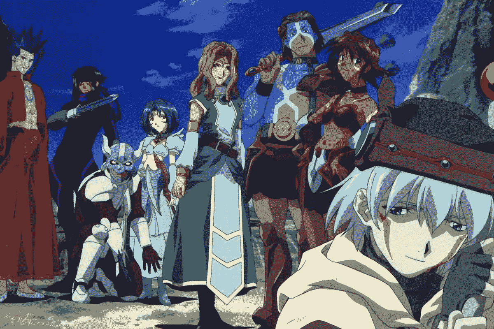
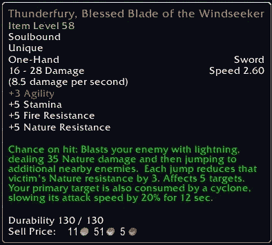

# 网络 3 和魔兽世界第一部分——灵魂束缚

> 原文：<https://medium.com/coinmonks/web-3s-dna-and-world-of-warcraft-part-1-soulbound-e53d85af4fbf?source=collection_archive---------28----------------------->

我从大学开始就试图超越书呆子游戏玩家的刻板印象。这一年我要去社交，交朋友，参加聚会。不幸的是，我唯一的密友没有在春季学期回来，我也肯定不会成为一名医生。我妈妈很失望…她责怪电子游戏。在社交和学业上的挣扎中，我找到了回到唯一一个我觉得自己能掌控的世界的路。影歌哨兵的艾瓦尔将军听起来很不错。WoW 的巫妖王之怒资料片在我大学一年级的时候出了，我回到艾泽拉斯进行最后一次冒险。

当人们谈论“元宇宙”时，一个非常常见的比喻反复出现。《魔兽世界》和类似的 MMORPGs 是我们居住的第一批元游戏，拥有化身、社会团体、本地货币和数字身份符号。

事实上，通过虚拟现实体验到的 MMO·元宇宙的宏伟愿景是《黑客帝国》和《在线剑术》等流行动漫的共同主题。这些动漫预言了一个时代，那时人们将更关心虚拟世界而不是物理现实，许多人将戴着虚拟现实耳机生活。

Dot .Hack Sign

Web 3 有着深厚的渊源，可以追溯到 WoW。Vitalik Beuterin 创建以太坊是对暴雪集中控制 WoW 的平衡和方向的回应。在 Vitalik 的“关于我”页面上，您可以找到以下内容:

“我在 2007-2010 年愉快地玩着魔兽世界，但是有一天暴雪移除了我心爱的术士的虹吸生命法术的伤害部分。我哭着睡着了，那天我意识到了集中服务会带来什么样的恐怖。我很快决定退出。”

尽管维塔利克退出了 WoW，去了 Ethreum，但他仍然是艾泽拉斯的老手，WoW 中的许多概念仍然影响着他的思维。今年早些时候，Vitalik 讨论了灵魂绑定 NFTs 未开发的设计潜力。“灵魂绑定”属性是直接从 WoW 借用的，在 WoW 中，某些物品一旦被拾取，就不能转让或出售给其他玩家。

目前，很难从表面的一瞥中判断一个人是如何获得 NFT 的。你拥有一只无聊的猿或月鸟是因为你知道在薄荷店买一只，还是因为你非常富有？灵魂绑定的 NFT 可以象征财富之外的东西，它们可以证明出席或参与，是数字地位符号的另一种排列。

WoW 的许多方面影响了 Web 3 的构建方式，这在一篇文章中是无法涵盖的。这是正在进行的关于 Web 3 的 DNA 和它在魔兽世界的根源系列的第一部分。我们将通过中国的淘金者来介绍 WoW gold 及其与真实现金的互操作性，以及 DAOs 从 DKP 系统继承的东西等等。

感谢您的阅读。

查看我的 Web 3 之旅:

[https://twitter.com/wasifmrahman](https://twitter.com/wasifmrahman)

在 LinkedIn 上关注我:

 [## Wasif Rahman -营销伙伴关系总监- Ex Populus | LinkedIn

### 查看 Wasif Rahman 在全球最大的职业社区 LinkedIn 上的个人资料。Wasif 有 4 个工作列在他们的…

www.linkedin.com](https://www.linkedin.com/in/wasif-rahman-91114a85/) 

我的 Web 3 淋浴想法:

 [## 瓦西夫·拉赫曼-中号

### 阅读瓦西夫·拉赫曼在媒介上的作品。Web 3 德根 Ex Populus 营销伙伴关系总监。每天…

medium.com](/@wasifmrahman) 

阅读第二部分:中国淘金者

 [## Web 3 DNA 和魔兽世界第二部分——中国淘金者

### 我登录了我的魔兽世界账户，发现我的 80 级战士一丝不挂地坐在暴风城。我的用户界面看起来不一样…我…

medium.com](/@wasifmrahman/web-3-dna-and-world-of-warcraft-part-2-chinese-gold-farmers-b71b1e7b5ac6) 

阅读第 3 部分:有组织的网络流氓

 [## 网络 3 DNA 和魔兽世界第 3 部分-有组织的网上歹徒

### 你发现自己在经典 WoW 的 Un Goro 火山口。你正在猎杀传说中的恶魔龙，为它剥皮…

medium.com](/@wasifmrahman/web-3-dna-and-world-of-warcraft-part-3-organized-online-gangsters-92d9d68f9038) 

阅读第 4 部分:从游戏公会到 Web 3 社区

 [## Web 3 DNA 和魔兽世界第 4 部分——从游戏公会到 Web 3 社区

### 我记得我魔兽世界职业生涯中最难忘的一天。我已经成功地带领我的公会通过了整个…

medium.com](/@wasifmrahman/web-3-dna-and-world-of-warcraft-part-4-from-gaming-guilds-to-web-3-communities-3efc3b5b8674) 

阅读第五部分:DKP 和代币经济学

 [## 网络 3 和魔兽世界第五部分——DKP 和代币经济

### 经过一场艰苦的战斗，我们终于拿下了霜龙 Syndragosa，然后我见到了阿尔萨斯，巫妖王…

medium.com](/@wasifmrahman/web-3-and-world-of-warcraft-part-5-dkp-and-token-economies-9b2b314b7bef) 

阅读:高潮与低谷:网络 3 的一年

 [## 高潮与低谷:Web 3 的一年

### 我在去年 6 月 22 日买了我的第一个密码。我清楚地记得这是自加密以来的第一次重大下跌…

medium.com](/@wasifmrahman/the-highs-and-lows-a-year-in-web-3-eed764aa6efb) 

> *加入 Coinmonks* [*电报频道*](https://t.me/coincodecap) *和* [*Youtube 频道*](https://www.youtube.com/c/coinmonks/videos) *获取每日* [*加密新闻*](http://coincodecap.com/)

# 另外，阅读

*   [复制交易](/coinmonks/top-10-crypto-copy-trading-platforms-for-beginners-d0c37c7d698c) | [加密税务软件](/coinmonks/crypto-tax-software-ed4b4810e338)
*   [网格交易](https://coincodecap.com/grid-trading) | [加密硬件钱包](/coinmonks/the-best-cryptocurrency-hardware-wallets-of-2020-e28b1c124069)
*   [密码电报信号](http://top%204%20telegram%20channels%20for%20crypto%20traders/) | [密码交易机器人](/coinmonks/crypto-trading-bot-c2ffce8acb2a)
*   [最佳加密交易所](/coinmonks/crypto-exchange-dd2f9d6f3769) | [印度最佳加密交易所](/coinmonks/bitcoin-exchange-in-india-7f1fe79715c9)
*   [开发者最佳加密 API](/coinmonks/best-crypto-apis-for-developers-5efe3a597a9f)
*   最佳[密码借贷平台](/coinmonks/top-5-crypto-lending-platforms-in-2020-that-you-need-to-know-a1b675cec3fa)
*   [杠杆代币](/coinmonks/leveraged-token-3f5257808b22)终极指南