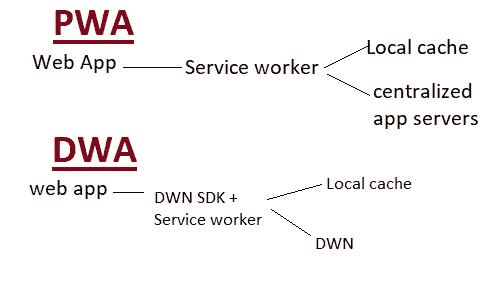

# web 5.0:web 功能的扩展。

> 原文：<https://medium.com/coinmonks/web-5-0-an-introduction-to-the-future-of-the-web-6a21cfd6eaab?source=collection_archive---------1----------------------->

Photo by [Stefan Cosma](https://unsplash.com/@stefanbc?utm_source=medium&utm_medium=referral) on [Unsplash](https://unsplash.com?utm_source=medium&utm_medium=referral)

# 介绍

Web 5.0 是一个分散的 Web 平台，允许开发人员使用分散的标识符(did)、可验证的凭据(VC)和分散的 web 节点(dwn)开发分散的 web 应用程序(DWA)，为用户收回身份和数据的所有权和控制权。它将建立在比特币 T2 的基础上。

在继续之前，我写了关于[开始使用 web 3.0](/coinmonks/getting-started-with-web3-3b62acee1eaf) 。这篇文章将让你快速回顾一下 web 的发展，以及 web 3.0 能提供什么。

> 我很想简单谈谈仍在发展中的 web 4.0，它被称为“共生网络”，但 web 5.0(智能和情感网络)比预期的更早出现。🤞🤞

根据杰克·多西的说法，web 5.0 的主要目标是让用户完全控制他们的数据。此外，用户可以控制他们的数据交互以及如何在互联网上使用这些数据。

很有趣，对吧？🤔🤔

## 深潜

Web 5.0 是 Web 的发展，它支持分散的应用程序和协议。

目前，web 用户仍然抱怨不能完全控制他们的数据和身份、其使用，以及在 web 3.0 中仍然备受关注的安全方面；web 5.0 有望将数据和身份的完全控制权交给用户，因为这些信息将与用户一起保存。

## Web 5.0 的支柱

1.  DID `did://`:这种自有身份允许身份的分散认证和路由。
2.  可验证凭证(VC):以加密方式呈现和验证断言的数据格式和策略。
3.  分散网络节点(DWN):它处理数据存储和信息中继节点。因此，它是分散式应用程序和协议的主干。

> **DID** 是自我生成和自我拥有的。它没有集中的提供者或权威。它是抗阻断，它是普遍发现的。
> 
> DWN 是普遍可寻址和安全的。 **DWN** s 可以用单独的 ***DID*** 密钥加密。此外，DWN 支持异步消息线程。

## 剖析 web 5.0 身份钱包

1.  数据管理:它具有图形用户界面(GUI)和管理*DWN 凭证和应用数据的能力。*
2.  *凭证功能:签名、验证、发现并向验证方提供凭证。*
3.  *它执行认证并管理认证—“***做了*** Auth”。*
4.  *它支持*的创建、更新和跨所有支持的 ***DID*** 方法的更新。**

**它维护并强制哪个**用于不同的人、应用或服务。****

## **从 PWA 看 DWA 的演变**

**简单来说，渐进式网络应用程序(PWA)是一个拥有应用程序所有功能的网站。PWAs 允许你创建一个版本的网站，更可靠，更吸引人。PWAs 可以做几乎所有本机应用程序做的事情，包括离线工作，在需要时访问您的摄像头和麦克风，以及使用 GPS。**

**而分散式 web 应用程序(DWA)是一种革命性的 Web 应用程序模型，安全得多。与网络应用不同，DWA 将其协议和数据在区块链上加密和分类。**

****

**image showing the evolution of DWA from PWA**

## **Web 5.0 有趣的部分—有趣的事实**

1.  **当*和 ***DWN*** 一起使用时，他们创建了一个*的网络——安全的消息传递、数据存储和凭证共享，可以用各种语义数据传输的通用标准取代一次性协议。****
2.  ***在当今世界，许多行动都需要在各方之间建立信任。个人、组织和企业可以使用 ***DID*** s 和 ***DWN*** 来广播任何人都可以找到并独立验证的凭证。***
3.  **当您需要在众多平台上收集数据时，您不必重新输入数据。您可以让这些平台访问您保存的数据，如旅行预订、音乐播放列表、银行账户信息等。**

## **结论**

**web 1.0 的焦点是连接文档(资源)和建立网络访问。然后是 web 2.0，这是一个用户贡献(网站)价值的环境。同样，web 3.0 允许你在网上创建、拥有和识别你的数据。另一方面，Web 4.0 仍然是一项进行中的工作，它被称为“共生网络”。最后，web 5.0 是一个感官情感区域，让用户完全控制他们的数据。此外，用户可以控制他们的数据交互以及如何在互联网上使用这些数据。**

**我们知道人类更多的能力-技术探索仍在进行中，我们等待着惊人的发展，我们希望它能减轻我们的日常生活，给我们带来更多的安全。**

**本文灵感来源于 [tbdex](https://www.google.com/search?q=tbdex&rlz=1C1RLNS_enNG973NG974&oq=tbdex&aqs=chrome.0.69i59j0i20i263i512j0i512l4j0i10i512l2j0i512l2.1314j0j9&sourceid=chrome&ie=UTF-8) 。🙌🙌🙌🙌🙌🙌**

> **加入 Coinmonks [电报频道](https://t.me/coincodecap)和 [Youtube 频道](https://www.youtube.com/c/coinmonks/videos)了解加密交易和投资**

# **另外，阅读**

*   **[隐翅虫替代品](/coinmonks/cryptohopper-alternatives-d67287b16d27) | [HitBTC 审查](/coinmonks/hitbtc-review-c5143c5d53c2)**
*   **[CBET 评论](https://coincodecap.com/cbet-casino-review) | [库科恩 vs 比特币基地](https://coincodecap.com/kucoin-vs-coinbase)**
*   **[Fold App 审核](https://coincodecap.com/fold-app-review) | [Kucoin 交易机器人](/coinmonks/kucoin-trading-bot-automate-your-trades-8cf0ca2138e0) | [Probit 审核](https://coincodecap.com/probit-review)**
*   **[如何匿名购买比特币](https://coincodecap.com/buy-bitcoin-anonymously) | [比特币现金钱包](https://coincodecap.com/bitcoin-cash-wallets)**
*   **[币安 vs FTX](https://coincodecap.com/binance-vs-ftx) | [最佳(SOL)索拉纳钱包](https://coincodecap.com/solana-wallets)**
*   **[比诺莫评论](https://coincodecap.com/binomo-review) | [斯多葛派 vs 3Commas vs TradeSanta](https://coincodecap.com/stoic-vs-3commas-vs-tradesanta)**