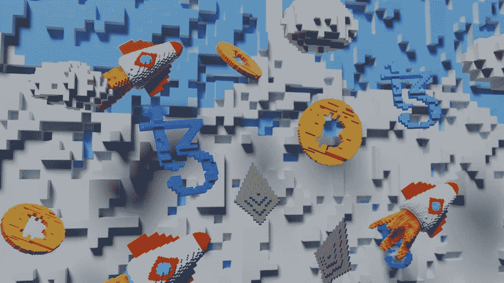
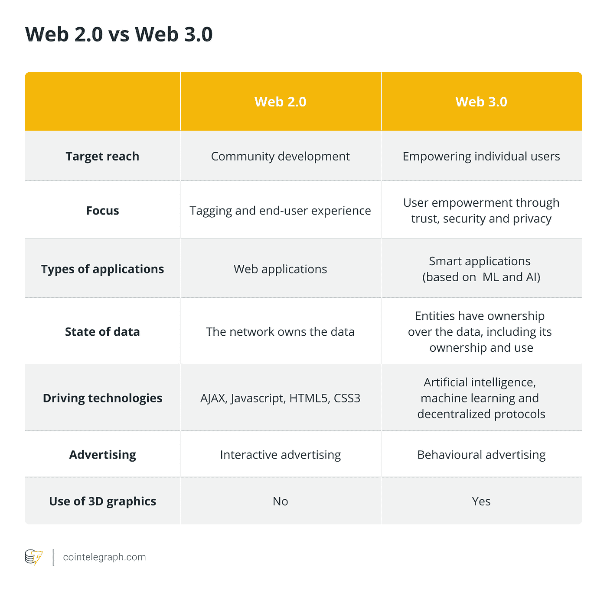

# Web3.0 就在这里，我为什么要关心它？

> 原文：<https://medium.com/coinmonks/web3-0-is-here-why-should-i-care-about-it-84ab25b4243f?source=collection_archive---------40----------------------->

Author: [Shubham Dhage](https://unsplash.com/@theshubhamdhage)

Web3.0 最近受到了很多关注，也有很多噪音，怀疑者说 web3.0 只是另一种时尚，出于许多原因，完全不值得主流改编。是的，当然，web3.0 仍处于早期阶段，但它充满了无限的潜力，可以在它的基础上构建全新的应用程序。

嗯，有意思！🤔等一下，伙计们，我认为在进一步谈论 web3.0 或其所有惊人的好处之前，我们有点言过其实了，我们需要回到 Web 1.0 并从那里开始。

## **Web 1.0**

简而言之，Web 1.0 是 Web 的第一个“阶段”。

在这个阶段，网页是静态的，内容由服务器的文件系统提供。此外，这些网页没有互动性。你不能对带有评论或赞的帖子做出“反应”。相反，你只是被动地消费信息。

Web 1.0 从 20 世纪 80 年代末一直持续到 2005 年。

**Web 2.0**

Web 2.0 就是我们今天所知道的网络。代替静态内容，网络变成了一个动态内容的地方，一个用户现在能够与网络上发布的内容进行交互的地方。

Web 2.0 也被称为参与式社交网络，这意味着普通互联网用户现在能够为其他互联网用户创建内容进行互动。这导致了一些为 web2.0 构建的新的非常广泛的应用程序，一些在 Web 2.0 中蓬勃发展的著名应用程序:Instagram、YouTube、脸书，当然还有谷歌。

Web 2.0 是完全基于交互的。

**Web 3.0**

Web 3.0 是 web/Internet 发展的下一个迭代或阶段，可能会像 Web 2.0 一样具有破坏性，代表着一个巨大的范式转变。

Web 3.0 建立在去中心化、开放性、无信任和无许可、人工智能(AI)以及连接性和无处不在的核心概念之上

去中心化:这意味着不是消费者通过像谷歌、苹果或脸书这样的公司中介的服务来访问互联网，而是个人自己拥有和管理互联网的一部分。

**开放性:**由一个开放的、可访问的开发者社区构建的软件，并在众目睽睽之下执行。

**无信任:**网络本身允许参与者在没有可信第三方的情况下公开或私下互动。

**无需许可:**在这种情况下，任何人，包括用户和供应商，都可以在没有管理机构授权的情况下参与。

人工智能:在 Web 3.0 中，通过基于语义网概念和自然语言处理的技术，计算机将能够像人类一样理解信息。Web 3.0 还将使用机器学习，这是人工智能(AI)的一个分支，使用数据和算法来模仿人类的学习方式，逐渐提高其准确性。

**连接性和无处不在**:内容可以被多个应用程序访问，每个设备都连接到网络，服务可以在任何地方使用。([物联网](https://www.investopedia.com/terms/i/internet-things.asp))。)

cointelegraph.com

# 概括起来

Web 2.0 是参与式社交网络，或者说是支持读写功能的第二代互联网服务。

另一方面，web 3.0(读-写-执行)是专注于语义 Web 的第三代 Web。它致力于在分散的基础设施上实现用户和机器之间更好的交流和理解。

如果你正在寻找真实世界的例子，这里有一个令人兴奋的 web3.0 项目。

*   [Nestcoin](https://nestcoin.com/about-us)

你想获得构建 web3.0 应用的相关技能吗？

*   [方块游戏](https://blockgames.gg/)
*   [祖日实习](https://zuri.team/)