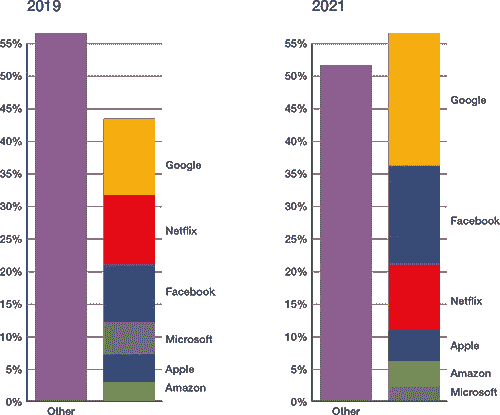

# Web3.0:安全考虑和影响

> 原文：<https://medium.com/coinmonks/web3-0-security-considerations-and-implications-746004bc106d?source=collection_archive---------7----------------------->

> 创新就是应用技术的创造力——约书亚·J·S·莫利

如果你之前看过我的一个讲座或者读过我的一篇文章，你会对这句话很熟悉，但是我认为，鉴于这篇文章的主题，强调一下是非常重要的。因为使用 Web3.0 和其他新兴技术的创意人员正在创建项目，这些项目将成为下一代广泛使用的技术的基础。

今天，我将谈谈不保护 web3 和其他新兴技术的一些重要考虑因素和影响。

这篇文章的内容如下:

*   我将首先介绍 web1 和 web 2 的背景
*   然后我要谈谈 web 3，围绕这个定义的两个思想流派(以及我认为未来和 Web3.0 会是什么样子)
*   然后，我将讨论一些考虑事项以及没有为 web 3 提供足够安全性的一些影响
*   最后，我会对你在开发 Web3.0 时应该考虑的事情提出一些建议

但是在我们开始讨论 Web3.0 安全编程的考虑因素和含义之前，让我们先从什么是 Web1.0(也称为语法 Web)和 Web2.0(也称为社交 Web)的基础知识开始。

# Web1.0 和 Web2.0

## Web1.0

现在，术语 web 1、2 和 3 是由 Tim 的 Bernes-Lee(被广泛认为是 web 的创始人)创造的。web1.0 也被称为“**句法 web** 或“**只读 web** ”，这是万维网的早期版本，允许人们有效地搜索信息并阅读它(过于简单，但你懂我的意思)，除了信息消费和在更深层次上参与 Web 所需的编程语法知识(这就是该名称的来源)之外，没有太多与 Web 的参与。

总的来说，Web1.0 将实体思维应用于数字领域，网络是一个分散的知识图书馆，人们可以通过电子商务网站购买东西，但你大部分时间都是在浏览网页，而不是贡献或改变东西。

## Web2.0

web 2 也被称为“**读写网络**或“**社交网络**”，这是交互式网络服务(如电子邮件、用户组、博客以及最终的社交媒体平台)兴起的结果。

Web2.0 见证了人们开始在网络上互动和社交，而不仅仅是消费信息。它还被用来描述一个由少数几家科技巨头主导的网络，其中大部分网络流量都是通过这 5 到 8 家公司过滤的

Image Credit [Sandvine](https://www.sandvine.com/blog/telco-business-models-reaching-tipping-point-in-digital-era)

主导网络使用和流量的大技术实际上是人们(*尤其是*区块链的狂热分子)想要转向他们所谓的“web3”或“去中心化网络”的主要驱动力之一，这是我马上要谈到的第二个思想阵营。

# Web3.0

## 神秘的网络 3

那么什么是 Web3.0/web3 呢？因为有很多 tik-tok 的，很多视频，很多人在谈论它(没有真正给出一个明确的定义或描述)。我通常会看到一系列流行术语(包括“区块链”、“加密货币”、“NFT”、“去中心化”)，但我不会看到任何关于我们如何实现完全去中心化的网络以及由此产生的影响的描述或现实前景。在我们进入区块链 web3 兔子洞之前，重要的是要谈谈最初的 Web3.0，即“语义网”。

## 语义网

“语义网”一词由 Tim Bernes-Lee 于 1999 年提出，并于 2006 年首次命名为“Web3.0”，它描述了一个计算机或人工智能能够解析/分析互联网数据、智能代理能够与人交互的网络。这种理解是围绕 Web3.0 的第一个思想流派。

现在，当我们谈论这两个不同的阵营时，我相信他们都在描述同一件事情的组成部分，只是桌子的不同侧面。

区块链爱好者所描述的“web3”是加文·伍德(以太坊的联合创始人)在 2017 年创造的一个术语，通常用于描述一个远离大科技的去中心化网络。这个术语在区块链的金融界很流行，主要围绕加密货币、NFTs(不可替代的代币)和 DAOs(去中心化自治组织)等。

人工智能 Web 3.0(Tim Berners Lee 在 2006 年首次提到)通常由信息架构师和万维网联盟(WWWC)使用，通常用于描述采用人机界面和人工智能使用方面的进步的 Web2.0 的演变。

## 对 Web3.0/web3 的批评

对 Web3.0 的两种定义的批评大多针对乌托邦式的炒作，要么是在区块链上运行的完全去中心化的互联网，要么是完全机器可解析的 Web 的想法。

例如**埃隆·马斯克**和**杰克·多西**将区块链网络 3 斥为“流行语”和“风险资本家的玩物”，强调了技术的易变性，他们的“价值几乎完全基于公众意见”([埃隆·马斯克应该知道](https://www.latimes.com/entertainment-arts/tv/story/2021-05-09/dogecoin-stock-plummets-after-elon-musk-calls-it-a-hustle-on-snl))。

尽管在过去的 20 年中，对语义网的批评主要集中在用机器可解析和可解释的方式将大量知识形式化的可行性上(此外，这些批评中的许多是在人工智能的最新发展之前提出的)

我相信这两种方法都将成为“真正的 Web3.0”的组成部分。我也相信 Web3.0 是不可避免的，但同样的，现在仍然有 Web1.0 网站，当 Web3.0 到来时，仍然会有 Web1.0 和 Web2.0 网站。

# 乔希的定义:Web3.0

因此，我认为批评人们在没有自己给出定义的情况下胡乱猜测是不公平的。

这是我对 Web3.0 的预测和定义

> “一个通过虚拟(元宇宙)和混合现实拥抱互动的网络，将通过物联网实现，智能设备将提供反馈、输入或输出，并促进互联网和我们现实世界环境之间的无缝接口。网络将有智能代理，人工智能不仅会发现、解释和交流信息，还会创造(GAN 的)和分散的货币、人工制品和组织将使我们的网络体验民主化，将一些权力带回用户手中”——约书亚·J·S·莫利

# Web3.0 安全影响

但这都存在一个问题。

我去年做了一个演讲，谈到了物联网的安全影响，并提到了起搏器可被黑客攻击之类的事情(恶意行为者可以远程访问起搏器，执行诸如改变起搏器节奏、实施电击或放电之类的操作)。但是当我们考虑到 web3 将带来的所有东西时，这是一个更可怕的想法！

*   如果你所有的钱都在一个遭受 51%攻击的密码里
*   如果你的元宇宙触觉反馈服被黑了，你的要害就会被压碎
*   如果你必须存储你所有的私人钥匙，(很难拖出一台电视，但恶意的演员可以在抢劫房子时瞄准 USB 驱动器。)

那么，作为安全专业人员，我们在准备 web3 的工作时需要考虑哪些事情呢

首先，我想分享一些我们目前在 web3.0 技术和工作中面临的考虑和警示，然后我会提供一系列建议

## 认证和授权

今天，大多数去中心化的应用程序(dApps)并不验证或签署他们的 API 响应，我认为这是不言自明的。如果你正在构建 web3 应用，像 API 认证**这样的基本东西必须包括在内。**想象一个去中心化的银行 app，不做 API 认证，也不做响应签名。

此外，许多声称是 web3.0 应用程序的 dApps 目前使用像 Infura 或 Alchemy 这样的集中式服务。signal 的创始人和 signal protocol 的合著者莫邪·马林斯派克在他的博客中记录了“web3.0”平台的问题，他指出 dApps 本身通常不是分布式的，它们只是 react 网站，但分散的部分是国家，权限在区块链，而不是集中的数据库。他继续指出，NFT 最大的市场 OpenSea 在没有必要或没有提供正当理由的情况下删除了他创建的 NFT，这揭示了一个问题，即即使是 NFTs，web3.0 区块链世界的一颗闪亮的星，也是由 web2 公司控制的。那么，当连 web3 应用程序都自然而然地倾向于这种模式时，我们如何才能消除这种集中控制点呢

## 加密密钥管理

最后，许多区块链技术的一个共同因素是用户控制的密钥管理。您的钱包、应用程序和认证服务器都有一个私钥。丢失这把钥匙，或者失去这把钥匙的所有权是毁灭性的。所以很多人使用比特币基地这样的平台(web2 平台)作为保管人或中介来管理你的私人钥匙和钱包

就像我前面说的，我不相信我们会进入一个完全去中心化的网络，但是 web 3 中安全专家的一个考虑将是许多密钥的管理，而不依赖于中心化的组织

## 安全性与可持续性

区块链的一个很大的区别是它的安全应用在一个分散的性质，这种分散的安全是以能源和可持续性为代价的。为了证明数据和交易的正确性，区块链可以使用许多不同的“证明”功能。两大问题是:

*   工作证明:矿工们竞相求解复杂的方程，最快的求解者将获得奖励，获得在区块链增加新交易的权利

和

*   利益证明:验证者以他们自己的密码的一定价值作为担保，验证者被奖励在区块链创建下一个区块的权利，并按照他们在网络中的股份比例维护公共分类帐

工作证明更安全(并且更经得起时间考验)，但是在能量消耗方面明显更昂贵。事实上，以太坊区块链正在从 PoW 转向 PoS，并表示他们预计将减少 99%的能源使用。一个惊人的事实是，比特币(使用工作证明)占全球所有能源使用量的 0.6(2021 年 7 月)。

## 加密技术应用≠自动保护

我们还必须记住，加密技术并不自动意味着完美的安全性。信息架构和数据安全等传统考虑因素仍然适用，web3 应用程序在公共区块链上拥有信息的要求并不意味着任何信息都不需要加密、保密和保护。是的，我可以去 HotSpotty，看到灯塔证人，挑战和氦热点采矿奖励。但是我不应该(也不能)看到该热点所有者的全名、地址、电话号码和电子邮件。有些信息可以公开，有些应该保密

(第二)互联网充满了“转向 web3”的人。虽然我热情地鼓励每个人，无论是技术人员还是其他人，提高技术技能，学习多种开发形式中的一种，因为许多 web3.0 开发人员都是业余爱好者、黑客马拉松参与者或热衷于进入市场的年轻企业家，但设计安全性的焦点是空缺的。这是一件非常困难的事情，但我们需要为所有这些新兴的区块链技术制定一些基本的安全要求

## 教育至关重要

随着数据的民主化和数据所有权从中央平台转移到用户手中，教育比以往任何时候都更加重要。部分原因是，目前有许多“限制”作为人们的安全网，不仅保护他们免受恶意行为者的伤害，也保护他们免受事故的伤害。

然而，如果你的元宇宙头像和用户名 ***是你的身份*** 呢，欺骗会导致简单、自动和大规模的身份盗窃和冒名顶替。

在这个世界里，丢失一个 usb 加密密钥可能意味着失去你一生的积蓄，那该怎么办

或者，如果社交媒体信息是机器可读的，可以被人工智能模型解释，从而开放给自动化开发，这个世界会怎么样

至关重要的是，我们要继续教育公众如何保持安全，并采用这些新的进步。

## 故障的影响

因为如果我们生活在一个没有这些安全网的世界，失败的**影响要大得多，而去中心化世界的现实是**缺乏监管和由此产生的安全网**。**

我们见过孩子们用他们父母的信用卡订了几十个比萨饼，但是孩子们在一个被破解的密码机上刷信用卡怎么办？NFT 诈骗，引诱人们快速致富的计划。火绒骗子约会多名世界各地的人在元宇宙。

## 机器可解释的数据挖掘和利用

在人工智能可以解释数据的未来，我们可以依靠编写的智能代理来利用人类的情感和弱点。我们已经看到自动化的出现，利用虚假的 Instagram 账户诈骗来剥削无辜的人，更不用说我们看到的大量电子邮件和短信诈骗了。

但是，在这个世界里，人工智能可以根据每个目标的模型训练自己，并专门针对个人的弱点，或者从网上搜集信息来勒索特定的人，那会怎么样呢

## 生物集成技术

让我们来谈谈生物集成技术(大脑植入、生物识别电路纹身和其他生物识别接口设备)。随着我们看到越来越多的这些技术与我们的身体相结合，以及允许我们与混合或虚拟现实进行交互的技术，我们必须确保它们是安全的。因为**未能保护融入我们身体的技术的影响可能是致命的。**

## 艺术模仿生活(骗局也一样)

艺术模仿生活，特别是用 deepfakes。GANS 和越来越智能的聊天机器人可以用来完全虚构一个人，进行大规模欺诈和诈骗。想象一下 tinder 骗子，在另一边是一个人工智能，而不是一个人，人工智能提供的欺诈规模是巨大的。

## 分权世界中的问责制

哇，在一个去中心化的世界里，我们有责任吗？最近的 Log4j 漏洞给我们上了一堂重要的课，它是关于问责制以及对去中心化未来的影响。分散的项目可能意味着没有专门的问责制，如果没有问责制，我们需要开始考虑我们可以替代的担保，以确保问题不受抑制。

# 以安全的方式实现 Web3.0 的建议

所以，我只是用大量的信息、虚假的评论和一点点讽刺来轰炸你。但是我能给你什么有用的建议，让你以安全的方式走向 web3 的未来呢

1.  设计时要考虑伦理实践，这在为人类设计机器可解释数据时非常重要[(如果你感兴趣，可以阅读我关于计算机视觉伦理的文章)](https://joshua-j-morley.medium.com/ethical-considerations-for-computer-vision-e5e7b8adb60d)
2.  内置对欺诈、诈骗和不道德使用平台的检测(和消除)
3.  许多 web2 安全实践仍然适用于 web3。默认情况下采用现有的安全原则
4.  考虑分散应用程序是否必要、现实，以及如果分散会对安全性产生什么影响
5.  考虑应用程序的可持续性影响，以及是否有必要提高安全性
6.  对你的数据进行分类，哪些应该公开，哪些应该保密
7.  鼓励开发人员在设计时考虑安全性。提醒他们 web3 (poly network hack)安全性失败的代价
8.  教育你的同伴和网络，鼓励学习和质疑的心态
9.  它对某人的健康(身体或精神)越危险，就越应该得到保护

在本文中，我介绍了 Web1.0、2.0 和 3.0 的背景，给出了我自己对 Web3.0 的定义和预测，谈到了 Web3.0 中由于安全决策可能出现的一些问题，并为在 Web3.0 领域工作的开发人员提供了一些建议性的考虑。

我谦卑地请求，如果你喜欢内容，它是信息丰富的或发人深省的，**请跟随我**作为接收我发布的新作品的机制，但也支持我在我正在进行的博客之旅中的努力。

谢谢你和最美好的祝愿，
乔希

> [你可以在这里加入 medium，阅读更多关于加密、区块链和更多的内容。](https://joshua-j-morley.medium.com/membership)
> 
> 加入 Coinmonks [电报频道](https://t.me/coincodecap)和 [Youtube 频道](https://www.youtube.com/c/coinmonks/videos)了解加密交易和投资

# 另外，阅读

*   [有哪些交易信号？](https://coincodecap.com/trading-signal) | [比特斯坦普 vs 比特币基地](https://coincodecap.com/bitstamp-coinbase)
*   [ProfitFarmers 点评](https://coincodecap.com/profitfarmers-review) | [如何使用 Cornix Trading Bot](https://coincodecap.com/cornix-trading-bot)
*   [如何在势不可挡的域名上购买域名？](https://coincodecap.com/buy-domain-on-unstoppable-domains)
*   [印度的秘密税](https://coincodecap.com/crypto-tax-india) | [altFINS 审查](https://coincodecap.com/altfins-review) | [Prokey 审查](/coinmonks/prokey-review-26611173c13c)
*   [赢取注册奖金——10 大最佳加密平台](https://coincodecap.com/earn-sign-up-bonus)