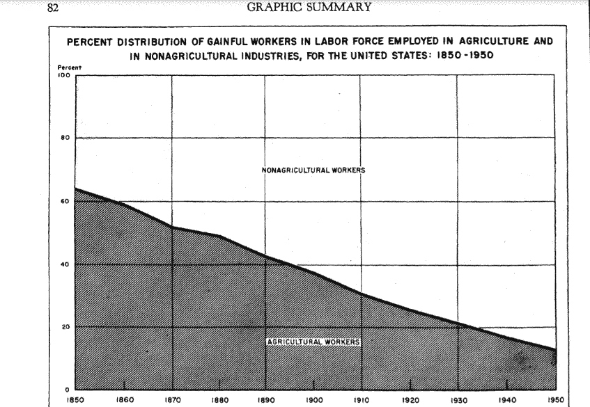

# Web3:历史视角

> 原文：<https://medium.com/coinmonks/web3-a-historical-perspective-8be5012963b?source=collection_archive---------12----------------------->

重大的历史转变目前很难衡量，但随着时间和视角的变化，趋势变得可以识别，叙述变得更加清晰。让我们简要回顾一下从工业革命到今天的技术崛起的历史，重点关注 web 采用的演变，并使用这个角度来考虑互联网的下一个阶段。

## **农业社会到工业社会**

自从工业革命以来，技术一直在飞速发展。美国和其他西方国家[从 1860 年 60%以上的劳动力从事农业的农业社会转变为 1900 年的三分之一，1950 年的不到五分之一](https://www2.census.gov/prod2/decennial/documents/41667073v5p6ch4.pdf)，今天的[不到 2%的劳动力。](https://data.worldbank.org/indicator/SL.AGR.EMPL.ZS?end=2019&locations=US&start=1991)

过去，孩子们在一个看起来和他们的祖父母相似的世界中长大。几代人以来，大多数人的生活和生计都围绕着农业以及随之而来的生活方式。技术创新和采用是逐渐发生的，生活基本上与上一代人一样。

## **技术进步总会有权衡取舍**

一旦工业革命到来，个人、家庭和社区必须学会适应快速变化。新技术提高了工人的效率，并为农业以外的工作创造了机会。蒸汽机使得通过汽船和火车的大规模运输成为可能。工厂以更低的价格生产出质量更好的商品，让普通公民过上了前所未有的生活。

尽管物质上的改进比比皆是，但仍然有人对这些新技术带来的副作用持批评态度。他们担心这种快速的变化会破坏社会结构、家庭和之前的生活方式。尼尔·波兹曼关于技术创新有一句名言:

> [“所有的技术变革都是一种交换……技术给予，技术取走。”](https://web.cs.ucdavis.edu/~rogaway/classes/188/materials/postman.pdf)

创新的隐性成本包括:由于各地之间的旅行变得容易，失去了紧密团结的社区；由于网络使用，年轻人的孤独感增加；以及许多其他缺点。

## **当新技术提供真正的实质性改进时，它总是会被采用**

尽管在引入新技术时，除了该技术的实际成本之外，通常还会出现最初的负面影响:

*正如我们随着时间的推移所看到的那样，带来物质改善的技术变革总是会被采用，尽管存在权衡取舍。*

每一项创新都是潘多拉的盒子，一旦打开就再也关不上了。

## **20 世纪初的汽车**

尽管公众犹豫不决，新技术如何被采用的一个经典例子是汽车在 20 世纪初开始被大量采用。今天我们很难理解这一点，但是许多美国人反对汽车。今天的环保主义者不是提倡公共交通而不是汽车，而是反对所有形式的汽车，包括公共汽车。他们不喜欢噪音，他们占用的空间，安全问题，他们影响城市规划的方式，等等。尽管有这些顾虑，汽车还是被迅速采用，因为它给人们提供了难以置信的机动性。反对者可能有合理的担忧，但这并没有阻止汽车的迅速普及。

随着时间的推移，虽然有所改善，解决了一些，但不是所有的问题的诽谤者。转向灯于 1939 年引入，安全带于 20 世纪 50 年代大量引入，两者都是为了提高安全性。100 多年过去了，汽车变得越来越安全，对环境越来越好，产生的噪音越来越少，主要团体试图禁止所有形式的汽车不再存在。

## **Web1 的采用**

现在让我们快进到 20 世纪 90 年代，随着互联网的大规模采用。人们无法理解在短短几年内，许多服务将如何转移到网上。这是网络时代，人们可以在网上自由获取信息。他们不再需要去当地的图书馆查找资料或者看电视看新闻，他们现在只需点击一个按钮就可以在线获取这些信息。

和往常一样，当 Web1 推出时，有批评家怀疑新闻和服务转移到网上的想法，不相信会大规模采用。一篇写于 1995 年的《新闻周刊》文章说明了这一点，它提出了一个案例，说明了为什么互联网不会是一个获取信息和新闻的好地方，因为它在当时很难过滤好的内容。

尽管人们担心，但 Web1 还是被广泛采用，因为它的效用超过了它的成本。

## **Web2 的采用**

在 2000 年中期，一种新的互联网形式出现了。网络发展成为一个不仅仅是获取信息的地方，而是一个人们可以社交和创造社交内容的地方。人们开始使用像脸书和 YouTube 这样的主要平台来相互交流和创建内容(分享想法、兴趣小组等)。)让其他人在一个地方与所有人接触。

这种参与随着移动电话的采用而加剧，人们基本上可以在任何时间任何地点在线。创作者成为平台发展的积极参与者，并分享利润。

然而，创作者一直受制于平台的许可内容条款和不平衡的盈利规则( [YouTube 抽取广告收入的 45%](https://www.businessinsider.com/how-much-money-youtube-creators-influencers-earn-real-examples-2021-6))。尽管人们担心社交媒体和其他社交平台会对社会产生什么影响，但其社会和经济价值导致其被大量采用，今天大多数人都不假思索地参与其中。

## **不顾成本采用 Web1 和 Web2】**

自从诞生以来，Web1 和 Web2 的互联网一直在迅速发展。向所有能够访问开放互联网的人提供的知识和力量是前所未有的。如前所述，**任何提供材料改进的技术都会被采用**，Web1 和 Web2 如我们所见，没有什么不同。

最终被采用并不意味着不会有任何缺点。每一种提供实质性改进的新工具都有其利弊。

汽车帮助经济变得更有效率，连接住在很远地方的人们，建造郊区；以牺牲安全、强大的当地社区和环境为代价。

Web1 和 Web2 提供了令人难以置信的工具，让人们能够获取信息，以数字方式相互联系；以牺牲精神健康、上瘾、专注、健康讨论和睡眠为代价。

当考虑采用能带来真正好处的新技术时，我们可以否认它的最终采用，**或者认识到它将继续存在，并考虑最大化其积极影响的方法**。

## **最终采用 Web3**

所有这些都导致了今天的新技术，Web3。Web3 本质上去除了中间人(像脸书和 YouTube 这样的平台),他们垄断了平台上的参与规则。

使用区块链协议的 Web3 创建了一个去中心化的平台，在这个平台上，游戏规则是透明的，创作者拥有他们创作的内容。这意味着一个在 YouTube 上获得 55%广告收入的内容制作者，可以通过在一个分散的平台上发布内容，将分配给 YouTube 的额外 45%收入增加。

显然，就分散平台的采用和网络效应而言，我们还没有达到对今天的内容制作者可行的程度，但技术已经到位，最终将使内容创作者能够真正拥有他们为世界提供的价值，并最大化他们的潜在利润。

此外，当涉及到探测和转移在线所有权的能力时，Web3 也将产生巨大的社会影响。

艺术家和音乐家将能够从他们的肖像和音乐会门票的二次销售中获益。

人们将能够通过可验证地证明经验和与排他性群体的联系来发出信号，无论是工作经验还是在线社区。

用户在其数据的私有化和所有权方面将更加安全。

Web3 还有很多潜在的使用案例我没有提到，但我毫不怀疑在线参与将会发展，因为在线所有权的发明是前所未有的。

如果 Web3 保持它的发展速度，将没有办法阻止它被采用。

我们应该考虑 Web3 的影响，并想办法促进它的积极品质，同时减轻它的消极品质。

> 加入 Coinmonks [电报频道](https://t.me/coincodecap)和 [Youtube 频道](https://www.youtube.com/c/coinmonks/videos)了解加密交易和投资

# 另外，阅读

*   [如何开始通过加密贷款赚取被动收入](https://coincodecap.com/passive-income-crypto-lending)
*   [加密货币储蓄账户](/coinmonks/cryptocurrency-savings-accounts-be3bc0feffbf) | [加密交易机器人](https://coincodecap.com/best-crypto-trading-bots)
*   [BigONE 交易所评论](/coinmonks/bigone-exchange-review-64705d85a1d4) | [CEX。IO 审查](https://coincodecap.com/cex-io-review) | [交换区审查](/coinmonks/swapzone-review-crypto-exchange-data-aggregator-e0ad78e55ed7)
*   [最佳比特币保证金交易](/coinmonks/bitcoin-margin-trading-exchange-bcbfcbf7b8e3) | [比特币保证金交易](https://coincodecap.com/bityard-margin-trading)
*   [加密保证金交易交易所](/coinmonks/crypto-margin-trading-exchanges-428b1f7ad108) | [赚取比特币](/coinmonks/earn-bitcoin-6e8bd3c592d9)
*   [WazirX vs coin dcx vs bit bns](/coinmonks/wazirx-vs-coindcx-vs-bitbns-149f4f19a2f1)|[block fi vs coin loan vs Nexo](/coinmonks/blockfi-vs-coinloan-vs-nexo-cb624635230d)