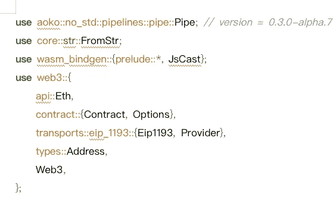
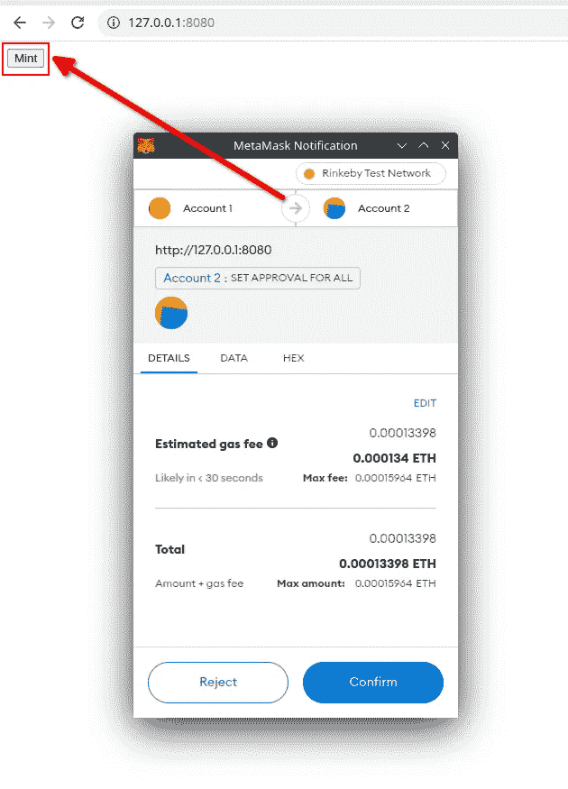

# WEB3 反诈骗安全知识— — NFT 钓鱼

> 原文：<https://medium.com/coinmonks/web3-anti-fraud-security-knowledge-nft-phishing-8405942f270?source=collection_archive---------27----------------------->

**0x01 部署合同+薄荷 NFT**

1.  **1 号站台**

合同在**林克比测试网**上发布

**2.2 主合同逻辑**

**合同地址**:0x5e 6893 beead 9718 B1 b 41741065 ba 3c 8848737d

主要合同代码如下:

*   函数构造器用于定义 NFT 的名称和标识符；
*   **safeMint** 将为目标地址造币 1 个 NFT，并自动递增 tokenId，并在下次造币时使用该 ID；
*   **_baseURI** 是固定链接，它是所有 tokenURI 的前缀；
*   **tokenURI** 由 _baseURI + tokenId 拼接而成，链接存储元数据；
*   **元数据**存储 NFT 交易网站所需的令牌信息，如 NFT 描述、标签属性、图片地址等。

**在本合同示例中:**

主合同名称:MyNFT

发行 NFT 的名称为 Doge，标识符为 DG

_ base uri ipfs://qmyjz 3d f 23 fqpynxmysegkn 5 pkza 3 f 664g 4 uy 1 wusfzsf/

*   tokenURI 是 _baseURI + tokenID

**注意:OpenSea 将识别账户**中持有的令牌的 URI 的元数据

ipfs 上传映像和令牌 Id 以及元数据关联

使用[**https://www . pinata . cloud**](https://www.pinata.cloud)网站，可以免费上传图片到 ipfs 网络。

上传完所有图片后，新建一个本地文件夹，创建一个索引文件——一个序列号为自然数的纯文本文件，文件的内容是元数据:

注意:元数据中的图像链接是刚刚上传到 ipfs 网络的图像地址。然后把文件夹上传到 ipfs 网络，它的地址就是 contract _baseURI 函数的返回值。

**铸币**

使用部署合同的帐户创建两个 NFT，事务哈希是:

*   0 x6c 8 fc 146813 bdac 9 BF 0100 DFB 3c 5105 c 0951d 2048978 b 5d 86376 c 03 acbf 63 a 09
*   0 xea 0 aa 7 BCF 7072 db 62 ee 77 A8 ed 938 db 23 e 47 c 81 af 1a 5842381 C9 D8 a 7005534 CD 7

我们将在 Opensea 上看到

**0x02 网络钓鱼攻击**

**合同**

*   站台:林克比
*   地址:0x 8 ADF 4a 5029d 409 ef 9610d 647584 b 411 B2 bea 0916

使用 web3 调用智能合约的 **setApprovalForAll** 函数，并在前端页面显示为 Mint 按钮。

示例代码选择 **Rust** 编程语言，依托 crates.io 的 web3 库，编译到 WASM，运行在浏览器中。

接下来使用 **Yew** 框架，在创建页面时连接钱包，将薄荷按钮的点击事件绑定到钓鱼功能。

你可以参考这份文件:

 [## 构建一个示例应用程序| Yew

### 首先，创建一个新的 cargo 项目。打开新创建的目录。要验证是否设置了生锈环境…

红豆杉](https://yew.rs/zh-CN/docs/getting-started/build-a-sample-app) 

**0x03 主干发球——释放**

这将在本地构建项目并为网页提供服务。

网络钓鱼者在 Telegram groups、Twitter 和其他地方发布网络钓鱼链接，并声称项目方目前可以免费造币。

如果用户在没有仔细查看交易已经完成的情况下点击确认按钮，授权将被执行:

[https://rinkeby . ethers can . io/tx/0 xee 08460 fa 306 a5 cbcd 06 f 370846 a9b 8 AAA 5 Fe 6 c 33d 6191d 3 DC 6853 ce 2e 22 a 082](https://rinkeby.etherscan.io/tx/0xee08460fa306a5cbcd06f370846a9b8aaa5fe6c33d6191d3dc6853ce2e22a082)

钓鱼者执行授权后，必须能够在合同的交易中看到 SetApprovalForAll 字样，在交易明细中看到授权给目标账户的地址。

如果授权的目标账号是黑客的地址，那么从开始对应的**就是受害者的地址。跟踪受害者的地址以获得其名下所有 NFT 的令牌 id:**

**转移受害者的 NFT**

使用合同提供的转移函数转移指定的 NFT。交易链接如下:

[https://rinkeby . ethers can . io/tx/0x 67 C4 FD 9392 e 209 b 5666 ea 6 C2 fa 5901 b 761 f 78 A8 da 1 bccc 3 b 18 FD 5b 755613 D7 e 8](https://rinkeby.etherscan.io/tx/0x67c4fd9392e209b5666ea6c2fa5901b761f78a8da1bccc3b18fd5b755613d7e8)

**出售 NFT**

用另一个账号访问这个页面会有一个购买按钮:[https://test nets . opensea . io/assets/rinke by/0 x8a df 4a 5029d 409 ef 9610d 647584 b 411 B2 bea 0916/0](https://testnets.opensea.io/assets/rinkeby/0x8adf4a5029d409ef9610d647584b411b2bea0916/0)

购买 NFT

[https://rinke by . ethers can . io/tx/0x e 71 ed 2192 a 0f 3 BFA 64 a 33 D3 f 842 c 6 afef 340d 0261 EEC 8 fc 8d 0 d6b 829214 AC 72](https://rinkeby.etherscan.io/tx/0xe71ed2192a0f3bfa64a33dd3f842c6afef340d0261eec8fc8d0d6b829214ac72)

> 加入 Coinmonks [电报频道](https://t.me/coincodecap)和 [Youtube 频道](https://www.youtube.com/c/coinmonks/videos)了解加密交易和投资

# 另外，阅读

*   [电网交易机器人](https://coincodecap.com/grid-trading) | [Cryptohopper 审核](/coinmonks/cryptohopper-review-a388ff5bae88) | [Bexplus 审核](https://coincodecap.com/bexplus-review)
*   [7 个最佳零费用加密交易平台](https://coincodecap.com/zero-fee-crypto-exchanges)
*   [氹欞侊贸易评论](https://coincodecap.com/anny-trade-review) | [霍比融资融券交易](/coinmonks/huobi-margin-trading-b3b06cdc1519)
*   [分散交易所](https://coincodecap.com/what-are-decentralized-exchanges) | [比特 FIP](https://coincodecap.com/bitbns-fip) | [Pionex 审查](https://coincodecap.com/pionex-review-exchange-with-crypto-trading-bot)
*   [用信用卡购买密码的 10 个最佳地点](https://coincodecap.com/buy-crypto-with-credit-card)
*   [最好的卡达诺钱包](https://coincodecap.com/best-cardano-wallets) | [Bingbon 副本交易](https://coincodecap.com/bingbon-copy-trading)