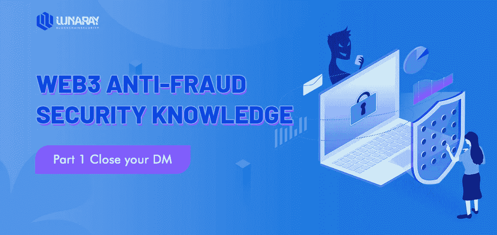

# Web3 反欺诈安全知识第 1 部分——关闭您的 DM

> 原文：<https://medium.com/coinmonks/web3-anti-fraud-security-knowledge-part-1-close-your-dm-764fa3eb150a?source=collection_archive---------35----------------------->

2021 年，密码领域总市值一度增长近 3 万亿美元，其中， **Opensea** 在 NFT 领域的交易额已经飙升至约 140 亿美元。

最近几个月在 **NFT** 领域随处可见的“黑客事件”也证明了反诈骗安全意识的重要性。

**5 次警告**

1.  在任何时候，保护好你钱包的私钥和助记短语。
2.  任何未知链接，不要随意点击，不要链接钱包，因小失大
3.  在任何情况下，保持警惕和谨慎，不要相信任何异常行为或细节，如秘密销售、空投等。
4.  任何不和谐的社区，Twitter 私信必须严格小心，坚决防止病毒或诈骗链接。

## web3 中的行话和俚语

*   **Mint:** 对于 NFTs，是获取数字资产并将数字文件转换为存储在区块链上的数字资产的过程。使它正式成为一种可以买卖的商品
*   **钱包私钥:**私钥像别针一样保护钱包。任何时候都必须保密。私钥用于签署交易和解密数据。如果私钥泄露给第三方，钱包中的加密货币或 NFT 可能会被盗。
*   秘密恢复短语、助记短语或种子短语是典型的 12 或 24 个单词的集合**，其可用于导出无限数量的账户**。这些短语经常被加密货币硬件钱包使用，由用户写在一张纸上，以安全地备份用户的资金。
*   **Alpha Group:**Alpha Access 是由@long 创建的，目的是**为其成员提供一个交流和讨论所有与 NFTs 相关的事情的平台，没有优惠、促销、追加销售和垃圾信息**。作为私人不和小组的一部分，成员可以提问、寻求反馈、提出想法和进行头脑风暴。
*   NFT 赠品**类似于加密空投，被区块链项目用来增加用户参与度和提高对他们项目的认识**。项目开发者向满足特定条件的加密钱包赠送免费的 NFT。这些赠品通常在项目正式启动前发放。
*   **拉地毯:**拉地毯是指欺诈者利用社交媒体大肆宣传一个不可替代的代币(NFT)项目，目的是在用户向该项目投入资金后卷走资金。
*   **Airdrop** :分发加密货币、代币或 NFT，免费发送到 web3 钱包地址作为促销，或作为参与体验或购买数字资产的附加值。空投通常用于增加附加值或吸引人们对品牌或体验的注意。
*   **荷兰式拍卖:**在荷兰式拍卖中，NFT 的价格从一个初始价格(最高价)开始，并定期下降一个固定的数量(例如每 10 分钟下降 0.1 ETH)，直到达到它将达到的最低价格(静止价)。
*   **主持人**:表示用户是经验丰富的 NFT 交易者，能够回答用户的问题。只需使用@版主标签。
*   **KYC:** 虽然“了解您的客户”( KYC)要求并未明确提及非金融交易，但绕过这些规定会带来潜在的监管审查、罚款和制裁风险。
*   **白名单:**在 NFT 世界中，白名单是一份在特定日期和时间窗口提前获得并保证访问 mint 的人的名单。
*   **合同地址:**合同地址是指**以太坊**上部署合同的地址。令牌 ID 指的是这个特定的 NFT。
*   **NFT 版税:**是对 NFT 原创者使用其不可替代令牌(NFT)的补偿。在商业上，版税一般是按销售额或利润的一定比例支付给创作者。有了 NFTs，版税通常由所有者在铸造过程中设定。
*   Testnet 是一个测试区块链的网络，在区块链或区块链的项目准备启动之前运行和测试它们。
*   **硬件钱包:**硬件钱包(有时也称为冷存储)是一种需要您使用物理设备来确认交易的钱包。这意味着黑客几乎不可能窃取你的 NFT，你不再是一个容易的目标，甚至不再在雷达上。
*   双因素认证 :2FA 为你的账户密码和电子邮件验证提供了额外的安全保障。这可以确保您的资产和个人信息继续保持安全。
*   出价:对收藏品的特定版本感兴趣的买家可以向版本的所有者出价，希望以他们想要的价格购买 NFT。
*   **PEP**:PFP 是 NFT 最流行的迭代之一；通常是围绕一个共同主题或人物的图像集合，它们由发布方创建和设计，而不是由所有者指定，并且通常包括进入私人俱乐部或活动。
*   LFG:我们走吧
*   GMI/瓦格米:瓦格米代表“我们都会成功”。
*   **NGMI** :代表“不会成功”。NGMI 的意思是你不会因为一个糟糕的决定或糟糕的判断而成功。例如，如果有人亏本出售 NFT，而其他人相信该项目的长期成功，卖方可能被判定为 NGMI。
*   **FOMO:** 害怕错过
*   **HODL** :作为“为了亲爱的生命坚持下去”的首字母缩写，它已经成为加密爱好者的口头禅，意味着加密货币投资的长期方法。
*   DYOR:做你自己的调查。(注意:你经常会发现这是一个经典的免责声明，这不是财务建议)。
*   **1/1 艺术:**1/1、1/1 或 1/1 是作为单一、独特版本发行的 NFT。其中一个被视为更稀缺，因此更有价值，因为一次只有一个人可以拥有它们

> 加入 Coinmonks [电报频道](https://t.me/coincodecap)和 [Youtube 频道](https://www.youtube.com/c/coinmonks/videos)了解加密交易和投资

# 另外，阅读

*   [CoinLoan 评论](https://coincodecap.com/coinloan-review) | [YouHodler 评论](/coinmonks/youhodler-4-easy-ways-to-make-money-98969b9689f2) | [BlockFi 评论](https://coincodecap.com/blockfi-review)
*   《XT.COM 评论》的[《币安评论》的](https://coincodecap.com/profittradingapp-for-binance)|
*   [SmithBot 评论](https://coincodecap.com/smithbot-review) | [4 款最佳免费开源交易机器人](https://coincodecap.com/free-open-source-trading-bots)
*   [比特币基地僵尸程序](/coinmonks/coinbase-bots-ac6359e897f3) | [AscendEX 审查](/coinmonks/ascendex-review-53e829cf75fa) | [OKEx 交易僵尸程序](/coinmonks/okex-trading-bots-234920f61e60)
*   [如何在印度购买比特币？](/coinmonks/buy-bitcoin-in-india-feb50ddfef94) | [瓦济克斯审查](/coinmonks/wazirx-review-5c811b074f5b)