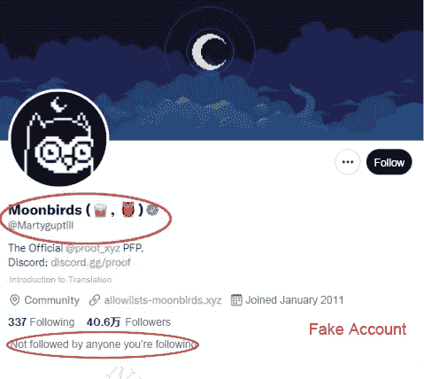
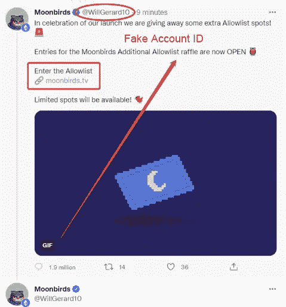
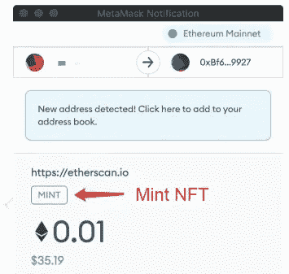
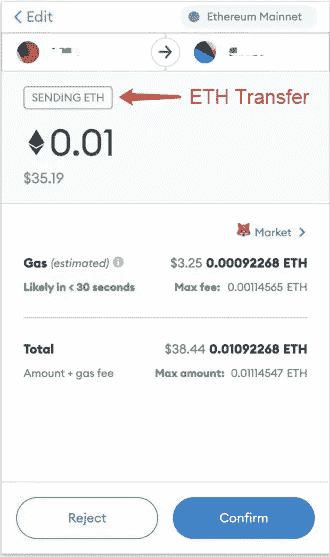
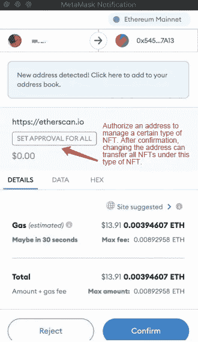
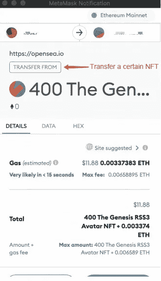

# Web3 反欺诈安全知识第二部分——认知偏差

> 原文：<https://medium.com/coinmonks/web3-anti-fraud-security-knowledge-part-2-cognitive-bias-b28e4bd3704a?source=collection_archive---------19----------------------->

**一般诈骗套路分 3 步:**

*   很难拒绝诱人的福利，也很难提前做出承诺。
*   孤立自己的信息源渠道，陷入信息孤岛。
*   要求你尽快做出决定，并出售骗局

## 0x01 特定行为

认知偏差有时被称为“人类硬件漏洞”，足以引发众多攻击媒介，其中包括:

*   **邦联:**邦联可以制造一个假象，迫使受害者透露他们通常不愿透露的信息。比如骗子通过在假造币网站上制造 **NFT** 即将售罄的假象，催促受骗者尽快造币，并链接钱包打开授权。
*   **网络诈骗:**使用另一个身份通过聊天的方式进行交流，在逐渐交流的过程中放松对方的警惕，从而达到一步步获取自己想要的信息的目的，如杀猪骗局。
*   **诱饵:**骗子以获取机密信息为目的，冒充知名 NFT 项目方或艺术家，诱骗受害人在 opensea 上购买 NFT，以骗取授权，进而实施诈骗。
*   **等价交换:**诈骗分子冒充技术人员或问卷调查人员，要求被骗者给出密码、私钥、或助记短语等关键信息，以此冒充帮助解决某种问题或给予物质奖励。攻击者还可能伪装成公司技术支持人员来“帮助”解决技术问题，并慢慢窃取信息。

## 0x02 什么是认知偏差

认知偏差是一种系统性的思维错误，发生在人们处理和解释周围世界的信息时，并影响他们做出的决定和判断。

人脑功能强大，但也有局限性。认知偏差通常是大脑试图简化信息处理的结果。偏见通常作为经验法则，帮助你理解这个世界，并相对快速地做出决定。

**不和>推特>电报>电子邮件>钓鱼网站**

## 0x03 欺诈场景

最近，热门的 NFT 项目 **Moobirds** 在推特上发了一条私信，楼面价高达 18ETH。Moonbirds 发微博称 Moonbirds 被成功释放。为了回馈 NFT 玩家的支持，现在选择 1000 名幸运追随者空投 NFT。数量有限，抓紧时间。我想大多数人如果遇到这种情况，一定会非常兴奋，肯定会点击“收集钱包”

受害者检查了钱包但发现里面什么都没有，然后打开 **OpenSea** 查看他的 **NFT** 。这时，他发现自己的一系列优质 NFT 都不见了。(真实故事)

欺骗分析:

*   骗子利用热点和热门 NFT 诈骗 NFT 初学者和 NFT 持有者
*   通过一个众所周知的 Twitter 账户，受害者使用精心设计的钓鱼网站获得了授权，受害者在 NFT 的资产被转移。

## 0x04 反欺诈策略

注意识别推特上的账号。钓鱼账号一般有以下特点。

*   他们经过认证，并声称是一个大型项目的早期投资者或(联合)创始人。
*   账号创建很早，但是有几条推文，是最近才活跃的，比如一个十年前注册的账号，最近一个月才发了几十条推文。
*   他们自己也写了很多评论。
*   不要盲目相信一些知名的 Twitter 账号，一个人的关注人数与他的个人信用无关，更不要说关注人数可以随意造假的“影响力”。
*   所有要造币的项目都应尽可能地进行研究，以确定正确的造币时间和价格，并提前做好准备
*   **造币**:铸造 NFT，是 NFT 官方预售和公开发售最常用的方式。确认后，您的钱包将被扣除相应的费用(NFT 售价+燃气费)，您将获得相应的 NFT。
*   **发送 ETH** :ETH 传输。确认后，会从你的钱包里转出一定数量的 ETH。
*   **全部设置审批**:授权某个地址管理某类 NFT。确认后，该地址可以将该类型下的所有 NFTs 转移到您的钱包中。
*   薄荷:

*   发送以太网

*   **设置全部审批**

*   **转移自/安全转移自**

> *加入 Coinmonks* [*电报频道*](https://t.me/coincodecap) *和* [*Youtube 频道*](https://www.youtube.com/c/coinmonks/videos) *了解加密交易和投资*

# 另外，阅读

*   [3 商业评论](/coinmonks/3commas-review-an-excellent-crypto-trading-bot-2020-1313a58bec92) | [Pionex 评论](https://coincodecap.com/pionex-review-exchange-with-crypto-trading-bot) | [Coinrule 评论](/coinmonks/coinrule-review-2021-a-beginner-friendly-crypto-trading-bot-daf0504848ba)
*   [莱杰 vs Ngrave](/coinmonks/ledger-vs-ngrave-zero-7e40f0c1d694) | [莱杰 nano s vs x](/coinmonks/ledger-nano-s-vs-x-battery-hardware-price-storage-59a6663fe3b0) | [币安评论](/coinmonks/binance-review-ee10d3bf3b6e)
*   [Bybit Exchange 评论](/coinmonks/bybit-exchange-review-dbd570019b71) | [Bityard 评论](https://coincodecap.com/bityard-reivew) | [Jet-Bot 评论](https://coincodecap.com/jet-bot-review)
*   [3 commas vs crypto hopper](/coinmonks/3commas-vs-pionex-vs-cryptohopper-best-crypto-bot-6a98d2baa203)|[赚取加密利息](/coinmonks/earn-crypto-interest-b10b810fdda3)
*   最好的比特币[硬件钱包](/coinmonks/hardware-wallets-dfa1211730c6) | [BitBox02 回顾](/coinmonks/bitbox02-review-your-swiss-bitcoin-hardware-wallet-c36c88fff29)
*   [BlockFi vs 摄氏](/coinmonks/blockfi-vs-celsius-vs-hodlnaut-8a1cc8c26630) | [Hodlnaut 点评](/coinmonks/hodlnaut-review-best-way-to-hodl-is-to-earn-interest-on-your-bitcoin-6658a8c19edf) | [KuCoin 点评](https://coincodecap.com/kucoin-review)
*   [Bitsgap 审查](/coinmonks/bitsgap-review-a-crypto-trading-bot-that-makes-easy-money-a5d88a336df2) | [Quadency 审查](/coinmonks/quadency-review-a-crypto-trading-automation-platform-3068eaa374e1) | [Bitbns 审查](/coinmonks/bitbns-review-38256a07e161)