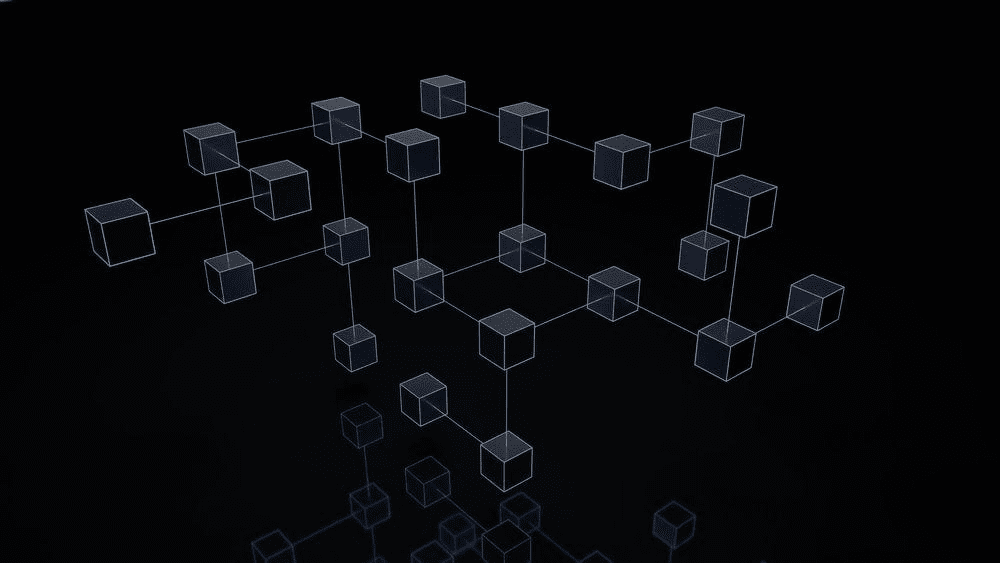
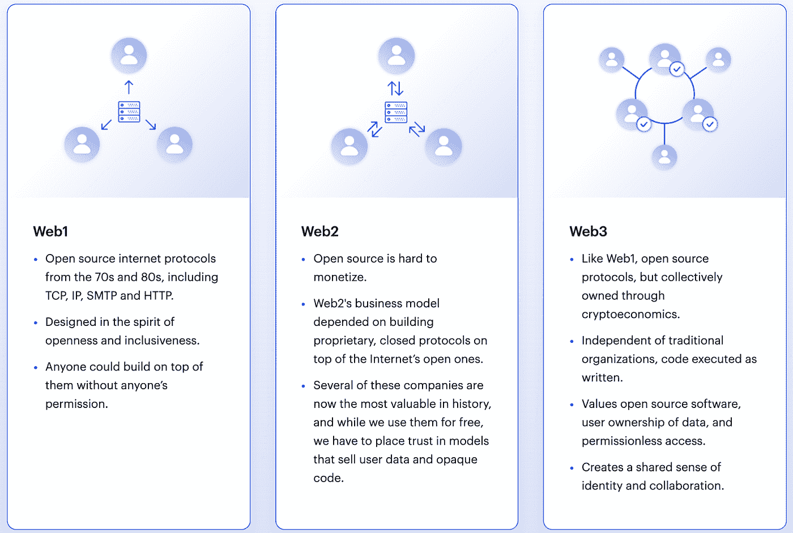

# Web3 基础💸

> 原文：<https://medium.com/coinmonks/web3-basics-252121357f33?source=collection_archive---------38----------------------->

# 什么是 Web3？

如果你是区块链领域的新手，你可能还没有听说过关键词“Web3”。

这正是 Web3 随着区块链科技和加密货币的引入，一个代表互联网状态的*流行语*。

下图有助于解释 web3 与 web2 和 web1 的区别

1.  **Web3 是互联网的资金层。**
2.  Web3 是互联网的身份层。
3.  **Web3 是对社交网络不保护我们的数据安全并出售这些数据以获取利润的反应。**
4.  **Web3 是艺术家和创作者不仅拥有他们在平台上创作的作品，还拥有平台本身的一种方式。**
5.  Web3 是互联网的一种新的顾客模式。
6.  **Web3 使建立合作所有权和治理结构变得容易。**
7.  Web3 仍然没有完全去中心化。

[https://consensys.net/blog/blockchain-explained/what-is-web3-here-are-some-ways-to-explain-it-to-a-friend/](https://consensys.net/blog/blockchain-explained/what-is-web3-here-are-some-ways-to-explain-it-to-a-friend/)

Web1 =电子邮件+密码
Web2 =使用谷歌的脸书登录
Web3 =连接到[元掩码](https://metamask.io/)(钱包)

Web 3 允许用户发送和接收数字货币，保护他们的信息安全，利用去中心化的网络以及上面提到的所有其他好处。

总的来说，Web3 只是一个时髦词，用来创造参与度，让用户关注我们在当前互联网状态下讨论的话题。

说了这么多，你应该对什么是 Web3 以及它与互联网现状的关系有了更好的理解，如果没有，你可以随时通过 socials[@ thedudescrypto](https://twitter.com/TheDudesCrypto)或 [@metadadsxyz](https://twitter.com/metadadsxyz) 联系我

感谢来自 consensys.net 的詹姆斯·贝克在这里分享了一些有价值的信息。

# 一定要小心！！！

我怎么强调这一点都不为过！保持高度警惕，注意你点击的每一个链接，你做的每一笔交易，以及你接触的每一个人，因为骗子在这个空间里比比皆是，最好看的项目都被取消了。

点击所有链接之前，要再三检查，确保它们是你要找的官方链接。在把任何有价值的东西寄给别人之前，也要仔细检查所有的钱包地址。

**跟随我们的加密/NFT/区块链/元宇宙之旅**

[*推特*](https://twitter.com/TheDudesCrypto)[*不和*](https://discord.gg/Cv8v2Ert8m)[*YouTube*](https://www.youtube.com/channel/UC7pbtSBs9nRJHK6coMhCR8g)[*抖音*](https://www.tiktok.com/@thedudescrypto)[*insta gram*](https://www.instagram.com/thedudescrypto/)[*Spotify 播客*](https://open.spotify.com/episode/5U8vXE9HDAsGbSbebw9p62?si=2rZIigw-Tw2pCxjxmkbYzQ)

请支持我发送 polygon matic 到这个 eth 地址，或者 eth:
0x b 53b 3978333 e 11 c 382 ab 619 f 02 f 469 A8 c 70750 af

干杯，
哥们儿

> 加入 Coinmonks [电报频道](https://t.me/coincodecap)和 [Youtube 频道](https://www.youtube.com/c/coinmonks/videos)了解加密交易和投资

# 另外，阅读

*   [3 商业评论](/coinmonks/3commas-review-an-excellent-crypto-trading-bot-2020-1313a58bec92) | [Pionex 评论](https://coincodecap.com/pionex-review-exchange-with-crypto-trading-bot) | [Coinrule 评论](/coinmonks/coinrule-review-2021-a-beginner-friendly-crypto-trading-bot-daf0504848ba)
*   [莱杰 vs n rave](/coinmonks/ledger-vs-ngrave-zero-7e40f0c1d694)|[莱杰 nano s vs x](/coinmonks/ledger-nano-s-vs-x-battery-hardware-price-storage-59a6663fe3b0) | [币安评论](/coinmonks/binance-review-ee10d3bf3b6e)
*   [by bit Exchange Review](/coinmonks/bybit-exchange-review-dbd570019b71)|[bit yard Review](https://coincodecap.com/bityard-reivew)|[Jet-Bot Review](https://coincodecap.com/jet-bot-review)
*   [3 commas vs crypto hopper](/coinmonks/3commas-vs-pionex-vs-cryptohopper-best-crypto-bot-6a98d2baa203)|[赚取加密利息](/coinmonks/earn-crypto-interest-b10b810fdda3)
*   最好的比特币[硬件钱包](/coinmonks/hardware-wallets-dfa1211730c6) | [BitBox02 回顾](/coinmonks/bitbox02-review-your-swiss-bitcoin-hardware-wallet-c36c88fff29)