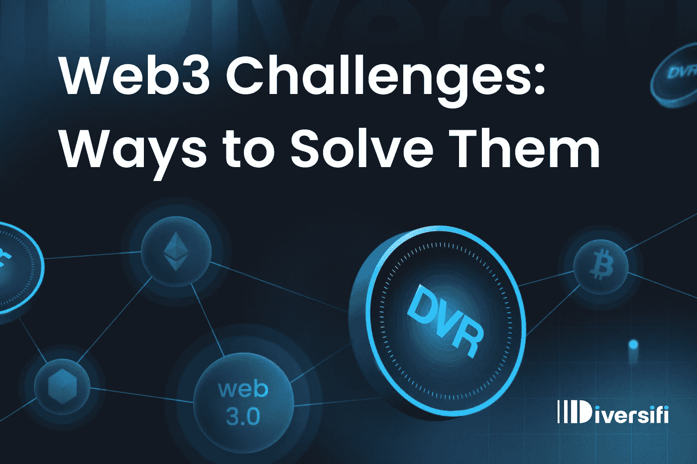

# Web3 挑战:解决它们的方法(第二部分)

> 原文：<https://medium.com/coinmonks/web3-challenges-ways-to-solve-them-part-2-daa3896c6d8d?source=collection_archive---------15----------------------->

在上一篇文章["**Web3 采用的挑战** "](/@diversi_fi/website-and-medium-c9be832ac96e) 中，我们讨论了阻碍 web 3 无缝采用的主要问题——隔离的可访问性、安全标准的缺乏以及非区块链人的高进入壁垒。

作为这个新领域的开发者和企业家，我们的工作就是让它更容易被更广泛的受众所接受。我们希望与尽可能多的人分享 Web3 带来的价值和好处，我们不希望我们的应用程序用户仅限于“那些知道内情的人”。因此，我们有责任解决上述三个问题，降低准入门槛。

# **无障碍**

这些措施将使新用户更容易访问您的 Web3 项目:

1.  建立拉平访问曲线的机制。
2.  使用现有的用户界面隐喻。使用不会让用户困惑的清晰的 UX(例如，如果你正在构建一个 DeFi 应用程序，使用一个银行或交易所的比喻，而不是一个卖牦牛的霓虹灯冰淇淋摊)。
3.  使用经过测试的真实标准，不要重新发明轮子。
4.  提供易于使用的扁平桥，包括信用卡和通用支付提供商。
5.  使用托管/非托管账户，允许用户参与许多金融体验。
6.  提供客户支持。和真正的人在一起。

# **安全**

1.  向您的用户保证他们的安全、隐私和资产是我们的重中之重。不要让他们拿自己的血汗钱去赌博。
2.  审核您的所有智能合约和界面，并提供完整审核和修复的链接。这是必须的。
3.  确保需要保险的链外零件。
4.  保护所有接口。
5.  建议你的用户为他们的资产购买连锁保险(例如 Nexus Mutual)。考虑提供捆绑保险的产品。
6.  警告用户可能的陷阱和错误。让他们手动确认可能对他们造成伤害的步骤。
7.  快速解决安全问题。当它们发生时，保持透明，分享你解决问题的方法。
8.  让你的主要开发团队进行 doxxed，或者至少由第三方进行验证。

# **教育**

如果我们不能将 Web3 的价值观主流化，不能以一种有组织的、易于消费的方式将教育内容和机会带给大众，那么上述所有这些都不会把人们带到 Web3。

1.  参与在线讨论、空间、博客等。，与尽可能多的人分享 Web3 的潜力、承诺和精神。
2.  创建不同种类的内容。每个人学习的方式不同。提供文章、视频、播客、待办事项、操作指南、播放列表等。
3.  耐心点:所有人都害怕新事物。倾听他们的恐惧，并解释你如何努力减轻他们的恐惧。
4.  当你的产品是可访问的(见“可访问性”)并且在你看来足够简单的时候，请 Web3 的批评者尝试使用它。看看他们是否“明白”，如果没有，努力缩小差距。
5.  记住:Web3 就要来了，所以把每一个可疑的、消极的或恐惧的声音都当作一个需要帮助的潜在客户。

**关于 Diversifi**

在 Diversifi，我们的使命是让每个人都能安全地访问 Web3。我们正在建立 Diversifi 协议，这是一个开放的协议，将提供对多个链和链外流动性的简单访问。

我们正在努力为开发人员提供原语，这将反过来允许他们构建安全和可访问的财务 dapps。我们也非常重视教育。我们打算围绕我们的产品建立一个社区，让更多的人使用 Web3，这样我们就可以分享它的好处。

*点击* *了解更多 Diversifi 协议* [*。*](http://www.diversi.fi)

*加入我们的 Web3 应用开发者社区* [*这里*](https://t.me/+W5PwFy) *。*

> 加入 Coinmonks [电报频道](https://t.me/coincodecap)和 [Youtube 频道](https://www.youtube.com/c/coinmonks/videos)了解加密交易和投资

# 另外，阅读

*   [加密保证金交易交易所](/coinmonks/crypto-margin-trading-exchanges-428b1f7ad108) | [赚取比特币](/coinmonks/earn-bitcoin-6e8bd3c592d9)
*   [WazirX vs CoinDCX vs bit bns](/coinmonks/wazirx-vs-coindcx-vs-bitbns-149f4f19a2f1)|[block fi vs coin loan vs Nexo](/coinmonks/blockfi-vs-coinloan-vs-nexo-cb624635230d)
*   [BlockFi 信用卡](https://coincodecap.com/blockfi-credit-card) | [如何在币安购买比特币](https://coincodecap.com/buy-bitcoin-binance)
*   [火币交易机器人](https://coincodecap.com/huobi-trading-bot) | [如何购买 ADA](https://coincodecap.com/buy-ada-cardano) | [Geco？一次审查](https://coincodecap.com/geco-one-review)
*   [加密复制交易平台](/coinmonks/top-10-crypto-copy-trading-platforms-for-beginners-d0c37c7d698c) | [五大 BlockFi 替代品](https://coincodecap.com/blockfi-alternatives)
*   【Crypto.com 评论】|[|](/coinmonks/crypto-com-review-f143dca1f74c)|[信用交易](/coinmonks/huobi-margin-trading-b3b06cdc1519)