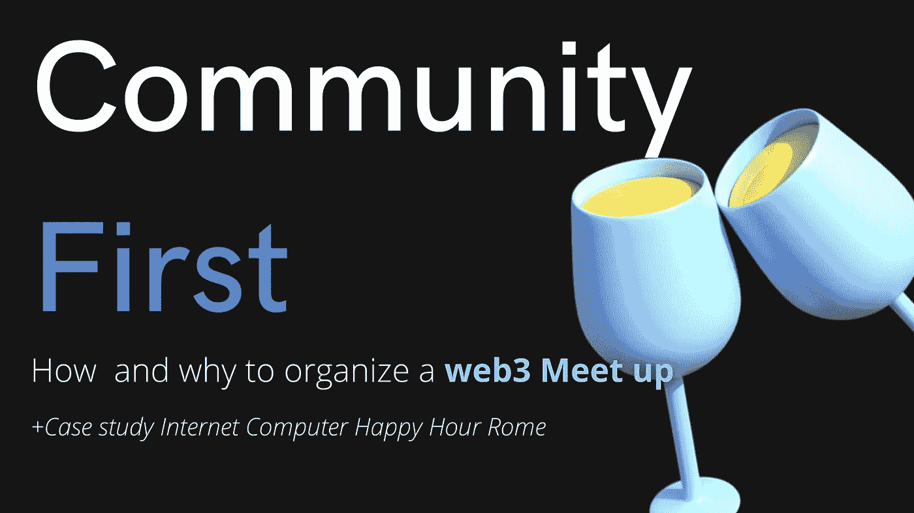
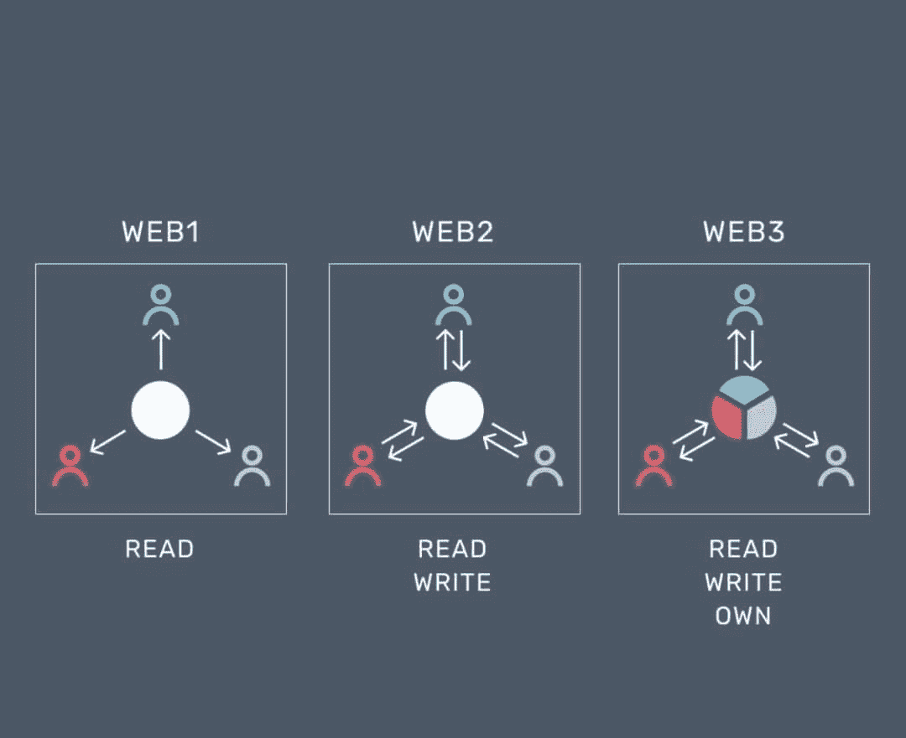
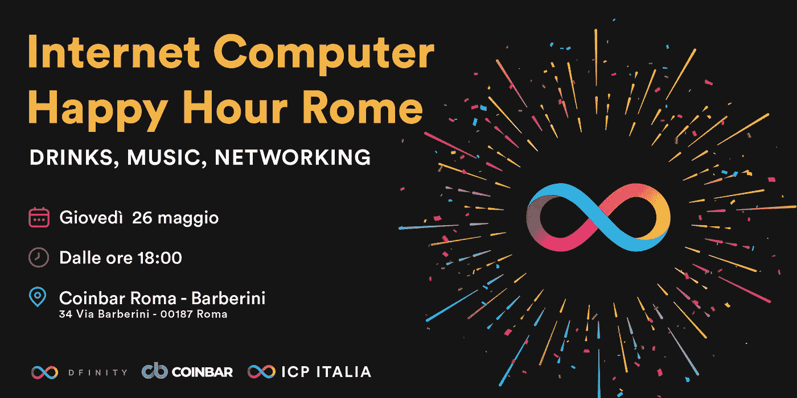
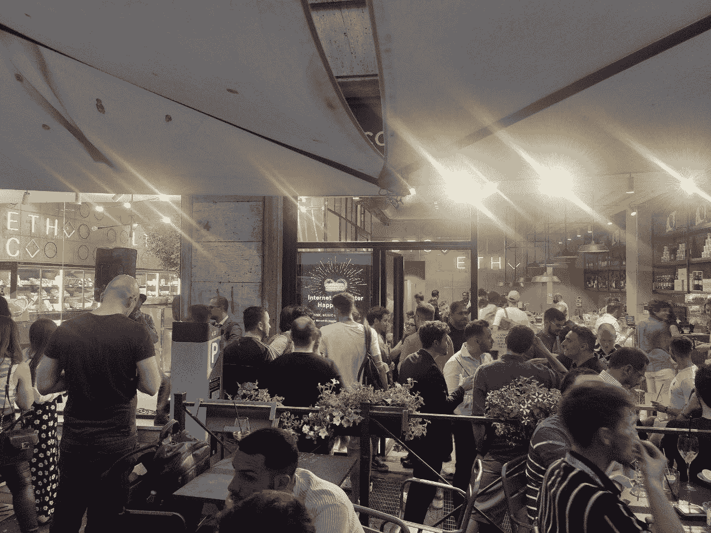

# Web3 =社区第一。如何和为什么组织一次聚会|案例研究互联网计算机快乐时光罗马

> 原文：<https://medium.com/coinmonks/web3-community-first-3b82c646b6e5?source=collection_archive---------13----------------------->

即使是最具创新性的互联网领域也需要数字化，这样才能接近现实生活中的用户。这就是为什么 web3 领域的**聚会是重要的事件**，在那里人们可以互相了解，甚至在虚拟生活之外也可以联系。

我是保罗，我是一名营销人员，在**有限基金会**工作，该基金会致力于开发开源**互联网计算机协议**:第三代区块链无许可 L1 世界上最快的无限扩展和去中心化的互联网，旨在成为 web3 创建的公共开放互联网。

我在 2022 年 5 月组织了第一次欧洲 ICP 会议，在这个指南中，我想给你一些关于如何和为什么组织会议的见解。也许它们会对你自己的项目有用。

我们可以开始了吗？

# 为什么用户是每个 web3 项目的核心？

Web3 最著名的口号之一是， ***“读、写、拥有”，*** 一言以蔽之，人们有能力成为他们正在交互的应用程序的所有者。

from the web

事实上，这正是在**dapp、项目令牌和 DAO 中发生的事情:**每个用户不仅可以成为用户，还可以成为他或她所相信的项目的一部分的所有者:要么作为投资者，要么作为 DAO(一种董事会)的一部分。

中心是用户，所以社群第一: ***没有社群，一个项目不可能有长久的生命。***

这就是为什么聚会非常重要:**phydigital**从未像现在这样重要。

# 相遇:到达互联网不能到达的地方

*“Touch Scream” of Federico Clapis*

铭记难忘的记忆和娱乐你的社区是最人性化的姿态，也是当今互联网无法实现的缺失部分。

生活产生了伟大的合作，伙伴关系，也许还有友谊。

对于许多在线企业来说，这可能是一个很好的营销举措。

## 你何时以及如何组织聚会？

在 8 点中，我尝试总结了一些你需要记住的事情，以便成功地组织一次成功的聚会:

## 1.语境

基于你的定位，在这种情况下是网络 3 如果你想组织一次成功的活动，我会选择一个地点和日期，提供最大可能的来自感兴趣的人的成员:今天在最重要的博览会和会议期间，城市充满了附带活动。更多的竞争，更多的工作要做。

## 2.位置

根据你想要带来的形式，地点的选择是至关重要的，因为它将影响 meetup 的体验。无论是休息室酒吧还是会议室都有很大的不同。

## 3.服务

你可以选择为你安排一切的解决方案，或者你可以自己安排一切，努力肯定会有所不同。

## 4.锚定工具

在活动期间赠送一些东西将确保给与会者一些实物，以提醒他们该活动，并可能使用该项目进行更多的曝光，随着时间的推移而永久存在。
如贴纸、t 恤衫、传单、nfts、poap

## 5.哇效果

能够找到能让客人对活动做出积极反应的东西并创造“惊喜时刻”会让一切变得更加难忘和有趣
,例如快闪、寻宝游戏等。

## 6.破冰船

有时候，你需要一些东西来打破僵局，让人们融化，互动和享受活动。
例如 Openbar

## 7.营销

提前宣布活动将确保你可以传播消息，让口口相传。既不太早也不太晚。
8。某些人的邀请+公开邀请
对一个成功的活动来说是至关重要的。
例如，行业影响者

## 让它令人难忘

如果你做了精心的准备，给人们一个积极享受活动的机会，那么这个活动就具备了成功的所有条件。

# 案例研究:互联网计算机快乐时光罗马

event poster

5 月 26 日，我组织了第一次欧洲互联网计算机协议(ICP)会议。

ICP 是第三代通用区块链无许可 L1 世界最快的无限可扩展和去中心化的区块链，旨在成为创建 web3 的公共开放互联网。

我决定在**区块链周**期间在**罗马**组织它，因为我们知道那些对该领域感兴趣的人在那些日子都在城里。

地点是 **Coinbar** 因为这是一个与密码相关的酒吧，而且它在战略上靠近主要活动，我们在推广方面从他们那里得到了很多帮助，这肯定有所不同。

这个时间是典型的欢乐时光，加上主要活动同时结束，人们很可能会去酒吧喝酒。

我们为那些之前在 Eventbrite 上买了票的人提供饮料，这取决于城市。最常用的应用程序是 Eventbrite 和“Meetup”。

我们为出席者颁发了特别活动的奖品。

这是:

 [## Vimeo

### 编辑描述

vimeo.com](https://vimeo.com/manage/videos/717515891?embedded=true&source=video_title&owner=177716836) 

我认为哇效果是所有因素的结合:所以在 5 个小时的时间里，酒吧里挤满了社交和玩乐的人。
+350 名参与者
+5 小时的派对
积极的晚间反馈

sneak peak from the start of the event

我的经历是积极的，有些人相信这只是运气，有些人相信运气不存在。

> 加入 coin monks[Telegram group](https://t.me/joinchat/Trz8jaxd6xEsBI4p)学习加密交易和投资

我希望这个指南对你有所帮助，并对你有所启发。

我相信，如果你组织一次活动，你会邀请我；)

下次见
保罗