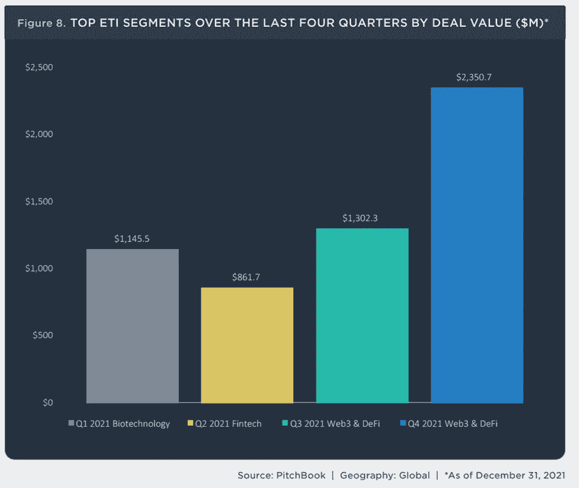
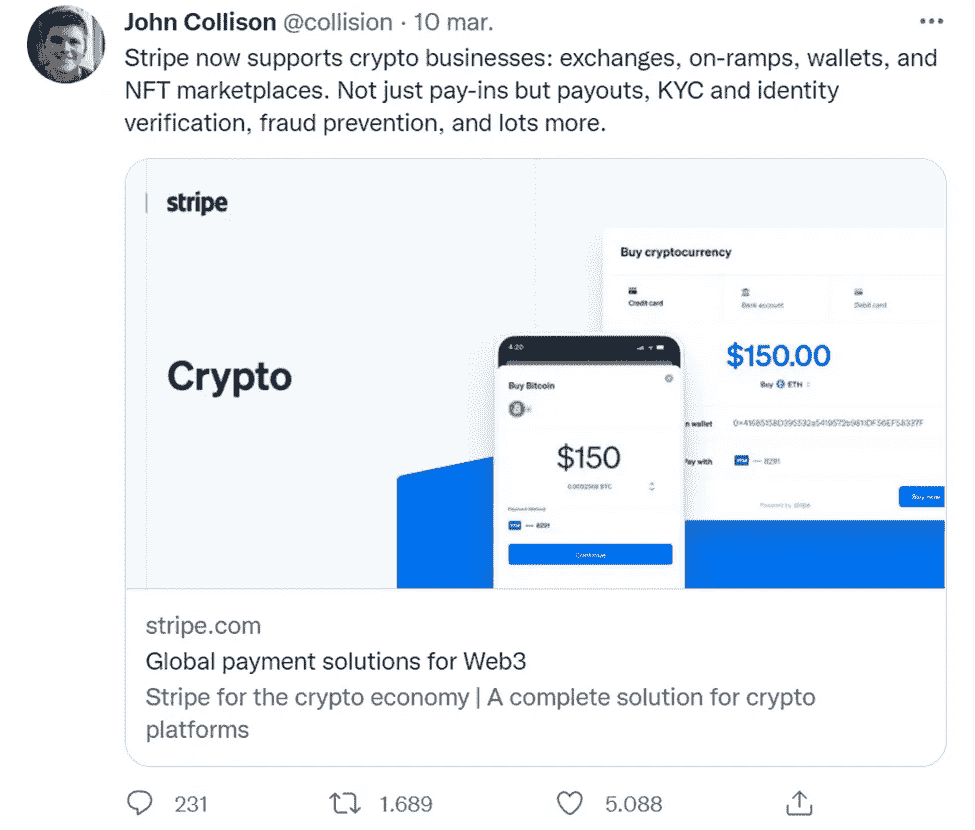

# Web3、DeFi 和去年金融科技投资者喜欢什么

> 原文：<https://medium.com/coinmonks/web3-defi-and-what-fintech-investors-liked-last-year-eb05a9b4c5?source=collection_archive---------53----------------------->

去年最成功的早期投资者都赌在哪里？

根据 Pitchbook 的新兴技术指标(ETI)，一个跟踪涉及 15 家领先风险投资公司的早期和种子阶段交易的指数，2021 年第四季度，ETI 的投资在 221 笔交易中达到 102 亿美元。本季度最大的交易包括对**的 7.25 亿美元的 B 轮融资，这是一个帮助游戏开发商整合密码经济学的技术平台，使 Web3 & DeFi 成为去年最重要的投资主题。**

**Web3 和 DeFi 意味着什么，对投资者意味着什么？**

**“Web3”已经成为一个术语，泛指分散软件协议和区块链产品的新兴行业，DeFi 可以理解为 it 行业中新兴的金融产品类别。虽然 crypto 和区块链已经存在了十多年，但我相信报告的结果表明，就这些技术的商业应用而言，我们只是触及了表面，去年围绕 NFT 的所有讨论占据了朋友的谈话和华尔街媒体，也引起了专业投资者的共鸣。**

**杰出的行业参与者在这一切中扮演什么角色？**

**上周，支付巨头 [**Stripe**](https://stripe.com/) [宣布](https://techcrunch.com/2022/03/10/stripe-gets-friendly-with-crypto-again/)将恢复对加密业务的支持，允许[商家和交易所在退出该产品线四年后使用其签名软件解决方案进行加密支付](https://stripe.com/use-cases/crypto)。在去年另一项最大的交易中，一个备受瞩目的 NFT 和交易平台，**FTX 追加了 4.21 亿美元的 B 轮融资(2022 年在 Q1 宣布了另外 4 亿美元的 C 轮融资)，使其融资总额达到 19 亿美元。猜猜他们选择与谁合作来改进其身份合规性功能和面向用户的 fiat onboarding 工作流？****

****************

> *****加入 Coinmonks* [*电报频道*](https://t.me/coincodecap) *和* [*Youtube 频道*](https://www.youtube.com/c/coinmonks/videos) *了解加密交易和投资*****

# ****另外，阅读****

*   ****[3 商业评论](/coinmonks/3commas-review-an-excellent-crypto-trading-bot-2020-1313a58bec92) | [Pionex 评论](https://coincodecap.com/pionex-review-exchange-with-crypto-trading-bot) | [Coinrule 评论](/coinmonks/coinrule-review-2021-a-beginner-friendly-crypto-trading-bot-daf0504848ba)****
*   ****[莱杰 vs n rave](/coinmonks/ledger-vs-ngrave-zero-7e40f0c1d694)|[莱杰 nano s vs x](/coinmonks/ledger-nano-s-vs-x-battery-hardware-price-storage-59a6663fe3b0) | [币安评论](/coinmonks/binance-review-ee10d3bf3b6e)****
*   ****[Bybit Exchange 审查](/coinmonks/bybit-exchange-review-dbd570019b71) | [Bityard 审查](https://coincodecap.com/bityard-reivew) | [Jet-Bot 审查](https://coincodecap.com/jet-bot-review)****
*   ****[3 commas vs crypto hopper](/coinmonks/3commas-vs-pionex-vs-cryptohopper-best-crypto-bot-6a98d2baa203)|[赚取加密利息](/coinmonks/earn-crypto-interest-b10b810fdda3)****
*   ****最好的比特币[硬件钱包](/coinmonks/hardware-wallets-dfa1211730c6) | [BitBox02 回顾](/coinmonks/bitbox02-review-your-swiss-bitcoin-hardware-wallet-c36c88fff29)****