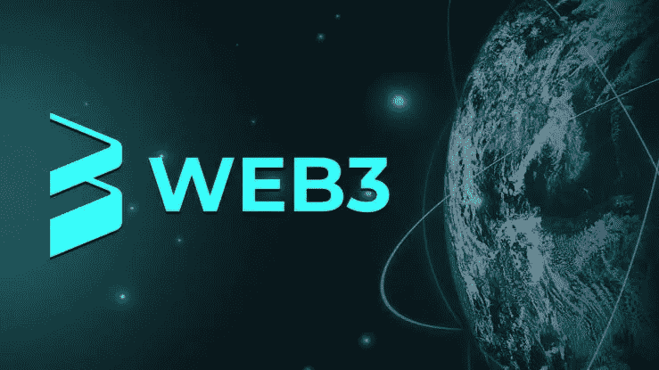

# 外行人的 Web3

> 原文：<https://medium.com/coinmonks/web3-for-a-layman-20f5458b7291?source=collection_archive---------17----------------------->

当我第一次听到 Web3 这个术语时，我认为它是一种新型的网站，将会取代现有的网站。我认为这款新浏览器将拥有现有网站所不具备的顶级功能。如果你是第一次听 Web3，我很容易猜到这些也是你的想法。不幸的是，这是错误的。

我想更多地了解这个网站的好奇心驱使我研究和阅读了这个课题。最终，我的无知被揭露出来，我接触到了 Web3 的真正含义。为了用通俗的语言解释 Web3 的含义，我选择了写这篇文章。

# 网络的演变

让我们定义一下网络这个术语。网站被简单地定义为互联网上可访问的相关网页的互连。于是，Web 可以被称为万维网，它是互联网上所有网站和超文本文档的集合。

20 多年前，当第一个网站创建的时候，第一个版本的 web 被称为 Web1。在这个时代，网络上很少有网站，这些网站是静态的，因为很少有网站开发者，也很少有人会在互联网上冲浪。

Web2(也称为 Web 2.0)问世不久，直到 2000 年代末才被广泛接受。这种类型的网站比以前的版本有更多的功能，因为它可以服务于许多目的。它见证了许多网站的出现，也赞助了相当多的人参与互联网的使用。与 Web1 不同，它允许用户参与，用户在网站上获得信息后，还可以在同一网站上给出反馈和评论。社交媒体和电子商务网站是 Web 2.0 革命中的主要异类。

即使面对 Web 2.0 漏洞，Web 3.0 也在不断发展。然而，被亲切地称为 Web3 的网络并没有完全取代它。这个版本的网站使用与其他版本的网站相同的操作系统，但是为用户提供了更多的好处。总之，Web3 相对于 Web2.0 的优势是去中心化，这将在本文的后半部分讨论。

# Web3 到底是什么？

Web3.0 是一种特殊的互联网，它试图结束集中式互联网的统治。它使用区块链技术促进去中心化和用户所有权。这个版本的 web 是在互联网上谈论的，因为最近对 Web3 的搜索在短短几年内增加了 2400%以上。

Web 2.0 是集中式的，它允许网站所有者绝对控制互联网。人们发现，全球 43%的网络流量仅由 5 家公司控制。你可以很容易地猜到这 5 家公司，但我会帮助你。他们是脸书、谷歌、亚马逊、苹果和网飞。

Web1 的局限性在于它是静态的，允许网站所有者或开发者创建内容。另一方面，Web 2.0 鼓励用户创建内容，但它的局限性在于内容的分发是集中的。可以肯定地说，控制互联网内容的权力掌握在上述五家公司手中。

Web 3.0 试图通过提供不受任何人控制的开源网络来挑战这种集中化。它利用区块链生态系统来实现用户之间无信任、无许可的交互。它还包含大量智能技术、机器学习和人工智能。

虽然 Web 2.0 和 Web 3.0 没有太大区别。然而，Web3 对互联网的使用方式和谁控制互联网进行了彻底的改革。它寻求将用户置于比所有者更有利的位置，这可能是正确的事情。

# 最后的话

Web3 遍布整个互联网，并将在几年后接管。去中心化网站是某些组织对互联网绝对控制的解决方案。虽然你可能希望将 Web3 视为对抗大公司的一场革命，但你必须明白，这些公司多年来剥削互联网用户时并没有考虑到这一点。

我的下一篇文章将是关于 Web3 的原则以及它对用户的好处。请跟我来，在这一页留下你的一些评论。

> 加入 Coinmonks [电报频道](https://t.me/coincodecap)和 [Youtube 频道](https://www.youtube.com/c/coinmonks/videos)了解加密交易和投资

# 另外，阅读

*   [如何开始用加密贷款赚取被动收入](https://coincodecap.com/passive-income-crypto-lending)
*   [加密货币储蓄账户](/coinmonks/cryptocurrency-savings-accounts-be3bc0feffbf) | [加密交易机器人](https://coincodecap.com/best-crypto-trading-bots)
*   [BigONE 交易所评论](/coinmonks/bigone-exchange-review-64705d85a1d4) | [CEX。IO 审查](https://coincodecap.com/cex-io-review) | [交换区审查](/coinmonks/swapzone-review-crypto-exchange-data-aggregator-e0ad78e55ed7)
*   [最佳比特币保证金交易](/coinmonks/bitcoin-margin-trading-exchange-bcbfcbf7b8e3) | [比特币保证金交易](https://coincodecap.com/bityard-margin-trading)