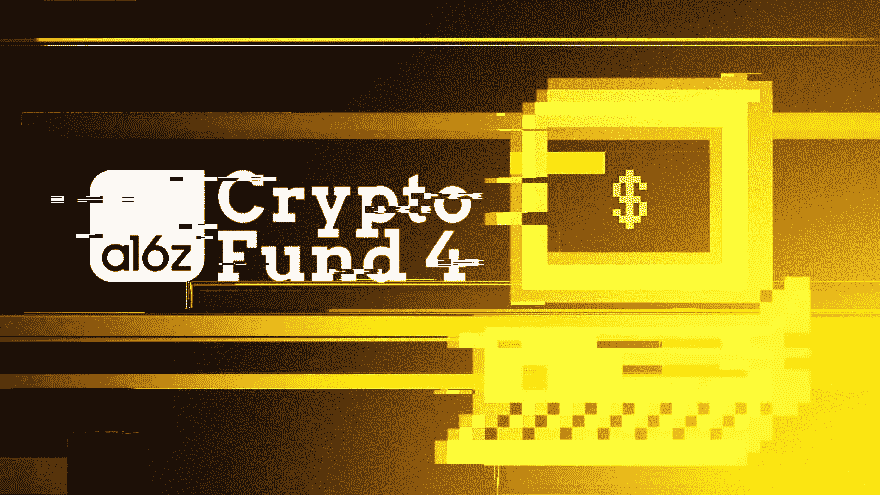
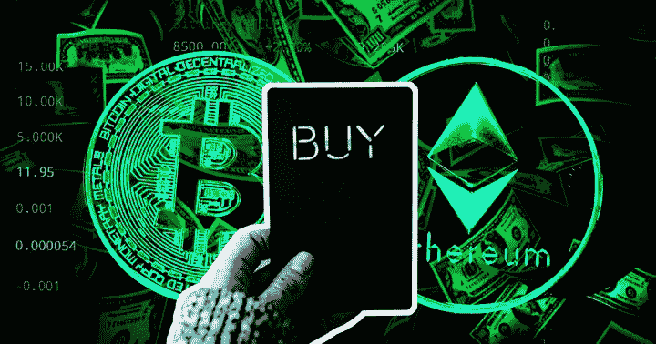

# Web3 已经爆炸了，就像你脸上那个恼人的疙瘩。

> 原文：<https://medium.com/coinmonks/web3-has-exploded-like-that-irritating-pimple-on-your-face-1a0eeaf47dd6?source=collection_archive---------54----------------------->

A16Z’s 4th crypto fund is $4.5B. Who’s most bullish now?

我听到的都是现在的熊市有多严重。

每一个头条都是厄运和黑暗。

互联网的每一面墙上都有痛苦和污点。

露娜的崩溃导致了。

股市暴跌，大型科技股受损，派对结束了，散户投资者的下巴被打了一拳。

YC 告诉他们的创始人收紧，为最坏的情况做准备，并期待街头流血。

大大小小的投资者就像泰坦尼克号上的钟声一样发出了结束的信号。

创始人们，我们可以忘记筹集任何资金，直接投入到建设模式中。

等等等等。

然而，投资 web3 的最大风险投资之一刚刚筹集了 45 亿美元，用于在熊市中投入更多资金。

让我们看看上个月在 cryptoland 发生了什么，好吗？

现在每个人都有新钱包了。

比特币基地、罗宾汉甚至 GameStop 都发布了他们的 web3 钱包，也许是因为他们开始意识到，钱包实际上是任何 web3 用户进入这个领域必须拥有的第一件东西。

Instagram 和 Spotify 正在为其创作者测试 NFT。

古驰、巴尔曼、巴黎世家和普拉达刚刚参加完派对，正在发布他们自己的 NFT。

甚至梵蒂冈城也带着他们的数字 NFT 画廊进入了元宇宙。

像 Bored Ape 这样的 NFT 在 NFT 文化中创造了一个全新的亚生态系统，并建立了一个价值数十亿美元的企业。

在创始人自我否定后，米拉迪 NFTs 失宠了。

Ebay 也推出了第一个 NFT 系列。

ETH 继续取笑我们的合并。

马丁·斯克雷利要来加密公司。

因欺诈而被定罪和监禁的 Yup Pharma Bro 刚刚出狱，也在深入研究加密技术。

和《绝地归来》一样，亚当·诺伊曼也要来 crypto 了。

想想这些新闻。

世界在燃烧，经济在燃烧，每个行业都在遭受痛苦，但就在上个月，Web3 获得了 50 亿美元的巨大增长。

安德森·霍洛维茨宣布了一个 45 亿美元的基金来支持加密和区块链公司。该公司将投资加密货币和公司股票。”

在过去的几年里，他们已经筹集了 4 个加密专项基金。

对于一只 45 亿美元的基金来说，2%的管理费相当于每年 9000 万美元。

为了获得 2 倍的回报(大约 100 亿美元)，他们不得不投资一切。

他们投资基础设施、层面、早期创始人、新技术、DeFi、GameFi 等。

他们必须为 Web3 的未来发展和推动叙事、故事、想象和希望。

如果他们是致力于建设 web3 乌托邦的城市规划者，这意味着建设和规划从地下管道、卫生、安全、公共交通、道路、公路、住宅建筑、发电厂等一切。

现在你明白他们为什么需要那种金融战争基金了吧？

A16Z 会不会看错了 web3？

当然，但是他们是经验丰富的老手，这不是他们的第一次竞技。

你怎么能对 Web3 的未来不乐观呢？

你最看好 Web3.0 中的哪个板块？

-

你最看好 Web3.0 中的哪个板块？

-

# startups # business # startupx # growth # success # social media # culture # entrepreneur # strategy # eth #比特币#加密货币# bayc # NFT # getrich # airdrop # branding # master card # line # revolution # web 3

> 加入 Coinmonks [电报频道](https://t.me/coincodecap)和 [Youtube 频道](https://www.youtube.com/c/coinmonks/videos)了解加密交易和投资

# 另外，阅读

*   [加密货币储蓄账户](/coinmonks/cryptocurrency-savings-accounts-be3bc0feffbf) | [YoBit 审核](/coinmonks/yobit-review-175464162c62)
*   [Botsfolio vs nap bots vs Mudrex](/coinmonks/botsfolio-vs-napbots-vs-mudrex-c81344970c02)|[gate . io 交流回顾](/coinmonks/gate-io-exchange-review-61bf87b7078f)
*   [CoinFLEX 评论](https://coincodecap.com/coinflex-review) | [AEX 交易所评论](https://coincodecap.com/aex-exchange-review) | [UPbit 评论](https://coincodecap.com/upbit-review)
*   [AscendEx 保证金交易](https://coincodecap.com/ascendex-margin-trading) | [Bitfinex 赌注](https://coincodecap.com/bitfinex-staking) | [bitFlyer 点评](https://coincodecap.com/bitflyer-review)
*   [Bitget 回顾](https://coincodecap.com/bitget-review)|[Gemini vs block fi](https://coincodecap.com/gemini-vs-blockfi)cmd |[OKEx 期货交易](https://coincodecap.com/okex-futures-trading)
*   [AscendEx Staking](https://coincodecap.com/ascendex-staking)|[Bot Ocean Review](https://coincodecap.com/bot-ocean-review)|[最佳比特币钱包](https://coincodecap.com/bitcoin-wallets-india)