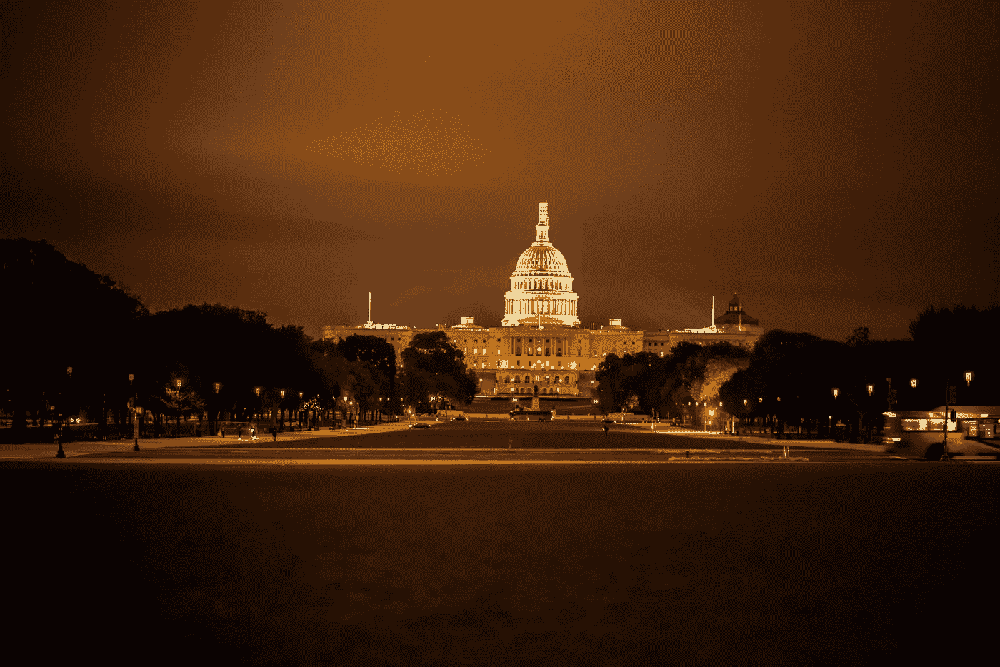

# 网络 3 与华盛顿相遇

> 原文：<https://medium.com/coinmonks/web3-meets-washington-d843210136cc?source=collection_archive---------41----------------------->

## 战胜全球贫困的强大联盟

[https://unsplash.com/photos/L_U4jhwZ6hY](https://unsplash.com/photos/L_U4jhwZ6hY)

上周在美国科罗拉多州，一项名为丹佛理工大学的活动拉开了序幕。超过 [12，000](https://www.thedenverchannel.com/news/local-news/ethdenver-event-attracting-thousands-of-cryptocurrency-and-blockchain-fans-from-around-the-world) 人参加了黑客马拉松，参加会谈，会见志同道合的人，当然还有聚会。

在过去的几年中，这项活动已经见证了巨大的需求，这表明 Web3/Crypto 空间正在不断增长。2018 年…