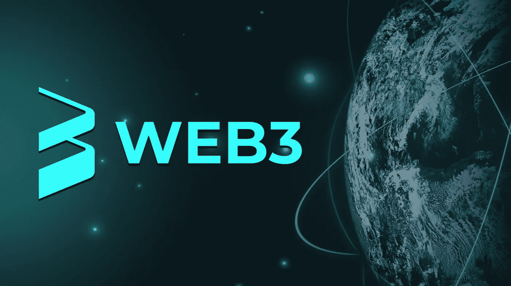

# Web3、NFTs 和元宇宙:打造 Web 3.0 的未来

> 原文：<https://medium.com/coinmonks/web3-nfts-the-metaverse-making-the-future-of-web-3-0-1f8bc2c8c928?source=collection_archive---------24----------------------->

Cointelegraph 在 BlockDown Croatia 2022 节日上向与会者讲述了 Web3 生态系统的社会政治、不可替代令牌(NFT)和元宇宙。事实证明，整个加密生态系统中正在进行的创新已经做好了决定媒体和娱乐未来的准备。

虽然与加密相关的创新继续模糊数字和物理世界，但 Cointelegraph 的主编 Kristina Cornèr 在 BlockDown festival 期间讨论区块链技术对媒体公司日益增长的影响时，也认为“这是疯狂的一年”。

Cornèr 谈到了 NFT 空间的用例，这些用例允许独立艺术家和记者筹集资金，应对气候变化等现实世界的挑战。在与 NFT3 创始人 Dylan Dewdney 的单独讨论中，Cornèr 谈到了在元宇宙融合虚拟和现实世界。

杜德尼认为，现实世界的问题很有可能渗透到元宇宙。但是他建议开发一个假名系统，在这个系统中，用户可以被验证，但是可以选择不向元宇宙的其他成员透露他们的身份。

Dewdney 认为，随着世界转移到一个新的虚拟家园，现实世界将变得更好。然而，这将需要一些人开始考虑公平和个人责任作为这种情况发生的秘密精神。

block show——coin telegraph 的旗舰活动——正在更名为分散自治组织(DAO ),允许与会者在展会中拥有股份并参与组织活动。BlockShow 首席执行官 Addy Crezee 表示，BlockShow DAO 的目标是“让更多人使用 Web3，并帮助人们感受到所有权经济的好处。”

Dewdney 告诉 Cornèr，在元宇宙，“我们仍然会有同样的问题，因为我们仍然是同样的老人，做着同样的小事和大事。”

如果加密社区可以成功地分散互联网，“这是一个值得兴奋的未来”——在个人和另一个社会层面。

风险投资公司 Andreessen Horowitz 最近推出了 6 亿美元的游戏基金 One。该基金将投资于游戏初创公司，重点是 Web3。它旨在支持游戏工作室、消费者应用程序和游戏基础设施提供商。

Cointelegraph 此前报道称，元宇宙项目正在吸引来自游戏行业巨头的投资，如《堡垒之夜》的创作者 Epic Games。今年 4 月，Epic 筹集了 20 亿美元，用资金创建了一个元宇宙。

> 加入 Coinmonks [电报频道](https://t.me/coincodecap)和 [Youtube 频道](https://www.youtube.com/c/coinmonks/videos)了解加密交易和投资

# 另外，阅读

*   [八大加密附属计划](https://coincodecap.com/crypto-affiliate-programs) | [eToro vs 比特币基地](https://coincodecap.com/etoro-vs-coinbase)
*   [最佳以太坊钱包](https://coincodecap.com/best-ethereum-wallets) | [电报上的加密货币机器人](https://coincodecap.com/telegram-crypto-bots)
*   [交易杠杆代币的最佳交易所](https://coincodecap.com/leveraged-token-exchanges) | [购买 HTZ 代币](https://coincodecap.com/how-to-buy-htz-token)
*   [5 大最佳社交交易平台](https://coincodecap.com/best-social-trading-platforms) | [瓦济克斯 NFT 印度](https://coincodecap.com/wazirx-nft-india)
*   [10 本关于加密的最佳书籍](https://coincodecap.com/best-crypto-books) | [英国 5 个最佳加密机器人](https://coincodecap.com/uk-trading-bots)