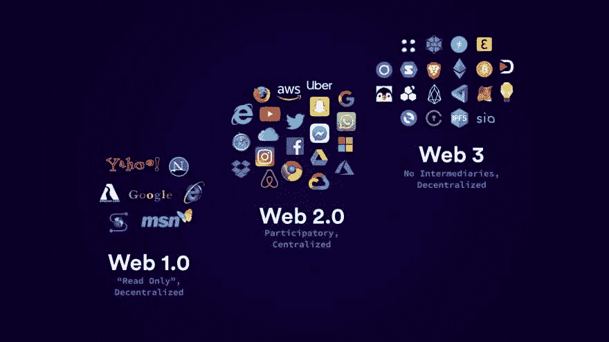

# Web3。o 用英语解释

> 原文：<https://medium.com/coinmonks/web3-o-explained-in-english-dadf8915f49e?source=collection_archive---------14----------------------->

# 什么是 web3？

# 为了更好地理解这一点，首先，我们应该了解 Web1、Web2 和 Web3:

# 网络 1.0 (1994 年至 2005 年)

几十年来，超文本的概念早于万维网。

然而，几乎所有的超文本系统都依赖于本地文件。

蒂姆·伯纳斯·李想创建一个可以跨网络工作的系统，允许人们从一台机器上的一个文件链接到另一台机器上。

因此，1990 年 12 月，他用 Objective-C 为他的下一个计算机系统开发了一个应用程序，并将其命名为万维网。

万维网不仅仅是一个文件浏览程序。

它既是浏览器又是文本编辑器。

这个十年的互联网，我们只能阅读，不能互动，我们不能喜欢任何帖子，也不能评论。

它是分散的，用户有自己的服务器。

# web2.0(2005 年至今)

我们现在使用的互联网，我们可以与之互动，但它是集中的，这意味着公司拥有所有权，他们拥有我们所有的数据，如 meta，google，amazon 等。

# 欢迎来到 web3.0

# web 3.0(2020-未来)

这是非常需要的互联网。它是分散的，这意味着我们以代币的形式拥有它，它在区块链上运行。

web3.0 是不可信的(**不需要可信中介**的支持)，去中心化的

(**用户是所有者**)无权限。这个网络是由矿工们运营的，他们在区块链验证我们的交易，并因此获得天然气费和大宗奖励。他们遍布世界各地。

## web3.0 的要点

*   我们的数据仍然安全。
*   它是完全分散的，这意味着没有人是单一的所有者。
*   我们可以用代币的形式拥有它。
*   它不能被破解。

# 智能合同

这些智能合同只有区块链能理解，这种方式没有中间人。

在这些合同上，写有一些条件，只有在这些条件得到满足后，它才运行。

例如

假设我们想为环保事业筹集资金，我们希望有一个可信的组织来收集这些资金，并将金额转交给有关当局。

在这里，智能合同开始发挥作用。因此，我们制定了一个智能合同，条件是如果数量等于 10 个乙醚，那么将金额转移到环境当局，否则资金留在合同中，如果任何人想要退款，可以处理并退还。这就是智能合同的工作方式。

NFTs ( **不可替代代币**)

这些都是独特的令牌，并在 NFT 的帮助下出现在 NFT 市场上，真正的主人得到了认可。

DAOs( [**分散自治组织**](https://www.investopedia.com/tech/what-dao/) )

这个社区不属于任何人， [**自治**](https://www.investopedia.com/tech/what-dao/) s 表示任何人都可以加入这些社区，无需提供任何个人信息。

决策是通过投票作出的，投票时使用代币。

最后的想法

*   这都是关于 web3 的。如果你知道所有细节，那么开始学习 web3 开发。
*   与区块链交互不需要任何个人数据，
*   使用没有广告的互联网
*   给任何人寄钱，但不提供你的个人信息。
*   连接您的钱包并开始使用 web3。

在 twitter 上关注我 Aditya_misra1

内容参考:[https://medium . com/@ choudharyparam 99/web 3-0-explained-in-hinglish-2e 460 BCF 06 b](/@choudharyparam99/web3-0-explained-in-hinglish-2e460bcf06b)

> 加入 Coinmonks [电报频道](https://t.me/coincodecap)和 [Youtube 频道](https://www.youtube.com/c/coinmonks/videos)了解加密交易和投资

# 另外，阅读

*   [最佳期货交易信号](https://coincodecap.com/futures-trading-signals) | [流动性交易所评论](https://coincodecap.com/liquid-exchange-review)
*   [南非的加密交易所](https://coincodecap.com/crypto-exchanges-in-south-africa) | [BitMEX 加密信号](https://coincodecap.com/bitmex-crypto-signals)
*   [MoonXBT 副本交易](https://coincodecap.com/moonxbt-copy-trading) | [阿联酋](https://coincodecap.com/crypto-wallets-in-uae)的加密钱包
*   [雷米塔诺评论](https://coincodecap.com/remitano-review)|[1 英寸协议指南](https://coincodecap.com/1inch) | [购买 Floki](https://coincodecap.com/buy-floki-inu-token)
*   [MoonXBT vs Bybit vs 币安](https://coincodecap.com/bybit-binance-moonxbt) | [Arbitrum:第二层解决方案](https://coincodecap.com/arbitrum)